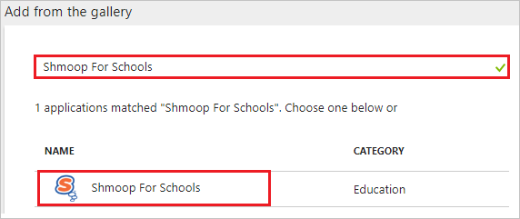
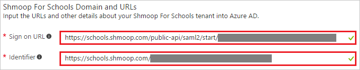
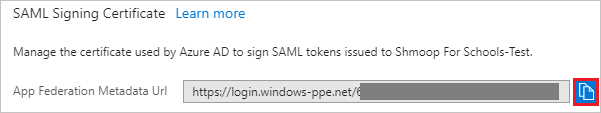
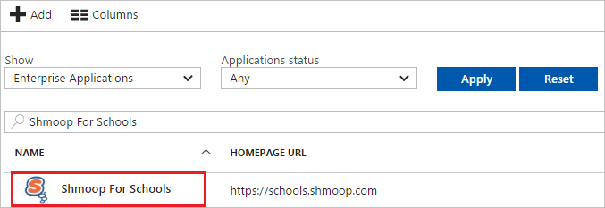

# Tutorial: Azure Active Directory integration with Shmoop For Schools

In this tutorial, you learn how to integrate Shmoop For Schools with Azure Active Directory (Azure AD).

Integrating Shmoop For Schools with Azure AD provides you with the following benefits:

- You can control in Azure AD who has access to Shmoop For Schools.
- You can enable your users to automatically get signed in to Shmoop For Schools with their Azure AD accounts.
- You can manage your accounts in one central location--the Azure portal.

For more information about SaaS app integration with Azure AD, see [What is application access and single sign-on with Azure Active Directory?](../manage-apps/what-is-single-sign-on.md).

## Prerequisites

To configure Azure AD integration with Shmoop For Schools, you need the following items:

- An Azure AD subscription
- A Shmoop For Schools single sign-on enabled subscription

> [!NOTE]
> We don't recommend using a production environment to test the steps in this tutorial.

To test the steps in this tutorial, we recommend:

- Using your production evironment only if it's necessary.
- Getting a [free one-month trial](https://azure.microsoft.com/pricing/free-trial/) if you don't already have an Azure AD trial environment.

## Scenario description
In this tutorial, you test Azure AD single sign-on in a test environment. The scenario that's outlined in this tutorial consists of two main building blocks:

1. Adding Shmoop For Schools from the gallery
2. Configuring and testing Azure AD single sign-on

## Add Shmoop For Schools from the gallery
To configure the integration of Shmoop For Schools into Azure AD, you need to add Shmoop For Schools from the gallery to your list of managed SaaS apps.

**To add Shmoop For Schools from the gallery, take the following steps:**

1. In the [Azure portal](https://portal.azure.com), in the left pane, select the **Azure Active Directory** icon. 

	![The Azure Active Directory button][1]

2. Go to **Enterprise applications**. Then go to **All applications**.

	![The Enterprise applications blade][2]
	
3. To add a new application, select the **New application** button on the top of dialog box.

	![The New application button][3]

4. In the search box, type **Shmoop For Schools**. Select **Shmoop For Schools** from the results, then select the **Add** button to add the application.

	

## Configure and test Azure AD single sign-on

In this section, you configure and test Azure AD single sign-on with Shmoop For Schools based on a test user called "Britta Simon."

For single sign-on to work, Azure AD needs to know who the counterpart user in Shmoop For Schools is to a user in Azure AD. In other words, you need to establish a link between an Azure AD user and the related user in Shmoop For Schools.

To configure and test Azure AD single sign-on with Shmoop For Schools, complete the following building blocks:

1. [Configure Azure AD single sign-on](#configure-azure-ad-single-sign-on) to enable your users to use this feature.
2. [Create an Azure AD test user](#create-an-azure-ad-test-user) to test Azure AD single sign-on with Britta Simon.
3. [Create a Shmoop For Schools test user](#create-a-shmoop-for-schools-test-user) to have a counterpart of Britta Simon in Shmoop For Schools that is linked to the Azure AD representation of the user.
4. [Assign the Azure AD test user](#assign-the-azure-ad-test-user) to enable Britta Simon to use Azure AD single sign-on.
5. [Test single sign-on](#test-single-sign-on) to verify that the configuration works.

### Configure Azure AD single sign-on

In this section, you enable Azure AD single sign-on in the Azure portal and configure single sign-on in your Shmoop For Schools application.

**To configure Azure AD single sign-on with Shmoop For Schools, perform the following steps:**

1. In the Azure portal, on the **Shmoop For Schools** application integration page, select **Single sign-on**.

	![Configure single sign-on link][4]

2. In the **Single sign-on** dialog box, in the drop-down menu under **Single Sign-on Mode**, select **SAML-based Sign-on**.
 
	

3. In the **Shmoop For Schools Domain and URLs** section, take the following steps:

	

    a. In the **Sign-on URL** box, type a URL with the following pattern: `https://schools.shmoop.com/public-api/saml2/start/<uniqueid>`

	b. In the **Identifier** box, type a URL with the following pattern: `https://schools.shmoop.com/<uniqueid>`

	> [!NOTE] 
	> These values are not real. Update these values with the actual sign-on URL and identifier. Contact the [Shmoop For Schools Client support team](mailto:support@shmoop.com) to get these values. 
 
4. The Shmoop For Schools application expects the SAML assertions in a specific format. Configure the following claims for this application. You can manage the values of these attributes from the **User Attributes** section on the application integration page. The following screenshot shows how to configure the assertions:

	

	> [!NOTE]
	> Shmoop for School supports two roles for users: **Teacher** and **Student**. Set up these roles in Azure AD so that users can be assigned the appropriate roles. To understand how to configure roles in Azure AD, see [Manage access using RBAC and the Azure portal](../../role-based-access-control/role-assignments-portal.md).
	
5. In the **User Attributes** section in the **Single sign-on** dialog box, configure the SAML token attribute as shown in the previous image.  Then take the following steps:

	| Attribute name | Attribute value |
	| -------------- | --------------- |
	| role           | user.assignedroles |

	a. To open the **Add Attribute** dialog box, select **Add attribute**.
	
	
	
	
	
	b. In the **Name** box, type the attribute name that's shown for that row.
	
	c. From the **Value** list, select the attribute value that's shown for that row.

	d. Leave the **Namespace** box empty.
	
	e. Select **Ok**.

6. Select the **Save** button.

	

7. On the **SAML Signing Certificate** section, click the copy button to copy **App Federation Metadata Url** and paste it into notepad.

	

8. To configure single sign-on on the **Shmoop For Schools** side, you need to send the **App Federation Metadata Url** to the [Shmoop For Schools support team](mailto:support@shmoop.com).

### Create an Azure AD test user

The objective of this section is to create a test user called Britta Simon in the Azure portal.

   ![Create an Azure AD test user][100]

**To create a test user in Azure AD, take the following steps:**

1. In the Azure portal, in the left pane, select the **Azure Active Directory** button.

    

2. To display the list of users, go to **Users and groups**. Then select **All users**.

    

3. To open the **User** dialog box, select **Add** at the top of the **All Users** dialog box.

    

4. In the **User** dialog box, take the following steps:

    

    a. In the **Name** box, type **BrittaSimon**.

    b. In the **User name** box, type the email address of user Britta Simon.

    c. Select the **Show Password** check box, and then write down the value that's displayed in the **Password** box.

    d. Select **Create**.
 
### Create a Shmoop For Schools test user

The objective of this section is to create a user called Britta Simon in Shmoop For Schools. Shmoop For Schools supports just-in-time provisioning, which is enabled by default. There is no action item for you in this section. If a new user doesn't yet exist, it is created during the attempt to access Shmoop For Schools.

>[!NOTE]
>If you need to create a user manually, contact the [Shmoop For Schools support team](mailto:support@shmoop.com).

### Assign the Azure AD test user

In this section, you enable Britta Simon to use Azure single sign-on by granting access to Shmoop For Schools.

![Assign the user role][200] 

**To assign Britta Simon to Shmoop For Schools, take the following steps:**

1. In the Azure portal, open the applications view. Then go to **Enterprise applications** in the directory view.  Next, select **All applications**.

	![Assign User][201] 

2. In the applications list, select **Shmoop For Schools**.

	  

3. In the menu on the left, select **Users and groups**.

	![The "Users and groups" link][202]

4. Select the **Add** button. Then, in the **Add Assignment** dialog box, select **Users and groups**.

	![The Add Assignment pane][203]

5. In the **Users and groups** dialog box, select **Britta Simon** in the users list.

6. In the **Users and groups** dialog box, click the **Select** button. 

7. In the **Add Assignment** dialog box, select the **Assign** button.
	
### Test single sign-on

In this section, you test your Azure AD single sign-on configuration by using the Access Panel.

When you select the **Shmoop For Schools** tile in the Access Panel, you should get automatically signed in to your Shmoop For Schools application.

For more information about the access panel, see [Introduction to the access panel](../user-help/active-directory-saas-access-panel-introduction.md). 

## Additional resources

* [List of tutorials for how to integrate SaaS Apps with Azure Active Directory](tutorial-list.md)
* [What is application access and single sign-on with Azure Active Directory?](../manage-apps/what-is-single-sign-on.md)

<!--Image references-->

[1]: ./media/shmoopforschools-tutorial/tutorial_general_01.png
[2]: ./media/shmoopforschools-tutorial/tutorial_general_02.png
[3]: ./media/shmoopforschools-tutorial/tutorial_general_03.png
[4]: ./media/shmoopforschools-tutorial/tutorial_general_04.png

[100]: ./media/shmoopforschools-tutorial/tutorial_general_100.png

[200]: ./media/shmoopforschools-tutorial/tutorial_general_200.png
[201]: ./media/shmoopforschools-tutorial/tutorial_general_201.png
[202]: ./media/shmoopforschools-tutorial/tutorial_general_202.png
[203]: ./media/shmoopforschools-tutorial/tutorial_general_203.png

