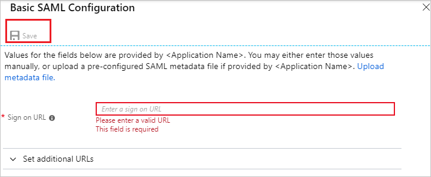

# Tutorial: Azure Active Directory integration with Signagelive

In this tutorial, you learn how to integrate Signagelive with Azure Active Directory (Azure AD).
Integrating Signagelive with Azure AD provides you with the following benefits:

* You can control in Azure AD who has access to Signagelive.
* You can enable your users to be automatically signed in to Signagelive (single sign-on) with their Azure AD accounts.
* You can manage your accounts in one central location: the Azure portal.

For more information about SaaS app integration with Azure AD, see [What is application access and single sign-on with Azure Active Directory](https://docs.microsoft.com/azure/active-directory/active-directory-appssoaccess-whatis). If you don't have an Azure subscription, [create a free account](https://azure.microsoft.com/free/) before you begin.

## Prerequisites

To configure Azure AD integration with Signagelive, you need the following items:

* An Azure AD subscription. If you don't have an Azure AD environment, you can get a [one-month trial](https://azure.microsoft.com/pricing/free-trial/).
* A Signagelive single-sign-on-enabled subscription.

## Scenario description

In this tutorial, you configure and test Azure AD single sign-on in a test environment.

* Signagelive supports SP-initiated SSO.

## Add Signagelive from the gallery

To configure the integration of Signagelive into Azure AD, first add Signagelive from the gallery to your list of managed SaaS apps.

To add Signagelive from the gallery, take the following steps:

1. In the [Azure portal](https://portal.azure.com), in the left pane, select the **Azure Active Directory** icon.

	

2. Go to **Enterprise Applications**, and then select the **All Applications** option.

	

3. To add a new application, select the  **New application** button at the top of the dialog box.

	

4. In the search box, enter **Signagelive**. 

	 

5. Select **Signagelive** from the results pane, and then select the **Add** button to add the application.

## Configure and test Azure AD single sign-on

In this section, you configure and test Azure AD single sign-on with Signagelive based on a test user called **Britta Simon**.
For single sign-on to work, you must establish a link between an Azure AD user and the related user in Signagelive.

To configure and test Azure AD single sign-on with Signagelive, first complete the following building blocks:

1. [Configure Azure AD single sign-on](#configure-azure-ad-single-sign-on) to enable your users to use this feature.
2. [Configure Signagelive single sign-on](#configure-signagelive-single-sign-on) to configure the single sign-on settings on the application side.
3. [Create an Azure AD test user](#create-an-azure-ad-test-user) to test Azure AD single sign-on with Britta Simon.
4. [Assign the Azure AD test user](#assign-the-azure-ad-test-user) to enable Britta Simon to use Azure AD single sign-on.
5. [Create a Signagelive test user](#create-a-signagelive-test-user) to have a counterpart of Britta Simon in Signagelive that is linked to the Azure AD representation of the user.
6. [Test single sign-on](#test-single-sign-on) to verify that the configuration works.

### Configure Azure AD single sign-on

In this section, you enable Azure AD single sign-on in the Azure portal.

To configure Azure AD single sign-on with Signagelive, take the following steps:

1. In the [Azure portal](https://portal.azure.com/), on the **Signagelive** application integration page, select **Single sign-on**.

    

2. In the **Select a single sign-on method** dialog box, select **SAML** to enable single sign-on.

    

3. On the **Set up single sign-on with SAML** page, select **Edit** to open the **Basic SAML Configuration** dialog box.

	

4. In the **Basic SAML Configuration** section, take the following steps:

    

    In the **Sign-on URL** box, enter a URL that uses the following pattern:
    `https://login.signagelive.com/sso/<ORGANIZATIONALUNITNAME>`

	> [!NOTE]
	> The value is not real. Update the value with the actual sign-on URL. To get the value, contact the [Signagelive Client support team](mailto:support@signagelive.com) . You can also refer to the patterns that are shown in the **Basic SAML Configuration** section in the Azure portal.

5. On the **Set up Single Sign-On with SAML** page, in the **SAML Signing Certificate** section, select **Download** to download the **Certificate (Raw)** from the given options per your requirement. Then save it on your computer.

	

6. In the **Set up Signagelive** section, copy the URL(s) that you need.

	

	a. Login URL

	b. Azure AD Identifier

	c. Logout URL

### Configure Signagelive Single sign-on

To configure single sign-on on the Signagelive side, send the downloaded **Certificate (Raw)** and copied URLs from the Azure portal to the [Signagelive support team](mailto:support@signagelive.com). They ensure that the SAML SSO connection is set properly on both sides.

### Create an Azure AD test user 

The objective of this section is to create a test user in the Azure portal called Britta Simon.

1. In the Azure portal, in the left pane, select **Azure Active Directory**, select **Users**, and then select **All users**.

    

2. Select **New user** at the top of the screen.

    

3. In the **User** dialog box, take the following steps.

    

    a. In the **Name** field, enter **BrittaSimon**.
  
    b. In the **User name** field, enter "brittasimon@yourcompanydomain.extension". For example, in this case, you might enter "BrittaSimon@contoso.com".

    c. Select the **Show password** check box, and then note the value that's displayed in the Password box.

    d. Select **Create**.

### Assign the Azure AD test user

In this section, you enable Britta Simon to use Azure single sign-on by granting access to Signagelive.

1. In the Azure portal, select **Enterprise Applications**, select **All applications**, and then select **Signagelive**.

	

2. In the applications list, select **Signagelive**.

	

3. In the menu on the left, select **Users and groups**.

    

4. Select the **Add user** button. Then, in the **Add Assignment** dialog box, select **Users and groups**.

    

5. In the **Users and groups** dialog box, in the **Users** list, select **Britta Simon**. Then click the **Select** button at the bottom of the screen.

6. If you are expecting a role value in the SAML assertion, then, in the **Select Role** dialog box, select the appropriate role for the user from the list. Next, click the **Select** button at the bottom of the screen.

7. In the **Add Assignment** dialog box, select the **Assign** button.

### Create a Signagelive test user

In this section, you create a user called Britta Simon in Signagelive. Work with the [Signagelive support team](mailto:support@signagelive.com) to add the users in the Signagelive platform. You must create and activate users before you use single sign-on.

### Test single sign-on 

In this section, you test your Azure AD single sign-on configuration by using the MyApps portal.

When you select the **Signagelive** tile in the MyApps portal, you should be automatically signed in. For more information about the MyApps portal, see [What is the MyApps portal?](https://docs.microsoft.com/azure/active-directory/active-directory-saas-access-panel-introduction).

## Additional resources

- [List of tutorials on how to integrate SaaS Apps with Azure Active Directory](https://docs.microsoft.com/azure/active-directory/active-directory-saas-tutorial-list)

- [What is application access and single sign-on with Azure Active Directory?](https://docs.microsoft.com/azure/active-directory/active-directory-appssoaccess-whatis)

- [What is Conditional Access in Azure Active Directory?](https://docs.microsoft.com/azure/active-directory/conditional-access/overview)

