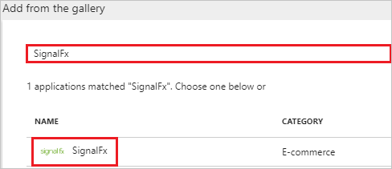
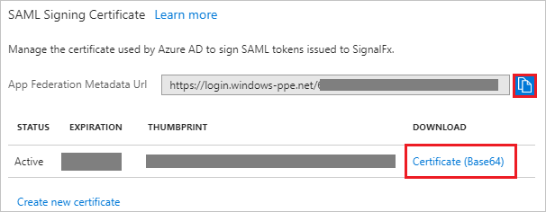
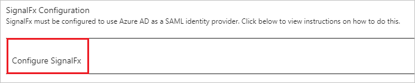

---
title: 'Tutorial: Azure Active Directory integration with SignalFx | Microsoft Docs'
description: Learn how to configure single sign-on between Azure Active Directory and SignalFx.
services: active-directory
documentationCenter: na
author: jeevansd
manager: femila
ms.reviewer: joflore

ms.assetid: 6d5ab4b0-29bc-4b20-8536-d64db7530f32
ms.service: active-directory
ms.component: saas-app-tutorial
ms.workload: identity
ms.tgt_pltfrm: na
ms.devlang: na
ms.topic: article
ms.date: 04/16/2018
ms.author: jeedes

---
# Tutorial: Azure Active Directory integration with SignalFx

In this tutorial, you learn how to integrate SignalFx with Azure Active Directory (Azure AD).

Integrating SignalFx with Azure AD provides you with the following benefits:

- You can control in Azure AD who has access to SignalFx.
- You can enable your users to automatically get signed-on to SignalFx (Single Sign-On) with their Azure AD accounts.
- You can manage your accounts in one central location - the Azure portal.

If you want to know more details about SaaS app integration with Azure AD, see [what is application access and single sign-on with Azure Active Directory](../manage-apps/what-is-single-sign-on.md).

## Prerequisites

To configure Azure AD integration with SignalFx, you need the following items:

- An Azure AD subscription
- A SignalFx single sign-on enabled subscription

> [!NOTE]
> To test the steps in this tutorial, we do not recommend using a production environment.

To test the steps in this tutorial, you should follow these recommendations:

- Do not use your production environment, unless it is necessary.
- If you don't have an Azure AD trial environment, you can [get a one-month trial](https://azure.microsoft.com/pricing/free-trial/).

## Scenario description
In this tutorial, you test Azure AD single sign-on in a test environment. 
The scenario outlined in this tutorial consists of two main building blocks:

1. Adding SignalFx from the gallery
1. Configuring and testing Azure AD single sign-on

## Adding SignalFx from the gallery
To configure the integration of SignalFx into Azure AD, you need to add SignalFx from the gallery to your list of managed SaaS apps.

**To add SignalFx from the gallery, perform the following steps:**

1. In the **[Azure portal](https://portal.azure.com)**, on the left navigation panel, click **Azure Active Directory** icon. 

	![The Azure Active Directory button][1]

1. Navigate to **Enterprise applications**. Then go to **All applications**.

	![The Enterprise applications blade][2]
	
1. To add new application, click **New application** button on the top of dialog.

	![The New application button][3]

1. In the search box, type **SignalFx**, select **SignalFx** from result panel then click **Add** button to add the application.

	

## Configure and test Azure AD single sign-on

In this section, you configure and test Azure AD single sign-on with SignalFx based on a test user called "Britta Simon".

For single sign-on to work, Azure AD needs to know what the counterpart user in SignalFx is to a user in Azure AD. In other words, a link relationship between an Azure AD user and the related user in SignalFx needs to be established.

To configure and test Azure AD single sign-on with SignalFx, you need to complete the following building blocks:

1. **[Configure Azure AD Single Sign-On](#configure-azure-ad-single-sign-on)** - to enable your users to use this feature.
1. **[Create an Azure AD test user](#create-an-azure-ad-test-user)** - to test Azure AD single sign-on with Britta Simon.
1. **[Create a SignalFx test user](#create-a-signalfx-test-user)** - to have a counterpart of Britta Simon in SignalFx that is linked to the Azure AD representation of user.
1. **[Assign the Azure AD test user](#assign-the-azure-ad-test-user)** - to enable Britta Simon to use Azure AD single sign-on.
1. **[Test single sign-on](#test-single-sign-on)** - to verify whether the configuration works.

### Configure Azure AD single sign-on

In this section, you enable Azure AD single sign-on in the Azure portal and configure single sign-on in your SignalFx application.

**To configure Azure AD single sign-on with SignalFx, perform the following steps:**

1. In the Azure portal, on the **SignalFx** application integration page, click **Single sign-on**.

	![Configure single sign-on link][4]

1. On the **Single sign-on** dialog, select **Mode** as	**SAML-based Sign-on** to enable single sign-on.
 
	

1. On the **SignalFx Domain and URLs** section, perform the following steps:

	

    a. In the **Identifier** textbox, type a URL: `https://api.signalfx.com/v1/saml/metadata`

	b. In the **Reply URL** textbox, type a URL using the following pattern: `https://api.signalfx.com/v1/saml/acs/<integration ID>`

	> [!NOTE] 
	> The preceding value is not real value. You update the value with the actual Reply URL, which is explained later in the tutorial.

1. SignalFx application expects the SAML assertions in a specific format. Configure the following claims for this application. You can manage the values of these attributes from the **User Attributes** section on application integration page. The following screenshot shows an example for this.   

	

1. In the **User Attributes** section on the **Single sign-on** dialog, configure SAML token attribute as shown in the image and perform the following steps:
	
	| Attribute Name | Attribute Value |
	| ------------------- | -------------------- |    
	| User.FirstName 		  | user.givenname |
	| User.email 		  | user.mail |
	| PersonImmutableID       | user.userprincipalname    |
	| User.LastName       | user.surname    |

	a. Click **Add attribute** to open the **Add Attribute** dialog.

	

	

	b. In the **Name** textbox, type the attribute name shown for that row.

	c. From the **Value** list, type the attribute value shown for that row.

	d. Leave the **Namespace** blank.
	
	e. Click **Ok**.
 
1. On the **SAML Signing Certificate** section, perform the following steps: 

	

	a. Click the copy button to copy **App Federation Metadata Url** and paste it into notepad.

	b. Click **Certificate(Base64)** and then save the certificate file on your computer.

1. Click **Save** button.

	

1. On the **SignalFx Configuration** section, click **Configure SignalFx** to open **Configure sign-on** window. Copy the **SAML Entity ID** from the **Quick Reference section.**

	 

1. Sign-on to your SignalFx company site as administrator.

1. In SignalFx, on the top click **Integrations** to open the Integrations page.

	

1. Click on **Azure Active Directory** tile under **Login Services** section.
 
	

1. Click on **NEW INTEGRATION** and under the **INSTALL** tab perform the following steps:
 
	

	a. In the **Name** textbox type, a new integration name, like **OurOrgName SAML SSO**.

	b. Copy the **Integration ID** value and append with the **Reply URL** like `https://api.signalfx.com/v1/saml/acs/<integration ID>` in the **Reply URL** textbox of **SignalFx Domain and URLs** section in Azure portal.

	c. Click on **Upload File** to upload the **Base64 encoded certificate** downloaded from Azure portal in the **Certificate** textbox.

	d. In the **Issuer URL** textbox, paste the value of **SAML Entity ID**, which you have copied from the Azure portal.

	e. In the **Metadata URL** textbox, paste the **App Federation Metadata Url** which you have copied from the Azure portal.

	f. Click **Save**.

### Create an Azure AD test user

The objective of this section is to create a test user in the Azure portal called Britta Simon.

   ![Create an Azure AD test user][100]

**To create a test user in Azure AD, perform the following steps:**

1. In the Azure portal, in the left pane, click the **Azure Active Directory** button.

    

1. To display the list of users, go to **Users and groups**, and then click **All users**.

    

1. To open the **User** dialog box, click **Add** at the top of the **All Users** dialog box.

    

1. In the **User** dialog box, perform the following steps:

    

    a. In the **Name** box, type **BrittaSimon**.

    b. In the **User name** box, type the email address of user Britta Simon.

    c. Select the **Show Password** check box, and then write down the value that's displayed in the **Password** box.

    d. Click **Create**.
  
### Create a SignalFx test user

The objective of this section is to create a user called Britta Simon in SignalFx. SignalFx supports just-in-time provisioning, which is by default enabled. There is no action item for you in this section. A new user is created during an attempt to access SignalFx if it doesn't exist yet.

When a user signs in to SignalFx from the SAML SSO for the first time, [SignalFx support team](mailto:kmazzola@signalfx.com) sends them an email containing a link that they must click through to authenticate. This will only happen the first time the user signs in; subsequent login attempts will not require email validation.

>[!Note]
>If you need to create a user manually, contact [SignalFx support team](mailto:kmazzola@signalfx.com)

### Assign the Azure AD test user

In this section, you enable Britta Simon to use Azure single sign-on by granting access to SignalFx.

![Assign the user role][200] 

**To assign Britta Simon to SignalFx, perform the following steps:**

1. In the Azure portal, open the applications view, and then navigate to the directory view and go to **Enterprise applications** then click **All applications**.

	![Assign User][201] 

1. In the applications list, select **SignalFx**.

	  

1. In the menu on the left, click **Users and groups**.

	![The "Users and groups" link][202]

1. Click **Add** button. Then select **Users and groups** on **Add Assignment** dialog.

	![The Add Assignment pane][203]

1. On **Users and groups** dialog, select **Britta Simon** in the Users list.

1. Click **Select** button on **Users and groups** dialog.

1. Click **Assign** button on **Add Assignment** dialog.
	
### Test single sign-on

In this section, you test your Azure AD single sign-on configuration using the Access Panel.

When you click the SignalFx tile in the Access Panel, you should get automatically signed-on to your SignalFx application.
For more information about the Access Panel, see [Introduction to the Access Panel](../user-help/active-directory-saas-access-panel-introduction.md). 

## Additional resources

* [List of Tutorials on How to Integrate SaaS Apps with Azure Active Directory](tutorial-list.md)
* [What is application access and single sign-on with Azure Active Directory?](../manage-apps/what-is-single-sign-on.md)

<!--Image references-->

[1]: ./media/signalfx-tutorial/tutorial_general_01.png
[2]: ./media/signalfx-tutorial/tutorial_general_02.png
[3]: ./media/signalfx-tutorial/tutorial_general_03.png
[4]: ./media/signalfx-tutorial/tutorial_general_04.png

[100]: ./media/signalfx-tutorial/tutorial_general_100.png

[200]: ./media/signalfx-tutorial/tutorial_general_200.png
[201]: ./media/signalfx-tutorial/tutorial_general_201.png
[202]: ./media/signalfx-tutorial/tutorial_general_202.png
[203]: ./media/signalfx-tutorial/tutorial_general_203.png

