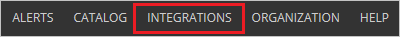
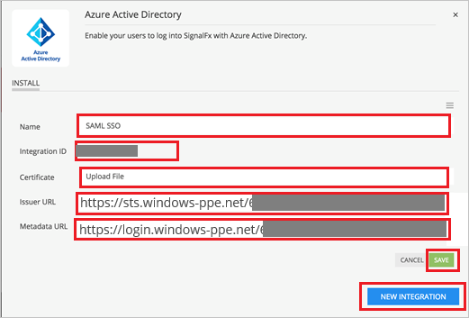

# Tutorial: Azure Active Directory integration with SignalFx

In this tutorial, you learn how to integrate SignalFx with Azure Active Directory (Azure AD).
Integrating SignalFx with Azure AD provides you with the following benefits:

* You can control in Azure AD who has access to SignalFx.
* You can enable your users to be automatically signed-in to SignalFx (Single Sign-On) with their Azure AD accounts.
* You can manage your accounts in one central location - the Azure portal.

If you want to know more details about SaaS app integration with Azure AD, see [What is application access and single sign-on with Azure Active Directory](https://docs.microsoft.com/azure/active-directory/active-directory-appssoaccess-whatis).
If you don't have an Azure subscription, [create a free account](https://azure.microsoft.com/free/) before you begin.

## Prerequisites

To configure Azure AD integration with SignalFx, you need the following items:

* An Azure AD subscription. If you don't have an Azure AD environment, you can get a [free account](https://azure.microsoft.com/free/)
* SignalFx single sign-on enabled subscription

## Scenario description

In this tutorial, you configure and test Azure AD single sign-on in a test environment.

* SignalFx supports **IDP** initiated SSO
* SignalFx supports **Just In Time** user provisioning

## Adding SignalFx from the gallery

To configure the integration of SignalFx into Azure AD, you need to add SignalFx from the gallery to your list of managed SaaS apps.

**To add SignalFx from the gallery, perform the following steps:**

1. In the **[Azure portal](https://portal.azure.com)**, on the left navigation panel, click **Azure Active Directory** icon.

	

2. Navigate to **Enterprise Applications** and then select the **All Applications** option.

	

3. To add new application, click **New application** button on the top of dialog.

	

4. In the search box, type **SignalFx**, select **SignalFx** from result panel then click **Add** button to add the application.

	 

## Configure and test Azure AD single sign-on

In this section, you configure and test Azure AD single sign-on with SignalFx based on a test user called **Britta Simon**.
For single sign-on to work, a link relationship between an Azure AD user and the related user in SignalFx needs to be established.

To configure and test Azure AD single sign-on with SignalFx, you need to complete the following building blocks:

1. **[Configure Azure AD Single Sign-On](#configure-azure-ad-single-sign-on)** - to enable your users to use this feature.
2. **[Configure SignalFx Single Sign-On](#configure-signalfx-single-sign-on)** - to configure the Single Sign-On settings on application side.
3. **[Create an Azure AD test user](#create-an-azure-ad-test-user)** - to test Azure AD single sign-on with Britta Simon.
4. **[Assign the Azure AD test user](#assign-the-azure-ad-test-user)** - to enable Britta Simon to use Azure AD single sign-on.
5. **[Create SignalFx test user](#create-signalfx-test-user)** - to have a counterpart of Britta Simon in SignalFx that is linked to the Azure AD representation of user.
6. **[Test single sign-on](#test-single-sign-on)** - to verify whether the configuration works.

### Configure Azure AD single sign-on

In this section, you enable Azure AD single sign-on in the Azure portal.

To configure Azure AD single sign-on with SignalFx, perform the following steps:

1. In the [Azure portal](https://portal.azure.com/), on the **SignalFx** application integration page, select **Single sign-on**.

    

2. On the **Select a Single sign-on method** dialog, select **SAML/WS-Fed** mode to enable single sign-on.

    

3. On the **Set up Single Sign-On with SAML** page, click **Edit** icon to open **Basic SAML Configuration** dialog.

	

4. On the **Set up Single Sign-On with SAML** page, perform the following steps:

    

    a. In the **Identifier** text box, type a URL:
    `https://api.signalfx.com/v1/saml/metadata`

    b. In the **Reply URL** text box, type a URL using the following pattern:
    `https://api.signalfx.com/v1/saml/acs/<integration ID>`

	> [!NOTE]
	> The preceding value is not real value. You update the value with the actual Reply URL, which is explained later in the tutorial.

5. SignalFx application expects the SAML assertions in a specific format. Configure the following claims for this application. You can manage the values of these attributes from the **User Attributes** section on application integration page. On the **Set up Single Sign-On with SAML** page, click **Edit** button to open **User Attributes** dialog.

	

6. In the **User Claims** section on the **User Attributes** dialog, edit the claims by using **Edit icon** or add the claims by using **Add new claim** to configure SAML token attribute as shown in the image above and perform the following steps: 

	| Name |  Source Attribute|
	| ------------------- | -------------------- |
	| User.FirstName 	 | user.givenname |
	| User.email 		  | user.mail |
	| PersonImmutableID       | user.userprincipalname    |
	| User.LastName       | user.surname    |

	a. Click **Add new claim** to open the **Manage user claims** dialog.

	

	

	b. In the **Name** textbox, type the attribute name shown for that row.

	c. Leave the **Namespace** blank.

	d. Select Source as **Attribute**.

	e. From the **Source attribute** list, type the attribute value shown for that row.

	f. Click **Ok**

	g. Click **Save**.

7. On the **Set up Single Sign-On with SAML** page, in the **SAML Signing Certificate** section, click **Download** to download the **Certificate (Base64)** from the given options as per your requirement and save it on your computer.

	

8. On the **Set up SignalFx** section, copy the appropriate URL(s) as per your requirement.

	

	a. Login URL

	b. Azure AD Identifier

	c. Logout URL

### Configure SignalFx Single Sign-On

1. Sign in to your SignalFx company site as administrator.

1. In SignalFx, on the top click **Integrations** to open the Integrations page.

	

1. Click on **Azure Active Directory** tile under **Login Services** section.

	

1. Click on **NEW INTEGRATION** and under the **INSTALL** tab perform the following steps:

	

	a. In the **Name** textbox type, a new integration name, like **OurOrgName SAML SSO**.

	b. Copy the **Integration ID** value and append to the **Reply URL** in the place of `<integration ID>` in the **Reply URL** textbox of **Basic SAML Configuration** section in Azure portal.

	c. Click on **Upload File** to upload the **Base64 encoded certificate** downloaded from Azure portal in the **Certificate** textbox.

	d. In the **Issuer URL** textbox, paste the value of **Azure AD Identifier**, which you have copied from the Azure portal.

	e. In the **Metadata URL** textbox, paste the **Login URL** which you have copied from the Azure portal.

	f. Click **Save**.

### Create an Azure AD test user

The objective of this section is to create a test user in the Azure portal called Britta Simon.

1. In the Azure portal, in the left pane, select **Azure Active Directory**, select **Users**, and then select **All users**.

    

2. Select **New user** at the top of the screen.

    

3. In the User properties, perform the following steps.

    

    a. In the **Name** field enter **BrittaSimon**.
  
    b. In the **User name** field type `brittasimon@yourcompanydomain.extension`  
    For example, BrittaSimon@contoso.com

    c. Select **Show password** check box, and then write down the value that's displayed in the Password box.

    d. Click **Create**.

### Assign the Azure AD test user

In this section, you enable Britta Simon to use Azure single sign-on by granting access to SignalFx.

1. In the Azure portal, select **Enterprise Applications**, select **All applications**, then select **SignalFx**.

	

2. In the applications list, select **SignalFx**.

	

3. In the menu on the left, select **Users and groups**.

    

4. Click the **Add user** button, then select **Users and groups** in the **Add Assignment** dialog.

    

5. In the **Users and groups** dialog select **Britta Simon** in the Users list, then click the **Select** button at the bottom of the screen.

6. If you are expecting any role value in the SAML assertion then in the **Select Role** dialog select the appropriate role for the user from the list, then click the **Select** button at the bottom of the screen.

7. In the **Add Assignment** dialog click the **Assign** button.

### Create SignalFx test user

The objective of this section is to create a user called Britta Simon in SignalFx. SignalFx supports just-in-time provisioning, which is by default enabled. There is no action item for you in this section. A new user is created during an attempt to access SignalFx if it doesn't exist yet.

When a user signs in to SignalFx from the SAML SSO for the first time, [SignalFx support team](mailto:kmazzola@signalfx.com) sends them an email containing a link that they must click through to authenticate. This will only happen the first time the user signs in; subsequent login attempts will not require email validation.

> [!Note]
> If you need to create a user manually, contact [SignalFx support team](mailto:kmazzola@signalfx.com)

### Test single sign-on

In this section, you test your Azure AD single sign-on configuration using the Access Panel.

When you click the SignalFx tile in the Access Panel, you should be automatically signed in to the SignalFx for which you set up SSO. For more information about the Access Panel, see [Introduction to the Access Panel](https://docs.microsoft.com/azure/active-directory/active-directory-saas-access-panel-introduction).

## Additional Resources

- [List of Tutorials on How to Integrate SaaS Apps with Azure Active Directory](https://docs.microsoft.com/azure/active-directory/active-directory-saas-tutorial-list)

- [What is application access and single sign-on with Azure Active Directory?](https://docs.microsoft.com/azure/active-directory/active-directory-appssoaccess-whatis)

- [What is Conditional Access in Azure Active Directory?](https://docs.microsoft.com/azure/active-directory/conditional-access/overview)

