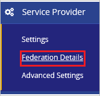
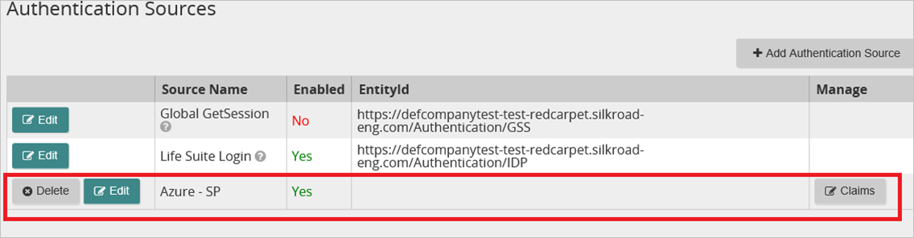
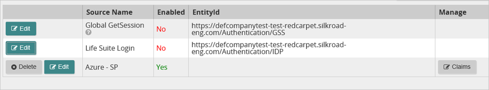

# Tutorial: Microsoft Entra integration with SilkRoad Life Suite

In this tutorial, you'll learn how to integrate SilkRoad Life Suite with Microsoft Entra ID. When you integrate SilkRoad Life Suite with Microsoft Entra ID, you can:

* Control in Microsoft Entra ID who has access to SilkRoad Life Suite.
* Enable your users to be automatically signed-in to SilkRoad Life Suite with their Microsoft Entra accounts.
* Manage your accounts in one central location.

## Prerequisites

To configure Microsoft Entra integration with SilkRoad Life Suite, you need the following items:

* A Microsoft Entra subscription. If you don't have a Microsoft Entra environment, you can get a [free account](https://azure.microsoft.com/free/).
* SilkRoad Life Suite single sign-on enabled subscription.

## Scenario description

In this tutorial, you configure and test Microsoft Entra single sign-on in a test environment.

* SilkRoad Life Suite supports **SP** initiated SSO.

## Add SilkRoad Life Suite from the gallery

To configure the integration of SilkRoad Life Suite into Microsoft Entra ID, you need to add SilkRoad Life Suite from the gallery to your list of managed SaaS apps.

1. Sign in to the [Microsoft Entra admin center](https://entra.microsoft.com) as at least a [Cloud Application Administrator](../roles/permissions-reference.md#cloud-application-administrator).
1. Browse to **Identity** > **Applications** > **Enterprise applications** > **New application**.
1. In the **Add from the gallery** section, type **SilkRoad Life Suite** in the search box.
1. Select **SilkRoad Life Suite** from results panel and then add the app. Wait a few seconds while the app is added to your tenant.

 Alternatively, you can also use the [Enterprise App Configuration Wizard](https://portal.office.com/AdminPortal/home?Q=Docs#/azureadappintegration). In this wizard, you can add an application to your tenant, add users/groups to the app, assign roles, as well as walk through the SSO configuration as well. [Learn more about Microsoft 365 wizards.](/microsoft-365/admin/misc/azure-ad-setup-guides)

## Configure and test Microsoft Entra SSO for SilkRoad Life Suite

Configure and test Microsoft Entra SSO with SilkRoad Life Suite using a test user called **B.Simon**. For SSO to work, you need to establish a link relationship between a Microsoft Entra user and the related user in SilkRoad Life Suite.

To configure and test Microsoft Entra SSO with SilkRoad Life Suite, perform the following steps:

1. **[Configure Microsoft Entra SSO](#configure-azure-ad-sso)** - to enable your users to use this feature.
    1. **[Create a Microsoft Entra test user](#create-an-azure-ad-test-user)** - to test Microsoft Entra single sign-on with B.Simon.
    1. **[Assign the Microsoft Entra test user](#assign-the-azure-ad-test-user)** - to enable B.Simon to use Microsoft Entra single sign-on.
1. **[Configure SilkRoad Life Suite SSO](#configure-silkroad-life-suite-sso)** - to configure the single sign-on settings on application side.
    1. **[Create SilkRoad Life Suite test user](#create-silkroad-life-suite-test-user)** - to have a counterpart of B.Simon in SilkRoad Life Suite that is linked to the Microsoft Entra representation of user.
1. **[Test SSO](#test-sso)** - to verify whether the configuration works.

## Configure Microsoft Entra SSO

Follow these steps to enable Microsoft Entra SSO.

1. Sign in to the [Microsoft Entra admin center](https://entra.microsoft.com) as at least a [Cloud Application Administrator](../roles/permissions-reference.md#cloud-application-administrator).
1. Browse to **Identity** > **Applications** > **Enterprise applications** > **SilkRoad Life Suite** > **Single sign-on**.
1. On the **Select a single sign-on method** page, select **SAML**.
1. On the **Set up single sign-on with SAML** page, click the pencil icon for **Basic SAML Configuration** to edit the settings.

   

1. On the **Basic SAML Configuration** section, if you have **Service Provider metadata file**, perform the following steps:

    > [!NOTE]
    > You will get the **Service Provider metadata file** explained later in this tutorial.

	a. Click **Upload metadata file**.

    

	b. Click on **folder logo** to select the metadata file and click **Upload**.

	

	c. Once the metadata file is successfully uploaded, the **Identifier** and **Reply URL** values get auto populated in Basic SAML Configuration section.

	> [!Note]
	> If the **Identifier** and **Reply URL** values are not getting auto populated, then fill in the values manually according to your requirement.

    d. In the **Sign-on URL** text box, type a URL using the following pattern:
    `https://<SUBDOMAIN>.silkroad-eng.com/Authentication/`

5. On the **Basic SAML Configuration** section, if you do not have **Service Provider metadata file**, perform the following steps:

    a. In the **Identifier** box, type a URL using one of the following patterns:

    | Identifier URL |
    |-----|
    |`https://<SUBDOMAIN>.silkroad-eng.com/Authentication/SP`|
	|`https://<SUBDOMAIN>.silkroad.com/Authentication/SP`|
    

    b. In the **Reply URL** text box, type a URL using one of the following patterns:

    | Reply URL |
    |-----|
	|`https://<SUBDOMAIN>.silkroad-eng.com/Authentication/`|
	|`https://<SUBDOMAIN>.silkroad.com/Authentication/`|

    c. In the **Sign-on URL** text box, type a URL using the following pattern:
    `https://<SUBDOMAIN>.silkroad-eng.com/Authentication/`

	> [!NOTE]
	> These values are not real. Update these values with the actual Identifier,Reply URL and Sign-On URL. Contact [SilkRoad Life Suite Client support team](https://www.silkroad.com/locations/) to get these values. You can also refer to the patterns shown in the **Basic SAML Configuration** section.

6. On the **Set up Single Sign-On with SAML** page, in the **SAML Signing Certificate** section, click **Download** to download the **Federation Metadata XML** from the given options as per your requirement and save it on your computer.

	

7. On the **Set up SilkRoad Life Suite** section, copy the appropriate URL(s) as per your requirement.

	

### Create a Microsoft Entra test user

In this section, you'll create a test user called B.Simon.

1. Sign in to the [Microsoft Entra admin center](https://entra.microsoft.com) as at least a [User Administrator](../roles/permissions-reference.md#user-administrator).
1. Browse to **Identity** > **Users** > **All users**.
1. Select **New user** > **Create new user**, at the top of the screen.
1. In the **User** properties, follow these steps:
   1. In the **Display name** field, enter `B.Simon`.  
   1. In the **User principal name** field, enter the username@companydomain.extension. For example, `B.Simon@contoso.com`.
   1. Select the **Show password** check box, and then write down the value that's displayed in the **Password** box.
   1. Select **Review + create**.
1. Select **Create**.

### Assign the Microsoft Entra test user

In this section, you'll enable B.Simon to use single sign-on by granting access to SilkRoad Life Suite.

1. Sign in to the [Microsoft Entra admin center](https://entra.microsoft.com) as at least a [Cloud Application Administrator](../roles/permissions-reference.md#cloud-application-administrator).
1. Browse to **Identity** > **Applications** > **Enterprise applications** > **SilkRoad Life Suite**.
1. In the app's overview page, select **Users and groups**.
1. Select **Add user/group**, then select **Users and groups** in the **Add Assignment** dialog.
   1. In the **Users and groups** dialog, select **B.Simon** from the Users list, then click the **Select** button at the bottom of the screen.
   1. If you are expecting a role to be assigned to the users, you can select it from the **Select a role** dropdown. If no role has been set up for this app, you see "Default Access" role selected.
   1. In the **Add Assignment** dialog, click the **Assign** button.

## Configure SilkRoad Life Suite SSO

1. Sign in to your SilkRoad company site as administrator.

    > [!NOTE]
    > To obtain access to the SilkRoad Life Suite Authentication application for configuring federation with Microsoft Entra ID, please contact SilkRoad Support or your SilkRoad Services representative.

1. Go to **Service Provider**, and then click **Federation Details**.

    

1. Click **Download Federation Metadata**, and then save the metadata file on your computer. Use Downloaded Federation Metadata as a **Service Provider metadata file** in the **Basic SAML Configuration** section.

    

1. In your **SilkRoad** application, click **Authentication Sources**.

     

1. Click **Add Authentication Source**.

    

1. In the **Add Authentication Source** section, perform the following steps:

    
  
    a. Under **Option 2 - Metadata File**, click **Browse** to upload the downloaded metadata file from Azure portal.
  
    b. Click **Create Identity Provider using File Data**.

1. In the **Authentication Sources** section, click **Edit**.

    

1. On the **Edit Authentication Source** dialog, perform the following steps:

    

    a. As **Enabled**, select **Yes**.

	b. In the **EntityId** textbox, paste the value of **Microsoft Entra Identifier**..

    c. In the **IdP Description** textbox, type a description for your configuration (for example: **Microsoft Entra SSO**).

	d. In the **Metadata File** textbox, Upload the **metadata** file which you have downloaded previously.
  
    e. In the **IdP Name** textbox, type a name that is specific to your configuration (for example: *Azure SP*).
  
	f. In the **Logout Service URL** textbox, paste the value of **Logout URL**..

	g. In the **Sign-on service URL** textbox, paste the value of **Login URL**..

    h. Click **Save**.

1. Disable all other authentication sources.

    

### Create SilkRoad Life Suite test user

In this section, you create a user called Britta Simon in SilkRoad Life Suite. Work with [SilkRoad Life Suite Client support team](https://www.silkroad.com/locations/) to add the users in the SilkRoad Life Suite platform. Users must be created and activated before you use single sign-on.

## Test SSO

In this section, you test your Microsoft Entra single sign-on configuration with following options. 

* Click on **Test this application**, this will redirect to SilkRoad Life Suite Sign-on URL where you can initiate the login flow. 

* Go to SilkRoad Life Suite Sign-on URL directly and initiate the login flow from there.

* You can use Microsoft My Apps. When you click the SilkRoad Life Suite tile in the My Apps, this will redirect to SilkRoad Life Suite Sign-on URL. For more information about the My Apps, see [Introduction to the My Apps](https://support.microsoft.com/account-billing/sign-in-and-start-apps-from-the-my-apps-portal-2f3b1bae-0e5a-4a86-a33e-876fbd2a4510).

## Next steps

Once you configure SilkRoad Life Suite you can enforce session control, which protects exfiltration and infiltration of your organization’s sensitive data in real time. Session control extends from Conditional Access. [Learn how to enforce session control with Microsoft Defender for Cloud Apps](/cloud-app-security/proxy-deployment-aad).
