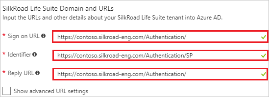
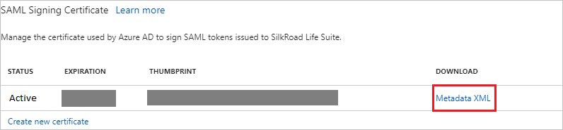
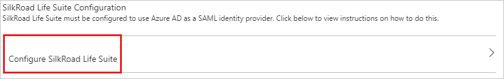
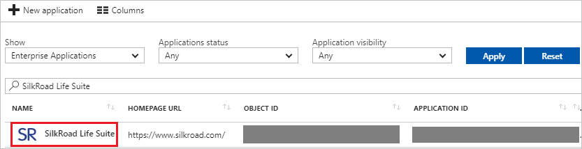

---
title: 'Tutorial: Azure Active Directory integration with SilkRoad Life Suite | Microsoft Docs'
description: Learn how to configure single sign-on between Azure Active Directory and SilkRoad Life Suite.
services: active-directory
documentationCenter: na
author: jeevansd
manager: femila
ms.reviewer: joflore

ms.assetid: 3cd92319-7964-41eb-8712-444f5c8b4d15
ms.service: active-directory
ms.component: saas-app-tutorial
ms.workload: identity
ms.tgt_pltfrm: na
ms.devlang: na
ms.topic: article
ms.date: 12/12/2017
ms.author: jeedes

---
# Tutorial: Azure Active Directory integration with SilkRoad Life Suite

In this tutorial, you learn how to integrate SilkRoad Life Suite with Azure Active Directory (Azure AD).

Integrating SilkRoad Life Suite with Azure AD provides you with the following benefits:

- You can control in Azure AD who has access to SilkRoad Life Suite.
- You can enable your users to automatically get signed-on to SilkRoad Life Suite (Single Sign-On) with their Azure AD accounts.
- You can manage your accounts in one central location - the Azure portal.

If you want to know more details about SaaS app integration with Azure AD, see [what is application access and single sign-on with Azure Active Directory](../manage-apps/what-is-single-sign-on.md).

## Prerequisites

To configure Azure AD integration with SilkRoad Life Suite, you need the following items:

- An Azure AD subscription
- A SilkRoad Life Suite single-sign on enabled subscription

> [!NOTE]
> To test the steps in this tutorial, we do not recommend using a production environment.

To test the steps in this tutorial, you should follow these recommendations:

- Do not use your production environment, unless it is necessary.
- If you don't have an Azure AD trial environment, you can [get a one-month trial](https://azure.microsoft.com/pricing/free-trial/).

## Scenario description
In this tutorial, you test Azure AD single sign-on in a test environment. 
The scenario outlined in this tutorial consists of two main building blocks:

1. Adding SilkRoad Life Suite from the gallery
1. Configuring and testing Azure AD single sign-on

## Adding SilkRoad Life Suite from the gallery
To configure the integration of SilkRoad Life Suite into Azure AD, you need to add SilkRoad Life Suite from the gallery to your list of managed SaaS apps.

**To add SilkRoad Life Suite from the gallery, perform the following steps:**

1. In the **[Azure portal](https://portal.azure.com)**, on the left navigation panel, click **Azure Active Directory** icon. 

	![The Azure Active Directory button][1]

1. Navigate to **Enterprise applications**. Then go to **All applications**.

	![The Enterprise applications blade][2]
	
1. To add new application, click **New application** button on the top of dialog.

	![The New application button][3]

1. In the search box, type **SilkRoad Life Suite**, select **SilkRoad Life Suite** from result panel then click **Add** button to add the application.

	

## Configure and test Azure AD single sign-on

In this section, you configure and test Azure AD single sign-on with SilkRoad Life Suite based on a test user called "Britta Simon".

For single sign-on to work, Azure AD needs to know what the counterpart user in SilkRoad Life Suite is to a user in Azure AD. In other words, a link relationship between an Azure AD user and the related user in SilkRoad Life Suite needs to be established.

In SilkRoad Life Suite, assign the value of the **user name** in Azure AD as the value of the **Username** to establish the link relationship.

To configure and test Azure AD single sign-on with SilkRoad Life Suite, you need to complete the following building blocks:

1. **[Configure Azure AD Single Sign-On](#configure-azure-ad-single-sign-on)** - to enable your users to use this feature.
1. **[Create an Azure AD test user](#create-an-azure-ad-test-user)** - to test Azure AD single sign-on with Britta Simon.
1. **[Create a SilkRoad Life Suite test user](#create-a-silkroad-life-suite-test-user)** - to have a counterpart of Britta Simon in SilkRoad Life Suite that is linked to the Azure AD representation of user.
1. **[Assign the Azure AD test user](#assign-the-azure-ad-test-user)** - to enable Britta Simon to use Azure AD single sign-on.
1. **[Test single sign-on](#test-single-sign-on)** - to verify whether the configuration works.

### Configure Azure AD single sign-on

In this section, you enable Azure AD single sign-on in the Azure portal and configure single sign-on in your SilkRoad Life Suite application.

**To configure Azure AD single sign-on with SilkRoad Life Suite, perform the following steps:**

1. In the Azure portal, on the **SilkRoad Life Suite** application integration page, click **Single sign-on**.

	![Configure single sign-on link][4]

1. On the **Single sign-on** dialog, select **Mode** as	**SAML-based Sign-on** to enable single sign-on.
 
	

1. On the **SilkRoad Life Suite Domain and URLs** section, perform the following steps:

	

	a. In the **Sign-on URL** textbox, type a URL using the following pattern: `https://<subdomain>.silkroad-eng.com/Authentication/`

    b. In the **Identifier** textbox, type a URL using the following pattern: 
	| |
	|--|
	| `https://<subdomain>.silkroad-eng.com/Authentication/SP` |
	| `https://<subdomain>.silkroad.com/Authentication/SP` |

	c. In the **Reply URL** textbox, type a URL using the following pattern: 
	| |
	|--|
	| `https://<subdomain>.silkroad-eng.com/Authentication/` |
	| `https://<subdomain>.silkroad.com/Authentication/` |
	 
	> [!NOTE] 
	> These values are not real. Update these values with the actual Identifier, Reply URL, and Sign-On URL. Contact [SilkRoad Life Suite Client support team](https://www.silkroad.com/locations/) to get these values. 

1. On the **SAML Signing Certificate** section, click **Metadata XML** and then save the metadata file on your computer.

	 

1. Click **Save** button.

	
	
1. On the **SilkRoad Life Suite Configuration** section, click **Configure SilkRoad Life Suite** to open **Configure sign-on** window. Copy the **Sign-Out URL, SAML Entity ID, and SAML Single Sign-On Service URL** from the **Quick Reference section.**

	 

1. Sign-on to your SilkRoad company site as administrator. 
 
    >[!NOTE] 
    > To obtain access to the SilkRoad Life Suite Authentication application for configuring federation with Microsoft Azure AD, please contact SilkRoad Support or your SilkRoad Services representative.

1. Go to **Service Provider**, and then click **Federation Details**. 
   
    ![Azure AD Single Sign-On][10]

1. Click **Download Federation Metadata**, and then save the metadata file on your computer.
   
    ![Azure AD Single Sign-On][11] 

1. In your **SilkRoad** application, click **Authentication Sources**.
   
    ![Azure AD Single Sign-On][12] 

1. Click **Add Authentication Source**. 
   
    ![Azure AD Single Sign-On][13] 

1. In the **Add Authentication Source** section, perform the following steps: 
   
    ![Azure AD Single Sign-On][14]
  
    a. Under **Option 2 - Metadata File**, click **Browse** to upload the downloaded metadata file from Azure portal.
  
    b. Click **Create Identity Provider using File Data**.

1. In the **Authentication Sources** section, click **Edit**. 
    
     ![Azure AD Single Sign-On][15] 

1. On the **Edit Authentication Source** dialog, perform the following steps: 
    
     ![Azure AD Single Sign-On][16] 

    a. As **Enabled**, select **Yes**.

	b. In the **EntityId** textbox, paste the value of **SAML Entity ID** which you have copied from Azure portal.
   
    c. In the **IdP Description** textbox, type a description for your configuration (for example: *Azure AD SSO*).

	d. In the **Metadata File** textbox, Upload the **metadata** file which you have downloaded from Azure portal.
  
    e. In the **IdP Name** textbox, type a name that is specific to your configuration (for example: *Azure SP*).
  
	f. In the **Logout Service URL** textbox, paste the value of **Sign-Out URL** which you have copied from Azure portal.

	g. In the **sign-on service URL** textbox, paste the value of **SAML Single Sign-On Service URL** which you have copied from Azure portal.

    h. Click **Save**.

1. Disable all other authentication sources. 
    
     ![Azure AD Single Sign-On][17]

> [!TIP]
> You can now read a concise version of these instructions inside the [Azure portal](https://portal.azure.com), while you are setting up the app!  After adding this app from the **Active Directory > Enterprise Applications** section, simply click the **Single Sign-On** tab and access the embedded documentation through the **Configuration** section at the bottom. You can read more about the embedded documentation feature here: [Azure AD embedded documentation]( https://go.microsoft.com/fwlink/?linkid=845985)

### Create an Azure AD test user

The objective of this section is to create a test user in the Azure portal called Britta Simon.

   ![Create an Azure AD test user][100]

**To create a test user in Azure AD, perform the following steps:**

1. In the Azure portal, in the left pane, click the **Azure Active Directory** button.

    

1. To display the list of users, go to **Users and groups**, and then click **All users**.

    

1. To open the **User** dialog box, click **Add** at the top of the **All Users** dialog box.

    

1. In the **User** dialog box, perform the following steps:

    

    a. In the **Name** box, type **BrittaSimon**.

    b. In the **User name** box, type the email address of user Britta Simon.

    c. Select the **Show Password** check box, and then write down the value that's displayed in the **Password** box.

    d. Click **Create**.
 
### Create a SilkRoad Life Suite test user

In this section, you create a user called Britta Simon in SilkRoad Life Suite. Work with [SilkRoad Life Suite Client support team](https://www.silkroad.com/locations/) to add the users in the SilkRoad Life Suite platform. Users must be created and activated before you use single sign-on. 

### Assign the Azure AD test user

In this section, you enable Britta Simon to use Azure single sign-on by granting access to SilkRoad Life Suite.

![Assign the user role][200] 

**To assign Britta Simon to SilkRoad Life Suite, perform the following steps:**

1. In the Azure portal, open the applications view, and then navigate to the directory view and go to **Enterprise applications** then click **All applications**.

	![Assign User][201] 

1. In the applications list, select **SilkRoad Life Suite**.

	  

1. In the menu on the left, click **Users and groups**.

	![The "Users and groups" link][202]

1. Click **Add** button. Then select **Users and groups** on **Add Assignment** dialog.

	![The Add Assignment pane][203]

1. On **Users and groups** dialog, select **Britta Simon** in the Users list.

1. Click **Select** button on **Users and groups** dialog.

1. Click **Assign** button on **Add Assignment** dialog.
	
### Test single sign-on

In this section, you test your Azure AD single sign-on configuration using the Access Panel.

When you click the SilkRoad Life Suite tile in the Access Panel, you should get automatically signed-on to your SilkRoad Life Suite application.
For more information about the Access Panel, see [Introduction to the Access Panel](../user-help/active-directory-saas-access-panel-introduction.md). 

## Additional resources

* [List of Tutorials on How to Integrate SaaS Apps with Azure Active Directory](tutorial-list.md)
* [What is application access and single sign-on with Azure Active Directory?](../manage-apps/what-is-single-sign-on.md)

<!--Image references-->

[1]: ./media/silkroad-life-suite-tutorial/tutorial_general_01.png
[2]: ./media/silkroad-life-suite-tutorial/tutorial_general_02.png
[3]: ./media/silkroad-life-suite-tutorial/tutorial_general_03.png
[4]: ./media/silkroad-life-suite-tutorial/tutorial_general_04.png

[100]: ./media/silkroad-life-suite-tutorial/tutorial_general_100.png

[200]: ./media/silkroad-life-suite-tutorial/tutorial_general_200.png
[201]: ./media/silkroad-life-suite-tutorial/tutorial_general_201.png
[202]: ./media/silkroad-life-suite-tutorial/tutorial_general_202.png
[203]: ./media/silkroad-life-suite-tutorial/tutorial_general_203.png
[10]: ./media/silkroad-life-suite-tutorial/tutorial_silkroad_06.png
[11]: ./media/silkroad-life-suite-tutorial/tutorial_silkroad_07.png
[12]: ./media/silkroad-life-suite-tutorial/tutorial_silkroad_08.png
[13]: ./media/silkroad-life-suite-tutorial/tutorial_silkroad_09.png
[14]: ./media/silkroad-life-suite-tutorial/tutorial_silkroad_10.png
[15]: ./media/silkroad-life-suite-tutorial/tutorial_silkroad_11.png
[16]: ./media/silkroad-life-suite-tutorial/tutorial_silkroad_12.png
[17]: ./media/silkroad-life-suite-tutorial/tutorial_silkroad_13.png
