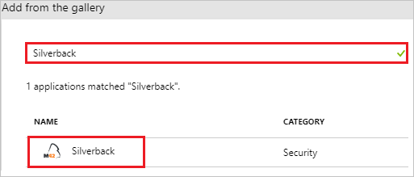
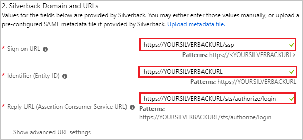
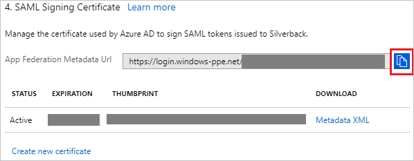
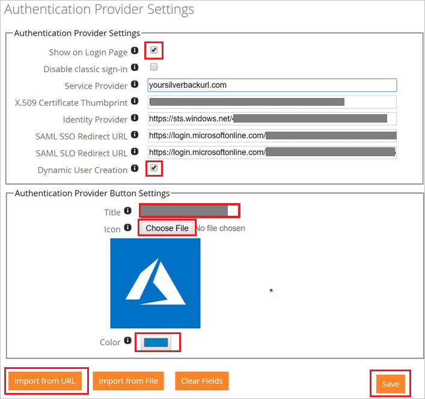
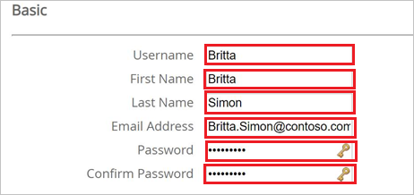
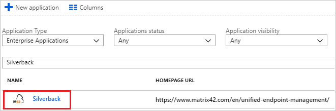

# Tutorial: Azure Active Directory integration with Silverback

In this tutorial, you learn how to integrate Silverback with Azure Active Directory (Azure AD).

Integrating Silverback with Azure AD provides you with the following benefits:

- You can control in Azure AD who has access to Silverback.
- You can enable your users to automatically get signed-on to Silverback (Single Sign-On) with their Azure AD accounts.
- You can manage your accounts in one central location - the Azure portal.

If you want to know more details about SaaS app integration with Azure AD, see [what is application access and single sign-on with Azure Active Directory](../manage-apps/what-is-single-sign-on.md).

## Prerequisites

To configure Azure AD integration with Silverback, you need the following items:

- An Azure AD subscription
- An active Silverback subscription

> [!NOTE]
> To test the steps in this tutorial, we do not recommend using a production environment.

To test the steps in this tutorial, you should follow these recommendations:

- Do not use your production environment, unless it is necessary.
- If you don't have an Azure AD trial environment, you can [get a one-month trial](https://azure.microsoft.com/pricing/free-trial/).

## Scenario description
In this tutorial, you test Azure AD single sign-on in a test environment. 
The scenario outlined in this tutorial consists of two main building blocks:

1. Adding Silverback from the gallery
2. Configuring and testing Azure AD single sign-on

## Adding Silverback from the gallery
To configure the integration of Silverback into Azure AD, you need to add Silverback from the gallery to your list of managed SaaS apps.

**To add Silverback from the gallery, perform the following steps:**

1. In the **[Azure portal](https://portal.azure.com)**, on the left navigation panel, click **Azure Active Directory** icon. 

	![The Azure Active Directory button][1]

2. Navigate to **Enterprise applications**. Then go to **All applications**.

	![The Enterprise applications blade][2]
	
3. To add new application, click **New application** button on the top of dialog.

	![The New application button][3]

4. In the search box, type **Silverback**, select **Silverback** from result panel then click **Add** button to add the application.

	

## Configure and test Azure AD single sign-on

In this section, you configure and test Azure AD single sign-on with Silverback based on a test user called "Britta Simon".

For single sign-on to work, Azure AD needs to know what the counterpart user in Silverback is to a user in Azure AD. In other words, a link relationship between an Azure AD user and the related user in Silverback needs to be established.

To configure and test Azure AD single sign-on with Silverback, you need to complete the following building blocks:

1. **[Configure Azure AD Single Sign-On](#configure-azure-ad-single-sign-on)** - to enable your users to use this feature.
2. **[Create an Azure AD test user](#create-an-azure-ad-test-user)** - to test Azure AD single sign-on with Britta Simon.
3. **[Create a Silverback test user](#create-a-silverback-test-user)** - to have a counterpart of Britta Simon in Silverback that is linked to the Azure AD representation of user.
4. **[Assign the Azure AD test user](#assign-the-azure-ad-test-user)** - to enable Britta Simon to use Azure AD single sign-on.
5. **[Test single sign-on](#test-single-sign-on)** - to verify whether the configuration works.

### Configure Azure AD single sign-on

In this section, you enable Azure AD single sign-on in the Azure portal and configure single sign-on in your Silverback application.

**To configure Azure AD single sign-on with Silverback, perform the following steps:**

1. In the Azure portal, on the **Silverback** application integration page, click **Single sign-on**.

	![Configure single sign-on link][4]

2. On the **Single sign-on** dialog, select **Mode** as	**SAML-based Sign-on** to enable single sign-on.
 
	

3. On the **Silverback Domain and URLs** section, perform the following steps:

	

    a. In the **Sign-on URL** textbox, type a URL using the following pattern: `https://<YOURSILVERBACKURL>.com/ssp`

	b. In the **Identifier** textbox, type a URL using the following pattern: `<YOURSILVERBACKURL>.com`

	c. In the **Reply URL** textbox, type a URL using the following pattern: `https://<YOURSILVERBACKURL>.com/sts/authorize/login`

	> [!NOTE] 
	> These values are not real. Update these values with the actual Sign-On URL, Identifier and Reply URL. Contact [Silverback Client support team](mailto:helpdesk@matrix42.com) to get these values. 

4. On the **SAML Signing Certificate** section, click the copy button to copy **App Federation Metadata Url** and paste it into notepad.

	 

5. Click **Save** button.

	

6.  Login to your Silverback Server as an Administrator and perform the following steps:

	a. 	Navigate to **Admin** > **Authentication Provider**.

	b. On the **Authentication Provider Settings** page, perform the following steps:

	

	c. 	Click on **Import from URL**.
 	
	d.	Paste the copied Metadata URL and click **OK**.
	
	e.	Confirm with **OK** then the values will be populated automatically.
	
	f.	Enable **Show on Login Page**.
	
	g.	Enable **Dynamic User Creation** if you want to add by Azure AD authorized users automatically (optional).
	
	h.	Create a **Title** for the button on the Self Service Portal.

	i.	Upload an **Icon** by clicking on **Choose File**.
	
	j.	Select the background **color** for the button.
	
	k.	Click **Save**.

### Create an Azure AD test user

The objective of this section is to create a test user in the Azure portal called Britta Simon.

   ![Create an Azure AD test user][100]

**To create a test user in Azure AD, perform the following steps:**

1. In the Azure portal, in the left pane, click the **Azure Active Directory** button.

    

2. To display the list of users, go to **Users and groups**, and then click **All users**.

    

3. To open the **User** dialog box, click **Add** at the top of the **All Users** dialog box.

    

4. In the **User** dialog box, perform the following steps:

    

    a. In the **Name** box, type **BrittaSimon**.

    b. In the **User name** box, type the email address of user Britta Simon.

    c. Select the **Show Password** check box, and then write down the value that's displayed in the **Password** box.

    d. Click **Create**.
 
### Create a Silverback test user

To enable Azure AD users to log in to Silverback, they must be provisioned into Silverback. In Silverback, provisioning is a manual task.

**To provision a user account, perform the following steps:**

1. Login to your Silverback Server as an Administrator.

2. Navigate to **Users** and **add a new device user**.

3. On the **Basic** page, perform the following steps:

	

	a. In **Username** text box, enter the name of user like **Britta**.

	b. In **First Name** text box, enter the first name of user like **Britta**.

	c. In **Last Name** text box, enter the last name of user like **Simon**.

	d. In **E-mail Address** text box, enter the email of user like **Brittasimon@contoso.com**.

	e. In the **Password** text box, enter your password.
	
	f. In the **Confirm Password** text box, Re-enter your password and confirm.

	g. Click **Save**.

>[!NOTE]
>If you don’t want to create each user manually Enable the **Dynamic User Creation** Checkbox under **Admin** > **Authentication Provider**.

### Assign the Azure AD test user

In this section, you enable Britta Simon to use Azure single sign-on by granting access to Silverback.

![Assign the user role][200] 

**To assign Britta Simon to Silverback, perform the following steps:**

1. In the Azure portal, open the applications view, and then navigate to the directory view and go to **Enterprise applications** then click **All applications**.

	![Assign User][201] 

2. In the applications list, select **Silverback**.

	  

3. In the menu on the left, click **Users and groups**.

	![The "Users and groups" link][202]

4. Click **Add** button. Then select **Users and groups** on **Add Assignment** dialog.

	![The Add Assignment pane][203]

5. On **Users and groups** dialog, select **Britta Simon** in the Users list.

6. Click **Select** button on **Users and groups** dialog.

7. Click **Assign** button on **Add Assignment** dialog.
	
### Test single sign-on

In this section, you test your Azure AD single sign-on configuration using the Access Panel.

When you click the Silverback tile in the Access Panel, you should get automatically signed-on to your Silverback application.
For more information about the Access Panel, see [Introduction to the Access Panel](../active-directory-saas-access-panel-introduction.md). 

## Additional resources

* [List of Tutorials on How to Integrate SaaS Apps with Azure Active Directory](tutorial-list.md)
* [What is application access and single sign-on with Azure Active Directory?](../manage-apps/what-is-single-sign-on.md)

<!--Image references-->

[1]: ./media/silverback-tutorial/tutorial_general_01.png
[2]: ./media/silverback-tutorial/tutorial_general_02.png
[3]: ./media/silverback-tutorial/tutorial_general_03.png
[4]: ./media/silverback-tutorial/tutorial_general_04.png

[100]: ./media/silverback-tutorial/tutorial_general_100.png

[200]: ./media/silverback-tutorial/tutorial_general_200.png
[201]: ./media/silverback-tutorial/tutorial_general_201.png
[202]: ./media/silverback-tutorial/tutorial_general_202.png
[203]: ./media/silverback-tutorial/tutorial_general_203.png

