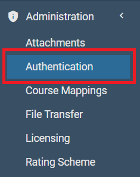
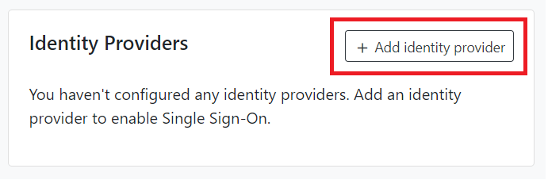
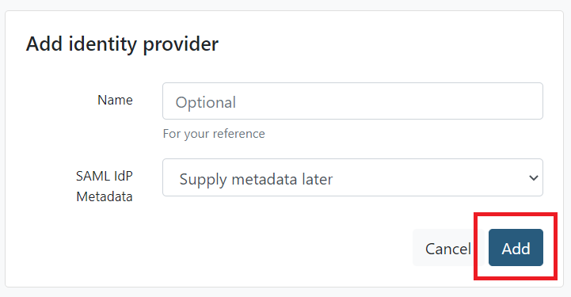
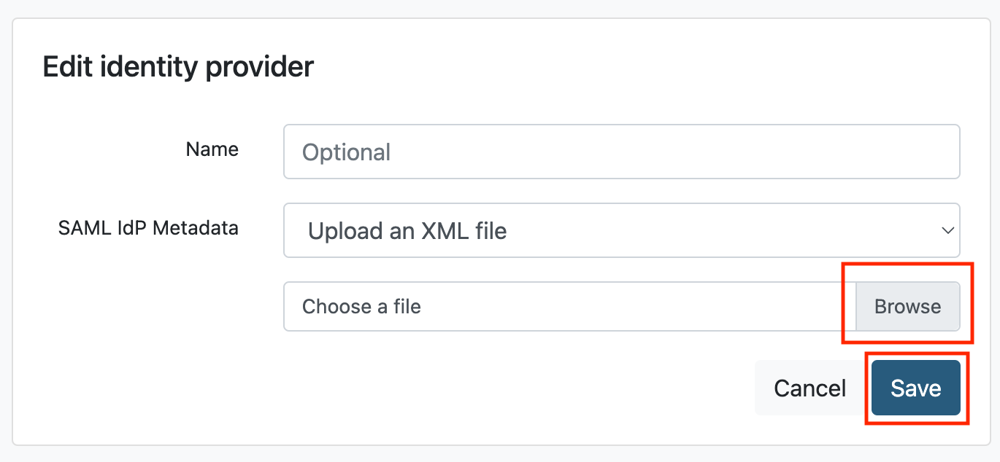
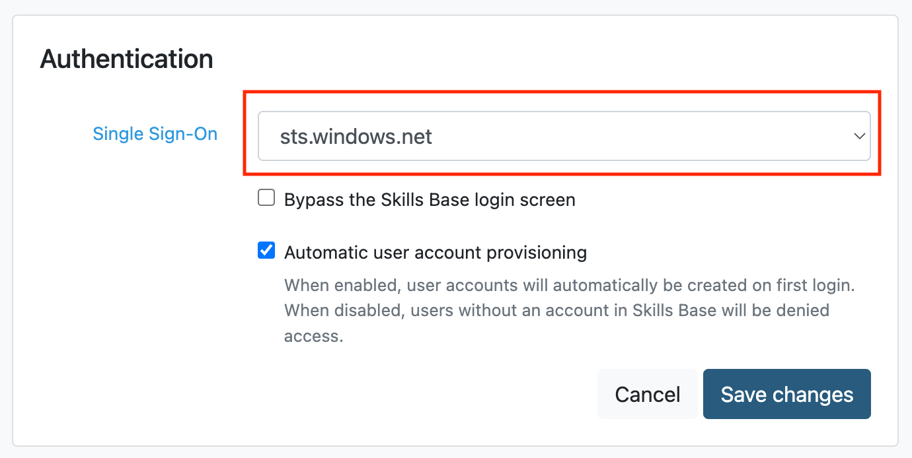
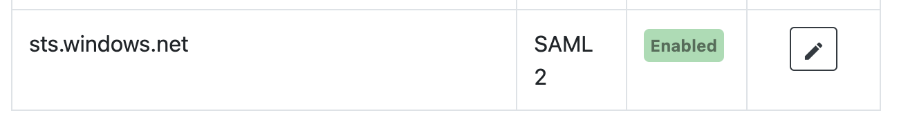

# Tutorial: Microsoft Entra integration with Skills Base

In this tutorial, you'll learn how to integrate Skills Base with Microsoft Entra ID. When you integrate Skills Base with Microsoft Entra ID, you can:

* Control in Microsoft Entra ID who has access to Skills Base.
* Enable your users to be automatically signed-in to Skills Base with their Microsoft Entra accounts.
* Manage your accounts in one central location.

## Prerequisites

To get started, you need the following items:

* A Microsoft Entra subscription. If you don't have a subscription, you can get a [free account](https://azure.microsoft.com/free/).
* A Skills Base license that supports single sign-on (SSO).

> [!NOTE]
> This integration is also available to use from Microsoft Entra US Government Cloud environment. You can find this application in the Microsoft Entra US Government Cloud Application Gallery and configure it in the same way as you do from public cloud.

## Scenario description

In this tutorial, you configure and test Microsoft Entra single sign-on in a test environment.

* Skills Base supports **SP** initiated SSO.
* Skills Base supports **Just In Time** user provisioning.

>[!NOTE]
> Skills Base does not support **IdP** initiated SSO.

## Add Skills Base from the gallery

To configure the integration of Skills Base into Microsoft Entra ID, you need to add Skills Base from the gallery to your list of managed SaaS apps.

1. Sign in to the [Microsoft Entra admin center](https://entra.microsoft.com) as at least a [Cloud Application Administrator](../roles/permissions-reference.md#cloud-application-administrator).
1. Browse to **Identity** > **Applications** > **Enterprise applications** > **New application**.
1. In the **Add from the gallery** section, type **Skills Base** in the search box.
1. Select **Skills Base** from results panel and then add the app. Wait a few seconds while the app is added to your tenant.

 Alternatively, you can also use the [Enterprise App Configuration Wizard](https://portal.office.com/AdminPortal/home?Q=Docs#/azureadappintegration). In this wizard, you can add an application to your tenant, add users/groups to the app, assign roles, as well as walk through the SSO configuration as well. [Learn more about Microsoft 365 wizards.](/microsoft-365/admin/misc/azure-ad-setup-guides)

## Configure and test Microsoft Entra SSO for Skills Base

Configure and test Microsoft Entra SSO with Skills Base using a test user called **B.Simon**. For SSO to work, you need to establish a link relationship between a Microsoft Entra user and the related user in Skills Base.

To configure and test Microsoft Entra SSO with Skills Base, perform the following steps:

1. **[Configure Microsoft Entra SSO](#configure-azure-ad-sso)** - to enable your users to use this feature.
    1. **[Create a Microsoft Entra test user](#create-an-azure-ad-test-user)** - to test Microsoft Entra single sign-on with B.Simon.
    2. **[Assign the Microsoft Entra test user](#assign-the-azure-ad-test-user)** - to enable B.Simon to use Microsoft Entra single sign-on.
2. **[Configure Skills Base SSO](#configure-skills-base-sso)** - to configure the single sign-on settings on application side.
    1. **[Create Skills Base test user](#create-skills-base-test-user)** - to have a counterpart of B.Simon in Skills Base that is linked to the Microsoft Entra representation of user.
3. **[Test SSO](#test-sso)** - to verify whether the configuration works.
    

## Configure Microsoft Entra SSO

Follow these steps to enable Microsoft Entra SSO.

1. Sign in to the [Microsoft Entra admin center](https://entra.microsoft.com) as at least a [Cloud Application Administrator](../roles/permissions-reference.md#cloud-application-administrator).
1. Browse to **Identity** > **Applications** > **Enterprise applications** > **Skills Base** Enterprise Application Overview page, under **Getting Started** section select **Get started** under **2. Set up single sign on**.

2. On the **Select a single sign-on method** page, select **SAML**.

1. On the **Set up Single Sign-On with SAML** page, click the **Upload metadata file** button at the top of the page.

4. Click the **Select a file** icon and select the metadata file that you downloaded from Skills Base.

5. Click **Add**

   

6. On the **Basic SAML Configuration** page, in the **Sign on URL** text box, enter your Skills Base shortcut link, which should be in the format:
    `https://app.skills-base.com/o/<customer-unique-key>`

	> [!NOTE]
	> You can get the Sign on URL from the Skills Base application. Please log in as an Administrator and to go to \[Administration > Settings > Instance details > Shortcut link\]. Copy the shortcut link and paste it into the **Sign on URL** textbox in Microsoft Entra ID.

5. Click **Save**

6. Close the **Basic SAML Configuration** dialog.

1. On the **Set up Single Sign-On with SAML** page, in the **SAML Signing Certificate** section, next to **Federation Metadata XML**, click **Download** to download the Federation Metadata XML and save it on your computer.

	

## Configure Skills Base SSO

1. Log in to Skills Base as an Administrator.

1. From the left side of menu, select **Administration -> Authentication**.

	

1. On the **Authentication** page in the **Identity Providers** section, select **Add identity provider**.

	

1. Click **Add** to use the default settings.

	

1. In the **Application Details** panel, next to **SAML SP Metadata**, select **Download XML File** and save the resulting file on your computer.

	

1. In the **Identity Providers** section, select the **edit** button (denoted by a pencil icon) for the Identity Provider record you added.

   

1. In the **Edit identity provider** panel, for **SAML IdP Metadata** select **Upload an XML file**

1. Click **Browse** to choose a file. Select the Federation Metadata XML file that you downloaded from Microsoft Entra ID and click **Save**.

   
   
1. In the **Authentication** panel, for **Single Sign-On** select the Identity Provider you added.

   

1. Make sure the option to bypass the Skills Base login screen is **deselected** for now.  You can enable this option later, once the integration is proved to be working.

1. If you would like to enable **Just In Time** user provisioning, enable the **Automatic user account provisioning** option.

1. click **Save changes**.

   

> [!Note]
> The Identity Provider you added in the **Identity Providers** panel should now have a green **Enabled** badge in the **Status** column.

### Create a Microsoft Entra test user

In this section, you'll create a test user called B.Simon.

1. Sign in to the [Microsoft Entra admin center](https://entra.microsoft.com) as at least a [User Administrator](../roles/permissions-reference.md#user-administrator).
1. Browse to **Identity** > **Users** > **All users**.
1. Select **New user** > **Create new user**, at the top of the screen.
1. In the **User** properties, follow these steps:
   1. In the **Display name** field, enter `B.Simon`.  
   1. In the **User principal name** field, enter the username@companydomain.extension. For example, `B.Simon@contoso.com`.
   1. Select the **Show password** check box, and then write down the value that's displayed in the **Password** box.
   1. Select **Review + create**.
1. Select **Create**.

### Assign the Microsoft Entra test user

In this section, you'll enable B.Simon to use single sign-on by granting access to Skills Base.

1. Sign in to the [Microsoft Entra admin center](https://entra.microsoft.com) as at least a [Cloud Application Administrator](../roles/permissions-reference.md#cloud-application-administrator).
1. Browse to **Identity** > **Applications** > **Enterprise applications** > **Skills Base**.
3. In the app's overview page, find the **Manage** section and select **Users and groups**.
4. Select **Add user**, then select **Users and groups** in the **Add Assignment** dialog.
5. In the **Users and groups** dialog, select **B.Simon** from the Users list, then click the **Select** button at the bottom of the screen.
6. If you are expecting a role to be assigned to the users, you can select it from the **Select a role** dropdown. If no role has been set up for this app, you see "Default Access" role selected.
7. In the **Add Assignment** dialog, click the **Assign** button.

### Create Skills Base test user

Skills Base supports just-in-time user provisioning, which is enabled by default. There is no action item for you in this section. If a user doesn't already exist in Skills Base, a new one is created after authentication.

> [!Note]
> If you need to create a user manually, follow the instructions [here](https://support.skills-base.com/kb/articles/11000024831-adding-people-and-enabling-them-to-log-in).

## Test SSO

In this section, you test your Microsoft Entra single sign-on configuration with following options. 

* Click on **Test this application**, this will redirect to Skills Base Sign-on URL where you can initiate the login flow. 

* Go to Skills Base Sign-on URL directly and initiate the login flow from there.

* You can use Microsoft My Apps. When you click the Skills Base tile in the My Apps, this will redirect to Skills Base Sign-on URL. For more information about the My Apps, see [Introduction to the My Apps](https://support.microsoft.com/account-billing/sign-in-and-start-apps-from-the-my-apps-portal-2f3b1bae-0e5a-4a86-a33e-876fbd2a4510).

## Next steps

Once you configure Skills Base you can enforce session control, which protects exfiltration and infiltration of your organization’s sensitive data in real time. Session control extends from Conditional Access. [Learn how to enforce session control with Microsoft Defender for Cloud Apps](/cloud-app-security/proxy-deployment-aad).
