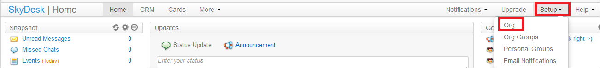
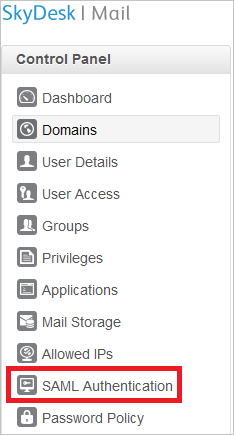
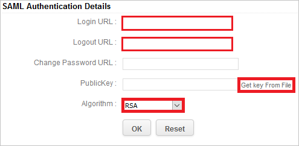
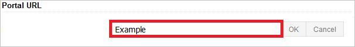

# Tutorial: Azure AD SSO integration with SkyDesk Email

In this tutorial, you'll learn how to integrate SkyDesk Email with Azure Active Directory (Azure AD). When you integrate SkyDesk Email with Azure AD, you can:

* Control in Azure AD who has access to SkyDesk Email.
* Enable your users to be automatically signed-in to SkyDesk Email with their Azure AD accounts.
* Manage your accounts in one central location - the Azure portal.

## Prerequisites

To get started, you need the following items:

* An Azure AD subscription. If you don't have a subscription, you can get a [free account](https://azure.microsoft.com/free/).
* SkyDesk Email single sign-on (SSO) enabled subscription.

## Scenario description

In this tutorial, you configure and test Azure AD single sign-on in a test environment.

* SkyDesk Email supports **SP** initiated SSO.

> [!NOTE]
> Identifier of this application is a fixed string value so only one instance can be configured in one tenant.

## Add SkyDesk Email from the gallery

To configure the integration of SkyDesk Email into Azure AD, you need to add SkyDesk Email from the gallery to your list of managed SaaS apps.

1. Sign in to the Azure portal using either a work or school account, or a personal Microsoft account.
1. On the left navigation pane, select the **Azure Active Directory** service.
1. Navigate to **Enterprise Applications** and then select **All Applications**.
1. To add new application, select **New application**.
1. In the **Add from the gallery** section, type **SkyDesk Email** in the search box.
1. Select **SkyDesk Email** from results panel and then add the app. Wait a few seconds while the app is added to your tenant.

 Alternatively, you can also use the [Enterprise App Configuration Wizard](https://portal.office.com/AdminPortal/home?Q=Docs#/azureadappintegration). In this wizard, you can add an application to your tenant, add users/groups to the app, assign roles, as well as walk through the SSO configuration as well. [Learn more about Microsoft 365 wizards.](/microsoft-365/admin/misc/azure-ad-setup-guides)

## Configure and test Azure AD SSO for SkyDesk Email

Configure and test Azure AD SSO with SkyDesk Email using a test user called **B.Simon**. For SSO to work, you need to establish a link relationship between an Azure AD user and the related user in SkyDesk Email.

To configure and test Azure AD SSO with SkyDesk Email, perform the following steps:

1. **[Configure Azure AD SSO](#configure-azure-ad-sso)** - to enable your users to use this feature.
    1. **[Create an Azure AD test user](#create-an-azure-ad-test-user)** - to test Azure AD single sign-on with B.Simon.
    1. **[Assign the Azure AD test user](#assign-the-azure-ad-test-user)** - to enable B.Simon to use Azure AD single sign-on.
1. **[Configure SkyDesk Email SSO](#configure-skydesk-email-sso)** - to configure the single sign-on settings on application side.
    1. **[Create SkyDesk Email test user](#create-skydesk-email-test-user)** - to have a counterpart of B.Simon in SkyDesk Email that is linked to the Azure AD representation of user.
1. **[Test SSO](#test-sso)** - to verify whether the configuration works.

## Configure Azure AD SSO

Follow these steps to enable Azure AD SSO in the Azure portal.

1. In the Azure portal, on the **SkyDesk Email** application integration page, find the **Manage** section and select **single sign-on**.
1. On the **Select a single sign-on method** page, select **SAML**.
1. On the **Set up single sign-on with SAML** page, click the pencil icon for **Basic SAML Configuration** to edit the settings.

   

4. On the **Basic SAML Configuration** section, perform the following step:

    In the **Sign-on URL** text box, type a URL using the following pattern:
    `https://mail.skydesk.jp/portal/<companyname>`

5. On the **Set up Single Sign-On with SAML** page, in the **SAML Signing Certificate** section, click **Download** to download the **Certificate (Base64)** from the given options as per your requirement and save it on your computer.

	

6. On the **Set up SkyDesk Email** section, copy the appropriate URL(s) as per your requirement.

	

### Create an Azure AD test user

In this section, you'll create a test user in the Azure portal called B.Simon.

1. From the left pane in the Azure portal, select **Azure Active Directory**, select **Users**, and then select **All users**.
1. Select **New user** at the top of the screen.
1. In the **User** properties, follow these steps:
   1. In the **Name** field, enter `B.Simon`.  
   1. In the **User name** field, enter the username@companydomain.extension. For example, `B.Simon@contoso.com`.
   1. Select the **Show password** check box, and then write down the value that's displayed in the **Password** box.
   1. Click **Create**.

### Assign the Azure AD test user

In this section, you'll enable B.Simon to use Azure single sign-on by granting access to SkyDesk Email.

1. In the Azure portal, select **Enterprise Applications**, and then select **All applications**.
1. In the applications list, select **SkyDesk Email**.
1. In the app's overview page, find the **Manage** section and select **Users and groups**.
1. Select **Add user**, then select **Users and groups** in the **Add Assignment** dialog.
1. In the **Users and groups** dialog, select **B.Simon** from the Users list, then click the **Select** button at the bottom of the screen.
1. If you are expecting a role to be assigned to the users, you can select it from the **Select a role** dropdown. If no role has been set up for this app, you see "Default Access" role selected.
1. In the **Add Assignment** dialog, click the **Assign** button.

## Configure SkyDesk Email SSO

1. In a different web browser, sign-on to your SkyDesk Email account as administrator.

1. In the menu on the top, click **Setup**, and select **Org**.

    
  
1. Click on **Domains** from the left panel.

    

1. Click on **Add Domain**.

    

1. Enter your Domain name, and then verify the Domain.

    

1. Click on **SAML Authentication** from the left panel.

    

1. On the **SAML Authentication** dialog page, perform the following steps:

    

    > [!NOTE]
    > To use SAML based authentication, you should either have **verified domain** or **portal URL** setup. You can set the portal URL with the unique name.

    

    a. In the **Login URL** textbox, paste the value of **Login URL**, which you have copied from Azure portal.

    b. In the **Logout** URL textbox, paste the value of **Logout URL**, which you have copied from Azure portal.

    c. **Change Password URL** is optional so leave it blank.

    d. Click on **Get Key From File** to select your downloaded certificate from Azure portal, and then click **Open** to upload the certificate.

    e. As **Algorithm**, select **RSA**.

    f. Click **Ok** to save the changes.

### Create SkyDesk Email test user

In this section, you create a user called Britta Simon in SkyDesk Email.

Click on **User Access** from the left panel in SkyDesk Email and then enter your username.

## Test SSO

In this section, you test your Azure AD single sign-on configuration with following options. 

* Click on **Test this application** in Azure portal. This will redirect to SkyDesk Email Sign-on URL where you can initiate the login flow. 

* Go to SkyDesk Email Sign-on URL directly and initiate the login flow from there.

* You can use Microsoft My Apps. When you click the SkyDesk Email tile in the My Apps, this will redirect to SkyDesk Email Sign-on URL. For more information about the My Apps, see [Introduction to the My Apps](../user-help/my-apps-portal-end-user-access.md).

## Next steps

Once you configure SkyDesk Email you can enforce session control, which protects exfiltration and infiltration of your organization’s sensitive data in real time. Session control extends from Conditional Access. [Learn how to enforce session control with Microsoft Defender for Cloud Apps](/cloud-app-security/proxy-deployment-aad).
