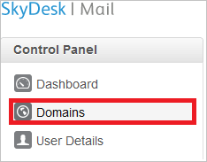
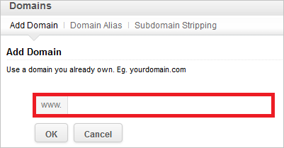
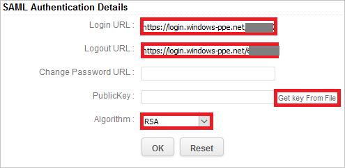
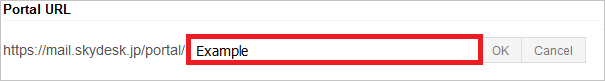
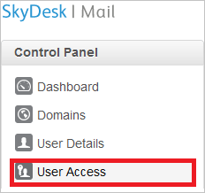

# Tutorial: Azure Active Directory integration with SkyDesk Email

In this tutorial, you learn how to integrate SkyDesk Email with Azure Active Directory (Azure AD).
Integrating SkyDesk Email with Azure AD provides you with the following benefits:

* You can control in Azure AD who has access to SkyDesk Email.
* You can enable your users to be automatically signed-in to SkyDesk Email (Single Sign-On) with their Azure AD accounts.
* You can manage your accounts in one central location - the Azure portal.

If you want to know more details about SaaS app integration with Azure AD, see [What is application access and single sign-on with Azure Active Directory](https://docs.microsoft.com/azure/active-directory/active-directory-appssoaccess-whatis).
If you don't have an Azure subscription, [create a free account](https://azure.microsoft.com/free/) before you begin.

## Prerequisites

To configure Azure AD integration with SkyDesk Email, you need the following items:

* An Azure AD subscription. If you don't have an Azure AD environment, you can get one-month trial [here](https://azure.microsoft.com/pricing/free-trial/)
* SkyDesk Email single sign-on enabled subscription

## Scenario description

In this tutorial, you configure and test Azure AD single sign-on in a test environment.

* SkyDesk Email supports **SP** initiated SSO

## Adding SkyDesk Email from the gallery

To configure the integration of SkyDesk Email into Azure AD, you need to add SkyDesk Email from the gallery to your list of managed SaaS apps.

**To add SkyDesk Email from the gallery, perform the following steps:**

1. In the **[Azure portal](https://portal.azure.com)**, on the left navigation panel, click **Azure Active Directory** icon.

	

2. Navigate to **Enterprise Applications** and then select the **All Applications** option.

	

3. To add new application, click **New application** button on the top of dialog.

	

4. In the search box, type **SkyDesk Email**, select **SkyDesk Email** from result panel then click **Add** button to add the application.

	 

## Configure and test Azure AD single sign-on

In this section, you configure and test Azure AD single sign-on with SkyDesk Email based on a test user called **Britta Simon**.
For single sign-on to work, a link relationship between an Azure AD user and the related user in SkyDesk Email needs to be established.

To configure and test Azure AD single sign-on with SkyDesk Email, you need to complete the following building blocks:

1. **[Configure Azure AD Single Sign-On](#configure-azure-ad-single-sign-on)** - to enable your users to use this feature.
2. **[Configure SkyDesk Email Single Sign-On](#configure-skydesk-email-single-sign-on)** - to configure the Single Sign-On settings on application side.
3. **[Create an Azure AD test user](#create-an-azure-ad-test-user)** - to test Azure AD single sign-on with Britta Simon.
4. **[Assign the Azure AD test user](#assign-the-azure-ad-test-user)** - to enable Britta Simon to use Azure AD single sign-on.
5. **[Create SkyDesk Email test user](#create-skydesk-email-test-user)** - to have a counterpart of Britta Simon in SkyDesk Email that is linked to the Azure AD representation of user.
6. **[Test single sign-on](#test-single-sign-on)** - to verify whether the configuration works.

### Configure Azure AD single sign-on

In this section, you enable Azure AD single sign-on in the Azure portal.

To configure Azure AD single sign-on with SkyDesk Email, perform the following steps:

1. In the [Azure portal](https://portal.azure.com/), on the **SkyDesk Email** application integration page, select **Single sign-on**.

    

2. On the **Select a Single sign-on method** dialog, select **SAML/WS-Fed** mode to enable single sign-on.

    

3. On the **Set up Single Sign-On with SAML** page, click **Edit** icon to open **Basic SAML Configuration** dialog.

	

4. On the **Basic SAML Configuration** section, perform the following steps:

    

    In the **Sign-on URL** text box, type a URL using the following pattern:
    `https://mail.skydesk.jp/portal/<companyname>`

	> [!NOTE]
	> The value is not real. Update the value with the actual Sign-On URL. Contact [SkyDesk Email Client support team](https://www.skydesk.jp/apps/support/) to get the value. You can also refer to the patterns shown in the **Basic SAML Configuration** section in the Azure portal.

5. On the **Set up Single Sign-On with SAML** page, in the **SAML Signing Certificate** section, click **Download** to download the **Certificate (Base64)** from the given options as per your requirement and save it on your computer.

	

6. On the **Set up SkyDesk Email** section, copy the appropriate URL(s) as per your requirement.

	

	a. Login URL

	b. Azure AD Identifier

	c. Logout URL

### Configure SkyDesk Email Single Sign-On

1. In a different web browser, sign-on to your SkyDesk Email account as administrator.

1. In the menu on the top, click **Setup**, and select **Org**.

    
  
1. Click on **Domains** from the left panel.

    

1. Click on **Add Domain**.

    

1. Enter your Domain name, and then verify the Domain.

    

1. Click on **SAML Authentication** from the left panel.

    

1. On the **SAML Authentication** dialog page, perform the following steps:

    

    > [!NOTE]
    > To use SAML based authentication, you should either have **verified domain** or **portal URL** setup. You can set the portal URL with the unique name.

    

    a. In the **Login URL** textbox, paste the value of **Login URL**, which you have copied from Azure portal.

    b. In the **Logout** URL textbox, paste the value of **Logout URL**, which you have copied from Azure portal.

    c. **Change Password URL** is optional so leave it blank.

    d. Click on **Get Key From File** to select your downloaded certificate from Azure portal, and then click **Open** to upload the certificate.

    e. As **Algorithm**, select **RSA**.

    f. Click **Ok** to save the changes.

### Create an Azure AD test user

The objective of this section is to create a test user in the Azure portal called Britta Simon.

1. In the Azure portal, in the left pane, select **Azure Active Directory**, select **Users**, and then select **All users**.

    

2. Select **New user** at the top of the screen.

    

3. In the User properties, perform the following steps.

    

    a. In the **Name** field enter **BrittaSimon**.
  
    b. In the **User name** field type **brittasimon@yourcompanydomain.extension**  
    For example, BrittaSimon@contoso.com

    c. Select **Show password** check box, and then write down the value that's displayed in the Password box.

    d. Click **Create**.

### Assign the Azure AD test user

In this section, you enable Britta Simon to use Azure single sign-on by granting access to SkyDesk Email.

1. In the Azure portal, select **Enterprise Applications**, select **All applications**, then select **SkyDesk Email**.

	

2. In the applications list, select **SkyDesk Email**.

	

3. In the menu on the left, select **Users and groups**.

    

4. Click the **Add user** button, then select **Users and groups** in the **Add Assignment** dialog.

    

5. In the **Users and groups** dialog select **Britta Simon** in the Users list, then click the **Select** button at the bottom of the screen.

6. If you are expecting any role value in the SAML assertion then in the **Select Role** dialog select the appropriate role for the user from the list, then click the **Select** button at the bottom of the screen.

7. In the **Add Assignment** dialog click the **Assign** button.

### Create SkyDesk Email test user

In this section, you create a user called Britta Simon in SkyDesk Email.

Click on **User Access** from the left panel in SkyDesk Email and then enter your username.

> [!NOTE]
> If you need to create bulk users, you need to contact the [SkyDesk Email Client support team](https://www.skydesk.jp/apps/support/).

### Test single sign-on

In this section, you test your Azure AD single sign-on configuration using the Access Panel.

When you click the SkyDesk Email tile in the Access Panel, you should be automatically signed in to the SkyDesk Email for which you set up SSO. For more information about the Access Panel, see [Introduction to the Access Panel](https://docs.microsoft.com/azure/active-directory/active-directory-saas-access-panel-introduction).

## Additional Resources

- [List of Tutorials on How to Integrate SaaS Apps with Azure Active Directory](https://docs.microsoft.com/azure/active-directory/active-directory-saas-tutorial-list)

- [What is application access and single sign-on with Azure Active Directory?](https://docs.microsoft.com/azure/active-directory/active-directory-appssoaccess-whatis)

- [What is Conditional Access in Azure Active Directory?](https://docs.microsoft.com/azure/active-directory/conditional-access/overview)

