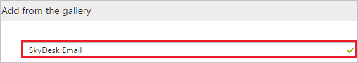
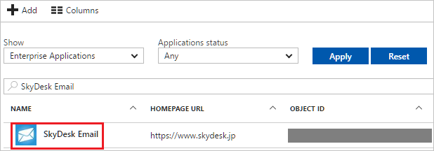

# Tutorial: Azure Active Directory integration with SkyDesk Email

In this tutorial, you learn how to integrate SkyDesk Email with Azure Active Directory (Azure AD).

Integrating SkyDesk Email with Azure AD provides you with the following benefits:

- You can control in Azure AD who has access to SkyDesk Email
- You can enable your users to automatically get signed-on to SkyDesk Email (Single Sign-On) with their Azure AD accounts
- You can manage your accounts in one central location - the Azure portal

If you want to know more details about SaaS app integration with Azure AD, see [what is application access and single sign-on with Azure Active Directory](../manage-apps/what-is-single-sign-on.md).

## Prerequisites

To configure Azure AD integration with SkyDesk Email, you need the following items:

- An Azure AD subscription
- A SkyDesk Email single sign-on enabled subscription

> [!NOTE]
> To test the steps in this tutorial, we do not recommend using a production environment.

To test the steps in this tutorial, you should follow these recommendations:

- Do not use your production environment, unless it is necessary.
- If you don't have an Azure AD trial environment, you can get a one-month trial here [Trial offer](https://azure.microsoft.com/pricing/free-trial/).

## Scenario description
In this tutorial, you test Azure AD single sign-on in a test environment. 
The scenario outlined in this tutorial consists of two main building blocks:

1. Adding SkyDesk Email from the gallery
1. Configuring and testing Azure AD single sign-on

## Adding SkyDesk Email from the gallery
To configure the integration of SkyDesk Email into Azure AD, you need to add SkyDesk Email from the gallery to your list of managed SaaS apps.

**To add SkyDesk Email from the gallery, perform the following steps:**

1. In the **[Azure portal](https://portal.azure.com)**, on the left navigation panel, click **Azure Active Directory** icon. 

	![Active Directory][1]

1. Navigate to **Enterprise applications**. Then go to **All applications**.

	![Applications][2]
	
1. To add new application, click **New application** button on the top of dialog.

	![Applications][3]

1. In the search box, type **SkyDesk Email**.

	

1. In the results panel, select **SkyDesk Email**, and then click **Add** button to add the application.

	

##  Configuring and testing Azure AD single sign-on
In this section, you configure and test Azure AD single sign-on with SkyDesk Email based on a test user called "Britta Simon".

For single sign-on to work, Azure AD needs to know what the counterpart user in SkyDesk Email is to a user in Azure AD. In other words, a link relationship between an Azure AD user and the related user in SkyDesk Email needs to be established.

In SkyDesk Email, assign the value of the **user name** in Azure AD as the value of the **Username** to establish the link relationship.

To configure and test Azure AD single sign-on with SkyDesk Email, you need to complete the following building blocks:

1. **[Configuring Azure AD Single Sign-On](#configuring-azure-ad-single-sign-on)** - to enable your users to use this feature.
1. **[Creating an Azure AD test user](#creating-an-azure-ad-test-user)** - to test Azure AD single sign-on with Britta Simon.
1. **[Creating a SkyDesk Email test user](#creating-a-skydesk-email-test-user)** - to have a counterpart of Britta Simon in SkyDesk Email that is linked to the Azure AD representation of user.
1. **[Assigning the Azure AD test user](#assigning-the-azure-ad-test-user)** - to enable Britta Simon to use Azure AD single sign-on.
1. **[Testing Single Sign-On](#testing-single-sign-on)** - to verify whether the configuration works.

### Configuring Azure AD single sign-on

In this section, you enable Azure AD single sign-on in the Azure portal and configure single sign-on in your SkyDesk Email application.

**To configure Azure AD single sign-on with SkyDesk Email, perform the following steps:**

1. In the Azure portal, on the **SkyDesk Email** application integration page, click **Single sign-on**.

	![Configure Single Sign-On][4]

1. On the **Single sign-on** dialog, select **Mode** as	**SAML-based Sign-on** to enable single sign-on.
 
	

1. On the **SkyDesk Email Domain and URLs** section, perform the following steps:

	

    In the **Sign-on URL** textbox, type a URL using the following pattern: `https://mail.skydesk.jp/portal/<companyname>`

	> [!NOTE] 
	> The value is not real. Update the value with the actual Sign-On URL. Contact [SkyDesk Email Client support team](https://www.skydesk.sg/support/) to get the value. 
 
1. On the **SAML Signing Certificate** section, click **Certificate (Base64)** and then save the certificate file on your computer.

	 

1. Click **Save** button.

	

1. On the **SkyDesk Email Configuration** section, click **Configure SkyDesk Email** to open **Configure sign-on** window. Copy the **Sign-Out URL, and SAML Single Sign-On Service URL** from the **Quick Reference section.**

	 

1. To enable SSO in **SkyDesk Email**, perform the following steps:

    a. Sign-on to your SkyDesk Email account as administrator.

    b. In the menu on the top, click **Setup**, and select **Org**. 
    
      
  
    c. Click on **Domains** from the left panel.
    
      

    d. Click on **Add Domain**.
    
      

    e. Enter your Domain name, and then verify the Domain.
    
      

    f. Click on **SAML Authentication** from the left panel.
    
      

1. On the **SAML Authentication** dialog page, perform the following steps:
   
      
   
    >[!NOTE]
    >To use SAML based authentication, you should either have **verified domain** or **portal URL** setup. You can set the portal URL with the unique name.
    > 
    > 
   
    

    a. In the **Login URL** textbox, paste the value of **SAML Single Sign-On Service URL**, which you have copied from Azure portal.
   
    b. In the **Logout** URL textbox, paste the value of **Sign-Out URL**, which you have copied from Azure portal.

    c. **Change Password URL** is optional so leave it blank.

    d. Click on **Get Key From File** to select your downloaded certificate from Azure portal, and then click **Open** to upload the certificate.

    e. As **Algorithm**, select **RSA**.

    f. Click **Ok** to save the changes.

> [!TIP]
> You can now read a concise version of these instructions inside the [Azure portal](https://portal.azure.com), while you are setting up the app!  After adding this app from the **Active Directory > Enterprise Applications** section, simply click the **Single Sign-On** tab and access the embedded documentation through the **Configuration** section at the bottom. You can read more about the embedded documentation feature here: [Azure AD embedded documentation]( https://go.microsoft.com/fwlink/?linkid=845985)
> 

### Creating an Azure AD test user
The objective of this section is to create a test user in the Azure portal called Britta Simon.

![Create Azure AD User][100]

**To create a test user in Azure AD, perform the following steps:**

1. In the **Azure portal**, on the left navigation pane, click **Azure Active Directory** icon.

	 

1. To display the list of users, go to **Users and groups** and click **All users**.
	
	 

1. To open the **User** dialog, click **Add** on the top of the dialog.
 
	 

1. On the **User** dialog page, perform the following steps:
 
	 

    a. In the **Name** textbox, type **BrittaSimon**.

    b. In the **User name** textbox, type the **email address** of BrittaSimon.

	c. Select **Show Password** and write down the value of the **Password**.

    d. Click **Create**.
 
### Creating a SkyDesk Email test user

In this section, you create a user called Britta Simon in SkyDesk Email.

1. Click on **User Access** from the left panel in SkyDesk Email and then enter your username. 

    

>[!NOTE] 
>If you need to create bulk users, you need to contact the [SkyDesk Email Client support team](https://www.skydesk.sg/support/).

### Assigning the Azure AD test user

In this section, you enable Britta Simon to use Azure single sign-on by granting access to SkyDesk Email.

![Assign User][200] 

**To assign Britta Simon to SkyDesk Email, perform the following steps:**

1. In the Azure portal, open the applications view, and then navigate to the directory view and go to **Enterprise applications** then click **All applications**.

	![Assign User][201] 

1. In the applications list, select **SkyDesk Email**.

	 

1. In the menu on the left, click **Users and groups**.

	![Assign User][202] 

1. Click **Add** button. Then select **Users and groups** on **Add Assignment** dialog.

	![Assign User][203]

1. On **Users and groups** dialog, select **Britta Simon** in the Users list.

1. Click **Select** button on **Users and groups** dialog.

1. Click **Assign** button on **Add Assignment** dialog.
	
### Testing single sign-on

The objective of this section is to test your Azure AD SSO configuration using the Access Panel.

When you click the SkyDesk Email tile in the Access Panel, you should get automatically signed-on to your SkyDesk Email application.

## Additional resources

* [List of Tutorials on How to Integrate SaaS Apps with Azure Active Directory](tutorial-list.md)
* [What is application access and single sign-on with Azure Active Directory?](../manage-apps/what-is-single-sign-on.md)

<!--Image references-->

[1]: ./media/skydeskemail-tutorial/tutorial_general_01.png
[2]: ./media/skydeskemail-tutorial/tutorial_general_02.png
[3]: ./media/skydeskemail-tutorial/tutorial_general_03.png
[4]: ./media/skydeskemail-tutorial/tutorial_general_04.png

[100]: ./media/skydeskemail-tutorial/tutorial_general_100.png

[200]: ./media/skydeskemail-tutorial/tutorial_general_200.png
[201]: ./media/skydeskemail-tutorial/tutorial_general_201.png
[202]: ./media/skydeskemail-tutorial/tutorial_general_202.png
[203]: ./media/skydeskemail-tutorial/tutorial_general_203.png

