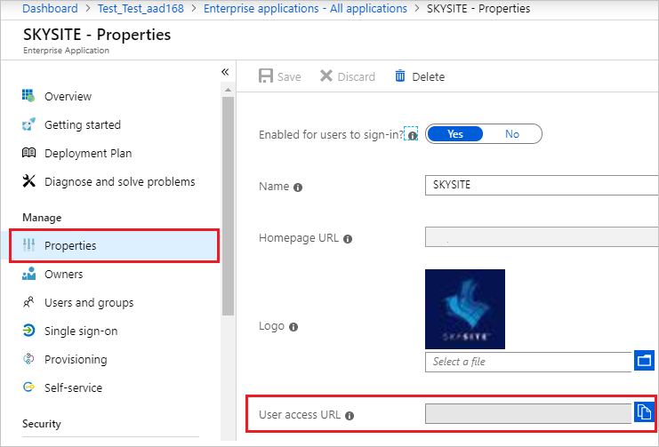
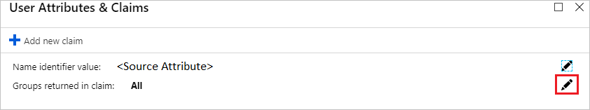
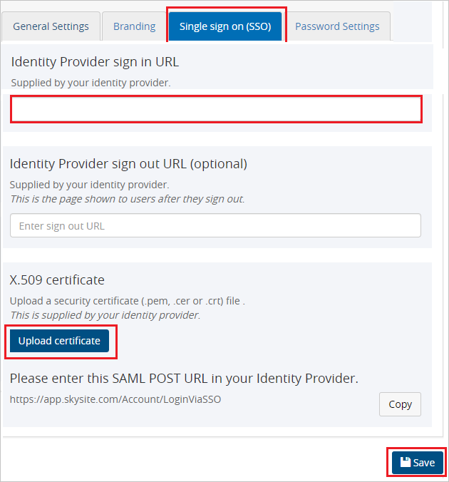

# Tutorial: Azure AD SSO integration with SKYSITE

In this tutorial, you'll learn how to integrate SKYSITE with Azure Active Directory (Azure AD). When you integrate SKYSITE with Azure AD, you can:

* Control in Azure AD who has access to SKYSITE.
* Enable your users to be automatically signed-in to SKYSITE with their Azure AD accounts.
* Manage your accounts in one central location - the Azure portal.

## Prerequisites

To get started, you need the following items:

* An Azure AD subscription. If you don't have a subscription, you can get a [free account](https://azure.microsoft.com/free/).
* SKYSITE single sign-on (SSO) enabled subscription.

## Scenario description

In this tutorial, you configure and test Azure AD SSO in a test environment.

* SKYSITE supports **IDP** initiated SSO.

* SKYSITE supports **Just In Time** user provisioning.

## Add SKYSITE from the gallery

To configure the integration of SKYSITE into Azure AD, you need to add SKYSITE from the gallery to your list of managed SaaS apps.

1. Sign in to the Azure portal using either a work or school account, or a personal Microsoft account.
1. On the left navigation pane, select the **Azure Active Directory** service.
1. Navigate to **Enterprise Applications** and then select **All Applications**.
1. To add new application, select **New application**.
1. In the **Add from the gallery** section, type **SKYSITE** in the search box.
1. Select **SKYSITE** from results panel and then add the app. Wait a few seconds while the app is added to your tenant.

 Alternatively, you can also use the [Enterprise App Configuration Wizard](https://portal.office.com/AdminPortal/home?Q=Docs#/azureadappintegration). In this wizard, you can add an application to your tenant, add users/groups to the app, assign roles, as well as walk through the SSO configuration as well. [Learn more about Microsoft 365 wizards.](/microsoft-365/admin/misc/azure-ad-setup-guides)

## Configure and test Azure AD SSO for SKYSITE

Configure and test Azure AD SSO with SKYSITE using a test user called **B.Simon**. For SSO to work, you need to establish a link relationship between an Azure AD user and the related user in SKYSITE.

To configure and test Azure AD SSO with SKYSITE, perform the following steps:

1. **[Configure Azure AD SSO](#configure-azure-ad-sso)** - to enable your users to use this feature.
    1. **[Create an Azure AD test user](#create-an-azure-ad-test-user)** - to test Azure AD single sign-on with B.Simon.
    1. **[Assign the Azure AD test user](#assign-the-azure-ad-test-user)** - to enable B.Simon to use Azure AD single sign-on.
1. **[Configure SKYSITE SSO](#configure-skysite-sso)** - to configure the single sign-on settings on application side.
    1. **[Create SKYSITE test user](#create-skysite-test-user)** - to have a counterpart of B.Simon in SKYSITE that is linked to the Azure AD representation of user.
1. **[Test SSO](#test-sso)** - to verify whether the configuration works.

## Configure Azure AD SSO

Follow these steps to enable Azure AD SSO in the Azure portal.

1. In the Azure portal, on the **SKYSITE** application integration page, click on **Properties tab** and perform the following step: 

	

	* Copy the **User access URL** and you have to paste it in **Configure SKYSITE SSO section**, which is explained later in the tutorial.

1. On the **SKYSITE** application integration page, navigate to **single sign-on**.
1. On the **Select a single sign-on method** page, select **SAML**.
1. On the **Set up single sign-on with SAML** page, click the pencil icon for **Basic SAML Configuration** to edit the settings.

   

1. On the **Basic SAML Configuration** section the application is pre-configured in **IDP** initiated mode and the necessary URLs are already pre-populated with Azure. The user needs to save the configuration by clicking the **Save** button.

1. SKYSITE application expects the SAML assertions in a specific format, which requires you to add custom attribute mappings to your SAML token attributes configuration. The following screenshot shows the list of default attributes. Click **Edit** icon to open User Attributes dialog.

	

1. In addition to above, SKYSITE application expects few more attributes to be passed back in SAML response. In the **User Attributes & Claims** section on the **Group Claims (Preview)** dialog, perform the following steps:

	a. Click the **pen** next to **Groups returned in claim**.

	

	

	b. Select **All Groups** from the radio list.

	c. Select **Source Attribute** of **Group ID**.

	d. Click **Save**.

1. On the **Set up single sign-on with SAML** page, in the **SAML Signing Certificate** section,  find **Certificate (Base64)** and select **Download** to download the certificate and save it on your computer.

	

1. On the **Set up SKYSITE** section, copy the appropriate URL(s) based on your requirement.

	

### Create an Azure AD test user

In this section, you'll create a test user in the Azure portal called B.Simon.

1. From the left pane in the Azure portal, select **Azure Active Directory**, select **Users**, and then select **All users**.
1. Select **New user** at the top of the screen.
1. In the **User** properties, follow these steps:
   1. In the **Name** field, enter `B.Simon`.  
   1. In the **User name** field, enter the username@companydomain.extension. For example, `B.Simon@contoso.com`.
   1. Select the **Show password** check box, and then write down the value that's displayed in the **Password** box.
   1. Click **Create**.

### Assign the Azure AD test user

In this section, you'll enable B.Simon to use Azure single sign-on by granting access to SKYSITE.

1. In the Azure portal, select **Enterprise Applications**, and then select **All applications**.
1. In the applications list, select **SKYSITE**.
1. In the app's overview page, find the **Manage** section and select **Users and groups**.
1. Select **Add user**, then select **Users and groups** in the **Add Assignment** dialog.
1. In the **Users and groups** dialog, select **B.Simon** from the Users list, then click the **Select** button at the bottom of the screen.
1. If you're expecting any role value in the SAML assertion, in the **Select Role** dialog, select the appropriate role for the user from the list and then click the **Select** button at the bottom of the screen.
1. In the **Add Assignment** dialog, click the **Assign** button.

## Configure SKYSITE SSO

1. Open a new web browser window and sign into your SKYSITE company site as an administrator and perform the following steps:

1. Click on **Settings** on the top right side of page and then navigate to **Account setting**.

	

1. Switch to **Single sign on (SSO)** tab, perform the following steps:

	

	a. In the **Identity Provider sign in URL** text box, paste the value of **User access URL**, which you have copied from the **properties** tab in Azure portal.

	b. Click **Upload certificate**, to upload the Base64 encoded certificate which you have downloaded from the Azure portal.

	c. Click **Save**.

### Create SKYSITE test user

In this section, a user called Britta Simon is created in SKYSITE. SKYSITE supports just-in-time user provisioning, which is enabled by default. There is no action item for you in this section. If a user doesn't already exist in SKYSITE, a new one is created after authentication.

## Test SSO 

In this section, you test your Azure AD single sign-on configuration with following options.

* Click on Test this application in Azure portal and you should be automatically signed in to the SKYSITE for which you set up the SSO.

* You can use Microsoft My Apps. When you click the SKYSITE tile in the My Apps, you should be automatically signed in to the SKYSITE for which you set up the SSO. For more information about the My Apps, see [Introduction to the My Apps](../user-help/my-apps-portal-end-user-access.md).

## Next steps

Once you configure SKYSITE you can enforce session control, which protects exfiltration and infiltration of your organization’s sensitive data in real time. Session control extends from Conditional Access. [Learn how to enforce session control with Microsoft Cloud App Security](/cloud-app-security/proxy-deployment-aad).