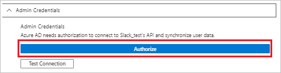

# Tutorial: Configure Slack for automatic user provisioning

The objective of this tutorial is to show you the steps you need to perform in Slack and Azure AD to automatically provision and de-provision user accounts from Azure AD to Slack. For important details on what this service does, how it works, and frequently asked questions, see [Automate user provisioning and deprovisioning to SaaS applications with Azure Active Directory](../manage-apps/user-provisioning.md). 

## Capabilities supported
> [!div class="checklist"]
> * Create users in Slack
> * Remove users in Slack when they do not require access anymore
> * Keep user attributes synchronized between Azure AD and Slack
> * Provision groups and group memberships in Slack
> * [Single sign-on](https://docs.microsoft.com/azure/active-directory/saas-apps/slack-tutorial) to Slack (recommended)

## Prerequisites

The scenario outlined in this tutorial assumes that you already have the following items:

* [An Azure AD tenant](https://docs.microsoft.com/azure/active-directory/develop/quickstart-create-new-tenant).
* A user account in Azure AD with [permission](https://docs.microsoft.com/azure/active-directory/users-groups-roles/directory-assign-admin-roles) to configure provisioning (e.g. Application Administrator, Cloud Application administrator, Application Owner, or Global Administrator).
* A Slack tenant with the [Plus plan](https://aadsyncfabric.slack.com/pricing) or better enabled.
* A user account in Slack with Team Admin permissions.

## Step 1. Plan your provisioning deployment
1. Learn about [how the provisioning service works](https://docs.microsoft.com/azure/active-directory/manage-apps/user-provisioning).
2. Determine who will be in [scope for provisioning](https://docs.microsoft.com/azure/active-directory/manage-apps/define-conditional-rules-for-provisioning-user-accounts).
3. Determine what data to [map between Azure AD and Slack](https://docs.microsoft.com/azure/active-directory/manage-apps/customize-application-attributes). 

## Step 2. Add Slack from the Azure AD application gallery

Add Slack from the Azure AD application gallery to start managing provisioning to Slack. If you have previously setup Slack for SSO you can use the same application. However it is recommended that you create a separate app when testing out the integration initially. Learn more about adding an application from the gallery [here](https://docs.microsoft.com/azure/active-directory/manage-apps/add-gallery-app). 

## Step 3. Define who will be in scope for provisioning 

The Azure AD provisioning service allows you to scope who will be provisioned based on assignment to the application and or based on attributes of the user / group. If you choose to scope who will be provisioned to your app based on assignment, you can use the following [steps](../manage-apps/assign-user-or-group-access-portal.md) to assign users and groups to the application. If you choose to scope who will be provisioned based solely on attributes of the user or group, you can use a scoping filter as described [here](https://docs.microsoft.com/azure/active-directory/manage-apps/define-conditional-rules-for-provisioning-user-accounts). 

* When assigning users and groups to Slack, you must select a role other than **Default Access**. Users with the Default Access role are excluded from provisioning and will be marked as not effectively entitled in the provisioning logs. If the only role available on the application is the default access role, you can [update the application manifest](https://docs.microsoft.com/azure/active-directory/develop/howto-add-app-roles-in-azure-ad-apps) to add additional roles. 

* Start small. Test with a small set of users and groups before rolling out to everyone. When scope for provisioning is set to assigned users and groups, you can control this by assigning one or two users or groups to the app. When scope is set to all users and groups, you can specify an [attribute based scoping filter](https://docs.microsoft.com/azure/active-directory/manage-apps/define-conditional-rules-for-provisioning-user-accounts).

## Step 4. Configure automatic user provisioning to Slack 

This section guides you through connecting your Azure AD to Slack's user account provisioning API, and configuring the provisioning service to create, update, and disable assigned user accounts in Slack based on user and group assignment in Azure AD.

### To configure automatic user account provisioning to Slack in Azure AD:

1. Sign in to the [Azure portal](https://portal.azure.com). Select **Enterprise Applications**, then select **All applications**.

	

2. In the applications list, select **Slack**.

	

3. Select the **Provisioning** tab.

	

4. Set the **Provisioning Mode** to **Automatic**.

	

5. Under the **Admin Credentials** section, click **Authorize**. This opens a Slack authorization dialog in a new browser window.

	

6. In the new window, sign into Slack using your Team Admin account. in the resulting authorization dialog, select the Slack team that you want to enable provisioning for, and then select **Authorize**. Once completed, return to the Azure portal to complete the provisioning configuration.

    

7. In the Azure portal, click **Test Connection** to ensure Azure AD can connect to your Slack app. If the connection fails, ensure your Slack account has Team Admin permissions and try the "Authorize" step again.

8. In the **Notification Email** field, enter the email address of a person or group who should receive the provisioning error notifications and select the **Send an email notification when a failure occurs** check box.

	

9. Select **Save**.

10. Under the Mappings section, select **Synchronize Azure Active Directory Users to Slack**.

11. In the **Attribute Mappings** section, review the user attributes that will be synchronized from Azure AD to Slack. Note that the attributes selected as **Matching** properties will be used to match the user accounts in Slack for update operations. Select the Save button to commit any changes.

   |Attribute|Type|
   |---|---|
   |active|Boolean|
   |externalId|String|
   |displayName|String|
   |name.familyName|String|
   |name.givenName|String|
   |title|String|
   |emails[type eq "work"].value|String|
   |userName|String|
   |nickName|String|
   |addresses[type eq "untyped"].streetAddress|String|
   |addresses[type eq "untyped"].locality|String|
   |addresses[type eq "untyped"].region|String|
   |addresses[type eq "untyped"].postalCode|String|
   |addresses[type eq "untyped"].country|String|
   |phoneNumbers[type eq "mobile"].value|String|
   |phoneNumbers[type eq "work"].value|String|
   |roles[primary eq "True"].value|String|
   |locale|String|
   |name.honorificPrefix|String|
   |photos[type eq "photo"].value|String|
   |profileUrl|String|
   |timezone|String|
   |userType|String|
   |urn:scim:schemas:extension:enterprise:1.0.department|String|
   |urn:scim:schemas:extension:enterprise:1.0.manager|Reference|
   |urn:scim:schemas:extension:enterprise:1.0.employeeNumber|String|
   |urn:scim:schemas:extension:enterprise:1.0.costCenter|String|
   |urn:scim:schemas:extension:enterprise:1.0.organization|String|
   |urn:scim:schemas:extension:enterprise:1.0.division|String|

12. Under the **Mappings** section, select **Synchronize Azure Active Directory Groups to Slack**.

13. In the **Attribute Mappings** section, review the group attributes that will be synchronized from Azure AD to Slack. Note that the attributes selected as **Matching** properties will be used to match the groups in Slack for update operations. Select the Save button to commit any changes.

      |Attribute|Type|
      |---|---|
      |displayName|String|
      |members|Reference|

14. To configure scoping filters, refer to the following instructions provided in the [Scoping filter tutorial](../manage-apps/define-conditional-rules-for-provisioning-user-accounts.md).

15. To enable the Azure AD provisioning service for Slack, change the **Provisioning Status** to **On** in the **Settings** section

	

16. Define the users and/or groups that you would like to provision to Slack by choosing the desired values in **Scope** in the **Settings** section.

	

17. When you are ready to provision, click **Save**.

	

This operation starts the initial synchronization cycle of all users and groups defined in **Scope** in the **Settings** section. The initial cycle takes longer to perform than subsequent cycles, which occur approximately every 40 minutes as long as the Azure AD provisioning service is running. 

## Step 5. Monitor your deployment
Once you've configured provisioning, use the following resources to monitor your deployment:

1. Use the [provisioning logs](https://docs.microsoft.com/azure/active-directory/reports-monitoring/concept-provisioning-logs) to determine which users have been provisioned successfully or unsuccessfully
2. Check the [progress bar](https://docs.microsoft.com/azure/active-directory/manage-apps/application-provisioning-when-will-provisioning-finish-specific-user) to see the status of the provisioning cycle and how close it is to completion
3. If the provisioning configuration seems to be in an unhealthy state, the application will go into quarantine. Learn more about quarantine states [here](https://docs.microsoft.com/azure/active-directory/manage-apps/application-provisioning-quarantine-status).

## Connector limitations

* When configuring Slack's **displayName** attribute, be aware of the following behaviors:

  * Values are not entirely unique (e.g. 2 users can have the same display name)

  * Supports non-English characters, spaces, capitalization. 
  
  * Allowed punctuation includes periods, underscores, hyphens, apostrophes, brackets (e.g. **( [ { } ] )**), and separators (e.g. **, / ;**).
  
  * Only updates if these two settings are configured in Slack's workplace/organization - **Profile syncing is enabled** and **Users cannot change their display name**.
  
* Slack's **userName** attribute has to be under 21 characters and have a unique value.

* Slack only allows matching with the attributes **userName** and **email**.  

## Change log

* 06/16/2020 - Modified DisplayName attribute to only be updated during new user creation.

## Additional Resources

* [Managing user account provisioning for Enterprise Apps](../app-provisioning/configure-automatic-user-provisioning-portal.md)
* [What is application access and single sign-on with Azure Active Directory?](../manage-apps/what-is-single-sign-on.md)

## Next steps

* [Learn how to review logs and get reports on provisioning activity](../manage-apps/check-status-user-account-provisioning.md)