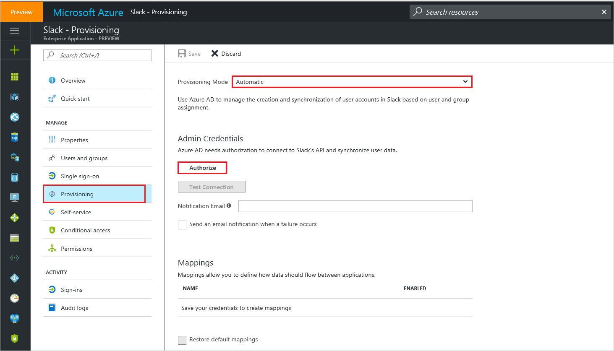
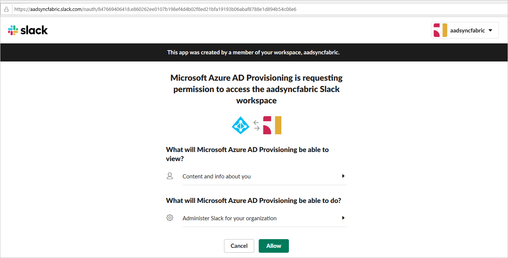

# Tutorial: Configure Slack for automatic user provisioning

The objective of this tutorial is to show you the steps you need to perform in Slack and Azure AD to automatically provision and de-provision user accounts from Azure AD to Slack.

## Prerequisites

The scenario outlined in this tutorial assumes that you already have the following items:

* An Azure Active Directory tenant
* A Slack tenant with the [Plus plan](https://aadsyncfabric.slack.com/pricing) or better enabled
* A user account in Slack with Team Admin permissions

Note: The Azure AD provisioning integration relies on the [Slack SCIM API](https://api.slack.com/scim), which is available to Slack teams on the Plus plan or better.

## Assigning users to Slack

Azure Active Directory uses a concept called "assignments" to determine which users should receive access to selected apps. In the context of automatic user account provisioning, only the users and groups that have been "assigned" to an application in Azure AD will be synchronized.

Before configuring and enabling the provisioning service, you will need to decide what users and/or groups in Azure AD represent the users who need access to your Slack app. Once decided, you can assign these users to your Slack app by following the instructions here:

[Assign a user or group to an enterprise app](../manage-apps/assign-user-or-group-access-portal.md)

### Important tips for assigning users to Slack

* It is recommended that a single Azure AD user is assigned to Slack to test the provisioning configuration. Additional users and/or groups may be assigned later.

* When assigning a user to Slack, you must select the **User** or "Group" role in the assignment dialog. The "Default Access" role does not work for provisioning.

## Configuring user provisioning to Slack 

This section guides you through connecting your Azure AD to Slack's user account provisioning API, and configuring the provisioning service to create, update, and disable assigned user accounts in Slack based on user and group assignment in Azure AD.

**Tip:** You may also choose to enabled SAML-based Single Sign-On for Slack, following the instructions provided in [Azure portal](https://portal.azure.com). Single sign-on can be configured independently of automatic provisioning, though these two features compliment each other.

### To configure automatic user account provisioning to Slack in Azure AD:

1. In the [Azure portal](https://portal.azure.com), browse to the **Azure Active Directory > Enterprise Apps > All applications**  section.

2. If you have already configured Slack for single sign-on, search for your instance of Slack using the search field. Otherwise, select **Add** and search for **Slack** in the application gallery. Select Slack from the search results, and add it to your list of applications.

3. Select your instance of Slack, then select the **Provisioning** tab.

4. Set the **Provisioning Mode** to **Automatic**.

   

5. Under the **Admin Credentials** section, click **Authorize**. This opens a Slack authorization dialog in a new browser window.

6. In the new window, sign into Slack using your Team Admin account. in the resulting authorization dialog, select the Slack team that you want to enable provisioning for, and then select **Authorize**. Once completed, return to the Azure portal to complete the provisioning configuration.

    

7. In the Azure portal, click **Test Connection** to ensure Azure AD can connect to your Slack app. If the connection fails, ensure your Slack account has Team Admin permissions and try the "Authorize" step again.

8. Enter the email address of a person or group who should receive provisioning error notifications in the **Notification Email** field, and check the checkbox below.

9. Click **Save**.

10. Under the Mappings section, select **Synchronize Azure Active Directory Users to Slack**.

11. In the **Attribute Mappings** section, review the user attributes that will be synchronized from Azure AD to Slack. Note that the attributes selected as **Matching** properties will be used to match the user accounts in Slack for update operations. Select the Save button to commit any changes.

12. To enable the Azure AD provisioning service for Slack, change the **Provisioning Status** to **On** in the **Settings** section

13. Click **Save**.

This will start the initial synchronization of any users and/or groups assigned to Slack in the Users and Groups section. Note that the initial sync will take longer to perform than subsequent syncs, which occur approximately every 10 minutes as long as the service is running. You can use the **Synchronization Details** section to monitor progress and follow links to provisioning activity reports, which describe all actions performed by the provisioning service on your Slack app.

## [Optional] Configuring group object provisioning to Slack

Optionally, you can enable the provisioning of group objects from Azure AD to Slack. This is different from "assigning groups of users", in that the actual group object in addition to its members will be replicated from Azure AD to Slack. For example, if you have a group named "My Group" in Azure AD, an identical group named "My Group" will be created inside Slack.

### To enable provisioning of group objects:

1. Under the Mappings section, select **Synchronize Azure Active Directory Groups to Slack**.

2. In the Attribute Mapping blade, set Enabled to Yes.

3. In the **Attribute Mappings** section, review the group attributes that will be synchronized from Azure AD to Slack. Note that the attributes selected as **Matching** properties will be used to match the groups in Slack for update operations. 

4. Click **Save**.

This result in any group objects assigned to Slack in the **Users and Groups** section being fully synchronized from Azure AD to Slack. You can use the **Synchronization Details** section to monitor progress and follow links to provisioning activity logs, which describe all actions performed by the provisioning service on your Slack app.

For more information on how to read the Azure AD provisioning logs, see [Reporting on automatic user account provisioning](../app-provisioning/check-status-user-account-provisioning.md).

## Connector limitations

* When configuring Slack's **displayName** attribute, be aware of the following behaviors:

  * Values are not entirely unique (e.g. 2 users can have the same display name)

  * Supports non-English characters, spaces, capitalization. 
  
  * Allowed punctuation includes periods, underscores, hyphens, apostrophes, brackets (e.g. **( [ { } ] )**), and separators (e.g. **, / ;**).
  
  * Only updates if these two settings are configured in Slack's workplace/organization - **Profile syncing is enabled** and **Users cannot change their display name**.
  
* Slack's **userName** attribute has to be under 21 characters and have a unique value.

* Slack only allows matching with the attributes **userName** and **email**.  

## Additional Resources

* [Managing user account provisioning for Enterprise Apps](../app-provisioning/configure-automatic-user-provisioning-portal.md)
* [What is application access and single sign-on with Azure Active Directory?](../manage-apps/what-is-single-sign-on.md)
