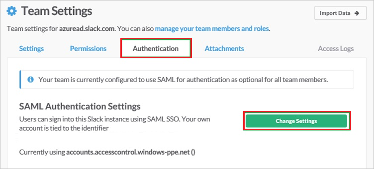
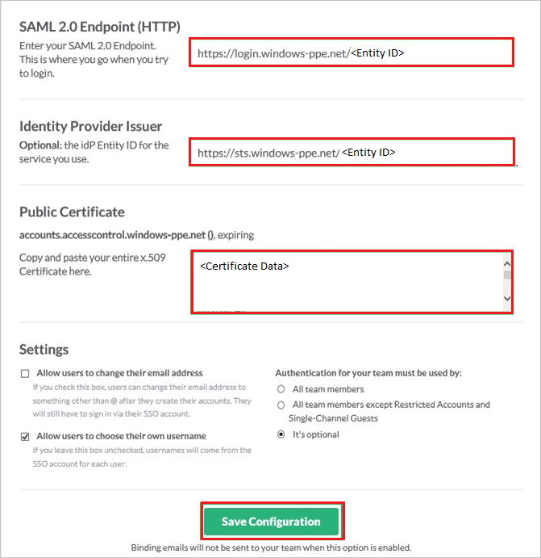

# Tutorial: Azure Active Directory integration with Slack

In this tutorial, you learn how to integrate Slack with Azure Active Directory (Azure AD).
Integrating Slack with Azure AD provides you with the following benefits:

* You can control in Azure AD who has access to Slack.
* You can enable your users to be automatically signed-in to Slack (Single Sign-On) with their Azure AD accounts.
* You can manage your accounts in one central location - the Azure portal.

If you want to know more details about SaaS app integration with Azure AD, see [What is application access and single sign-on with Azure Active Directory](https://docs.microsoft.com/azure/active-directory/active-directory-appssoaccess-whatis).
If you don't have an Azure subscription, [create a free account](https://azure.microsoft.com/free/) before you begin.

## Prerequisites

To configure Azure AD integration with Slack, you need the following items:

* An Azure AD subscription. If you don't have an Azure AD environment, you can get one-month trial [here](https://azure.microsoft.com/pricing/free-trial/)
* Slack single sign-on enabled subscription

## Scenario description

In this tutorial, you configure and test Azure AD single sign-on in a test environment.

* Slack supports **SP** initiated SSO
* Slack supports **Just In Time** user provisioning
* Slack supports [**Automated** user provisioning](slack-provisioning-tutorial.md)

## Adding Slack from the gallery

To configure the integration of Slack into Azure AD, you need to add Slack from the gallery to your list of managed SaaS apps.

**To add Slack from the gallery, perform the following steps:**

1. In the **[Azure portal](https://portal.azure.com)**, on the left navigation panel, click **Azure Active Directory** icon.

	

2. Navigate to **Enterprise Applications** and then select the **All Applications** option.

	

3. To add new application, click **New application** button on the top of dialog.

	

4. In the search box, type **Slack**, select **Slack** from result panel then click **Add** button to add the application.

	 

## Configure and test Azure AD single sign-on

In this section, you configure and test Azure AD single sign-on with Slack based on a test user called **Britta Simon**.
For single sign-on to work, a link relationship between an Azure AD user and the related user in Slack needs to be established.

To configure and test Azure AD single sign-on with Slack, you need to complete the following building blocks:

1. **[Configure Azure AD Single Sign-On](#configure-azure-ad-single-sign-on)** - to enable your users to use this feature.
2. **[Configure Slack Single Sign-On](#configure-slack-single-sign-on)** - to configure the Single Sign-On settings on application side.
3. **[Create an Azure AD test user](#create-an-azure-ad-test-user)** - to test Azure AD single sign-on with Britta Simon.
4. **[Assign the Azure AD test user](#assign-the-azure-ad-test-user)** - to enable Britta Simon to use Azure AD single sign-on.
5. **[Create Slack test user](#create-slack-test-user)** - to have a counterpart of Britta Simon in Slack that is linked to the Azure AD representation of user.
6. **[Test single sign-on](#test-single-sign-on)** - to verify whether the configuration works.

### Configure Azure AD single sign-on

In this section, you enable Azure AD single sign-on in the Azure portal.

To configure Azure AD single sign-on with Slack, perform the following steps:

1. In the [Azure portal](https://portal.azure.com/), on the **Slack** application integration page, select **Single sign-on**.

    

2. On the **Select a Single sign-on method** dialog, select **SAML/WS-Fed** mode to enable single sign-on.

    

3. On the **Set up Single Sign-On with SAML** page, click **Edit** icon to open **Basic SAML Configuration** dialog.

	

4. On the **Basic SAML Configuration** section, perform the following steps:

    

	a. In the **Sign on URL** text box, type a URL using the following pattern:
    `https://<companyname>.slack.com`

    b. In the **Identifier (Entity ID)** text box, type a URL:
    `https://slack.com`

	> [!NOTE]
	> The Sign on URL value is not real. Update the value with the actual Sign on URL. Contact [Slack Client support team](https://slack.com/help/contact) to get the value. You can also refer to the patterns shown in the **Basic SAML Configuration** section in the Azure portal.

5. Slack application expects the SAML assertions in a specific format. Configure the following claims for this application. You can manage the values of these attributes from the **User Attributes** section on application integration page. On the **Set up Single Sign-On with SAML** page, click **Edit** button to open **User Attributes** dialog.

	

	> [!NOTE] 
	> If you have users who’s assigned **email address** is not on an Office365 license, the **User.Email** claim will not appear in the SAML Token. In these cases, we suggest using **user.userprincipalname** as the **User.Email** attribute value to map as **Unique Identifier** instead.

6. In the **User Claims** section on the **User Attributes** dialog, configure SAML token attribute as shown in the image above and perform the following steps:

	| Name | Source Attribute |
	| --- | --- |
	| first_name | user.givenname |
	| last_name | user.surname |
	| User.Email | user.mail |
	| User.Username | user.userprincipalname |

	a. Click **Add new claim** to open the **Manage user claims** dialog.

	

	

	b. In the **Name** textbox, type the attribute name shown for that row.

	c. Leave the **Namespace** blank.

	d. Select Source as **Attribute**.

	e. From the **Source attribute** list, type the attribute value shown for that row.

	f. Click **Ok**

	g. Click **Save**.

7. On the **Set up Single Sign-On with SAML** page, in the **SAML Signing Certificate** section, click **Download** to download the **Certificate (Base64)** from the given options as per your requirement and save it on your computer.

	

8. On the **Set up Slack** section, copy the appropriate URL(s) as per your requirement.

	

	a. Login URL

	b. Azure Ad Identifier

	c. Logout URL

### Configure Slack Single Sign-On

1. In a different web browser window, log in to your Slack company site as an administrator.

2. Navigate to **Microsoft Azure AD** then go to **Team Settings**.

     

3. In the **Team Settings** section, click the **Authentication** tab, and then click **Change Settings**.

    

4. On the **SAML Authentication Settings** dialog, perform the following steps:

    

    a.  In the **SAML 2.0 Endpoint (HTTP)** textbox, paste the value of **Login URL**, which you have copied from Azure portal.

    b.  In the **Identity Provider Issuer** textbox, paste the value of **Azure Ad Identifier**, which you have copied from Azure portal.

    c.  Open your downloaded certificate file in notepad, copy the content of it into your clipboard, and then paste it to the **Public Certificate** textbox.

    d. Configure the above three settings as appropriate for your Slack team. For more information about the settings, please find the **Slack's SSO configuration guide** here. `https://get.slack.help/hc/articles/220403548-Guide-to-single-sign-on-with-Slack%60`

    e.  Click **Save Configuration**.

### Create an Azure AD test user 

The objective of this section is to create a test user in the Azure portal called Britta Simon.

1. In the Azure portal, in the left pane, select **Azure Active Directory**, select **Users**, and then select **All users**.

    

2. Select **New user** at the top of the screen.

    

3. In the User properties, perform the following steps.

    

    a. In the **Name** field enter **BrittaSimon**.
  
    b. In the **User name** field type **brittasimon\@yourcompanydomain.extension**  
    For example, BrittaSimon@contoso.com

    c. Select **Show password** check box, and then write down the value that's displayed in the Password box.

    d. Click **Create**.

### Assign the Azure AD test user

In this section, you enable Britta Simon to use Azure single sign-on by granting access to Slack.

1. In the Azure portal, select **Enterprise Applications**, select **All applications**, then select **Slack**.

	

2. In the applications list, select **Slack**.

	

3. In the menu on the left, select **Users and groups**.

    

4. Click the **Add user** button, then select **Users and groups** in the **Add Assignment** dialog.

    

5. In the **Users and groups** dialog select **Britta Simon** in the Users list, then click the **Select** button at the bottom of the screen.

6. If you are expecting any role value in the SAML assertion then in the **Select Role** dialog select the appropriate role for the user from the list, then click the **Select** button at the bottom of the screen.

7. In the **Add Assignment** dialog click the **Assign** button.

### Create Slack test user

The objective of this section is to create a user called Britta Simon in Slack. Slack supports just-in-time provisioning, which is by default enabled. There is no action item for you in this section. A new user is created during an attempt to access Slack if it doesn't exist yet. Slack also supports automatic user provisioning, you can find more details [here](slack-provisioning-tutorial.md) on how to configure automatic user provisioning.

> [!NOTE]
> If you need to create a user manually, you need to contact [Slack support team](https://slack.com/help/contact).

> [!NOTE]
> Azure AD Connect is the synchronization tool which can sync on premises Active Directory Identities to Azure AD and then these synced users can also use the applications as like other cloud users.

### Test single sign-on 

In this section, you test your Azure AD single sign-on configuration using the Access Panel.

When you click the Slack tile in the Access Panel, you should be automatically signed in to the Slack for which you set up SSO. For more information about the Access Panel, see [Introduction to the Access Panel](https://docs.microsoft.com/azure/active-directory/active-directory-saas-access-panel-introduction).

## Additional Resources

- [List of Tutorials on How to Integrate SaaS Apps with Azure Active Directory](https://docs.microsoft.com/azure/active-directory/active-directory-saas-tutorial-list)

- [What is application access and single sign-on with Azure Active Directory?](https://docs.microsoft.com/azure/active-directory/active-directory-appssoaccess-whatis)

- [What is Conditional Access in Azure Active Directory?](https://docs.microsoft.com/azure/active-directory/conditional-access/overview)

- [Configure User Provisioning](slack-provisioning-tutorial.md)
