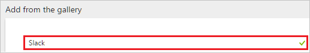
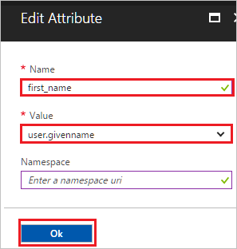
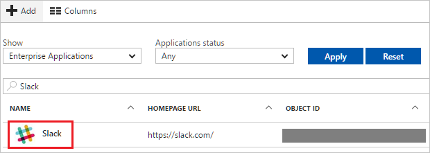

# Tutorial: Azure Active Directory integration with Slack

In this tutorial, you learn how to integrate Slack with Azure Active Directory (Azure AD).

Integrating Slack with Azure AD provides you with the following benefits:

- You can control in Azure AD who has access to Slack
- You can enable your users to automatically get signed-on to Slack (Single Sign-On) with their Azure AD accounts
- You can manage your accounts in one central location - the Azure portal

If you want to know more details about SaaS app integration with Azure AD, see [what is application access and single sign-on with Azure Active Directory](../manage-apps/what-is-single-sign-on.md).

## Prerequisites

To configure Azure AD integration with Slack, you need the following items:

- An Azure AD subscription
- A Slack single sign-on enabled subscription

> [!NOTE]
> To test the steps in this tutorial, we do not recommend using a production environment.

To test the steps in this tutorial, you should follow these recommendations:

- Do not use your production environment, unless it is necessary.
- If you don't have an Azure AD trial environment, you can [get a one-month trial](https://azure.microsoft.com/pricing/free-trial/).

## Scenario description
In this tutorial, you test Azure AD single sign-on in a test environment. 
The scenario outlined in this tutorial consists of two main building blocks:

1. Adding Slack from the gallery
1. Configuring and testing Azure AD single sign-on

## Adding Slack from the gallery
To configure the integration of Slack into Azure AD, you need to add Slack from the gallery to your list of managed SaaS apps.

**To add Slack from the gallery, perform the following steps:**

1. In the **[Azure portal](https://portal.azure.com)**, on the left navigation panel, click **Azure Active Directory** icon. 

	![Active Directory][1]

1. Navigate to **Enterprise applications**. Then go to **All applications**.

	![Applications][2]
	
1. To add new application, click **New application** button on the top of dialog.

	![Applications][3]

1. In the search box, type **Slack**.

	

1. In the results panel, select **Slack**, and then click **Add** button to add the application.

	

##  Configuring and testing Azure AD single sign-on
In this section, you configure and test Azure AD single sign-on with Slack based on a test user called "Britta Simon".

For single sign-on to work, Azure AD needs to know what the counterpart user in Slack is to a user in Azure AD. In other words, a link relationship between an Azure AD user and the related user in Slack needs to be established.

In Slack, assign the value of the **user name** in Azure AD as the value of the **Username** to establish the link relationship.

To configure and test Azure AD single sign-on with Slack, you need to complete the following building blocks:

1. **[Configuring Azure AD Single Sign-On](#configuring-azure-ad-single-sign-on)** - to enable your users to use this feature.
1. **[Creating an Azure AD test user](#creating-an-azure-ad-test-user)** - to test Azure AD single sign-on with Britta Simon.
1. **[Creating a Slack test user](#creating-a-slack-test-user)** - to have a counterpart of Britta Simon in Slack that is linked to the Azure AD representation of user.
1. **[Assigning the Azure AD test user](#assigning-the-azure-ad-test-user)** - to enable Britta Simon to use Azure AD single sign-on.
1. **[Testing Single Sign-On](#testing-single-sign-on)** - to verify whether the configuration works.

### Configuring Azure AD single sign-on

In this section, you enable Azure AD single sign-on in the Azure portal and configure single sign-on in your Slack application.

**To configure Azure AD single sign-on with Slack, perform the following steps:**

1. In the Azure portal, on the **Slack** application integration page, click **Single sign-on**.

	![Configure Single Sign-On][4]

1. On the **Single sign-on** dialog, select **Mode** as	**SAML-based Sign-on** to enable single sign-on.
 
	

1. On the **Slack Domain and URLs** section, perform the following steps:

	

    a. In the **Sign-on URL** textbox, type a URL using the following pattern: `https://<companyname>.slack.com`

    b. In the **Identifier** textbox, update the value with the Sign On URL. This is your workspace domain. For example: `https://contoso.slack.com`

1. Slack application expects the SAML assertions in a specific format. Configure the following claims for this application. You can manage the values of these attributes from the "**User Attributes**" section on application integration page. The following screenshot shows an example for this.
	
	

	> [!NOTE] 
	> If you have users who’s assigned **email address** is not on a Office365 license, the **User.Email** claim will not appear in the SAML Token. In these cases, we suggest using **user.userprincipalname** as the **User.Email** attribute value to map as **Unique Identifier** instead.

1. In the **User Attributes** section on the **Single sign-on** dialog, select **user.mail**  as **User Identifier** and for each row shown in the table below, perform the following steps:
    
	| Attribute Name | Attribute Value |
	| --- | --- |
	| first_name | user.givenname |
	| last_name | user.surname |
	| User.Email | user.mail |	
	| User.Username | user.userprincipalname |

    a. Click on **Attribute** to open **Edit Attribute** dialog box and perform the following steps:

    

    a. In the **Name** textbox, type the attribute name shown for that row.

	b. From the **Value** list, select the attribute value shown for that row.

	c. Leave the **Namespace** blank.

	d. Click **OK**

1. On the **SAML Signing Certificate** section, click **Certificate (Base64)** and then save the certificate file on your computer.

	

1. Click **Save** button.

	

1. On the **Slack Configuration** section, click **Configure Slack** to open **Configure sign-on** window. Copy the **SAML Entity ID, and SAML Single Sign-On Service URL** from the **Quick Reference section.**

	

1. In a different web browser window, log in to your Slack company site as an administrator.

1. Navigate to **Microsoft Azure AD** then go to **Team Settings**.

     

1. In the **Team Settings** section, click the **Authentication** tab, and then click **Change Settings**.

    

1. On the **SAML Authentication Settings** dialog, perform the following steps:

    

    a.  In the **SAML 2.0 Endpoint (HTTP)** textbox, paste the value of **SAML Single Sign-On Service URL**, which you have copied from Azure portal.

    b.  In the **Identity Provider Issuer** textbox, paste the value of **SAML Entity ID**, which you have copied from Azure portal.

    c.  Open your downloaded certificate file in notepad, copy the content of it into your clipboard, and then paste it to the **Public Certificate** textbox.

    d. Configure the above three settings as appropriate for your Slack team. For more information about the settings, please find the **Slack's SSO configuration guide** here. `https://get.slack.help/hc/articles/220403548-Guide-to-single-sign-on-with-Slack%60`

    e.  Click **Save Configuration**.

### Creating an Azure AD test user
The objective of this section is to create a test user in the Azure portal called Britta Simon.

![Create Azure AD User][100]

**To create a test user in Azure AD, perform the following steps:**

1. In the **Azure portal**, on the left navigation pane, click **Azure Active Directory** icon.

	 

1. To display the list of users, go to **Users and groups** and click **All users**.
	
	 

1. To open the **User** dialog, click **Add** on the top of the dialog.

	

1. On the **User** dialog page, perform the following steps:

	

    a. In the **Name** textbox, type **BrittaSimon**.

    b. In the **User name** textbox, type the **email address** of BrittaSimon.

	c. Select **Show Password** and write down the value of the **Password**.

    d. Click **Create**.

### Creating a Slack test user

The objective of this section is to create a user called Britta Simon in Slack. Slack supports just-in-time provisioning, which is by default enabled. There is no action item for you in this section. A new user is created during an attempt to access Slack if it doesn't exist yet. Slack also supports automatic user provisioning, you can find more details [here](slack-provisioning-tutorial.md) on how to configure automatic user provisioning.

> [!NOTE]
> If you need to create a user manually, you need to contact [Slack support team](https://slack.com/help/contact).

> [!NOTE]
> Azure AD Connect is the synchronization tool which can sync on premise Active Directory Identities to Azure AD and then these synced users can also use the applications as like other cloud users.

### Assigning the Azure AD test user

In this section, you enable Britta Simon to use Azure single sign-on by granting access to Slack.

![Assign User][200]

**To assign Britta Simon to Slack, perform the following steps:**

1. In the Azure portal, open the applications view, and then navigate to the directory view and go to **Enterprise applications** then click **All applications**.

	![Assign User][201] 

1. In the applications list, select **Slack**.

	 

1. In the menu on the left, click **Users and groups**.

	![Assign User][202] 

1. Click **Add** button. Then select **Users and groups** on **Add Assignment** dialog.

	![Assign User][203]

1. On **Users and groups** dialog, select **Britta Simon** in the Users list.

1. Click **Select** button on **Users and groups** dialog.

1. Click **Assign** button on **Add Assignment** dialog.
	
### Testing single sign-on

In this section, you test your Azure AD single sign-on configuration using the Access Panel.

When you click the Slack tile in the Access Panel, you should get automatically signed-on to your Slack application.

## Additional resources

* [List of Tutorials on How to Integrate SaaS Apps with Azure Active Directory](tutorial-list.md)
* [What is application access and single sign-on with Azure Active Directory?](../manage-apps/what-is-single-sign-on.md)
* [Configure User Provisioning](slack-provisioning-tutorial.md)

<!--Image references-->

[1]: ./media/slack-tutorial/tutorial_general_01.png
[2]: ./media/slack-tutorial/tutorial_general_02.png
[3]: ./media/slack-tutorial/tutorial_general_03.png
[4]: ./media/slack-tutorial/tutorial_general_04.png

[100]: ./media/slack-tutorial/tutorial_general_100.png

[200]: ./media/slack-tutorial/tutorial_general_200.png
[201]: ./media/slack-tutorial/tutorial_general_201.png
[202]: ./media/slack-tutorial/tutorial_general_202.png
[203]: ./media/slack-tutorial/tutorial_general_203.png
