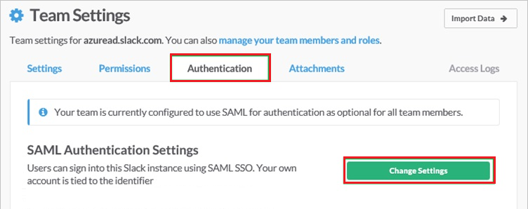
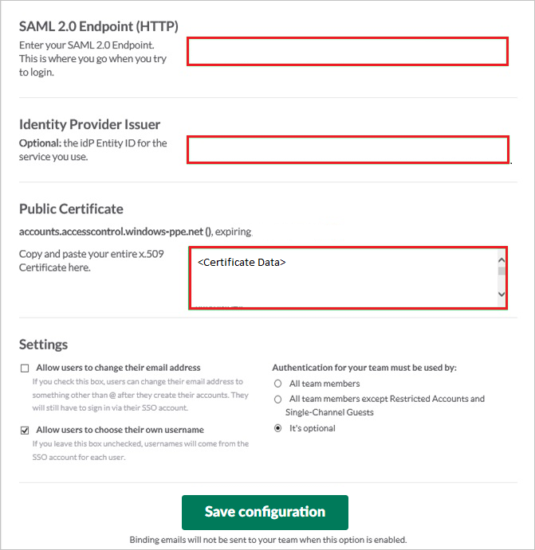

# Tutorial: Azure Active Directory single sign-on (SSO) integration with Slack

In this tutorial, you'll learn how to integrate Slack with Azure Active Directory (Azure AD). When you integrate Slack with Azure AD, you can:

* Control in Azure AD who has access to Slack.
* Enable your users to be automatically signed-in to Slack with their Azure AD accounts.
* Manage your accounts in one central location - the Azure portal.

To learn more about SaaS app integration with Azure AD, see [What is application access and single sign-on with Azure Active Directory](https://docs.microsoft.com/azure/active-directory/active-directory-appssoaccess-whatis).

## Prerequisites

To get started, you need the following items:

* An Azure AD subscription. If you don't have a subscription, you can get a [free account](https://azure.microsoft.com/free/).
* Slack single sign-on (SSO) enabled subscription.

> [!NOTE]
> If you need to integrate with more than one Slack instance in one tenant, the identifier for each application can be a variable.

## Scenario description

In this tutorial, you configure and test Azure AD SSO in a test environment.

* Slack supports **SP** initiated SSO
* Slack supports **Just In Time** user provisioning
* Slack supports [**Automated** user provisioning](https://docs.microsoft.com/azure/active-directory/saas-apps/slack-provisioning-tutorial)
* Once you configure Slack you can enforce Session control, which protect exfiltration and infiltration of your organization’s sensitive data in real-time. Session control extend from Conditional Access. [Learn how to enforce session control with Microsoft Cloud App Security](https://docs.microsoft.com/cloud-app-security/proxy-deployment-aad)

## Adding Slack from the gallery

To configure the integration of Slack into Azure AD, you need to add Slack from the gallery to your list of managed SaaS apps.

1. Sign in to the [Azure portal](https://portal.azure.com) using either a work or school account, or a personal Microsoft account.
1. On the left navigation pane, select the **Azure Active Directory** service.
1. Navigate to **Enterprise Applications** and then select **All Applications**.
1. To add new application, select **New application**.
1. In the **Add from the gallery** section, type **Slack** in the search box.
1. Select **Slack** from results panel and then add the app. Wait a few seconds while the app is added to your tenant.

## Configure and test Azure AD single sign-on for Slack

Configure and test Azure AD SSO with Slack using a test user called **B.Simon**. For SSO to work, you need to establish a link relationship between an Azure AD user and the related user in Slack.

To configure and test Azure AD SSO with Slack, complete the following building blocks:

1. **[Configure Azure AD SSO](#configure-azure-ad-sso)** - to enable your users to use this feature.
	* **[Create an Azure AD test user](#create-an-azure-ad-test-user)** - to test Azure AD single sign-on with B.Simon.
	* **[Assign the Azure AD test user](#assign-the-azure-ad-test-user)** - to enable B.Simon to use Azure AD single sign-on.
1. **[Configure Slack SSO](#configure-slack-sso)** - to configure the single sign-on settings on application side.
	* **[Create Slack test user](#create-slack-test-user)** - to have a counterpart of B.Simon in Slack that is linked to the Azure AD representation of user.
1. **[Test SSO](#test-sso)** - to verify whether the configuration works.

### Configure Azure AD SSO

Follow these steps to enable Azure AD SSO in the Azure portal.

1. In the [Azure portal](https://portal.azure.com/), on the **Slack** application integration page, find the **Manage** section and select **single sign-on**.
1. On the **Select a single sign-on method** page, select **SAML**.
1. On the **Set up single sign-on with SAML** page, click the edit/pen icon for **Basic SAML Configuration** to edit the settings.

   

1. On the **Basic SAML Configuration** section, enter the values for the following fields:

    a. In the **Sign on URL** text box, type a URL using the following pattern:
    `https://< DOMAIN NAME>.slack.com/sso/saml/start`

    b. In the **Identifier (Entity ID)** text box, type a URL:
    `https://slack.com`

	> [!NOTE]
	> The Sign on URL value is not real. Update the value with the actual Sign on URL. Contact [Slack Client support team](https://slack.com/help/contact) to get the value. You can also refer to the patterns shown in the **Basic SAML Configuration** section in the Azure portal.
	
	> [!NOTE]
	> The value for **Identifier (Entity ID)** can be a variable if you have more than one Slack instance that you need to integrate with the tenant. Use the pattern `https://<DOMAIN NAME>.slack.com`. In this scenario, you also must pair with another setting in Slack by using the same value.

1. Slack application expects the SAML assertions in a specific format, which requires you to add custom attribute mappings to your SAML token attributes configuration. The following screenshot shows the list of default attributes.

	

1. In addition to above, Slack application expects few more attributes to be passed back in SAML response which are shown below. These attributes are also pre populated but you can review them as per your requirements. You also must add the `email` attribute. If the user does not have an email address, map **emailaddress** to **user.userprincipalname** and map **email** to **user.userprincipalname**.

    | Name | Source Attribute |
    | -----|---------|
    | emailaddress | user.userprincipalname |
    | email | user.userprincipalname |
    | | |

   > [!NOTE]
   > In order to set up the service provider (SP) configuration, you must click on **Expand** next to **Advanced Options** in the SAML configuration page. In the **Service Provider Issuer** box, enter the workspace URL. The default is slack.com. 

1. On the **Set up single sign-on with SAML** page, in the **SAML Signing Certificate** section,  find **Certificate (Base64)** and select **Download** to download the certificate and save it on your computer.

	

1. On the **Set up Slack** section, copy the appropriate URL(s) based on your requirement.

	

### Create an Azure AD test user

In this section, you'll create a test user in the Azure portal called B.Simon.

1. From the left pane in the Azure portal, select **Azure Active Directory**, select **Users**, and then select **All users**.
1. Select **New user** at the top of the screen.
1. In the **User** properties, follow these steps:
   1. In the **Name** field, enter `B.Simon`.  
   1. In the **User name** field, enter the username@companydomain.extension. For example, `B.Simon@contoso.com`.
   1. Select the **Show password** check box, and then write down the value that's displayed in the **Password** box.
   1. Click **Create**.

### Assign the Azure AD test user

In this section, you'll enable B.Simon to use Azure single sign-on by granting access to Slack.

1. In the Azure portal, select **Enterprise Applications**, and then select **All applications**.
1. In the applications list, select **Slack**.
1. In the app's overview page, find the **Manage** section and select **Users and groups**.

   

1. Select **Add user**, then select **Users and groups** in the **Add Assignment** dialog.

	

1. In the **Users and groups** dialog, select **B.Simon** from the Users list, then click the **Select** button at the bottom of the screen.
1. If you're expecting any role value in the SAML assertion, in the **Select Role** dialog, select the appropriate role for the user from the list and then click the **Select** button at the bottom of the screen.
1. In the **Add Assignment** dialog, click the **Assign** button.

## Configure Slack SSO

1. In a different web browser window, sign in to your Slack company site as an administrator.

2. Navigate to **Microsoft Azure AD** then go to **Team Settings**.

     

3. In the **Team Settings** section, click the **Authentication** tab, and then click **Change Settings**.

    

4. On the **SAML Authentication Settings** dialog, perform the following steps:

    

    a.  In the **SAML 2.0 Endpoint (HTTP)** textbox, paste the value of **Login URL**, which you have copied from Azure portal.

    b.  In the **Identity Provider Issuer** textbox, paste the value of **Azure Ad Identifier**, which you have copied from Azure portal.

    c.  Open your downloaded certificate file in Notepad, copy the content of it into your clipboard, and then paste it to the **Public Certificate** textbox.

    d. Configure the above three settings as appropriate for your Slack team. For more information about the settings, please find the **Slack's SSO configuration guide** here. `https://get.slack.help/hc/articles/220403548-Guide-to-single-sign-on-with-Slack%60`

    

    e. Click on **expand** and enter `https://slack.com` in the **Service provider issuer** textbox.

    f.  Click **Save Configuration**.
    
    > [!NOTE]
    > If you have more than one Slack instance that you need to integrate with Azure AD, set `https://<DOMAIN NAME>.slack.com` to **Service provider issuer** so that it can pair with the Azure application **Identifier** setting.

### Create Slack test user

The objective of this section is to create a user called B.Simon in Slack. Slack supports just-in-time provisioning, which is by default enabled. There is no action item for you in this section. A new user is created during an attempt to access Slack if it doesn't exist yet. Slack also supports automatic user provisioning, you can find more details [here](slack-provisioning-tutorial.md) on how to configure automatic user provisioning.

> [!NOTE]
> If you need to create a user manually, you need to contact [Slack support team](https://slack.com/help/contact).

> [!NOTE]
> Azure AD Connect is the synchronization tool which can sync on premises Active Directory Identities to Azure AD and then these synced users can also use the applications as like other cloud users.

## Test SSO

In this section, you test your Azure AD single sign-on configuration using the Access Panel.

When you click the Slack tile in the Access Panel, you should be automatically signed in to the Slack for which you set up SSO. For more information about the Access Panel, see [Introduction to the Access Panel](https://docs.microsoft.com/azure/active-directory/active-directory-saas-access-panel-introduction).

## Additional resources

- [ List of Tutorials on How to Integrate SaaS Apps with Azure Active Directory ](https://docs.microsoft.com/azure/active-directory/active-directory-saas-tutorial-list)

- [What is application access and single sign-on with Azure Active Directory? ](https://docs.microsoft.com/azure/active-directory/active-directory-appssoaccess-whatis)

- [What is conditional access in Azure Active Directory?](https://docs.microsoft.com/azure/active-directory/conditional-access/overview)

- [Try Slack with Azure AD](https://aad.portal.azure.com/)

- [What is session control in Microsoft Cloud App Security?](https://docs.microsoft.com/cloud-app-security/proxy-intro-aad)
