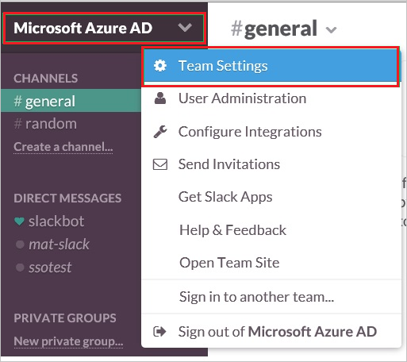
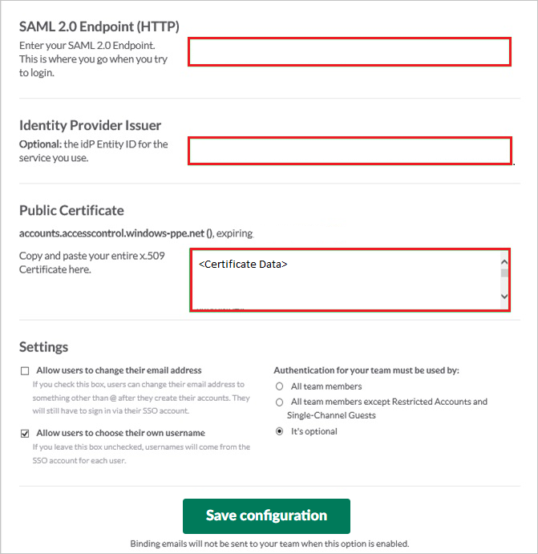
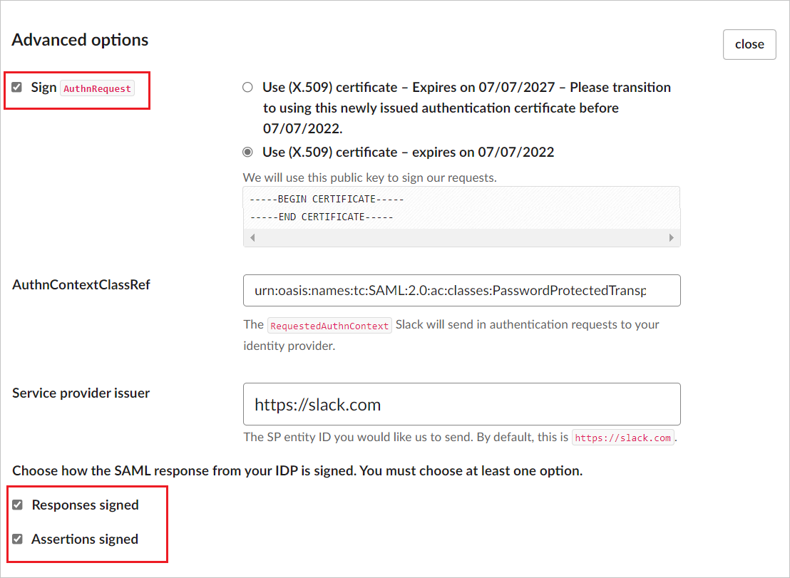
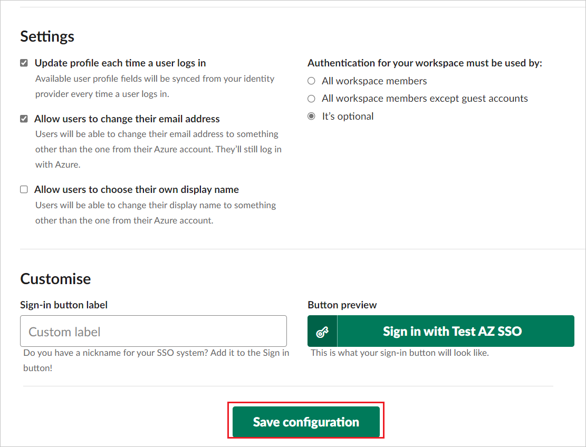

# Tutorial: Microsoft Entra SSO integration with Slack

In this tutorial, you'll learn how to integrate Slack with Microsoft Entra ID. When you integrate Slack with Microsoft Entra ID, you can:

* Control in Microsoft Entra ID who has access to Slack.
* Enable your users to be automatically signed-in to Slack with their Microsoft Entra accounts.
* Manage your accounts in one central location.

## Prerequisites

To get started, you need the following items:

* A Microsoft Entra subscription. If you don't have a subscription, you can get a [free account](https://azure.microsoft.com/free/).
* Slack single sign-on (SSO) enabled subscription.

> [!NOTE]
> If you need to integrate with more than one Slack instance in one tenant, the identifier for each application can be a variable.

> [!NOTE]
> This integration is also available to use from Microsoft Entra US Government Cloud environment. You can find this application in the Microsoft Entra US Government Cloud Application Gallery and configure it in the same way as you do from public cloud.

## Scenario description

In this tutorial, you configure and test Microsoft Entra SSO in a test environment.

* Slack supports **SP (service provider)** initiated SSO.
* Slack supports **Just In Time** user provisioning.
* Slack supports [**Automated** user provisioning](./slack-provisioning-tutorial.md).

> [!NOTE]
> Identifier of this application is a fixed string value so only one instance can be configured in one tenant.

## Adding Slack from the gallery

To configure the integration of Slack into Microsoft Entra ID, you need to add Slack from the gallery to your list of managed SaaS apps.

1. Sign in to the [Microsoft Entra admin center](https://entra.microsoft.com) as at least a [Cloud Application Administrator](../roles/permissions-reference.md#cloud-application-administrator).
1. Browse to **Identity** > **Applications** > **Enterprise applications** > **New application**.
1. In the **Add from the gallery** section, type **Slack** in the search box.
1. Select **Slack** from results panel and then add the app. Wait a few seconds while the app is added to your tenant.

Alternatively, you can also use the [Enterprise App Configuration Wizard](https://portal.office.com/AdminPortal/home?Q=Docs#/azureadappintegration). In this wizard, you can add an application to your tenant, add users/groups to the app, assign roles, as well as walk through the SSO configuration as well. You can learn more about O365 wizards [here](/microsoft-365/admin/misc/azure-ad-setup-guides?view=o365-worldwide&preserve-view=true).

## Configure and test Microsoft Entra SSO for Slack

Configure and test Microsoft Entra SSO with Slack using a test user called **B.Simon**. For SSO to work, you need to establish a link relationship between a Microsoft Entra user and the related user in Slack.

To configure and test Microsoft Entra SSO with Slack, perform the following steps:

1. **[Configure Microsoft Entra SSO](#configure-azure-ad-sso)** - to enable your users to use this feature.
	1. **[Create a Microsoft Entra test user](#create-an-azure-ad-test-user)** - to test Microsoft Entra single sign-on with B.Simon.
	1. **[Assign the Microsoft Entra test user](#assign-the-azure-ad-test-user)** - to enable B.Simon to use Microsoft Entra single sign-on.
1. **[Configure Slack SSO](#configure-slack-sso)** - to configure the single sign-on settings on application side.
	1. **[Create Slack test user](#create-slack-test-user)** - to have a counterpart of B.Simon in Slack that is linked to the Microsoft Entra representation of user.
1. **[Test SSO](#test-sso)** - to verify whether the configuration works.

### Configure Microsoft Entra SSO

Follow these steps to enable Microsoft Entra SSO.

1. Sign in to the [Microsoft Entra admin center](https://entra.microsoft.com) as at least a [Cloud Application Administrator](../roles/permissions-reference.md#cloud-application-administrator).
1. Browse to **Identity** > **Applications** > **Enterprise applications** > **Slack** > **Single sign-on**.
1. On the **Select a single sign-on method** page, select **SAML**.
1. On the **Set up single sign-on with SAML** page, click the edit/pen icon for **Basic SAML Configuration** to edit the settings.

   

1. On the **Basic SAML Configuration** section, enter the values for the following fields:

    a. In the **Sign on URL** text box, type a URL using the following pattern:
    `https://<DOMAIN NAME>.slack.com/sso/saml/start`

    b. In the **Identifier (Entity ID)** text box, type the URL:
    `https://slack.com`
	
    c. For **Reply URL**, enter one of the following URL patterns:
    
	| Reply URL|
	|----------|
	| `https://<DOMAIN NAME>.slack.com/sso/saml` |
	| `https://<DOMAIN NAME>.enterprise.slack.com/sso/saml` |

	> [!NOTE]
	> These values aren't real. You need to update these values with the actual Sign-on URL and Reply URL. Contact [Slack Client support team](https://slack.com/help/contact) to get the value. You can also refer to the patterns shown in the **Basic SAML Configuration** section.

	> [!NOTE]
	> The value for **Identifier (Entity ID)** can be a variable if you have more than one Slack instance that you need to integrate with the tenant. Use the pattern `https://<DOMAIN NAME>.slack.com`. In this scenario, you also must pair with another setting in Slack by using the same value.

1. Slack application expects the SAML assertions in a specific format, which requires you to add custom attribute mappings to your SAML token attributes configuration. The following screenshot shows the list of default attributes.

	

1. In addition to above, Slack application expects few more attributes to be passed back in SAML response which are shown below. These attributes are also pre populated but you can review them as per your requirements. You also must add the `email` attribute. If the user does not have an email address, map **emailaddress** to **user.userprincipalname** and map **email** to **user.userprincipalname**.

    | Name | Source Attribute |
    | -----|---------|
    | emailaddress | user.userprincipalname |
    | email | user.userprincipalname |

1. On the **Set up single sign-on with SAML** page, in the **SAML Signing Certificate** section,  find **Certificate (Base64)** and select **Download** to download the certificate and save it on your computer.

	

1. On the **Set up Slack** section, copy the appropriate URL(s) based on your requirement.

	

### Create a Microsoft Entra test user

In this section, you'll create a test user called B.Simon.

1. Sign in to the [Microsoft Entra admin center](https://entra.microsoft.com) as at least a [User Administrator](../roles/permissions-reference.md#user-administrator).
1. Browse to **Identity** > **Users** > **All users**.
1. Select **New user** > **Create new user**, at the top of the screen.
1. In the **User** properties, follow these steps:
   1. In the **Display name** field, enter `B.Simon`.  
   1. In the **User principal name** field, enter the username@companydomain.extension. For example, `B.Simon@contoso.com`.
   1. Select the **Show password** check box, and then write down the value that's displayed in the **Password** box.
   1. Select **Review + create**.
1. Select **Create**.

### Assign the Microsoft Entra test user

In this section, you'll enable B.Simon to use single sign-on by granting access to Slack.

1. Sign in to the [Microsoft Entra admin center](https://entra.microsoft.com) as at least a [Cloud Application Administrator](../roles/permissions-reference.md#cloud-application-administrator).
1. Browse to **Identity** > **Applications** > **Enterprise applications** > **Slack**.
1. In the app's overview page, find the **Manage** section and select **Users and groups**.

1. Select **Add user**, then select **Users and groups** in the **Add Assignment** dialog.

1. In the **Users and groups** dialog, select **B.Simon** from the Users list, then click the **Select** button at the bottom of the screen.
1. If you are expecting a role to be assigned to the users, you can select it from the **Select a role** dropdown. If no role has been set up for this app, you see "Default Access" role selected.
1. In the **Add Assignment** dialog, click the **Assign** button.

## Configure Slack SSO

1. In a different web browser window, sign in to your up Slack company site as an administrator

2. click on your workspace name in the top left, then go to **Settings & administration** -> **Workspace settings**.

     

3. In the **Settings & permissions** section, click the **Authentication** tab, and then click **Configure** button at SAML authentication method.

    

4. On the **Configure SAML authentication for Azure** dialog, perform the below steps:

    

    a. In the top right, toggle **Test** mode on.
    
    b.  In the **SAML SSO URL** textbox, paste the value of **Login URL**.

    c.  In the **Identity provider issuer** textbox, paste the value of **Microsoft Entra Identifier**.

    d.  Open your downloaded certificate file in Notepad, copy the content of it into your clipboard, and then paste it to the **Public Certificate** textbox.

1. Expand the **Advanced options** and perform the below steps:

    

    a. If you need an end-to-end encryption key, tick the box **Sign AuthnRequest** to show the certificate.

    b. Enter `https://slack.com` in the **Service provider issuer** textbox.

    c. Choose how the SAML response from your IDP is signed from the two options.

   > [!NOTE]
   > In order to set up the service provider (SP) configuration, you must click on **Expand** next to **Advanced Options** in the SAML configuration page. In the **Service Provider Issuer** box, enter the workspace URL. The default is slack.com. 

1. Under **Settings**, decide if members can edit their profile information (like their email or display name) after SSO is enabled. You can also choose whether SSO is required, partially required or optional.

    

1. Click **Save Configuration**.
    
    > [!NOTE]
    > If you have more than one Slack instance that you need to integrate with Microsoft Entra ID, set `https://<DOMAIN NAME>.slack.com` to **Service provider issuer** so that it can pair with the Azure application **Identifier** setting.

### Create Slack test user

The objective of this section is to create a user called B.Simon in Slack. Slack supports just-in-time provisioning, which is by default enabled. There is no action item for you in this section. A new user is created during an attempt to access Slack if it doesn't exist yet. Slack also supports automatic user provisioning, you can find more details [here](slack-provisioning-tutorial.md) on how to configure automatic user provisioning.

> [!NOTE]
> If you need to create a user manually, you need to contact [Slack support team](https://slack.com/help/contact).

> [!NOTE]
> Microsoft Entra Connect is the synchronization tool which can sync on premises Active Directory Identities to Microsoft Entra ID and then these synced users can also use the applications as like other cloud users.

## Test SSO

In this section, you test your Microsoft Entra single sign-on configuration with following options.

* Click on **Test this application**, this will redirect to Slack Sign-on URL where you can initiate the login flow.

* Go to Slack Sign-on URL directly and initiate the login flow from there.

* You can use Microsoft My Apps. When you click the Slack tile in the My Apps, this will redirect to Slack Sign-on URL. For more information about the My Apps, see [Introduction to the My Apps](https://support.microsoft.com/account-billing/sign-in-and-start-apps-from-the-my-apps-portal-2f3b1bae-0e5a-4a86-a33e-876fbd2a4510).

## Next steps

Once you configure Slack you can enforce Session control, which protects exfiltration and infiltration of your organization’s sensitive data in real time. Session control extends from Conditional Access. [Learn how to enforce session control with Microsoft Defender for Cloud Apps](/cloud-app-security/proxy-deployment-aad).
