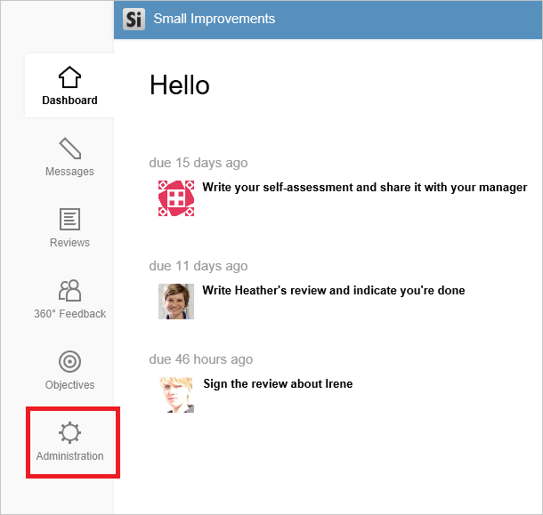
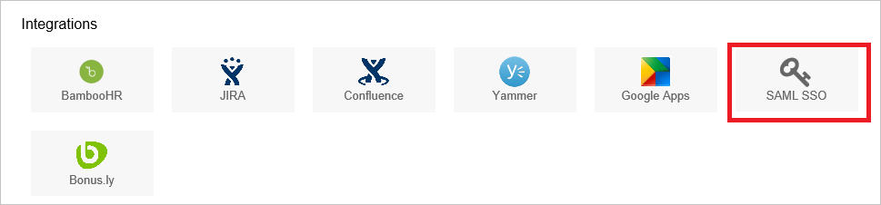
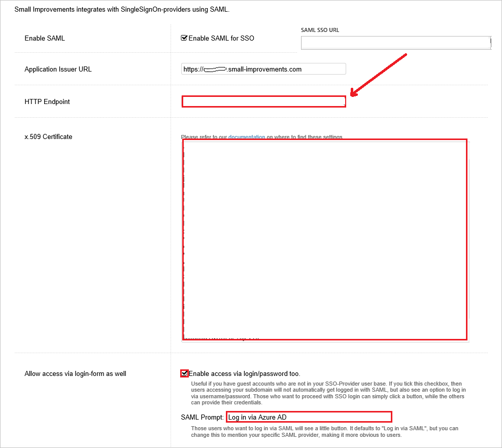
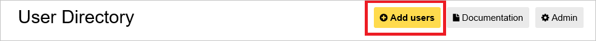
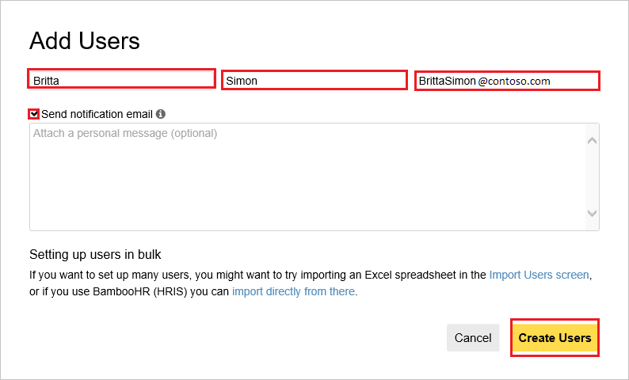

# Tutorial: Azure AD SSO integration with Small Improvements

In this tutorial, you'll learn how to integrate Small Improvements with Azure Active Directory (Azure AD). When you integrate Small Improvements with Azure AD, you can:

* Control in Azure AD who has access to Small Improvements.
* Enable your users to be automatically signed-in to Small Improvements with their Azure AD accounts.
* Manage your accounts in one central location - the Azure portal.

## Prerequisites

To get started, you need the following items:

* An Azure AD subscription. If you don't have a subscription, you can get a [free account](https://azure.microsoft.com/free/).
* Small Improvements single sign-on (SSO) enabled subscription.

## Scenario description

In this tutorial, you configure and test Azure AD single sign-on in a test environment.

* Small Improvements supports **SP** initiated SSO.

## Add Small Improvements from the gallery

To configure the integration of Small Improvements into Azure AD, you need to add Small Improvements from the gallery to your list of managed SaaS apps.

1. Sign in to the Azure portal using either a work or school account, or a personal Microsoft account.
1. On the left navigation pane, select the **Azure Active Directory** service.
1. Navigate to **Enterprise Applications** and then select **All Applications**.
1. To add new application, select **New application**.
1. In the **Add from the gallery** section, type **Small Improvements** in the search box.
1. Select **Small Improvements** from results panel and then add the app. Wait a few seconds while the app is added to your tenant.

 Alternatively, you can also use the [Enterprise App Configuration Wizard](https://portal.office.com/AdminPortal/home?Q=Docs#/azureadappintegration). In this wizard, you can add an application to your tenant, add users/groups to the app, assign roles, as well as walk through the SSO configuration as well. [Learn more about Microsoft 365 wizards.](/microsoft-365/admin/misc/azure-ad-setup-guides)

## Configure and test Azure AD SSO for Small Improvements

Configure and test Azure AD SSO with Small Improvements using a test user called **B.Simon**. For SSO to work, you need to establish a link relationship between an Azure AD user and the related user in Small Improvements.

To configure and test Azure AD SSO with Small Improvements, perform the following steps:

1. **[Configure Azure AD SSO](#configure-azure-ad-sso)** - to enable your users to use this feature.
    1. **[Create an Azure AD test user](#create-an-azure-ad-test-user)** - to test Azure AD single sign-on with B.Simon.
    1. **[Assign the Azure AD test user](#assign-the-azure-ad-test-user)** - to enable B.Simon to use Azure AD single sign-on.
1. **[Configure Small Improvements SSO](#configure-small-improvements-sso)** - to configure the single sign-on settings on application side.
    1. **[Create Small Improvements test user](#create-small-improvements-test-user)** - to have a counterpart of B.Simon in Small Improvements that is linked to the Azure AD representation of user.
1. **[Test SSO](#test-sso)** - to verify whether the configuration works.

## Configure Azure AD SSO

Follow these steps to enable Azure AD SSO in the Azure portal.

1. In the Azure portal, on the **Small Improvements** application integration page, find the **Manage** section and select **single sign-on**.
1. On the **Select a single sign-on method** page, select **SAML**.
1. On the **Set up single sign-on with SAML** page, click the pencil icon for **Basic SAML Configuration** to edit the settings.

   

4. On the **Basic SAML Configuration** section, perform the following steps:

    a. In the **Identifier (Entity ID)** text box, type a URL using the following pattern:
    `https://<subdomain>.small-improvements.com`

    b. In the **Sign on URL** text box, type a URL using the following pattern:
    `https://<subdomain>.small-improvements.com`

	> [!NOTE]
	> These values are not real. Update these values with the actual Identifier and Sign on URL. Contact [Small Improvements Client support team](mailto:support@small-improvements.com) to get these values. You can also refer to the patterns shown in the **Basic SAML Configuration** section in the Azure portal.

5. On the **Set up Single Sign-On with SAML** page, in the **SAML Signing Certificate** section, click **Download** to download the **Certificate (Base64)** from the given options as per your requirement and save it on your computer.

	

6. On the **Set up Small Improvements** section, copy the appropriate URL(s) as per your requirement.

	

### Create an Azure AD test user

In this section, you'll create a test user in the Azure portal called B.Simon.

1. From the left pane in the Azure portal, select **Azure Active Directory**, select **Users**, and then select **All users**.
1. Select **New user** at the top of the screen.
1. In the **User** properties, follow these steps:
   1. In the **Name** field, enter `B.Simon`.  
   1. In the **User name** field, enter the username@companydomain.extension. For example, `B.Simon@contoso.com`.
   1. Select the **Show password** check box, and then write down the value that's displayed in the **Password** box.
   1. Click **Create**.

### Assign the Azure AD test user

In this section, you'll enable B.Simon to use Azure single sign-on by granting access to Small Improvements.

1. In the Azure portal, select **Enterprise Applications**, and then select **All applications**.
1. In the applications list, select **Small Improvements**.
1. In the app's overview page, find the **Manage** section and select **Users and groups**.
1. Select **Add user**, then select **Users and groups** in the **Add Assignment** dialog.
1. In the **Users and groups** dialog, select **B.Simon** from the Users list, then click the **Select** button at the bottom of the screen.
1. If you are expecting a role to be assigned to the users, you can select it from the **Select a role** dropdown. If no role has been set up for this app, you see "Default Access" role selected.
1. In the **Add Assignment** dialog, click the **Assign** button.

## Configure Small Improvements SSO

1. In another browser window, sign on to your Small Improvements company site as an administrator.

1. From the main dashboard page, click **Administration** button on the left.

     

1. Click the **SAML SSO** button from **Integrations** section.

     

1. On the SSO Setup page, perform the following steps:

      

    a. In the **HTTP Endpoint** textbox, paste the value of **Login URL**, which you have copied from Azure portal.

    b. Open your downloaded certificate in Notepad, copy the content, and then paste it into the **x509 Certificate** textbox. 

    c. If you wish to have SSO and Login form authentication option available for users, then check the **Enable access via login/password too** option.  

    d. Enter the appropriate value to Name the SSO Login button in the **SAML Prompt** textbox.  

    e. Click **Save**.

### Create Small Improvements test user

To enable Azure AD users to log in to Small Improvements, they must be provisioned into Small Improvements. In the case of Small Improvements, provisioning is a manual task.

**To provision a user account, perform the following steps:**

1. Sign-on to your Small Improvements company site as an administrator.

1. From the Home page, go to the menu on the left, click **Administration**.

1. Click the **User Directory** button from User Management section.

     

1. Click **Add users**.

     

1. On the **Add Users** dialog, perform the following steps: 

    

	a. Enter the **first name** of user like **Britta**.

    b. Enter the **Last name** of user like **Simon**.

    c. Enter the **Email** of user like **brittasimon@contoso.com**.

    d. You can also choose to enter the personal message in the **Send notification email** box. If you do not wish to send the notification, then uncheck this checkbox.

    e. Click **Create Users**.

## Test SSO

In this section, you test your Azure AD single sign-on configuration with following options. 

* Click on **Test this application** in Azure portal. This will redirect to Small Improvements Sign-on URL where you can initiate the login flow. 

* Go to Small Improvements Sign-on URL directly and initiate the login flow from there.

* You can use Microsoft My Apps. When you click the Small Improvements tile in the My Apps, this will redirect to Small Improvements Sign-on URL. For more information about the My Apps, see [Introduction to the My Apps](../user-help/my-apps-portal-end-user-access.md).

## Next steps

Once you configure Small Improvements you can enforce session control, which protects exfiltration and infiltration of your organization’s sensitive data in real time. Session control extends from Conditional Access. [Learn how to enforce session control with Microsoft Defender for Cloud Apps](/cloud-app-security/proxy-deployment-aad).
