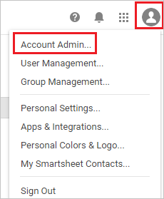
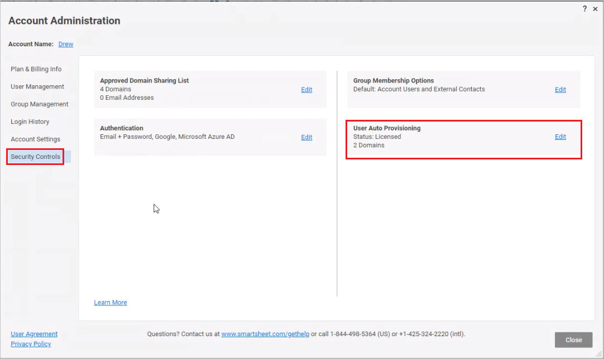
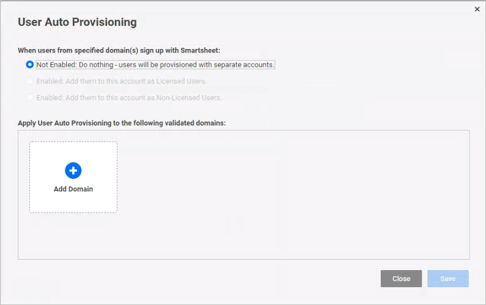
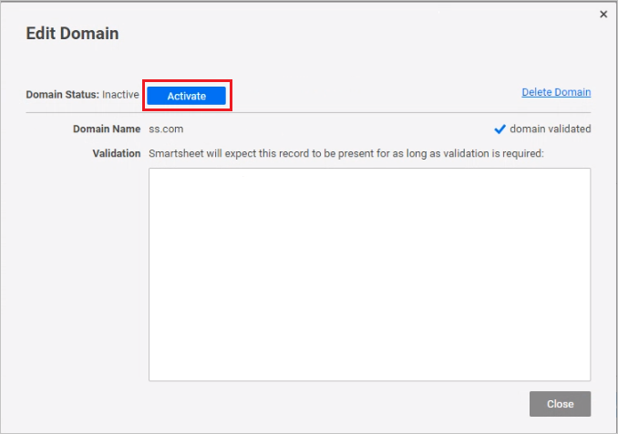
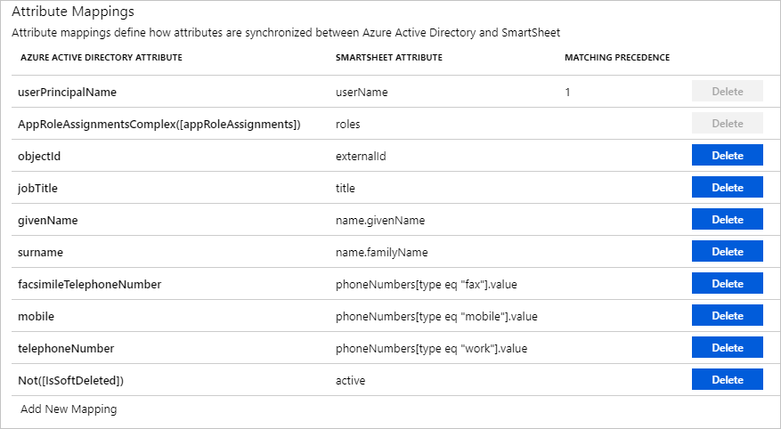

# Tutorial: Configure Smartsheet for automatic user provisioning

The objective of this tutorial is to demonstrate the steps to be performed in Smartsheet and Azure Active Directory (Azure AD) to configure Azure AD to automatically provision and de-provision users and/or groups to Smartsheet.

> [!NOTE]
> This tutorial describes a connector built on top of the Azure AD User Provisioning Service. For important details on what this service does, how it works, and frequently asked questions, see [Automate user provisioning and deprovisioning to SaaS applications with Azure Active Directory](../manage-apps/user-provisioning.md).
>
> This connector is currently in Public Preview. For more information on the general Microsoft Azure terms of use for Preview features, see [Supplemental Terms of Use for Microsoft Azure Previews](https://azure.microsoft.com/support/legal/preview-supplemental-terms/).

## Prerequisites

The scenario outlined in this tutorial assumes that you already have the following prerequisites:

* An Azure AD tenant
* [A Smartsheet tenant](https://www.smartsheet.com/pricing)
* A user account on a Smartsheet Enterprise or Enterprise Premier plan with System Administrator permissions.

## Assign users to Smartsheet

Azure Active Directory uses a concept called *assignments* to determine which users should receive access to selected apps. In the context of automatic user provisioning, only the users and/or groups that have been assigned to an application in Azure AD are synchronized.

Before configuring and enabling automatic user provisioning, you should decide which users and/or groups in Azure AD need access to Smartsheet. Once decided, you can assign these users and/or groups to Smartsheet by following the instructions here:

* [Assign a user or group to an enterprise app](../manage-apps/assign-user-or-group-access-portal.md)

### Important tips for assigning users to Smartsheet

* It is recommended that a single Azure AD user is assigned to Smartsheet to test the automatic user provisioning configuration. Additional users and/or groups may be assigned later.

* When assigning a user to Smartsheet, you must select any valid application-specific role (if available) in the assignment dialog. Users with the **Default Access** role are excluded from provisioning.

* To ensure parity in user role assignments between Smartsheet and Azure AD, it is recommended to utilize the same role assignments populated in the full Smartsheet user list. To retrieve this user list from Smartsheet, navigate to **Account Admin > User Management > More Actions > Download User List (csv)**.

* To access certain features in the app, Smartsheet requires a user to have multiple roles. To learn more about user types and permissions in Smartsheet, go to [User Types and Permissions](https://help.smartsheet.com/learning-track/shared-users/user-types-and-permissions).

*  If a user has multiple roles assigned in Smartsheet, you **MUST** ensure that these role assignments are replicated in Azure AD to avoid a scenario where users could lose access to Smartsheet objects permanently. Each unique role in Smartsheet **MUST** be assigned to a different group in Azure AD. The user **MUST** then be added to each of the groups corresponding to roles desired. 

## Set up Smartsheet for provisioning

Before configuring Smartsheet for automatic user provisioning with Azure AD, you will need to enable SCIM provisioning on Smartsheet.

1. Sign in as a **SysAdmin** in the **[Smartsheet portal](https://app.smartsheet.com/b/home)** and navigate to **Account Admin**.

	

2. Go to **Security Controls > User Auto Provisioning > Edit**.

	

3. Add and validate the email domains for the users that you plan to provision from Azure AD to Smartsheet. Choose **Not Enabled** to ensure that all provisioning actions only originate from Azure AD, and to also ensure that your Smartsheet user list is in sync with Azure AD assignments.

	

4. Once validation is complete, you will have to activate the domain. 

	

5. Generate the **Secret Token** required to configure automatic user provisioning with Azure AD by navigating to **Apps and Integrations**.

	

6. Choose **API Access**. Click **Generate new access token**.

	

7. Define the name of the API Access Token. Click **OK**.

	

8. Copy the API Access Token and save it as this will be the only time you can view it. This is required in the **Secret Token** field in Azure AD.

	

## Add Smartsheet from the gallery

To configure Smartsheet for automatic user provisioning with Azure AD, you need to add Smartsheet from the Azure AD application gallery to your list of managed SaaS applications.

1. In the **[Azure portal](https://portal.azure.com)**, in the left navigation panel, select **Azure Active Directory**.

	

2. Go to **Enterprise applications**, and then select **All applications**.

	

3. To add a new application, select the **New application** button at the top of the pane.

	

4. In the search box, enter **Smartsheet**, select **Smartsheet** in the results panel. 

	

5. Select the **Sign-up for Smartsheet** button which will redirect you to Smartsheet's login page. 

	

6. As Smartsheet is an OpenIDConnect app, choose to login to Smartsheet using your Microsoft work account.

	

7. After a successful authentication, accept the consent prompt for the consent page. The application will then be automatically added to your tenant and you will be redirected to your Smartsheet account.

	

## Configure automatic user provisioning to Smartsheet 

This section guides you through the steps to configure the Azure AD provisioning service to create, update, and disable users and/or groups in Smartsheet based on user and/or group assignments in Azure AD.

### To configure automatic user provisioning for Smartsheet in Azure AD:

1. Sign in to the [Azure portal](https://portal.azure.com). Select **Enterprise Applications**, then select **All applications**.

	

2. In the applications list, select **Smartsheet**.

	

3. Select the **Provisioning** tab.

	

4. Set the **Provisioning Mode** to **Automatic**.

	

5. Under the **Admin Credentials** section, input `https://scim.smartsheet.com/v2/` in **Tenant URL**. Input the value that you retrieved and saved earlier from Smartsheet in **Secret Token**. Click **Test Connection** to ensure Azure AD can connect to Smartsheet. If the connection fails, ensure your Smartsheet account has SysAdmin permissions and try again.

	

6. In the **Notification Email** field, enter the email address of a person or group who should receive the provisioning error notifications and check the checkbox - **Send an email notification when a failure occurs**.

	

7. Click **Save**.

8. Under the **Mappings** section, select **Synchronize Azure Active Directory Users to Smartsheet**.

	

9. Review the user attributes that are synchronized from Azure AD to Smartsheet in the **Attribute Mapping** section. The attributes selected as **Matching** properties are used to match the user accounts in Smartsheet for update operations. Select the **Save** button to commit any changes.

	

10. To configure scoping filters, refer to the following instructions provided in the [Scoping filter tutorial](../manage-apps/define-conditional-rules-for-provisioning-user-accounts.md).

11. To enable the Azure AD provisioning service for Smartsheet, change the **Provisioning Status** to **On** in the **Settings** section.

	

12. Define the users and/or groups that you would like to provision to Smartsheet by choosing the desired values in **Scope** in the **Settings** section.

	

13. When you are ready to provision, click **Save**.

	

This operation starts the initial synchronization of all users and/or groups defined in **Scope** in the **Settings** section. The initial sync takes longer to perform than subsequent syncs, which occur approximately every 40 minutes as long as the Azure AD provisioning service is running. You can use the **Synchronization Details** section to monitor progress and follow links to provisioning activity report, which describes all actions performed by the Azure AD provisioning service on Smartsheet.

For more information on how to read the Azure AD provisioning logs, see [Reporting on automatic user account provisioning](../manage-apps/check-status-user-account-provisioning.md).

## Connector limitations

* Smartsheet does not support soft-deletes. When a user's **active** attribute is set to False, Smartsheet deletes the user permanently.

## Additional resources

* [Managing user account provisioning for Enterprise Apps](../manage-apps/configure-automatic-user-provisioning-portal.md)
* [What is application access and single sign-on with Azure Active Directory?](../manage-apps/what-is-single-sign-on.md)

## Next steps

* [Learn how to review logs and get reports on provisioning activity](../manage-apps/check-status-user-account-provisioning.md)
