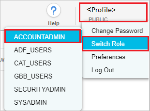
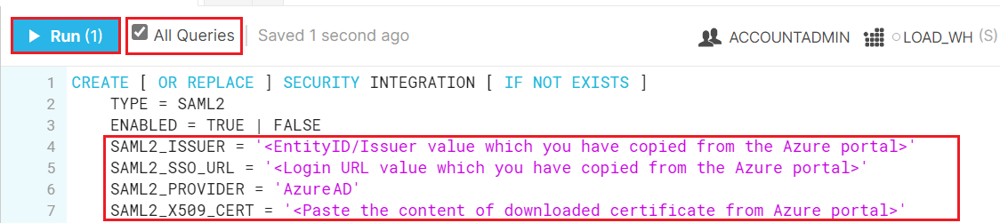
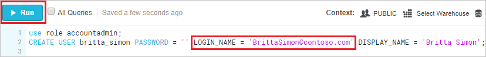

# Tutorial: Microsoft Entra SSO integration with Snowflake

In this tutorial, you'll learn how to integrate Snowflake with Microsoft Entra ID. When you integrate Snowflake with Microsoft Entra ID, you can:

* Control in Microsoft Entra ID who has access to Snowflake.
* Enable your users to be automatically signed-in to Snowflake with their Microsoft Entra accounts.
* Manage your accounts in one central location.

## Prerequisites

To configure Microsoft Entra integration with Snowflake, you need the following items:

* A Microsoft Entra subscription. If you don't have a Microsoft Entra environment, you can get a [free account](https://azure.microsoft.com/free/).
* Snowflake single sign-on enabled subscription.
* Along with Cloud Application Administrator, Application Administrator can also add or manage applications in Microsoft Entra ID.
For more information, see [Azure built-in roles](../roles/permissions-reference.md).

> [!NOTE]
> This integration is also available to use from Microsoft Entra US Government Cloud environment. You can find this application in the Microsoft Entra US Government Cloud Application Gallery and configure it in the same way as you do from public cloud.

## Scenario description

In this tutorial, you will configure and test Microsoft Entra single sign-on in a test environment.

* Snowflake supports **SP and IDP** initiated SSO.
* Snowflake supports [automated user provisioning and deprovisioning](snowflake-provisioning-tutorial.md) (recommended).

## Add Snowflake from the gallery

To configure the integration of Snowflake into Microsoft Entra ID, you need to add Snowflake from the gallery to your list of managed SaaS apps.

1. Sign in to the [Microsoft Entra admin center](https://entra.microsoft.com) as at least a [Cloud Application Administrator](../roles/permissions-reference.md#cloud-application-administrator).
1. Browse to **Identity** > **Applications** > **Enterprise applications** > **New application**.
1. In the **Add from the gallery** section, type **Snowflake** in the search box.
1. Select **Snowflake** from results panel and then add the app. Wait a few seconds while the app is added to your tenant.

 Alternatively, you can also use the [Enterprise App Configuration Wizard](https://portal.office.com/AdminPortal/home?Q=Docs#/azureadappintegration). In this wizard, you can add an application to your tenant, add users/groups to the app, assign roles, as well as walk through the SSO configuration as well. [Learn more about Microsoft 365 wizards.](/microsoft-365/admin/misc/azure-ad-setup-guides)

<a name='configure-and-test-azure-ad-sso-for-snowflake'></a>

## Configure and test Microsoft Entra SSO for Snowflake

Configure and test Microsoft Entra SSO with Snowflake using a test user called **B.Simon**. For SSO to work, you need to establish a link relationship between a Microsoft Entra user and the related user in Snowflake.

To configure and test Microsoft Entra SSO with Snowflake, perform the following steps:

1. **[Configure Microsoft Entra SSO](#configure-azure-ad-sso)** - to enable your users to use this feature.
	1. **[Create a Microsoft Entra test user](#create-an-azure-ad-test-user)** - to test Microsoft Entra single sign-on with B.Simon.
	1. **[Assign the Microsoft Entra test user](#assign-the-azure-ad-test-user)** - to enable B.Simon to use Microsoft Entra single sign-on.
1. **[Configure Snowflake SSO](#configure-snowflake-sso)** - to configure the single sign-on settings on application side.
	1. **[Create Snowflake test user](#create-snowflake-test-user)** - to have a counterpart of B.Simon in Snowflake that is linked to the Microsoft Entra representation of user.
1. **[Test SSO](#test-sso)** - to verify whether the configuration works.

<a name='configure-azure-ad-sso'></a>

## Configure Microsoft Entra SSO

Follow these steps to enable Microsoft Entra SSO.

1. Sign in to the [Microsoft Entra admin center](https://entra.microsoft.com) as at least a [Cloud Application Administrator](../roles/permissions-reference.md#cloud-application-administrator).
1. Browse to **Identity** > **Applications** > **Enterprise applications** > **Snowflake** > **Single sign-on**.
1. On the **Select a single sign-on method** page, select **SAML**.
1. On the **Set up single sign-on with SAML** page, click the pencil icon for **Basic SAML Configuration** to edit the settings.

   

1. In the **Basic SAML Configuration** section, perform the following steps, if you wish to configure the application in **IDP** initiated mode:

    a. In the **Identifier** text box, type a URL using the following pattern:
    `https://<SNOWFLAKE-URL>.snowflakecomputing.com`

    b. In the **Reply URL** text box, type a URL using the following pattern:
    `https://<SNOWFLAKE-URL>.snowflakecomputing.com/fed/login`

1. Click **Set additional URLs** and perform the following step if you wish to configure the application in **SP** initiated mode:

	a. In the **Sign-on URL** text box, type a URL using the following pattern:
    `https://<SNOWFLAKE-URL>.snowflakecomputing.com`
    
	b. In the **Logout URL** text box, type a URL using the following pattern:
    `https://<SNOWFLAKE-URL>.snowflakecomputing.com/fed/logout`

    > [!NOTE]
	> These values are not real. Update these values with the actual Identifier, Reply URL, Sign-on URL and Logout URL. Contact [Snowflake Client support team](https://support.snowflake.net/s/) to get these values. You can also refer to the patterns shown in the **Basic SAML Configuration** section.

1. On the **Set up Single Sign-On with SAML** page, in the **SAML Signing Certificate** section, click **Download** to download the **Certificate (Base64)** from the given options as per your requirement and save it on your computer.

	

1. On the **Set up Snowflake** section, copy the appropriate URL(s) as per your requirement.

	  

<a name='create-an-azure-ad-test-user'></a>

### Create a Microsoft Entra test user

In this section, you'll create a test user called B.Simon.

1. Sign in to the [Microsoft Entra admin center](https://entra.microsoft.com) as at least a [User Administrator](../roles/permissions-reference.md#user-administrator).
1. Browse to **Identity** > **Users** > **All users**.
1. Select **New user** > **Create new user**, at the top of the screen.
1. In the **User** properties, follow these steps:
   1. In the **Display name** field, enter `B.Simon`.  
   1. In the **User principal name** field, enter the username@companydomain.extension. For example, `B.Simon@contoso.com`.
   1. Select the **Show password** check box, and then write down the value that's displayed in the **Password** box.
   1. Select **Review + create**.
1. Select **Create**.

<a name='assign-the-azure-ad-test-user'></a>

### Assign the Microsoft Entra test user

In this section, you'll enable B.Simon to use single sign-on by granting access to Snowflake.

1. Sign in to the [Microsoft Entra admin center](https://entra.microsoft.com) as at least a [Cloud Application Administrator](../roles/permissions-reference.md#cloud-application-administrator).
1. Browse to **Identity** > **Applications** > **Enterprise applications** > **Snowflake**.
1. In the app's overview page, select **Users and groups**.
1. Select **Add user/group**, then select **Users and groups** in the **Add Assignment** dialog.
   1. In the **Users and groups** dialog, select **B.Simon** from the Users list, then click the **Select** button at the bottom of the screen.
   1. If you are expecting a role to be assigned to the users, you can select it from the **Select a role** dropdown. If no role has been set up for this app, you see "Default Access" role selected.
   1. In the **Add Assignment** dialog, click the **Assign** button.

## Configure Snowflake SSO

1. In a different web browser window, log in to Snowflake as a Security Administrator.

1. **Switch Role** to **ACCOUNTADMIN**, by clicking on **profile** on the top right side of page.

	> [!NOTE]
	> This is separate from the context you have selected in the top-right corner under your User Name.
    
	

1. Open the **downloaded Base 64 certificate** in notepad. Copy the value between “-----BEGIN CERTIFICATE-----” and “-----END CERTIFICATE-----" and paste this content into the **SAML2_X509_CERT**.

1. In the **SAML2_ISSUER**, paste **Identifier** value, which you copied previously.

1. In the **SAML2_SSO_URL**, paste **Login URL** value, which you copied previously.

1. In the **SAML2_PROVIDER**, give the value like `CUSTOM`.

1. Select the **All Queries** and click **Run**.

    

    ```
    CREATE [ OR REPLACE ] SECURITY INTEGRATION [ IF NOT EXISTS ]
    TYPE = SAML2
    ENABLED = TRUE | FALSE
    SAML2_ISSUER = '<EntityID/Issuer value which you have copied>'
    SAML2_SSO_URL = '<Login URL value which you have copied>'
    SAML2_PROVIDER = 'CUSTOM'
    SAML2_X509_CERT = '<Paste the content of downloaded certificate from Azure portal>'
    [ SAML2_SP_INITIATED_LOGIN_PAGE_LABEL = '<string_literal>' ]
    [ SAML2_ENABLE_SP_INITIATED = TRUE | FALSE ]
    [ SAML2_SNOWFLAKE_X509_CERT = '<string_literal>' ]
    [ SAML2_SIGN_REQUEST = TRUE | FALSE ]
    [ SAML2_REQUESTED_NAMEID_FORMAT = '<string_literal>' ]
    [ SAML2_POST_LOGOUT_REDIRECT_URL = '<string_literal>' ]
    [ SAML2_FORCE_AUTHN = TRUE | FALSE ]
    [ SAML2_SNOWFLAKE_ISSUER_URL = '<string_literal>' ]
    [ SAML2_SNOWFLAKE_ACS_URL = '<string_literal>' ]
    ```

If you are using a new Snowflake URL with an organization name as the login URL, it is necessary to update the following parameters:

Alter the integration to add Snowflake Issuer URL and SAML2 Snowflake ACS URL, please follow  the step-6 in [this](https://community.snowflake.com/s/article/HOW-TO-SETUP-SSO-WITH-ADFS-AND-THE-SNOWFLAKE-NEW-URL-FORMAT-OR-PRIVATELINK) article for more information.

1. [ SAML2_SNOWFLAKE_ISSUER_URL = '<string_literal>' ] 

    alter security integration `<your security integration name goes here>` set SAML2_SNOWFLAKE_ISSUER_URL = `https://<organization_name>-<account name>.snowflakecomputing.com`;

2. [ SAML2_SNOWFLAKE_ACS_URL = '<string_literal>' ]

    alter security integration `<your security integration name goes here>` set SAML2_SNOWFLAKE_ACS_URL = `https://<organization_name>-<account name>.snowflakecomputing.com/fed/login`;

> [!NOTE]
> Please follow [this](https://docs.snowflake.com/en/sql-reference/sql/create-security-integration.html) guide to know more about how to create a SAML2 security integration.

> [!NOTE]
> If you have an existing SSO setup using `saml_identity_provider` account parameter, then follow [this](https://docs.snowflake.com/en/user-guide/admin-security-fed-auth-advanced.html) guide to migrate it to the SAML2 security integration.

### Create Snowflake test user

To enable Microsoft Entra users to log in to Snowflake, they must be provisioned into Snowflake. In Snowflake, provisioning is a manual task.

**To provision a user account, perform the following steps:**

1. Log in to Snowflake as a Security Administrator.

2. **Switch Role** to **ACCOUNTADMIN**, by clicking on **profile** on the top right side of page.  

	

3. Create the user by running the below SQL query, ensuring "Login name" is set to the Microsoft Entra username on the worksheet as shown below.

	

    ```
	use role accountadmin;
	CREATE USER britta_simon PASSWORD = '' LOGIN_NAME = 'BrittaSimon@contoso.com' DISPLAY_NAME = 'Britta Simon';
    ```
> [!NOTE]
> Manually provisioning is unnecessary, if users and groups are provisioned with a SCIM integration. See how to enable auto provisioning for [Snowflake](snowflake-provisioning-tutorial.md).

## Test SSO 

In this section, you test your Microsoft Entra single sign-on configuration with following options. 

#### SP initiated:

* Click on **Test this application**, this will redirect to Snowflake Sign-on URL where you can initiate the login flow.  

* Go to Snowflake Sign-on URL directly and initiate the login flow from there.

#### IDP initiated:

* Click on **Test this application**, and you should be automatically signed in to the Snowflake for which you set up the SSO. 

You can also use Microsoft My Apps to test the application in any mode. When you click the Snowflake tile in the My Apps, if configured in SP mode you would be redirected to the application sign-on page for initiating the login flow and if configured in IDP mode, you should be automatically signed in to the Snowflake for which you set up the SSO. For more information, see [Microsoft Entra My Apps](/azure/active-directory/manage-apps/end-user-experiences#azure-ad-my-apps).

## Next steps

Once you configure Snowflake you can enforce Session control, which protects exfiltration and infiltration of your organization’s sensitive data in real time. Session control extends from Conditional Access. [Learn how to enforce session control with Microsoft Defender for Cloud Apps](/cloud-app-security/proxy-deployment-aad).
