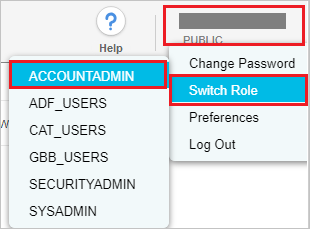
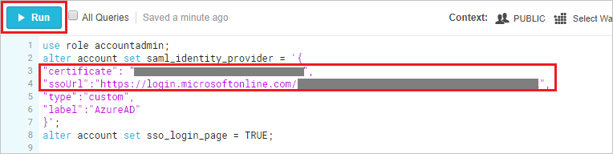

# Tutorial: Azure Active Directory integration with Snowflake

In this tutorial, you'll learn how to integrate Snowflake with Azure Active Directory (Azure AD). When you integrate Snowflake with Azure AD, you can:

* Control in Azure AD who has access to Snowflake.
* Enable your users to be automatically signed-in to Snowflake with their Azure AD accounts.
* Manage your accounts in one central location - the Azure portal.

## Prerequisites

To configure Azure AD integration with Snowflake, you need the following items:

* An Azure AD subscription. If you don't have an Azure AD environment, you can get one-month trial [here](https://azure.microsoft.com/pricing/free-trial/)
* Snowflake single sign-on enabled subscription

## Scenario description

In this tutorial, you will configure and test Azure AD single sign-on in a test environment.

- Snowflake supports **SP and IDP** initiated SSO
- Snowflake supports [Automated user provisioning and deprovisioning](snowflake-provisioning-tutorial.md) (recommended)

## Adding Snowflake from the gallery

To configure the integration of Snowflake into Azure AD, you need to add Snowflake from the gallery to your list of managed SaaS apps.

1. Sign in to the Azure portal using either a work or school account, or a personal Microsoft account.
1. On the left navigation pane, select the **Azure Active Directory** service.
1. Navigate to **Enterprise Applications** and then select **All Applications**.
1. To add new application, select **New application**.
1. In the **Add from the gallery** section, type **Snowflake** in the search box.
1. Select **Snowflake** from results panel and then add the app. Wait a few seconds while the app is added to your tenant.

## Configure and test Azure AD SSO for Snowflake

Configure and test Azure AD SSO with Snowflake using a test user called **B.Simon**. For SSO to work, you need to establish a link relationship between an Azure AD user and the related user in Snowflake.

To configure and test Azure AD SSO with Snowflake, complete the following building blocks:

1. **[Configure Azure AD SSO](#configure-azure-ad-sso)** - to enable your users to use this feature.
	1. **[Create an Azure AD test user](#create-an-azure-ad-test-user)** - to test Azure AD single sign-on with B.Simon.
	1. **[Assign the Azure AD test user](#assign-the-azure-ad-test-user)** - to enable B.Simon to use Azure AD single sign-on.
1. **[Configure Snowflake SSO](#configure-snowflake-sso)** - to configure the single sign-on settings on application side.
	1. **[Create Snowflake test user](#create-snowflake-test-user)** - to have a counterpart of B.Simon in Snowflake that is linked to the Azure AD representation of user.
1. **[Test SSO](#test-sso)** - to verify whether the configuration works.

### Configure Azure AD SSO

Follow these steps to enable Azure AD SSO in the Azure portal.

1. In the Azure portal, on the **Snowflake** application integration page, find the **Manage** section and select **single sign-on**.
1. On the **Select a single sign-on method** page, select **SAML**.
1. On the **Set up single sign-on with SAML** page, click the pencil icon for **Basic SAML Configuration** to edit the settings.

   

4. In the **Basic SAML Configuration** section, perform the following steps, if you wish to configure the application in **IDP** initiated mode:

    a. In the **Identifier** text box, type a URL using the following pattern:
    `https://<SNOWFLAKE-URL>.snowflakecomputing.com`

    b. In the **Reply URL** text box, type a URL using the following pattern:
    `https://<SNOWFLAKE-URL>.snowflakecomputing.com/fed/login`

1. Click **Set additional URLs** and perform the following step if you wish to configure the application in SP initiated mode:

	a. In the **Sign-on URL** text box, type a URL using the following pattern:
    `https://<SNOWFLAKE-URL>.snowflakecomputing.com`
    
	b. In the **Logout URL** text box, type a URL using the following pattern:
    `https://<SNOWFLAKE-URL>.snowflakecomputing.com/fed/logout`

    > [!NOTE]
	> These values are not real. Update these values with the actual Identifier, Reply URL and Sign-on URL. Contact [Snowflake Client support team](https://support.snowflake.net/s/) to get these values. You can also refer to the patterns shown in the **Basic SAML Configuration** section in the Azure portal.

4. On the **Set up Single Sign-On with SAML** page, in the **SAML Signing Certificate** section, click **Download** to download the **Certificate (Base64)** from the given options as per your requirement and save it on your computer.

	

6. On the **Set up Snowflake** section, copy the appropriate URL(s) as per your requirement.

	


### Create an Azure AD test user

In this section, you'll create a test user in the Azure portal called B.Simon.

1. From the left pane in the Azure portal, select **Azure Active Directory**, select **Users**, and then select **All users**.
1. Select **New user** at the top of the screen.
1. In the **User** properties, follow these steps:
   1. In the **Name** field, enter `B.Simon`.  
   1. In the **User name** field, enter the username@companydomain.extension. For example, `B.Simon@contoso.com`.
   1. Select the **Show password** check box, and then write down the value that's displayed in the **Password** box.
   1. Click **Create**.

### Assign the Azure AD test user

In this section, you'll enable B.Simon to use Azure single sign-on by granting access to Snowflake.

1. In the Azure portal, select **Enterprise Applications**, and then select **All applications**.
1. In the applications list, select **Snowflake**.
1. In the app's overview page, find the **Manage** section and select **Users and groups**.
1. Select **Add user**, then select **Users and groups** in the **Add Assignment** dialog.
1. In the **Users and groups** dialog, select **B.Simon** from the Users list, then click the **Select** button at the bottom of the screen.
1. If you are expecting a role to be assigned to the users, you can select it from the **Select a role** dropdown. If no role has been set up for this app, you see "Default Access" role selected.
1. In the **Add Assignment** dialog, click the **Assign** button.

## Configure Snowflake SSO

1. In a different web browser window, login to Snowflake as a Security Administrator.

1. **Switch Role** to **ACCOUNTADMIN**, by clicking on **profile** on the top right side of page.

	> [!NOTE]
	> This is separate from the context you have selected in the top-right corner under your User Name.
    
	

1. Open the **downloaded Base 64 certificate** in notepad. Copy the value between “-----BEGIN CERTIFICATE-----” and “-----END CERTIFICATE-----" and paste this into the quotation marks next to **certificate** below. In the **ssoUrl**, paste **Login URL** value which you have copied from the Azure portal. Select the **All Queries** and click **Run**.

   

   ```
   use role accountadmin;
   alter account set saml_identity_provider = '{
   "certificate": "<Paste the content of downloaded certificate from Azure portal>",
   "ssoUrl":"<Login URL value which you have copied from the Azure portal>",
   "type":"custom",
   "label":"AzureAD"
   }';
   alter account set sso_login_page = TRUE;
   ```


### Create Snowflake test user

To enable Azure AD users to log in to Snowflake, they must be provisioned into Snowflake. In Snowflake, provisioning is a manual task.

**To provision a user account, perform the following steps:**

1. Log in to Snowflake as a Security Administrator.

2. **Switch Role** to **ACCOUNTADMIN**, by clicking on **profile** on the top right side of page.  

	

3. Create the user by running the below SQL query, ensuring "Login name" is set to the Azure AD username on the worksheet as shown below.

	

    ```
	use role accountadmin;
	CREATE USER britta_simon PASSWORD = '' LOGIN_NAME = 'BrittaSimon@contoso.com' DISPLAY_NAME = 'Britta Simon';
    ```

### Test SSO 

In this section, you test your Azure AD single sign-on configuration with following options. 

#### SP initiated:

* Click on **Test this application** in Azure portal. This will redirect to Snowflake Sign on URL where you can initiate the login flow.  

* Go to Snowflake Sign-on URL directly and initiate the login flow from there.

#### IDP initiated:

* Click on **Test this application** in Azure portal and you should be automatically signed in to the Snowflake for which you set up the SSO 

You can also use Microsoft My Apps to test the application in any mode. When you click the Snowflake tile in the My Apps, if configured in SP mode you would be redirected to the application sign on page for initiating the login flow and if configured in IDP mode, you should be automatically signed in to the Snowflake for which you set up the SSO. For more information about the My Apps, see [Introduction to the My Apps](../user-help/my-apps-portal-end-user-access.md).


## Next steps

Once you configure Snowflake you can enforce Session control, which protects exfiltration and infiltration of your organization’s sensitive data in real time. Session control extends from Conditional Access. [Learn how to enforce session control with Microsoft Cloud App Security](/cloud-app-security/proxy-deployment-aad)