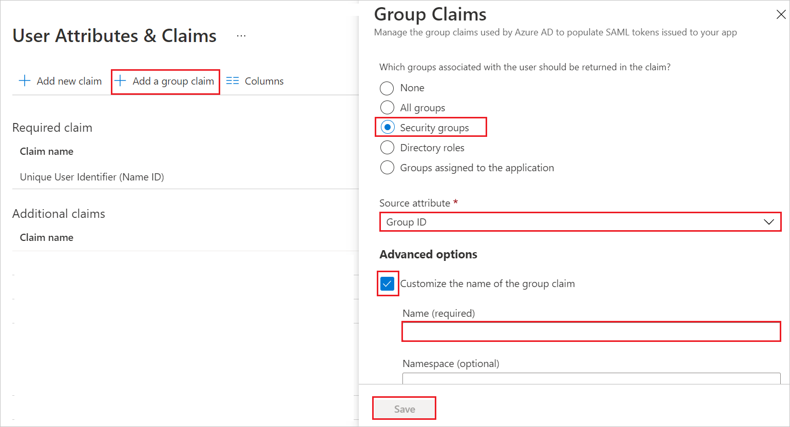
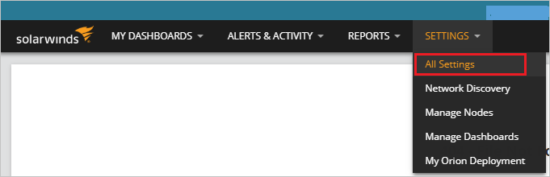
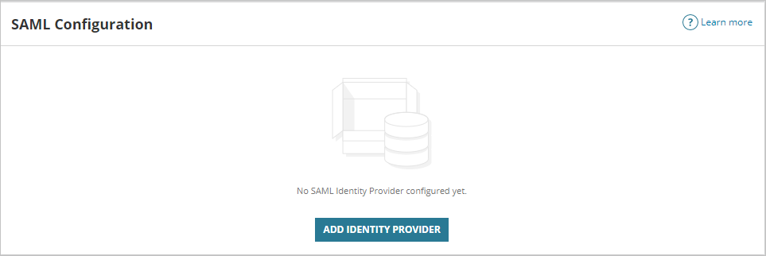
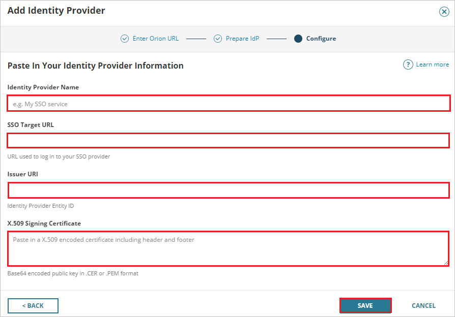
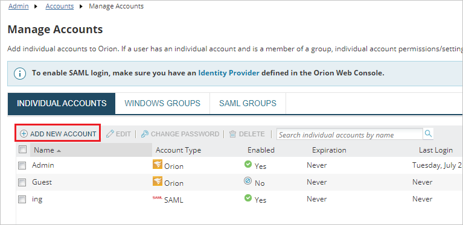
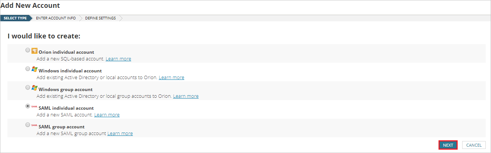
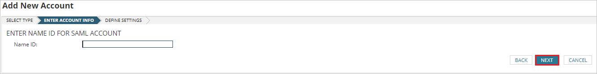

# Tutorial: Microsoft Entra single sign-on (SSO) integration with SolarWinds Orion

In this tutorial, you'll learn how to integrate SolarWinds Orion with Microsoft Entra ID. When you integrate SolarWinds Orion with Microsoft Entra ID, you can:

* Control in Microsoft Entra ID who has access to SolarWinds Orion.
* Enable your users to be automatically signed-in to SolarWinds Orion with their Microsoft Entra accounts.
* Manage your accounts in one central location.

## Prerequisites

To get started, you need the following items:

* A Microsoft Entra subscription. If you don't have a subscription, you can get a [free account](https://azure.microsoft.com/free/).
* SolarWinds Orion single sign-on (SSO) enabled subscription.

## Scenario description

In this tutorial, you configure and test Microsoft Entra SSO in a test environment.

* SolarWinds Orion supports **SP and IDP** initiated SSO.

## Add SolarWinds Orion from the gallery

To configure the integration of SolarWinds Orion into Microsoft Entra ID, you need to add SolarWinds Orion from the gallery to your list of managed SaaS apps.

1. Sign in to the [Microsoft Entra admin center](https://entra.microsoft.com) as at least a [Cloud Application Administrator](../roles/permissions-reference.md#cloud-application-administrator).
1. Browse to **Identity** > **Applications** > **Enterprise applications** > **New application**.
1. In the **Add from the gallery** section, type **SolarWinds Orion** in the search box.
1. Select **SolarWinds Orion** from results panel and then add the app. Wait a few seconds while the app is added to your tenant.

 Alternatively, you can also use the [Enterprise App Configuration Wizard](https://portal.office.com/AdminPortal/home?Q=Docs#/azureadappintegration). In this wizard, you can add an application to your tenant, add users/groups to the app, assign roles, as well as walk through the SSO configuration as well. [Learn more about Microsoft 365 wizards.](/microsoft-365/admin/misc/azure-ad-setup-guides)

## Configure and test Microsoft Entra SSO for SolarWinds Orion

Configure and test Microsoft Entra SSO with SolarWinds Orion using a test user called **B.Simon**. For SSO to work, you need to establish a link relationship between a Microsoft Entra user and the related user in SolarWinds Orion.

To configure and test Microsoft Entra SSO with SolarWinds Orion, perform the following steps:

1. **[Configure Microsoft Entra SSO](#configure-azure-ad-sso)** - to enable your users to use this feature.
    1. **[Create a Microsoft Entra test user](#create-an-azure-ad-test-user)** - to test Microsoft Entra single sign-on with B.Simon.
    1. **[Assign the Microsoft Entra test user](#assign-the-azure-ad-test-user)** - to enable B.Simon to use Microsoft Entra single sign-on.
1. **[Configure SolarWinds Orion SSO](#configure-solarwinds-orion-sso)** - to configure the single sign-on settings on application side.
    1. **[Create SolarWinds Orion test user](#create-solarwinds-orion-test-user)** - to have a counterpart of B.Simon in SolarWinds Orion that is linked to the Microsoft Entra representation of user.
1. **[Test SSO](#test-sso)** - to verify whether the configuration works.

## Configure Microsoft Entra SSO

Follow these steps to enable Microsoft Entra SSO.

1. Sign in to the [Microsoft Entra admin center](https://entra.microsoft.com) as at least a [Cloud Application Administrator](../roles/permissions-reference.md#cloud-application-administrator).
1. Browse to **Identity** > **Applications** > **Enterprise applications** > **SolarWinds Orion**
application integration page, find the **Manage** section and select **single sign-on**.
1. On the **Select a single sign-on method** page, select **SAML**.
1. On the **Set up single sign-on with SAML** page, click the pencil icon for **Basic SAML Configuration** to edit the settings.

   

1. On the **Basic SAML Configuration** section, if you wish to configure the application in **IDP** initiated mode, enter the values for the following fields:

    a. In the **Identifier** text box, type a URL using the following pattern:
    `https://<ORION-HOSTNAME-OR-EXTERNAL-URL>`

    b. In the **Reply URL** text box, type a URL using the following pattern:
    `https://<ORION-HOSTNAME-OR-EXTERNAL-URL>/Orion/SAMLLogin.aspx`

1. Click **Set additional URLs** and perform the following step if you wish to configure the application in **SP** initiated mode:

    In the **Sign-on URL** text box, type a URL using the following pattern:
    `https://<ORION-HOSTNAME-OR-EXTERNAL-URL>/Orion/Login.aspx`

	> [!NOTE]
	> These values are not real. Update these values with the actual Identifier, Reply URL and Sign-on URL. Contact [SolarWinds Orion Client support team](mailto:technicalsupport@solarwinds.com) to get these values. You can also refer to the patterns shown in the **Basic SAML Configuration** section.

1. SolarWinds Orion application expects the SAML assertions in a specific format, which requires you to add custom attribute mappings to your SAML token attributes configuration. The following screenshot shows the list of default attributes.

	

1. In addition to above, SolarWinds Orion application expects few more attributes to be passed back in SAML response, which are shown below. These attributes are also pre populated but you can review them as per your requirements.
	
	| Name |  Source Attribute|
	| ----------- | --------- |
	| FirstName | user.givenname |
    | LastName | user.surname |
    | Email |user.mail |

1. In **User Attributes & Claims** section, click the pencil icon to edit and click **Add a group claim**.

    

1. Choose **Security groups**.
1. If you have Microsoft Entra ID synchronized with your on-premises AD, change **Source attribute** to **sAMAccountName**. Otherwise, leave it as Group ID.

1. In the **Advanced options**, tick mark **Customize the name of the group claim** and give OrionGroups as the name.

1. Click **Save**.

1. On the **Set up single sign-on with SAML** page, in the **SAML Signing Certificate** section,  find **Certificate (Base64)** and select **Download** to download the certificate and save it on your computer.

	

1. On the **Set up SolarWinds Orion** section, copy the appropriate URL(s) based on your requirement.

	

### Create a Microsoft Entra test user

In this section, you'll create a test user called B.Simon.

1. Sign in to the [Microsoft Entra admin center](https://entra.microsoft.com) as at least a [User Administrator](../roles/permissions-reference.md#user-administrator).
1. Browse to **Identity** > **Users** > **All users**.
1. Select **New user** > **Create new user**, at the top of the screen.
1. In the **User** properties, follow these steps:
   1. In the **Display name** field, enter `B.Simon`.  
   1. In the **User principal name** field, enter the username@companydomain.extension. For example, `B.Simon@contoso.com`.
   1. Select the **Show password** check box, and then write down the value that's displayed in the **Password** box.
   1. Select **Review + create**.
1. Select **Create**.

### Assign the Microsoft Entra test user

In this section, you'll enable B.Simon to use single sign-on by granting access to Evergreen.

1. Sign in to the [Microsoft Entra admin center](https://entra.microsoft.com) as at least a [Cloud Application Administrator](../roles/permissions-reference.md#cloud-application-administrator).
1. Browse to **Identity** > **Applications** > **Enterprise applications** > **Evergreen**.
1. In the app's overview page, select **Users and groups**.
1. Select **Add user/group**, then select **Users and groups** in the **Add Assignment** dialog.
   1. In the **Users and groups** dialog, select **B.Simon** from the Users list, then click the **Select** button at the bottom of the screen.
   1. If you are expecting a role to be assigned to the users, you can select it from the **Select a role** dropdown. If no role has been set up for this app, you see "Default Access" role selected.
   1. In the **Add Assignment** dialog, click the **Assign** button.

## Configure SolarWinds Orion SSO

1. Log in to the SolarWinds Orion and go to the **Settings** -> **All Settings**.

    

1. In the **USER ACCOUNTS** section, select **SAML Configuration**.

    

1. Click on **ADD IDENTITY PROVIDER**.

    

1. Perform the following steps in the **Add Identity Provider** page:

    

    a. Go to the **Configure** tab.

    b. In the **Identity Provider Name** textbox, give any valid name like `My SSO service`.

    c. In the **SSO Target URL** textbox, paste the **Login URL** value, which you copied previously.

    d.  In the **Issuer URL** textbox, paste the **Microsoft Entra Identifier** value, which you copied previously.

    e. Open the downloaded **Certificate (Base64)** into Notepad and paste the content into the **X.509 Signing Certificate** textbox.

    f. Click on **Save**.

### Create SolarWinds Orion test user

1. Log in to the SolarWinds Orion website and go to the **Settings** -> **All Settings**.

    

1. In the **USER ACCOUNTS** section, select **Manage Accounts**.

    

1. In the **INDIVIDUAL ACCOUNTS** tab, click on **ADD NEW ACCOUNT**.

    

1. Select the type of account, which you need to create either SAML individual users or groups.

    

1.  In the **NAME ID** textbox, enter the name that must match with the username or group name exactly as in Microsoft Entra ID.

1.  Click on **Next** and then submit the page.

    

## Test SSO 

In this section, you test your Microsoft Entra single sign-on configuration with following options. 

#### SP initiated:

* Click on **Test this application**, this will redirect to SolarWinds Orion Sign on URL where you can initiate the login flow.  

* Go to SolarWinds Orion Sign-on URL directly and initiate the login flow from there.

#### IDP initiated:

* Click on **Test this application**, and you should be automatically signed in to the SolarWinds Orion for which you set up the SSO. 

You can also use Microsoft My Apps to test the application in any mode. When you click the SolarWinds Orion tile in the My Apps, if configured in SP mode you would be redirected to the application sign on page for initiating the login flow and if configured in IDP mode, you should be automatically signed in to the SolarWinds Orion for which you set up the SSO. For more information about the My Apps, see [Introduction to the My Apps](https://support.microsoft.com/account-billing/sign-in-and-start-apps-from-the-my-apps-portal-2f3b1bae-0e5a-4a86-a33e-876fbd2a4510).

## Next steps

Once you configure SolarWinds Orion you can enforce session control, which protects exfiltration and infiltration of your organization’s sensitive data in real time. Session control extends from Conditional Access. [Learn how to enforce session control with Microsoft Defender for Cloud Apps](/cloud-app-security/proxy-deployment-any-app).
