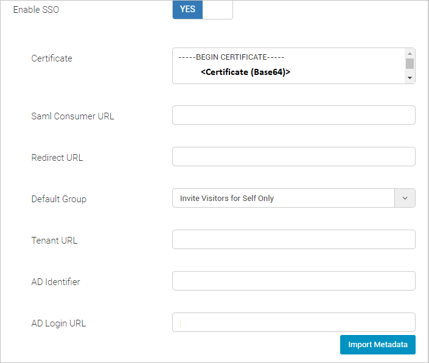
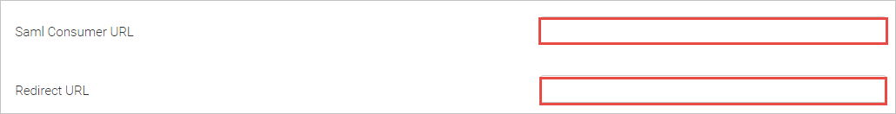

# Tutorial: Integrate Soloinsight-CloudGate SSO with Microsoft Entra ID

In this tutorial, you'll learn how to integrate Soloinsight-CloudGate SSO with Microsoft Entra ID. When you integrate Soloinsight-CloudGate SSO with Microsoft Entra ID, you can:

* Control in Microsoft Entra ID who has access to Soloinsight-CloudGate SSO.
* Enable your users to be automatically signed-in to Soloinsight-CloudGate SSO with their Microsoft Entra accounts.
* Manage your accounts in one central location.

## Prerequisites

To get started, you need the following items:

* A Microsoft Entra subscription. If you don't have a subscription, you can get a [free account](https://azure.microsoft.com/free/).
* Soloinsight-CloudGate SSO single sign-on (SSO) enabled subscription.

## Scenario description

In this tutorial, you configure and test Microsoft Entra SSO in a test environment.

* Soloinsight-CloudGate SSO supports **SP** initiated SSO.
* Soloinsight-CloudGate SSO supports [Automated user provisioning](soloinsight-cloudgate-sso-provisioning-tutorial.md).

## Add Soloinsight-CloudGate SSO from the gallery

To configure the integration of Soloinsight-CloudGate SSO into Microsoft Entra ID, you need to add Soloinsight-CloudGate SSO from the gallery to your list of managed SaaS apps.

1. Sign in to the [Microsoft Entra admin center](https://entra.microsoft.com) as at least a [Cloud Application Administrator](../roles/permissions-reference.md#cloud-application-administrator).
1. Browse to **Identity** > **Applications** > **Enterprise applications** > **New application**.
1. In the **Add from the gallery** section, type **Soloinsight-CloudGate SSO** in the search box.
1. Select **Soloinsight-CloudGate SSO** from results panel and then add the app. Wait a few seconds while the app is added to your tenant.

 Alternatively, you can also use the [Enterprise App Configuration Wizard](https://portal.office.com/AdminPortal/home?Q=Docs#/azureadappintegration). In this wizard, you can add an application to your tenant, add users/groups to the app, assign roles, as well as walk through the SSO configuration as well. [Learn more about Microsoft 365 wizards.](/microsoft-365/admin/misc/azure-ad-setup-guides)

## Configure and test Microsoft Entra SSO for Soloinsight-CloudGate SSO

Configure and test Microsoft Entra SSO with Soloinsight-CloudGate SSO using a test user called **B.Simon**. For SSO to work, you need to establish a link relationship between a Microsoft Entra user and the related user in Soloinsight-CloudGate SSO.

To configure and test Microsoft Entra SSO with Soloinsight-CloudGate SSO, perform the following steps:

1. **[Configure Microsoft Entra SSO](#configure-azure-ad-sso)** - to enable your users to use this feature.
    1. **[Create a Microsoft Entra test user](#create-an-azure-ad-test-user)** - to test Microsoft Entra single sign-on with B.Simon.
    1. **[Assign the Microsoft Entra test user](#assign-the-azure-ad-test-user)** - to enable B.Simon to use Microsoft Entra single sign-on.
1. **[Configure Soloinsight-CloudGate SSO](#configure-soloinsight-cloudgate-sso)** - to configure the single sign-on settings on application side.
    1. **[Create Soloinsight-CloudGate SSO test user](#create-soloinsight-cloudgate-sso-test-user)** - to have a counterpart of B.Simon in Soloinsight-CloudGate SSO that is linked to the Microsoft Entra representation of user.
1. **[Test SSO](#test-sso)** - to verify whether the configuration works.

### Configure Microsoft Entra SSO

Follow these steps to enable Microsoft Entra SSO.

1. Sign in to the [Microsoft Entra admin center](https://entra.microsoft.com) as at least a [Cloud Application Administrator](../roles/permissions-reference.md#cloud-application-administrator).
1. Browse to **Identity** > **Applications** > **Enterprise applications** > **Soloinsight-CloudGate SSO** application integration page, find the **Manage** section and select **Single sign-on**.
1. On the **Select a Single sign-on method** page, select **SAML**.
1. On the **Set up Single Sign-On with SAML** page, click the pencil icon for **Basic SAML Configuration** to edit the settings.

   

1. On the **Basic SAML Configuration** page, perform the following steps:

    1. In the **Sign on URL** text box, type a URL using the following pattern:
    `https://<SUBDOMAIN>.sigateway.com/login`

    1. In the **Identifier (Entity ID)** text box, type a URL using the following pattern:
    `https://<SUBDOMAIN>.sigateway.com/process/sso`

   > [!NOTE]
   > These values are not real. Update these values with the actual Sign on URL and Identifier which is explained later in the **Configure Soloinsight-CloudGate SSO Single Sign-On** section of the tutorial.

1. On the **Set up Single Sign-On with SAML** page, in the **SAML Signing Certificate** section, find **Certificate (Base64)** and select **Download** to download the certificate and save it on your computer.

   

1. On the **Set up Soloinsight-CloudGate SSO** section, copy the appropriate URL(s) based on your requirement.

   

### Create a Microsoft Entra test user

In this section, you'll create a test user called B.Simon.

1. Sign in to the [Microsoft Entra admin center](https://entra.microsoft.com) as at least a [User Administrator](../roles/permissions-reference.md#user-administrator).
1. Browse to **Identity** > **Users** > **All users**.
1. Select **New user** > **Create new user**, at the top of the screen.
1. In the **User** properties, follow these steps:
   1. In the **Display name** field, enter `B.Simon`.  
   1. In the **User principal name** field, enter the username@companydomain.extension. For example, `B.Simon@contoso.com`.
   1. Select the **Show password** check box, and then write down the value that's displayed in the **Password** box.
   1. Select **Review + create**.
1. Select **Create**.

### Assign the Microsoft Entra test user

In this section, you'll enable B.Simon to use single sign-on by granting access to Soloinsight-CloudGate SSO.

1. Sign in to the [Microsoft Entra admin center](https://entra.microsoft.com) as at least a [Cloud Application Administrator](../roles/permissions-reference.md#cloud-application-administrator).
1. Browse to **Identity** > **Applications** > **Enterprise applications** > **Soloinsight-CloudGate SSO**.
1. In the app's overview page, select **Users and groups**.
1. Select **Add user/group**, then select **Users and groups** in the **Add Assignment** dialog.
   1. In the **Users and groups** dialog, select **B.Simon** from the Users list, then click the **Select** button at the bottom of the screen.
   1. If you are expecting a role to be assigned to the users, you can select it from the **Select a role** dropdown. If no role has been set up for this app, you see "Default Access" role selected.
   1. In the **Add Assignment** dialog, click the **Assign** button.

## Configure Soloinsight-CloudGate SSO

1. In a different web browser window, sign in to your Soloinsight-CloudGate SSO company site as an administrator

4. To get the values that are to be pasted in the Azure portal while configuring Basic SAML, sign in to the CloudGate Web Portal using your credentials then access the SSO settings, which can be found on the following path **Home>Administration>System settings>General**.

	

5. **SAML Consumer URL**

	* Copy the links available against the **Saml Consumer URL** and the **Redirect URL** fields and paste them in the Azure portal **Basic SAML Configuration** section for **Identifier (Entity ID)** and **Reply URL** fields respectively.

		

6. **SAML Signing Certificate**

	* Go to the source of the Certificate (Base64) file that was downloaded from Azure portal SAML Signing Certificate lists and right-click on it. Choose **Edit with Notepad++** option from the list. 

		

	* Copy the content in the Certificate (Base64) Notepad++ file.

		

	* Paste the content in the CloudGate Web Portal SSO settings **Certificate** field and click on Save button.

		

7. **Default Group**

	* Select **Business Admin** from the drop-down list of the **Default Group** option in the CloudGate Web Portal

		

8. **AD Identifier and Login URL**

	* The copied **Login URL** **Set up Soloinsight-CloudGate SSO** configurations are to be entered in the CloudGate Web Portal SSO settings section.

	* Paste the **Login URL** link from Azure portal in the CloudGate Web Portal **AD Login URL** field.

	* Paste the **Microsoft Entra Identifier** link from Azure portal in the CloudGate Web Portal **AD Identifier** field

		

### Create Soloinsight-CloudGate SSO test user

To Create a test user, Select **Employees** from the main menu of your CloudGate Web Portal and fill out the Add New employee form. The Authority Level that is to be assigned to the test user is **Business Admin** Click on **Create** once all the required fields are filled.

> [!NOTE]
> Soloinsight-CloudGate SSO also supports automatic user provisioning, you can find more details [here](./soloinsight-cloudgate-sso-provisioning-tutorial.md) on how to configure automatic user provisioning.

## Test SSO

In this section, you test your Microsoft Entra single sign-on configuration with following options. 

* Click on **Test this application**, this will redirect to Soloinsight-CloudGate SSO Sign-on URL where you can initiate the login flow. 

* Go to Soloinsight-CloudGate SSO Sign-on URL directly and initiate the login flow from there.

* You can use Microsoft My Apps. When you click the Soloinsight-CloudGate SSO tile in the My Apps, this will redirect to Soloinsight-CloudGate SSO Sign-on URL. For more information about the My Apps, see [Introduction to the My Apps](https://support.microsoft.com/account-billing/sign-in-and-start-apps-from-the-my-apps-portal-2f3b1bae-0e5a-4a86-a33e-876fbd2a4510).

## Next steps

Once you configure Soloinsight-CloudGate SSO you can enforce session control, which protects exfiltration and infiltration of your organization’s sensitive data in real time. Session control extends from Conditional Access. [Learn how to enforce session control with Microsoft Defender for Cloud Apps](/cloud-app-security/proxy-deployment-aad).
