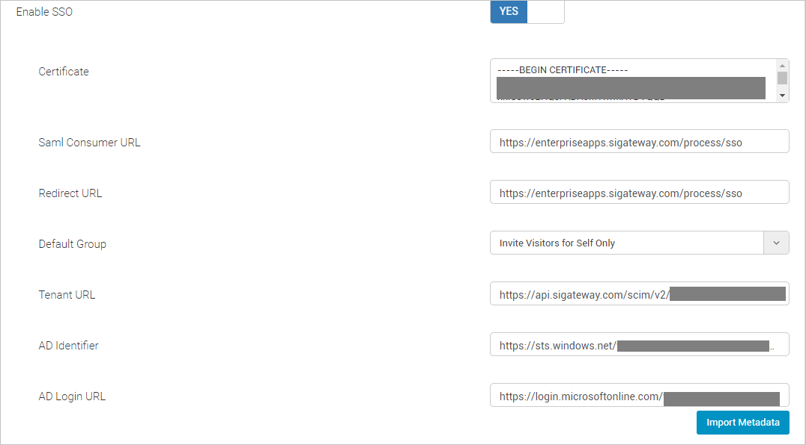
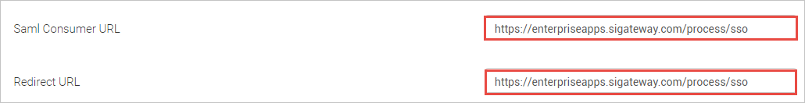
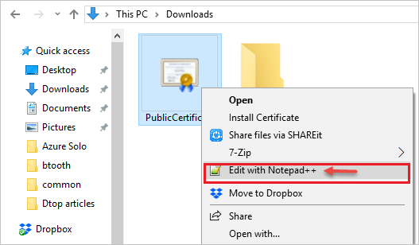
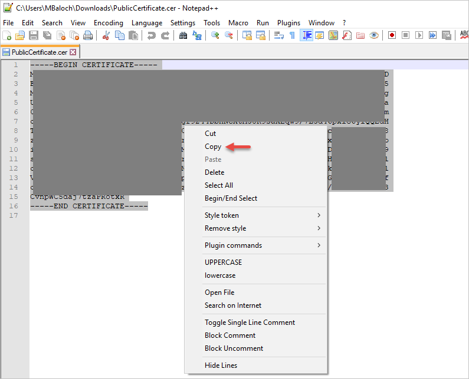
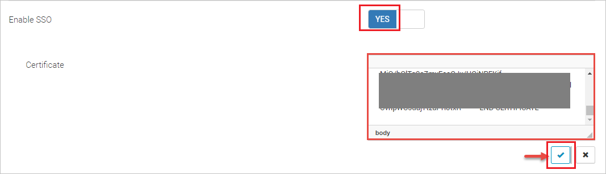
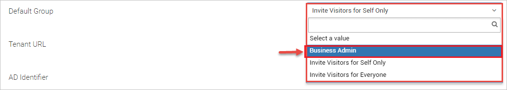

# Tutorial: Integrate Soloinsight-CloudGate SSO with Azure Active Directory

In this tutorial, you'll learn how to integrate Soloinsight-CloudGate SSO with Azure Active Directory (Azure AD). When you integrate Soloinsight-CloudGate SSO with Azure AD, you can:

* Control in Azure AD who has access to Soloinsight-CloudGate SSO.
* Enable your users to be automatically signed-in to Soloinsight-CloudGate SSO with their Azure AD accounts.
* Manage your accounts in one central location - the Azure portal.

To learn more about SaaS app integration with Azure AD, see [What is application access and single sign-on with Azure Active Directory](https://docs.microsoft.com/azure/active-directory/active-directory-appssoaccess-whatis).

## Prerequisites

To get started, you need the following items:

* An Azure AD subscription. If you don't have a subscription, you can get one-month free trial [here](https://azure.microsoft.com/pricing/free-trial/).
* Soloinsight-CloudGate SSO single sign-on (SSO) enabled subscription.

## Scenario description

In this tutorial, you configure and test Azure AD SSO in a test environment. Soloinsight-CloudGate SSO supports **SP** initiated SSO.

## Adding Soloinsight-CloudGate SSO from the gallery

To configure the integration of Soloinsight-CloudGate SSO into Azure AD, you need to add Soloinsight-CloudGate SSO from the gallery to your list of managed SaaS apps.

1. Sign in to the [Azure portal](https://portal.azure.com) using either a work or school account, or a personal Microsoft account.
1. On the left navigation pane, select the **Azure Active Directory** service.
1. Navigate to **Enterprise Applications** and then select **All Applications**.
1. To add new application, select **New application**.
1. In the **Add from the gallery** section, type **Soloinsight-CloudGate SSO** in the search box.
1. Select **Soloinsight-CloudGate SSO** from results panel and then add the app. Wait a few seconds while the app is added to your tenant.

## Configure and test Azure AD single sign-on

Configure and test Azure AD SSO with Soloinsight-CloudGate SSO using a test user called **Britta Simon**. For SSO to work, you need to establish a link relationship between an Azure AD user and the related user in Soloinsight-CloudGate SSO.

To configure and test Azure AD SSO with Soloinsight-CloudGate SSO, complete the following building blocks:

1. **[Configure Azure AD SSO](#configure-azure-ad-sso)** to enable your users to use this feature.
2. **[Configure Soloinsight-CloudGate SSO](#configure-soloinsight-cloudgate-sso)** to configure the SSO settings on application side.
3. **[Create an Azure AD test user](#create-an-azure-ad-test-user)** to test Azure AD single sign-on with Britta Simon.
4. **[Assign the Azure AD test user](#assign-the-azure-ad-test-user)** to enable Britta Simon to use Azure AD single sign-on.
5. **[Create Soloinsight-CloudGate SSO test user](#create-soloinsight-cloudgate-sso-test-user)** to have a counterpart of Britta Simon in Soloinsight-CloudGate SSO that is linked to the Azure AD representation of user.
6. **[Test SSO](#test-sso)** to verify whether the configuration works.

### Configure Azure AD SSO

Follow these steps to enable Azure AD SSO in the Azure portal.

1. In the [Azure portal](https://portal.azure.com/), on the **Soloinsight-CloudGate SSO** application integration page, find the **Manage** section and select **Single sign-on**.
1. On the **Select a Single sign-on method** page, select **SAML**.
1. On the **Set up Single Sign-On with SAML** page, click the edit/pen icon for **Basic SAML Configuration** to edit the settings.

   

1. On the **Basic SAML Configuration** page, enter the values for the following fields:

    1. In the **Sign on URL** text box, type a URL using the following pattern:
    `https://<SUBDOMAIN>.sigateway.com/login`

    1. In the **Identifier (Entity ID)** text box, type a URL using the following pattern:
    `https://<SUBDOMAIN>.sigateway.com/process/sso`

   > [!NOTE]
   > These values are not real. Update these values with the actual Sign on URL and Identifier which is explained later in the **Configure Soloinsight-CloudGate SSO Single Sign-On** section of the tutorial.

1. On the **Set up Single Sign-On with SAML** page, in the **SAML Signing Certificate** section, find **Certificate (Base64)** and select **Download** to download the certificate and save it on your computer.

   

1. On the **Set up Soloinsight-CloudGate SSO** section, copy the appropriate URL(s) based on your requirement.

   

### Configure Soloinsight-CloudGate SSO

1. To automate the configuration within Soloinsight-CloudGate SSO, you need to install **My Apps Secure Sign-in browser extension** by clicking **Install the extension**.

	

2. After adding extension to the browser, click on **Setup Soloinsight-CloudGate SSO** will direct you to the Soloinsight-CloudGate SSO application. From there, provide the admin credentials to sign into Soloinsight-CloudGate SSO. The browser extension will automatically configure the application for you and automate steps 3-8.

	

3. If you want to setup Soloinsight-CloudGate SSO manually, open a new web browser window and sign into your Soloinsight-CloudGate SSO company site as an administrator and perform the following steps:

4. To get the values that are to be pasted in the Azure portal while configuring Basic SAML, sign in to the CloudGate Web Portal using your credentials then access the SSO settings, which can be found on the following path **Home>Administration>System settings>General**.

	

5. **SAML Consumer URL**

	* Copy the links available against the **Saml Consumer URL** and the **Redirect URL** fields and paste them in the Azure portal **Basic SAML Configuration** section for **Identifier (Entity ID)** and **Reply URL** fields respectively.

		

6. **SAML Signing Certificate**

	* Go to the source of the Certificate (Base64) file that was downloaded from Azure portal SAML Signing Certificate lists and right-click on it. Choose **Edit with Notepad++** option from the list. 

		

	* Copy the content in the Certificate (Base64) Notepad++ file.

		

	* Paste the content in the CloudGate Web Portal SSO settings **Certificate** field and click on Save button.

		

7. **Default Group**

	* Select **Business Admin** from the drop-down list of the **Default Group** option in the CloudGate Web Portal

		

8. **AD Identifier and Login URL**

	* The copied **Login URL** from the Azure portal **Set up Soloinsight-CloudGate SSO** configurations are to be entered in the CloudGate Web Portal SSO settings section.

	* Paste the **Login URL** link from Azure portal in the CloudGate Web Portal **AD Login URL** field.

	* Paste the **Azure AD Identifier** link from Azure portal in the CloudGate Web Portal **AD Identifier** field

		

### Create an Azure AD test user

In this section, you'll create a test user in the Azure portal called Britta Simon.

1. From the left pane in the Azure portal, select **Azure Active Directory**, select **Users**, and then select **All users**.
1. Select **New user** at the top of the screen.
1. In the **User** properties, follow these steps:
   1. In the **Name** field, enter `Britta Simon`.  
   1. In the **User name** field, enter the username@companydomain.extension. For example, `BrittaSimon@contoso.com`.
   1. Select the **Show password** check box, and then write down the value that's displayed in the **Password** box.
   1. Click **Create**.

### Assign the Azure AD test user

In this section, you'll enable Britta Simon to use Azure single sign-on by granting access to Soloinsight-CloudGate SSO.

1. In the Azure portal, select **Enterprise Applications**, and then select **All applications**.
1. In the applications list, select **Soloinsight-CloudGate SSO**.
1. In the app's overview page, find the **Manage** section and select **Users and groups**.

   

1. Select **Add user**, then select **Users and groups** in the **Add Assignment** dialog.

	

1. In the **Users and groups** dialog, select **Britta Simon** from the Users list, then click the **Select** button at the bottom of the screen.
1. If you're expecting any role value in the SAML assertion, in the **Select Role** dialog, select the appropriate role for the user from the list and then click the **Select** button at the bottom of the screen.
1. In the **Add Assignment** dialog, click the **Assign** button.

### Create Soloinsight-CloudGate SSO test user

To Create a test user, Select **Employees** from the main menu of your CloudGate Web Portal and fill out the Add New employee form. The Authority Level that is to be assigned to the test user is **Business Admin** Click on **Create** once all the required fields are filled.

### Test SSO

When you select the Soloinsight-CloudGate SSO tile in the Access Panel, you should be automatically signed in to the Soloinsight-CloudGate SSO for which you set up SSO. For more information about the Access Panel, see [Introduction to the Access Panel](https://docs.microsoft.com/azure/active-directory/active-directory-saas-access-panel-introduction).

## Additional Resources

- [List of Tutorials on How to Integrate SaaS Apps with Azure Active Directory](https://docs.microsoft.com/azure/active-directory/active-directory-saas-tutorial-list)

- [What is application access and single sign-on with Azure Active Directory?](https://docs.microsoft.com/azure/active-directory/active-directory-appssoaccess-whatis)

- [What is Conditional Access in Azure Active Directory?](https://docs.microsoft.com/azure/active-directory/conditional-access/overview)