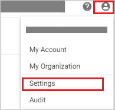
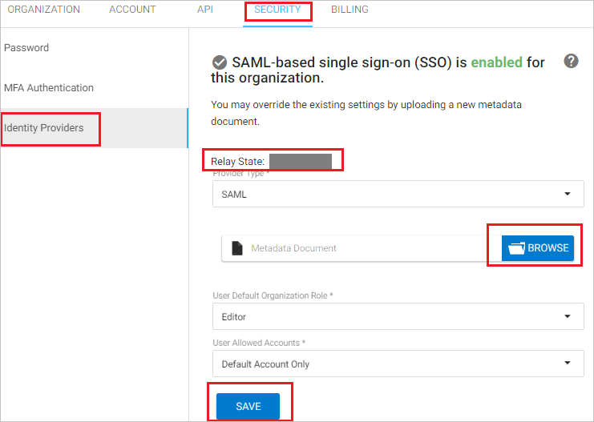
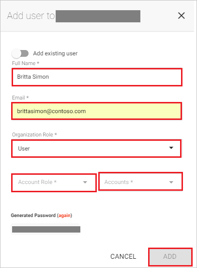

# Tutorial: Azure Active Directory single sign-on (SSO) integration with Spotinst

In this tutorial, you'll learn how to integrate Spotinst with Azure Active Directory (Azure AD). When you integrate Spotinst with Azure AD, you can:

* Control in Azure AD who has access to Spotinst.
* Enable your users to be automatically signed-in to Spotinst with their Azure AD accounts.
* Manage your accounts in one central location - the Azure portal.

To learn more about SaaS app integration with Azure AD, see [What is application access and single sign-on with Azure Active Directory](https://docs.microsoft.com/azure/active-directory/active-directory-appssoaccess-whatis).

## Prerequisites

To get started, you need the following items:

* An Azure AD subscription. If you don't have a subscription, you can get a [free account](https://azure.microsoft.com/free/).
* Spotinst single sign-on (SSO) enabled subscription.

## Scenario description

In this tutorial, you configure and test Azure AD SSO in a test environment.

* Spotinst supports **SP and IDP** initiated SSO

## Adding Spotinst from the gallery

To configure the integration of Spotinst into Azure AD, you need to add Spotinst from the gallery to your list of managed SaaS apps.

1. Sign in to the [Azure portal](https://portal.azure.com) using either a work or school account, or a personal Microsoft account.
1. On the left navigation pane, select the **Azure Active Directory** service.
1. Navigate to **Enterprise Applications** and then select **All Applications**.
1. To add new application, select **New application**.
1. In the **Add from the gallery** section, type **Spotinst** in the search box.
1. Select **Spotinst** from results panel and then add the app. Wait a few seconds while the app is added to your tenant.

## Configure and test Azure AD single sign-on for Spotinst

Configure and test Azure AD SSO with Spotinst using a test user called **B.Simon**. For SSO to work, you need to establish a link relationship between an Azure AD user and the related user in Spotinst.

To configure and test Azure AD SSO with Spotinst, complete the following building blocks:

1. **[Configure Azure AD SSO](#configure-azure-ad-sso)** - to enable your users to use this feature.
    * **[Create an Azure AD test user](#create-an-azure-ad-test-user)** - to test Azure AD single sign-on with B.Simon.
    * **[Assign the Azure AD test user](#assign-the-azure-ad-test-user)** - to enable B.Simon to use Azure AD single sign-on.
1. **[Configure Spotinst SSO](#configure-spotinst-sso)** - to configure the single sign-on settings on application side.
    * **[Create Spotinst test user](#create-spotinst-test-user)** - to have a counterpart of B.Simon in Spotinst that is linked to the Azure AD representation of user.
1. **[Test SSO](#test-sso)** - to verify whether the configuration works.

## Configure Azure AD SSO

Follow these steps to enable Azure AD SSO in the Azure portal.

1. In the [Azure portal](https://portal.azure.com/), on the **Spotinst** application integration page, find the **Manage** section and select **single sign-on**.
1. On the **Select a single sign-on method** page, select **SAML**.
1. On the **Set up single sign-on with SAML** page, click the edit/pen icon for **Basic SAML Configuration** to edit the settings.

   

1. On the **Basic SAML Configuration** section, if you wish to configure the application in **IDP** initiated mode, perform the following steps:

	a. Check **Set additional URLs**.

	b. In the **Relay State** textbox, type a value: `<ID>`

1. Click **Set additional URLs** and perform the following steps if you wish to configure the application in **SP** initiated mode:

	In the **Sign-on URL** text box, type the URL:
    `https://console.spotinst.com/auth/saml`

	> [!NOTE]
	> The Relay State value is not real. You will update the Relay State value with the actual Relay State value, which is explained later in the tutorial.

1. Click **Save**.

1. Spotinst application expects the SAML assertions in a specific format, which requires you to add custom attribute mappings to your SAML token attributes configuration. The following screenshot shows the list of default attributes.

	

1. In addition to above, Spotinst application expects few more attributes to be passed back in SAML response which are shown below. These attributes are also pre populated but you can review them as per your requirements.

	| Name | Source Attribute|
	| -----| --------------- |
	| Email | user.mail |
	| FirstName | user.givenname |
	| LastName | user.surname |

1. On the **Set up single sign-on with SAML** page, in the **SAML Signing Certificate** section,  find **Federation Metadata XML** and select **Download** to download the certificate and save it on your computer.

	

1. On the **Set up Spotinst** section, copy the appropriate URL(s) based on your requirement.

	

### Create an Azure AD test user

In this section, you'll create a test user in the Azure portal called B.Simon.

1. From the left pane in the Azure portal, select **Azure Active Directory**, select **Users**, and then select **All users**.
1. Select **New user** at the top of the screen.
1. In the **User** properties, follow these steps:
   1. In the **Name** field, enter `B.Simon`.  
   1. In the **User name** field, enter the username@companydomain.extension. For example, `B.Simon@contoso.com`.
   1. Select the **Show password** check box, and then write down the value that's displayed in the **Password** box.
   1. Click **Create**.

### Assign the Azure AD test user

In this section, you'll enable B.Simon to use Azure single sign-on by granting access to Spotinst.

1. In the Azure portal, select **Enterprise Applications**, and then select **All applications**.
1. In the applications list, select **Spotinst**.
1. In the app's overview page, find the **Manage** section and select **Users and groups**.

   

1. Select **Add user**, then select **Users and groups** in the **Add Assignment** dialog.

	

1. In the **Users and groups** dialog, select **B.Simon** from the Users list, then click the **Select** button at the bottom of the screen.
1. If you're expecting any role value in the SAML assertion, in the **Select Role** dialog, select the appropriate role for the user from the list and then click the **Select** button at the bottom of the screen.
1. In the **Add Assignment** dialog, click the **Assign** button.

## Configure Spotinst SSO

1. In a different web browser window, sign in to Spotinst as a Security Administrator.

2. Click on the **user icon** on the top right side of the screen and click **Settings**.

	

3. Click on the **SECURITY** tab on the top and then select **Identity Providers** and perform the following steps:

	

	a. Copy the **Relay State** value for your instance and paste it in **Relay State** textbox in **Basic SAML Configuration** section on Azure portal.

	b. Click **BROWSE** to upload the metadata xml file that you have downloaded from Azure portal

	c. Click **SAVE**.

### Create Spotinst test user

The objective of this section is to create a user called Britta Simon in Spotinst.

1. If you have configured the application in the **SP** initiated mode, perform the following steps:

   a. In a different web browser window, sign in to Spotinst as a Security Administrator.

   b. Click on the **user icon** on the top right side of the screen and click **Settings**.

	

	c. Click **Users** and select **ADD USER**.

	

	d. On the add user section, perform the following steps:

	

	* In the **Full Name** textbox, enter the full name of user like **BrittaSimon**.

	* In the **Email** textbox, enter the email address of the user like `brittasimon\@contoso.com`.

	* Select your organization-specific details for the **Organization Role, Account Role, and Accounts**.

2. If you have configured the application in the **IDP** initiated mode, There is no action item for you in this section. Spotinst supports just-in-time provisioning, which is by default enabled. A new user is created during an attempt to access Spotinst if it doesn't exist yet.

## Test SSO 

In this section, you test your Azure AD single sign-on configuration using the Access Panel.

When you click the Spotinst tile in the Access Panel, you should be automatically signed in to the Spotinst for which you set up SSO. For more information about the Access Panel, see [Introduction to the Access Panel](https://docs.microsoft.com/azure/active-directory/active-directory-saas-access-panel-introduction).

## Additional resources

- [ List of Tutorials on How to Integrate SaaS Apps with Azure Active Directory ](https://docs.microsoft.com/azure/active-directory/active-directory-saas-tutorial-list)

- [What is application access and single sign-on with Azure Active Directory? ](https://docs.microsoft.com/azure/active-directory/active-directory-appssoaccess-whatis)

- [What is conditional access in Azure Active Directory?](https://docs.microsoft.com/azure/active-directory/conditional-access/overview)

- [Try Spotinst with Azure AD](https://aad.portal.azure.com/)

