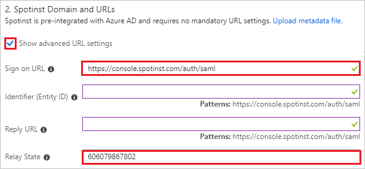
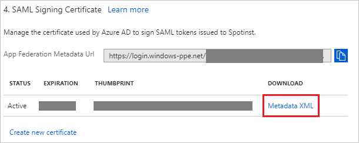
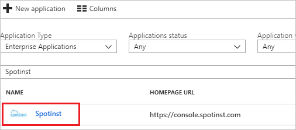

# Tutorial: Azure Active Directory integration with Spotinst

In this tutorial, you learn how to integrate Spotinst with Azure Active Directory (Azure AD).

Integrating Spotinst with Azure AD provides you with the following benefits:

- You can control in Azure AD who has access to Spotinst.
- You can enable your users to automatically get signed-on to Spotinst (Single Sign-On) with their Azure AD accounts.
- You can manage your accounts in one central location - the Azure portal.

If you want to know more details about SaaS app integration with Azure AD, see [what is application access and single sign-on with Azure Active Directory](../manage-apps/what-is-single-sign-on.md).

## Prerequisites

To configure Azure AD integration with Spotinst, you need the following items:

- An Azure AD subscription
- A Spotinst single sign-on enabled subscription

> [!NOTE]
> To test the steps in this tutorial, we do not recommend using a production environment.

To test the steps in this tutorial, you should follow these recommendations:

- Do not use your production environment, unless it is necessary.
- If you don't have an Azure AD trial environment, you can [get a one-month trial](https://azure.microsoft.com/pricing/free-trial/).

## Scenario description
In this tutorial, you test Azure AD single sign-on in a test environment. 
The scenario outlined in this tutorial consists of two main building blocks:

1. Adding Spotinst from the gallery
2. Configuring and testing Azure AD single sign-on

## Adding Spotinst from the gallery
To configure the integration of Spotinst into Azure AD, you need to add Spotinst from the gallery to your list of managed SaaS apps.

**To add Spotinst from the gallery, perform the following steps:**

1. In the **[Azure portal](https://portal.azure.com)**, on the left navigation panel, click **Azure Active Directory** icon. 

	![The Azure Active Directory button][1]

2. Navigate to **Enterprise applications**. Then go to **All applications**.

	![The Enterprise applications blade][2]
	
3. To add new application, click **New application** button on the top of dialog.

	![The New application button][3]

4. In the search box, type **Spotinst**, select **Spotinst** from result panel then click **Add** button to add the application.

	

## Configure and test Azure AD single sign-on

In this section, you configure and test Azure AD single sign-on with Spotinst based on a test user called "Britta Simon".

For single sign-on to work, Azure AD needs to know what the counterpart user in Spotinst is to a user in Azure AD. In other words, a link relationship between an Azure AD user and the related user in Spotinst needs to be established.

To configure and test Azure AD single sign-on with Spotinst, you need to complete the following building blocks:

1. **[Configure Azure AD Single Sign-On](#configure-azure-ad-single-sign-on)** - to enable your users to use this feature.
2. **[Create an Azure AD test user](#create-an-azure-ad-test-user)** - to test Azure AD single sign-on with Britta Simon.
3. **[Create a Spotinst test user](#create-a-spotinst-test-user)** - to have a counterpart of Britta Simon in Spotinst that is linked to the Azure AD representation of user.
4. **[Assign the Azure AD test user](#assign-the-azure-ad-test-user)** - to enable Britta Simon to use Azure AD single sign-on.
5. **[Test single sign-on](#test-single-sign-on)** - to verify whether the configuration works.

### Configure Azure AD single sign-on

In this section, you enable Azure AD single sign-on in the Azure portal and configure single sign-on in your Spotinst application.

**To configure Azure AD single sign-on with Spotinst, perform the following steps:**

1. In the Azure portal, on the **Spotinst** application integration page, click **Single sign-on**.

	![Configure single sign-on link][4]

2. On the **Single sign-on** dialog, select **Mode** as	**SAML-based Sign-on** to enable single sign-on.
 
	

3. On the **Spotinst Domain and URLs** section, perform the following steps if you wish to configure the application in IDP initiated mode:

	

	a. Check **Show advanced URL settings**.

	b. In the **Relay State** textbox, type a value: `<ID>`

	c. If you wish to configure the application in **SP** initiated mode, in the **Sign on URL** textbox, type the URL: `https://console.spotinst.com`

	> [!NOTE]
	> The Relay State value is not real. You will update the Relay State value with the actual Relay State value, which is explained later in the tutorial.

4. Spotinst application expects the SAML assertions in a specific format. Configure the following claims for this application. You can manage the values of these attributes from the **User Attributes** section on application integration page. The following screenshot shows an example for it.

	

5. In the **User Attributes** section on the **Single sign-on** dialog, configure SAML token attribute as shown in the image above and perform the following steps:

	| Attribute Name | Attribute Value |
	| ---------------| --------------- |
	| Email | user.mail |
	| FirstName | user.givenname |
	| LastName | user.surname |
	
	a. Click **Add attribute** to open the **Add Attribute** dialog.

	

	

	b. In the **Name** textbox, type the attribute name shown for that row.

	c. From the **Value** list, type the attribute value shown for that row.

	d. Leave the **Namespace** blank.

	e. Click **Ok**

6. On the **SAML Signing Certificate** section, click **Metadata XML** and then save the metadata file on your computer.

	 

7. Click **Save** button.

	

8. In a different web browser window, login to Spotinst as a Security Administrator.

9. Click on the **user icon** on the top right side of the screen and click **Settings**.

	

10. Click on the **SECURITY** tab on the top and then select **Identity Providers** and perform the following steps:

	

	a. Copy the **Relay State** value for your instance and paste it in **Relay State** textbox in **Spotinst Domain and URLs** section on Azure portal.

	b. Click **BROWSE** to upload the metadata xml file that you have downloaded from Azure portal

	c. Click **SAVE**.

### Create an Azure AD test user

The objective of this section is to create a test user in the Azure portal called Britta Simon.

   ![Create an Azure AD test user][100]

**To create a test user in Azure AD, perform the following steps:**

1. In the Azure portal, in the left pane, click the **Azure Active Directory** button.

    

2. To display the list of users, go to **Users and groups**, and then click **All users**.

    

3. To open the **User** dialog box, click **Add** at the top of the **All Users** dialog box.

    

4. In the **User** dialog box, perform the following steps:

    

    a. In the **Name** box, type **BrittaSimon**.

    b. In the **User name** box, type the email address of user Britta Simon.

    c. Select the **Show Password** check box, and then write down the value that's displayed in the **Password** box.

    d. Click **Create**.

### Create a Spotinst test user

The objective of this section is to create a user called Britta Simon in Spotinst.

1. If you have configured the application in the **SP** intiated mode, perform the following steps:

   a. In a different web browser window, login to Spotinst as a Security Administrator.

   b. Click on the **user icon** on the top right side of the screen and click **Settings**.

	

	c. Click **Users** and select **ADD USER**.

	

	d. On the add user section, perform the following steps:

	

	* In the **Full Name** textbox, enter the full name of user like **BrittaSimon**.

	* In the **Email** textbox, enter the email address of the user like **brittasimon@contoso.com**.

	* Select your organization-specific details for the **Organization Role, Account Role, and Accounts**.

2. If you have configured the application in the **IDP** intiated mode, There is no action item for you in this section. Spotinst supports just-in-time provisioning, which is by default enabled. A new user is created during an attempt to access Spotinst if it doesn't exist yet.

### Assign the Azure AD test user

In this section, you enable Britta Simon to use Azure single sign-on by granting access to Spotinst.

![Assign the user role][200] 

**To assign Britta Simon to Spotinst, perform the following steps:**

1. In the Azure portal, open the applications view, and then navigate to the directory view and go to **Enterprise applications** then click **All applications**.

	![Assign User][201] 

2. In the applications list, select **Spotinst**.

	  

3. In the menu on the left, click **Users and groups**.

	![The "Users and groups" link][202]

4. Click **Add** button. Then select **Users and groups** on **Add Assignment** dialog.

	![The Add Assignment pane][203]

5. On **Users and groups** dialog, select **Britta Simon** in the Users list.

6. Click **Select** button on **Users and groups** dialog.

7. Click **Assign** button on **Add Assignment** dialog.
	
### Test single sign-on

In this section, you test your Azure AD single sign-on configuration using the Access Panel.

When you click the Spotinst tile in the Access Panel, you should get automatically signed-on to your Spotinst application.
For more information about the Access Panel, see [Introduction to the Access Panel](../active-directory-saas-access-panel-introduction.md). 

## Additional resources

* [List of Tutorials on How to Integrate SaaS Apps with Azure Active Directory](tutorial-list.md)
* [What is application access and single sign-on with Azure Active Directory?](../manage-apps/what-is-single-sign-on.md)

<!--Image references-->

[1]: ./media/spotinst-tutorial/tutorial_general_01.png
[2]: ./media/spotinst-tutorial/tutorial_general_02.png
[3]: ./media/spotinst-tutorial/tutorial_general_03.png
[4]: ./media/spotinst-tutorial/tutorial_general_04.png

[100]: ./media/spotinst-tutorial/tutorial_general_100.png

[200]: ./media/spotinst-tutorial/tutorial_general_200.png
[201]: ./media/spotinst-tutorial/tutorial_general_201.png
[202]: ./media/spotinst-tutorial/tutorial_general_202.png
[203]: ./media/spotinst-tutorial/tutorial_general_203.png

