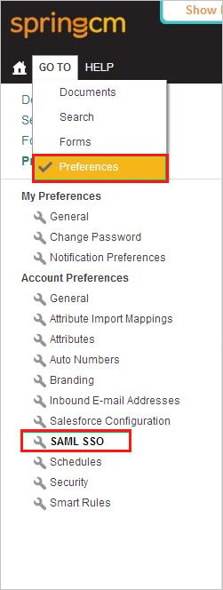

# Tutorial: Azure Active Directory integration with SpringCM

In this tutorial, you learn how to integrate SpringCM with Azure Active Directory (Azure AD).
Integrating SpringCM with Azure AD provides you with the following benefits:

* You can control in Azure AD who has access to SpringCM.
* You can enable your users to be automatically signed-in to SpringCM (Single Sign-On) with their Azure AD accounts.
* You can manage your accounts in one central location - the Azure portal.

If you want to know more details about SaaS app integration with Azure AD, see [What is application access and single sign-on with Azure Active Directory](https://docs.microsoft.com/azure/active-directory/active-directory-appssoaccess-whatis).
If you don't have an Azure subscription, [create a free account](https://azure.microsoft.com/free/) before you begin.

## Prerequisites

To configure Azure AD integration with SpringCM, you need the following items:

* An Azure AD subscription. If you don't have an Azure AD environment, you can get a [free account](https://azure.microsoft.com/free/)
* SpringCM single sign-on enabled subscription

## Scenario description

In this tutorial, you configure and test Azure AD single sign-on in a test environment.

* SpringCM supports **SP** initiated SSO

## Adding SpringCM from the gallery

To configure the integration of SpringCM into Azure AD, you need to add SpringCM from the gallery to your list of managed SaaS apps.

**To add SpringCM from the gallery, perform the following steps:**

1. In the **[Azure portal](https://portal.azure.com)**, on the left navigation panel, click the **Azure Active Directory** icon.

	

2. Navigate to **Enterprise Applications** and then select the **All Applications** option.

	

3. To add a new application, click the **New application** button at the top of the dialog.

	

4. In the search box, type **SpringCM**, select **SpringCM** from the result panel then click the **Add** button to add the application.

	

## Configure and test Azure AD single sign-on

In this section, you configure and test Azure AD single sign-on with SpringCM based on a test user called **Britta Simon**.
For single sign-on to work, a link relationship between an Azure AD user and the related user in SpringCM needs to be established.

To configure and test Azure AD single sign-on with SpringCM, you need to complete the following building blocks:

1. **[Configure Azure AD Single Sign-On](#configure-azure-ad-single-sign-on)** - to enable your users to use this feature.
2. **[Configure SpringCM Single Sign-On](#configure-springcm-single-sign-on)** - to configure the Single Sign-On settings on application side.
3. **[Create an Azure AD test user](#create-an-azure-ad-test-user)** - to test Azure AD single sign-on with Britta Simon.
4. **[Assign the Azure AD test user](#assign-the-azure-ad-test-user)** - to enable Britta Simon to use Azure AD single sign-on.
5. **[Create SpringCM test user](#create-springcm-test-user)** - to have a counterpart of Britta Simon in SpringCM that is linked to the Azure AD representation of user.
6. **[Test single sign-on](#test-single-sign-on)** - to verify whether the configuration works.

### Configure Azure AD single sign-on

In this section, you enable Azure AD single sign-on in the Azure portal.

To configure Azure AD single sign-on with SpringCM, perform the following steps:

1. In the [Azure portal](https://portal.azure.com/), on the **SpringCM** application integration page, select **Single sign-on**.

    

2. On the **Select a Single sign-on method** dialog, select **SAML/WS-Fed** mode to enable single sign-on.

    

3. On the **Set up Single Sign-On with SAML** page, click **Edit** icon to open **Basic SAML Configuration** dialog.

	

4. On the **Basic SAML Configuration** section, perform the following steps:

    

    In the **Sign-on URL** text box, type a URL using the following pattern:
    `https://na11.springcm.com/atlas/SSO/SSOEndpoint.ashx?aid=<identifier>`

	> [!NOTE]
	> The value is not real. Update the value with the actual Sign-On URL. Contact [SpringCM Client support team](https://knowledge.springcm.com/support) to get the value. You can also refer to the patterns shown in the **Basic SAML Configuration** section in the Azure portal.

4. On the **Set up Single Sign-On with SAML** page, in the **SAML Signing Certificate** section, click **Download** to download the **Certificate (Raw)** from the given options as per your requirement and save it on your computer.

	

6. On the **Set up SpringCM** section, copy the appropriate URL(s) as per your requirement.

	

	a. Login URL

	b. Azure AD Identifier

	c. Logout URL

### Configure SpringCM Single Sign-On

1. In a different web browser window, sign on to your **SpringCM** company site as administrator.

1. In the menu on the top, click **GO TO**, click **Preferences**, and then, in the **Account Preferences** section, click **SAML SSO**.
   
    

1. In the Identity Provider Configuration section, perform the following steps:
   
    
	
	a. To upload your downloaded Azure Active Directory certificate, click **Select Issuer Certificate** or **Change Issuer Certificate**.
  	
	b. In the **Issuer** textbox, paste **Azure AD Identifier** value, which you have copied from Azure portal.
  	
	c. In the **Service Provider (SP) Initiated Endpoint** textbox, paste **Login URL** value, which you have copied from the Azure portal.
	    	
	d. Select **SAML Enabled** as **Enable**.

	e. Click **Save**.

### Create an Azure AD test user 

The objective of this section is to create a test user in the Azure portal called Britta Simon.

1. In the Azure portal, in the left pane, select **Azure Active Directory**, select **Users**, and then select **All users**.

    

2. Select **New user** at the top of the screen.

    

3. In the User properties, perform the following steps.

    

    a. In the **Name** field enter **BrittaSimon**.
  
    b. In the **User name** field type `brittasimon@yourcompanydomain.extension`. For example, BrittaSimon@contoso.com

    c. Select **Show password** check box, and then write down the value that's displayed in the Password box.

    d. Click **Create**.

### Assign the Azure AD test user

In this section, you enable Britta Simon to use Azure single sign-on by granting access to SpringCM.

1. In the Azure portal, select **Enterprise Applications**, select **All applications**, then select **SpringCM**.

	

2. In the applications list, select **SpringCM**.

	

3. In the menu on the left, select **Users and groups**.

    

4. Click the **Add user** button, then select **Users and groups** in the **Add Assignment** dialog.

    

5. In the **Users and groups** dialog select **Britta Simon** in the Users list, then click the **Select** button at the bottom of the screen.

6. If you are expecting any role value in the SAML assertion then in the **Select Role** dialog select the appropriate role for the user from the list, then click the **Select** button at the bottom of the screen.

7. In the **Add Assignment** dialog click the **Assign** button.

### Create SpringCM test user

To enable Azure Active Directory users to sign in to SpringCM, they must be provisioned into SpringCM. In the case of SpringCM, provisioning is a manual task.

> [!NOTE]
> For more information, see [Create and Edit a SpringCM User](http://community.springcm.com/s/article/Create-and-Edit-a-SpringCM-User-1619481053). 

**To provision a user account to SpringCM, perform the following steps:**

1. Sign in to your **SpringCM** company site as administrator.

1. Click **GOTO**, and then click **ADDRESS BOOK**.
   
    

1. Click **Create User**.

1. Select a **User Role**.

1. Select **Send Activation Email**.

1. Type the first name, last name, and email address of a valid Azure Active Directory user account you want to provision into the related textboxes.

1. Add the user to a **Security group**.

1. Click **Save**.

   > [!NOTE]
   > You can use any other SpringCM user account creation tools or APIs provided by SpringCM to provision Azure AD user accounts.

### Test single sign-on 

In this section, you test your Azure AD single sign-on configuration using the Access Panel.

When you click the SpringCM tile in the Access Panel, you should be automatically signed in to the SpringCM for which you set up SSO. For more information about the Access Panel, see [Introduction to the Access Panel](https://docs.microsoft.com/azure/active-directory/active-directory-saas-access-panel-introduction).

## Additional resources

- [List of Tutorials on How to Integrate SaaS Apps with Azure Active Directory](https://docs.microsoft.com/azure/active-directory/active-directory-saas-tutorial-list)

- [What is application access and single sign-on with Azure Active Directory?](https://docs.microsoft.com/azure/active-directory/active-directory-appssoaccess-whatis)

- [What is Conditional Access in Azure Active Directory?](https://docs.microsoft.com/azure/active-directory/conditional-access/overview)

