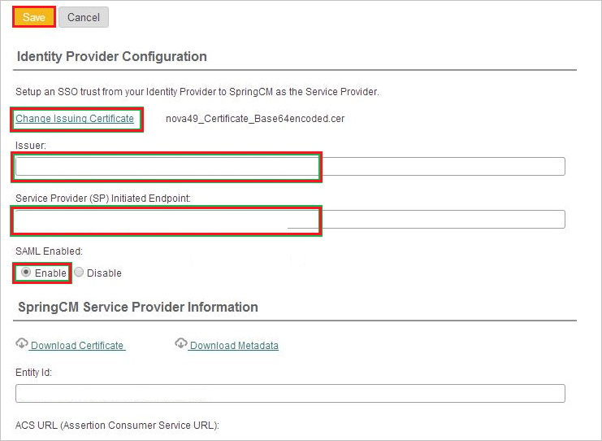

# Tutorial: Azure Active Directory integration with SpringCM

In this tutorial, you'll learn how to integrate SpringCM with Azure Active Directory (Azure AD). When you integrate SpringCM with Azure AD, you can:

* Control in Azure AD who has access to SpringCM.
* Enable your users to be automatically signed-in to SpringCM with their Azure AD accounts.
* Manage your accounts in one central location - the Azure portal.

## Prerequisites

To configure Azure AD integration with SpringCM, you need the following items:

* An Azure AD subscription. If you don't have an Azure AD environment, you can get a [free account](https://azure.microsoft.com/free/).
* SpringCM single sign-on enabled subscription.

## Scenario description

In this tutorial, you configure and test Azure AD single sign-on in a test environment.

* SpringCM supports **SP** initiated SSO.

> [!NOTE]
> Identifier of this application is a fixed string value so only one instance can be configured in one tenant.

## Add SpringCM from the gallery

To configure the integration of SpringCM into Azure AD, you need to add SpringCM from the gallery to your list of managed SaaS apps.

1. Sign in to the Azure portal using either a work or school account, or a personal Microsoft account.
1. On the left navigation pane, select the **Azure Active Directory** service.
1. Navigate to **Enterprise Applications** and then select **All Applications**.
1. To add new application, select **New application**.
1. In the **Add from the gallery** section, type **SpringCM** in the search box.
1. Select **SpringCM** from results panel and then add the app. Wait a few seconds while the app is added to your tenant.

 Alternatively, you can also use the [Enterprise App Configuration Wizard](https://portal.office.com/AdminPortal/home?Q=Docs#/azureadappintegration). In this wizard, you can add an application to your tenant, add users/groups to the app, assign roles, as well as walk through the SSO configuration as well. [Learn more about Microsoft 365 wizards.](/microsoft-365/admin/misc/azure-ad-setup-guides)

## Configure and test Azure AD SSO for SpringCM

Configure and test Azure AD SSO with SpringCM using a test user called **B.Simon**. For SSO to work, you need to establish a link relationship between an Azure AD user and the related user in SpringCM.

To configure and test Azure AD SSO with SpringCM, perform the following steps:

1. **[Configure Azure AD SSO](#configure-azure-ad-sso)** - to enable your users to use this feature.
    1. **[Create an Azure AD test user](#create-an-azure-ad-test-user)** - to test Azure AD single sign-on with B.Simon.
    1. **[Assign the Azure AD test user](#assign-the-azure-ad-test-user)** - to enable B.Simon to use Azure AD single sign-on.
1. **[Configure SpringCM SSO](#configure-springcm-sso)** - to configure the single sign-on settings on application side.
    1. **[Create SpringCM test user](#create-springcm-test-user)** - to have a counterpart of B.Simon in SpringCM that is linked to the Azure AD representation of user.
1. **[Test SSO](#test-sso)** - to verify whether the configuration works.

## Configure Azure AD SSO

Follow these steps to enable Azure AD SSO in the Azure portal.

1. In the Azure portal, on the **SpringCM** application integration page, find the **Manage** section and select **single sign-on**.
1. On the **Select a single sign-on method** page, select **SAML**.
1. On the **Set up single sign-on with SAML** page, click the pencil icon for **Basic SAML Configuration** to edit the settings.

   

4. On the **Basic SAML Configuration** section, perform the following steps:

    In the **Sign-on URL** text box, type a URL using the following pattern:
    `https://na11.springcm.com/atlas/SSO/SSOEndpoint.ashx?aid=<IDENTIFIER>`

    > [!NOTE]
    > The value is not real. Update the value with the actual Sign-On URL. Contact [SpringCM Client support team](https://knowledge.springcm.com/support) to get the value. You can also refer to the patterns shown in the **Basic SAML Configuration** section in the Azure portal.

4. On the **Set up Single Sign-On with SAML** page, in the **SAML Signing Certificate** section, click **Download** to download the **Certificate (Raw)** from the given options as per your requirement and save it on your computer.

    

6. On the **Set up SpringCM** section, copy the appropriate URL(s) as per your requirement.

    

### Create an Azure AD test user 

In this section, you'll create a test user in the Azure portal called B.Simon.

1. From the left pane in the Azure portal, select **Azure Active Directory**, select **Users**, and then select **All users**.
1. Select **New user** at the top of the screen.
1. In the **User** properties, follow these steps:
   1. In the **Name** field, enter `B.Simon`.  
   1. In the **User name** field, enter the username@companydomain.extension. For example, `B.Simon@contoso.com`.
   1. Select the **Show password** check box, and then write down the value that's displayed in the **Password** box.
   1. Click **Create**.

### Assign the Azure AD test user

In this section, you'll enable B.Simon to use Azure single sign-on by granting access to SpringCM.

1. In the Azure portal, select **Enterprise Applications**, and then select **All applications**.
1. In the applications list, select **SpringCM**.
1. In the app's overview page, find the **Manage** section and select **Users and groups**.
1. Select **Add user**, then select **Users and groups** in the **Add Assignment** dialog.
1. In the **Users and groups** dialog, select **B.Simon** from the Users list, then click the **Select** button at the bottom of the screen.
1. If you are expecting a role to be assigned to the users, you can select it from the **Select a role** dropdown. If no role has been set up for this app, you see "Default Access" role selected.
1. In the **Add Assignment** dialog, click the **Assign** button.

## Configure SpringCM SSO

1. In a different web browser window, sign on to your **SpringCM** company site as administrator.

1. In the menu on the top, click **GO TO**, click **Preferences**, and then, in the **Account Preferences** section, click **SAML SSO**.

    

1. In the Identity Provider Configuration section, perform the following steps:

    

    a. To upload your downloaded Azure Active Directory certificate, click **Select Issuer Certificate** or **Change Issuer Certificate**.

    b. In the **Issuer** textbox, paste **Azure AD Identifier** value, which you have copied from Azure portal.

    c. In the **Service Provider (SP) Initiated Endpoint** textbox, paste **Login URL** value, which you have copied from the Azure portal.

    d. Select **SAML Enabled** as **Enable**.

    e. Click **Save**.

### Create SpringCM test user

To enable Azure Active Directory users to sign in to SpringCM, they must be provisioned into SpringCM. In the case of SpringCM, provisioning is a manual task.

> [!NOTE]
> For more information, see [Create and Edit a SpringCM User](https://support.docusign.com/s/document-item?language=en_US&bundleId=fsk1642969066834&topicId=ynn1576609925288.html&_LANG=enus). 

**To provision a user account to SpringCM, perform the following steps:**

1. Sign in to your **SpringCM** company site as administrator.

1. Click **GOTO**, and then click **ADDRESS BOOK**.

    

1. Click **Create User**.

1. Select a **User Role**.

1. Select **Send Activation Email**.

1. Type the first name, last name, and email address of a valid Azure Active Directory user account you want to provision into the related textboxes.

1. Add the user to a **Security group**.

1. Click **Save**.

   > [!NOTE]
   > You can use any other SpringCM user account creation tools or APIs provided by SpringCM to provision Azure AD user accounts.

## Test SSO

In this section, you test your Azure AD single sign-on configuration with following options. 

* Click on **Test this application** in Azure portal. This will redirect to SpringCM Sign-on URL where you can initiate the login flow. 

* Go to SpringCM Sign-on URL directly and initiate the login flow from there.

* You can use Microsoft My Apps. When you click the SpringCM tile in the My Apps, this will redirect to SpringCM Sign-on URL. For more information about the My Apps, see [Introduction to the My Apps](https://support.microsoft.com/account-billing/sign-in-and-start-apps-from-the-my-apps-portal-2f3b1bae-0e5a-4a86-a33e-876fbd2a4510).

## Next steps

Once you configure SpringCM you can enforce session control, which protects exfiltration and infiltration of your organization’s sensitive data in real time. Session control extends from Conditional Access. [Learn how to enforce session control with Microsoft Defender for Cloud Apps](/cloud-app-security/proxy-deployment-aad).
