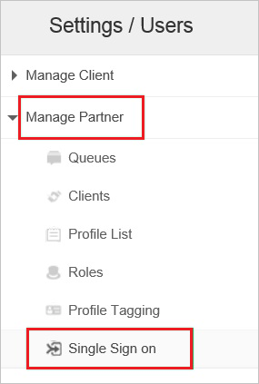
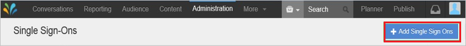
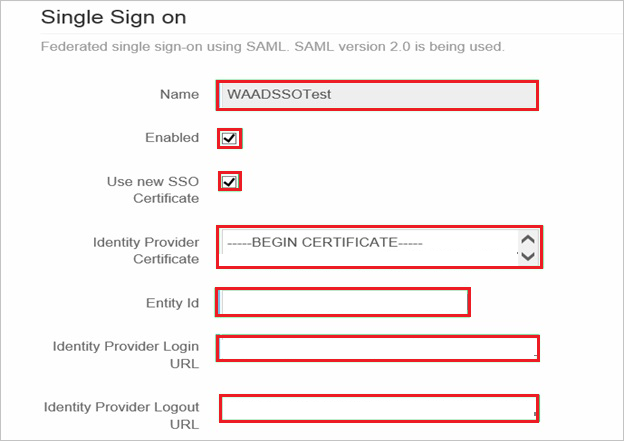
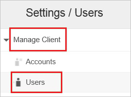
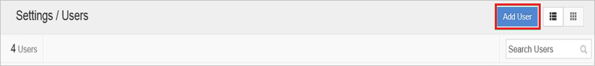
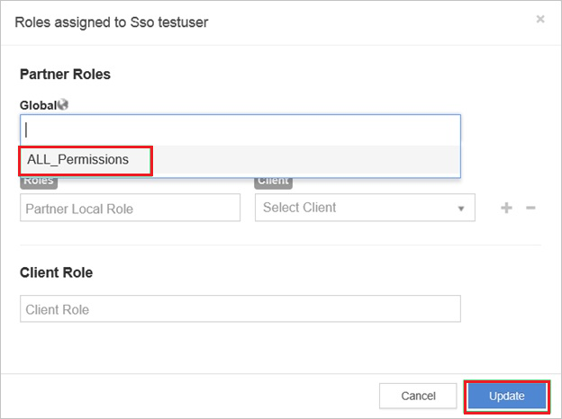

# Tutorial: Azure Active Directory integration with Sprinklr

In this tutorial, you'll learn how to integrate Sprinklr with Azure Active Directory (Azure AD). When you integrate Sprinklr with Azure AD, you can:

* Control in Azure AD who has access to Sprinklr.
* Enable your users to be automatically signed-in to Sprinklr with their Azure AD accounts.
* Manage your accounts in one central location - the Azure portal.

## Prerequisites

To get started, you need the following items:

* An Azure AD subscription. If you don't have a subscription, you can get a [free account](https://azure.microsoft.com/free/).
* Sprinklr single sign-on (SSO) enabled subscription.

## Scenario description

In this tutorial, you configure and test Azure AD single sign-on in a test environment.

* Sprinklr supports **SP** initiated SSO.

## Add Sprinklr from the gallery

To configure the integration of Sprinklr into Azure AD, you need to add Sprinklr from the gallery to your list of managed SaaS apps.

1. Sign in to the Azure portal using either a work or school account, or a personal Microsoft account.
1. On the left navigation pane, select the **Azure Active Directory** service.
1. Navigate to **Enterprise Applications** and then select **All Applications**.
1. To add new application, select **New application**.
1. In the **Add from the gallery** section, type **Sprinklr** in the search box.
1. Select **Sprinklr** from results panel and then add the app. Wait a few seconds while the app is added to your tenant.

 Alternatively, you can also use the [Enterprise App Configuration Wizard](https://portal.office.com/AdminPortal/home?Q=Docs#/azureadappintegration). In this wizard, you can add an application to your tenant, add users/groups to the app, assign roles, as well as walk through the SSO configuration as well. [Learn more about Microsoft 365 wizards.](/microsoft-365/admin/misc/azure-ad-setup-guides)

## Configure and test Azure AD SSO for Sprinklr

Configure and test Azure AD SSO with Sprinklr using a test user called **B.Simon**. For SSO to work, you need to establish a link relationship between an Azure AD user and the related user in Sprinklr.

To configure and test Azure AD SSO with Sprinklr, perform the following steps:

1. **[Configure Azure AD SSO](#configure-azure-ad-sso)** - to enable your users to use this feature.
    1. **[Create an Azure AD test user](#create-an-azure-ad-test-user)** - to test Azure AD single sign-on with B.Simon.
    1. **[Assign the Azure AD test user](#assign-the-azure-ad-test-user)** - to enable B.Simon to use Azure AD single sign-on.
1. **[Configure Sprinklr SSO](#configure-sprinklr-sso)** - to configure the single sign-on settings on application side.
    1. **[Create Sprinklr test user](#create-sprinklr-test-user)** - to have a counterpart of B.Simon in Sprinklr that is linked to the Azure AD representation of user.
1. **[Test SSO](#test-sso)** - to verify whether the configuration works.

## Configure Azure AD SSO

Follow these steps to enable Azure AD SSO in the Azure portal.

1. In the Azure portal, on the **Sprinklr** application integration page, find the **Manage** section and select **single sign-on**.
1. On the **Select a single sign-on method** page, select **SAML**.
1. On the **Set up single sign-on with SAML** page, click the pencil icon for **Basic SAML Configuration** to edit the settings.

   

4. On the **Basic SAML Configuration** section, perform the following steps:

	1. In the **Sign on URL** text box, type a URL using the following pattern:
    `https://<SUBDOMAIN>.sprinklr.com`

    1. In the **Identifier (Entity ID)** text box, type a URL using the following pattern:
    `https://<SUBDOMAIN>.sprinklr.com`

	> [!NOTE]
	> These values are not real. Update these values with the actual Sign on URL and Identifier. Contact [Sprinklr Client support team](https://www.sprinklr.com/contact-us/) to get these values. You can also refer to the patterns shown in the **Basic SAML Configuration** section in the Azure portal.

5. On the **Set up Single Sign-On with SAML** page, in the **SAML Signing Certificate** section, click **Download** to download the **Certificate (Base64)** from the given options as per your requirement and save it on your computer.

	

6. On the **Set up Sprinklr** section, copy the appropriate URL(s) as per your requirement.

	

### Create an Azure AD test user

In this section, you'll create a test user in the Azure portal called B.Simon.

1. From the left pane in the Azure portal, select **Azure Active Directory**, select **Users**, and then select **All users**.
1. Select **New user** at the top of the screen.
1. In the **User** properties, follow these steps:
   1. In the **Name** field, enter `B.Simon`.  
   1. In the **User name** field, enter the username@companydomain.extension. For example, `B.Simon@contoso.com`.
   1. Select the **Show password** check box, and then write down the value that's displayed in the **Password** box.
   1. Click **Create**.

### Assign the Azure AD test user

In this section, you'll enable B.Simon to use Azure single sign-on by granting access to Sprinklr.

1. In the Azure portal, select **Enterprise Applications**, and then select **All applications**.
1. In the applications list, select **Sprinklr**.
1. In the app's overview page, find the **Manage** section and select **Users and groups**.
1. Select **Add user**, then select **Users and groups** in the **Add Assignment** dialog.
1. In the **Users and groups** dialog, select **B.Simon** from the Users list, then click the **Select** button at the bottom of the screen.
1. If you are expecting a role to be assigned to the users, you can select it from the **Select a role** dropdown. If no role has been set up for this app, you see "Default Access" role selected.
1. In the **Add Assignment** dialog, click the **Assign** button.

## Configure Sprinklr SSO

1. In a different web browser window, log in to your Sprinklr company site as an administrator.

1. Go to **Administration \> Settings**.

    

1. Go to **Manage Partner \> Single Sign** on from the left pane.

    

1. Click **+Add Single Sign Ons**.

    

1. On the **Single Sign on** page, perform the following steps:

    

    1. In the **Name** textbox, type a name for your configuration (for example: **WAADSSOTest**).

    1. Select **Enabled**.

    1. Select **Use new SSO Certificate**.

    1. Open your base-64 encoded certificate in notepad, copy the content of it into your clipboard, and then paste it to the **Identity Provider Certificate** textbox.

    1. Paste the **Azure AD Identifier** value which you have copied from Azure portal into the **Entity Id** textbox.

    1. Paste the **Login URL** value which you have copied from Azure portal into the **Identity Provider Login URL** textbox.

    1. Paste the **Logout URL** value which you have copied from Azure portal into the **Identity Provider Logout URL** textbox.

    1. As **SAML User ID Type**, select **Assertion contains User’s sprinklr.com username**.

    1. As **SAML User ID Location**, select **User ID is in the Name Identifier element of the Subject statement**.

    1. Click **Save**.

    

### Create Sprinklr test user

1. Log in to your Sprinklr company site as an administrator.

1. Go to **Administration \> Settings**.

    

1. Go to **Manage Client \> Users** from the left pane.

    

1. Click **Add User**.

    

1. On the **Edit user** dialog, perform the following steps:

    

    1. In the **Email**, **First Name** and **Last Name** textboxes, type the information of an Azure AD user account you want to provision.

    1. Select **Password Disabled**.

    1. Select **Language**.

    1. Select **User Type**.

    1. Click **Update**.

    > [!IMPORTANT]
    > **Password Disabled** must be selected to enable a user to log in via an Identity provider. 

1. Go to **Role**, and then perform the following steps:

    

    1. From the **Global** list, select **ALL_Permissions**.  

    1. Click **Update**.

> [!NOTE]
> You can use any other Sprinklr user account creation tools or APIs provided by Sprinklr to provision Azure AD user accounts.

## Test SSO

In this section, you test your Azure AD single sign-on configuration with following options. 

* Click on **Test this application** in Azure portal. This will redirect to Sprinklr Sign-on URL where you can initiate the login flow. 

* Go to Sprinklr Sign-on URL directly and initiate the login flow from there.

* You can use Microsoft My Apps. When you click the Sprinklr tile in the My Apps, this will redirect to Sprinklr Sign-on URL. For more information about the My Apps, see [Introduction to the My Apps](https://support.microsoft.com/account-billing/sign-in-and-start-apps-from-the-my-apps-portal-2f3b1bae-0e5a-4a86-a33e-876fbd2a4510).

## Next steps

Once you configure Sprinklr you can enforce session control, which protects exfiltration and infiltration of your organization’s sensitive data in real time. Session control extends from Conditional Access. [Learn how to enforce session control with Microsoft Defender for Cloud Apps](/cloud-app-security/proxy-deployment-aad).
