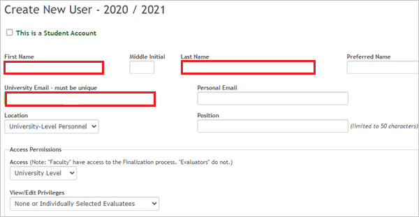

# Tutorial: Azure Active Directory single sign-on (SSO) integration with Standard for Success Accreditation

In this tutorial, you'll learn how to integrate Standard for Success Accreditation with Azure Active Directory (Azure AD). When you integrate Standard for Success Accreditation with Azure AD, you can:

* Control in Azure AD who has access to Standard for Success Accreditation.
* Enable your users to be automatically signed-in to Standard for Success Accreditation with their Azure AD accounts.

## Prerequisites

To get started, you need the following items:

* An Azure AD subscription. If you don't have a subscription, you can get a [free account](https://azure.microsoft.com/free/).
* Standard for Success Accreditation single sign-on (SSO) enabled subscription.

## Scenario description

In this tutorial, you configure and test Azure AD SSO in a test environment.

* Standard for Success Accreditation supports **SP and IDP** initiated SSO.

## Add Standard for Success Accreditation from the gallery

To configure the integration of Standard for Success Accreditation into Azure AD, you need to add Standard for Success Accreditation from the gallery to your list of managed SaaS apps.

1. Sign in to the Azure portal using either a work or school account, or a personal Microsoft account.
1. On the left navigation pane, select the **Azure Active Directory** service.
1. Navigate to **Enterprise Applications** and then select **All Applications**.
1. To add new application, select **New application**.
1. In the **Add from the gallery** section, type **Standard for Success Accreditation** in the search box.
1. Select **Standard for Success Accreditation** from the results panel and then add the app. Wait a few seconds while the app is added to your tenant.

## Configure and test Azure AD SSO for Standard for Success Accreditation

Configure and test Azure AD SSO with Standard for Success Accreditation using a test user called **B.Simon**. For SSO to work, you need to establish a link relationship between an Azure AD user and the related user in Standard for Success Accreditation.

To configure and test Azure AD SSO with Standard for Success Accreditation, perform the following steps:

1. **[Configure Azure AD SSO](#configure-azure-ad-sso)** - to enable your users to use this feature.
    1. **[Create an Azure AD test user](#create-an-azure-ad-test-user)** - to test Azure AD single sign-on with B.Simon.
    1. **[Assign the Azure AD test user](#assign-the-azure-ad-test-user)** - to enable B.Simon to use Azure AD single sign-on.
1. **[Configure Standard for Success Accreditation SSO](#configure-standard-for-success-accreditation-sso)** - to configure the single sign-on settings on application side.
    1. **[Create Standard for Success Accreditation test user](#create-standard-for-success-accreditation-test-user)** - to have a counterpart of B.Simon in Standard for Success Accreditation that is linked to the Azure AD representation of user.
1. **[Test SSO](#test-sso)** - to verify whether the configuration works.

## Configure Azure AD SSO

Follow these steps to enable Azure AD SSO in the Azure portal.

1. In the Azure portal, on the **Standard for Success Accreditation** application integration page, find the **Manage** section and select **single sign-on**.
1. On the **Select a single sign-on method** page, select **SAML**.
1. On the **Set up single sign-on with SAML** page, click the pencil icon for **Basic SAML Configuration** to edit the settings.

   

1. On the **Basic SAML Configuration** section, if you wish to configure the application in **IDP** initiated mode, perform the following steps:

    a. In the **Identifier** text box, type a value using the following pattern: 
    `api://<ApplicationId>`

    b. In the **Reply URL** text box, type a URL using the following pattern:
    `https://edu.sfsed.com/access/saml_consume?did=<INSTITUTION-ID>`

1. Click **Set additional URLs** and perform the following steps if you wish to configure the application in **SP** initiated mode:

    a. In the **Sign-on URL** text box, type a URL using the following pattern:
    `https://edu.sfsed.com/access/saml_int?did=<INSTITUTION-ID>`

    b. In the **Relay State** text box, type a URL using the following pattern:
    `https://edu.sfsed.com/access/saml_consume?did=<INSTITUTION-ID>`

    > [!NOTE]
    > These values are not real. Update these values with the actual Identifier, Reply URL, Sign-on URL and Relay State. Contact [Standard for Success Accreditation Client support team](mailto:help_he@standardforsuccess.com) to get these values. You can also refer to the patterns shown in the **Basic SAML Configuration** section in the Azure portal.

1. In the **SAML Signing Certificate** section, click **Edit** button to open **SAML Signing Certificate** dialog.

	

1. In the **SAML Signing Certificate** section, copy the **Thumbprint Value** and save it on your computer.

    

1. On the **Set up Standard for Success Accreditation** section, copy the appropriate URL(s) based on your requirement.

	

### Create an Azure AD test user

In this section, you'll create a test user in the Azure portal called B.Simon.

1. From the left pane in the Azure portal, select **Azure Active Directory**, select **Users**, and then select **All users**.
1. Select **New user** at the top of the screen.
1. In the **User** properties, follow these steps:
   1. In the **Name** field, enter `B.Simon`.  
   1. In the **User name** field, enter the username@institutiondomain.extension. For example, `B.Simon@contoso.com`.
   1. Select the **Show password** check box, and then write down the value that's displayed in the **Password** box.
   1. Click **Create**.

### Assign the Azure AD test user

In this section, you'll enable B.Simon to use Azure single sign-on by granting access to Standard for Success Accreditation.

1. In the Azure portal, select **Enterprise Applications**, and then select **All applications**.
1. In the applications list, select **Standard for Success Accreditation**.
1. In the app's overview page, find the **Manage** section and select **Users and groups**.
1. Select **Add user**, then select **Users and groups** in the **Add Assignment** dialog.
1. In the **Users and groups** dialog, select **B.Simon** from the Users list, then click the **Select** button at the bottom of the screen.
1. If you are expecting a role to be assigned to the users, you can select it from the **Select a role** dropdown. If no role has been set up for this app, you see "Default Access" role selected.
1. In the **Add Assignment** dialog, click the **Assign** button.

## Configure Standard for Success Accreditation SSO

1. Open a new web browser window and sign into the Standard for Success Accreditation site as an administrator with superuser access.

1. From the menu, click on **Admin Portal**.

1. Scroll down to **Single Sign On Settings** and click the **Microsoft Azure Single Sign On** link and perform the following steps.

    :::image type="content" source="./media/standard-for-success-accreditation-tutorial/configuration.png" alt-text="Screenshot that shows how to enable Azure single sign-on in Standard for Success Accreditation.":::

    a. Select the **Enable Azure Single Sign On** checkbox.

    b. Fill the URL and Identifier fields with the appropriate URLs copied from the Azure portal SAML setup.

    c. Fill the Application ID in the **Application ID** text box.

    d. In the **Certificate Thumbprint** text box, paste the **Thumbprint Value** that you copied from the Azure portal.

    e. Click **Save**. 

### Create Standard for Success Accreditation test user

1.	Sign in to Standard for Success Accreditation as an Administrator with superuser privileges.

1. From the menu, click on **Admin Portal** > **Create New Evaluatee** and perform the following steps.

    

    a. In **First Name** text box, enter B.

    b. In **Last Name** text box, enter Simon.

    c. In **University Email** text box, enter the email address you added for B.Simon within Azure.

    d. Scroll to the bottom and Click **Create User**.

## Test SSO 

In this section, you test your Azure AD single sign-on configuration with following options. 

#### SP initiated:

* Click on **Test this application** in Azure portal. This will redirect to Standard for Success Accreditation Sign on URL where you can initiate the login flow.  

* Go to Standard for Success Accreditation Sign-on URL directly and initiate the login flow from there.

#### IDP initiated:

* Click on **Test this application** in Azure portal and you should be automatically signed in to the Standard for Success Accreditation for which you set up the SSO 

You can also use Microsoft My Apps to test the application in any mode. When you click the Standard for Success Accreditation tile in the My Apps, if configured in SP mode you would be redirected to the application sign on page for initiating the login flow and if configured in IDP mode, you should be automatically signed in to the Standard for Success Accreditation for which you set up the SSO. For more information about the My Apps, see [Introduction to the My Apps](../user-help/my-apps-portal-end-user-access.md).

## Next steps

Once you configure Standard for Success Accreditation you can enforce session control, which protects exfiltration and infiltration of your organization’s sensitive data in real time. Session control extends from Conditional Access. [Learn how to enforce session control with Microsoft Cloud App Security](/cloud-app-security/proxy-deployment-any-app).
