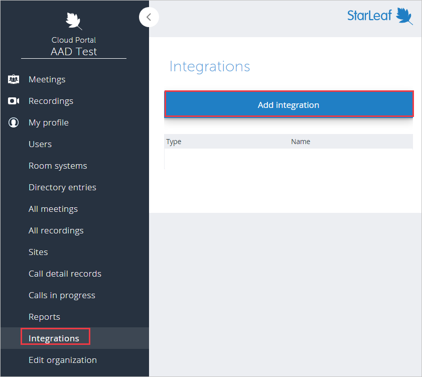
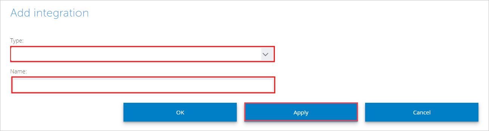
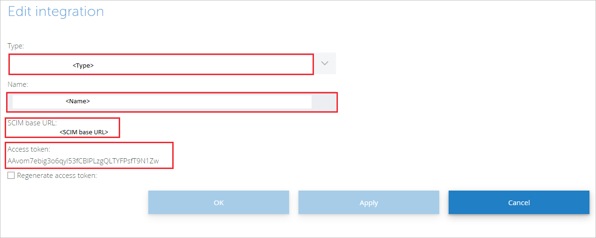
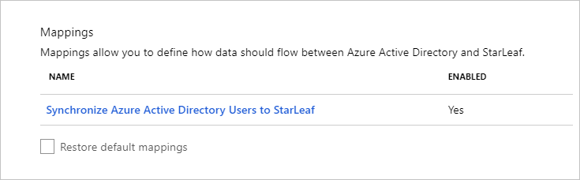

# Tutorial: Configure StarLeaf for automatic user provisioning

The objective of this tutorial is to demonstrate the steps to be performed in StarLeaf and Azure Active Directory (Azure AD) to configure Azure AD to automatically provision and de-provision users and/or groups to StarLeaf.

> [!NOTE]
>  This tutorial describes a connector built on top of the Azure AD User Provisioning Service. For important details on what this service does, how it works, and frequently asked questions, see [Automate user provisioning and deprovisioning to SaaS applications with Azure Active Directory](../app-provisioning/user-provisioning.md).
>
> This connector is currently in Preview. For more information on the general Microsoft Azure terms of use for Preview features, see [Supplemental Terms of Use for Microsoft Azure Previews](https://azure.microsoft.com/support/legal/preview-supplemental-terms/).

## Prerequisites

The scenario outlined in this tutorial assumes that you already have the following prerequisites:

* An Azure AD tenant.
* [A StarLeaf tenant](https://www.starleaf.com/solutions/).
* A user account in StarLeaf with Admin permissions.

## Assign users to StarLeaf
Azure Active Directory uses a concept called assignments to determine which users should receive access to selected apps. In the context of automatic user provisioning, only the users and/or groups that have been assigned to an application in Azure AD are synchronized.

Before you configure and enable automatic user provisioning, you should decide which users and groups in Azure AD need access to StarLeaf. Then you can assign the users and groups to StarLeaf by following [these instructions](../manage-apps/assign-user-or-group-access-portal.md).

## Important tips for assigning users to StarLeaf

* It's recommended that a single Azure AD user is assigned to StarLeaf to test the automatic user provisioning configuration. Additional users and groups can be assigned later.

* When you assign a user to StarLeaf, you must select any valid application-specific role (if available) in the assignment dialog. Users with the Default Access role are excluded from provisioning.

## Set up StarLeaf for provisioning

Before you configure StarLeaf for automatic user provisioning with Azure AD, you will need to configure SCIM provisioning in StarLeaf:

1. Sign in to your [StarLeaf Admin Console](https://portal.starleaf.com/#page=login). Navigate to **Integrations** > **Add integration**.

	

2. Select the **Type** to be Microsoft Azure Active Directory. Enter a suitable name in **Name**. Click **Apply**.

	

3.  The **SCIM base URL** and **Access token** values will be then displayed. These values will be entered in the **Tenant URL** and **Secret Token** fields in the Provisioning tab of your StarLeaf application in the Azure portal. 

	

## Add StarLeaf from the gallery

To configuring StarLeaf for automatic user provisioning with Azure AD, you need to add StarLeaf from the Azure AD application gallery to your list of managed SaaS applications.

**To add StarLeaf from the Azure AD application gallery, perform the following steps:**

1. In the **[Azure portal](https://portal.azure.com)**, in the left navigation panel, select **Azure Active Directory**.

	

2. Go to **Enterprise applications**, and then select **All applications**.

	

3. To add a new application, select the **New application** button at the top of the pane.

	

4. In the search box, enter **StarLeaf**, select **StarLeaf** in the results panel.
	

## Configure automatic user provisioning to StarLeaf

This section guides you through the steps to configure the Azure AD provisioning service to create, update, and disable users and/or groups in StarLeaf based on user and/or group assignments in Azure AD.

1. Sign in to the [Azure portal](https://portal.azure.com). Select **Enterprise Applications**, then select **All applications**.

	

2. In the applications list, select **StarLeaf**.

	

3. Select the **Provisioning** tab.

	

4. Set the **Provisioning Mode** to **Automatic**.

	

5. Under the Admin Credentials section, input the **SCIM Base URL** and **Access Token** values retrieved earlier in **Tenant URL** and **Secret Token** respectively. Click **Test Connection** to ensure Azure AD can connect to StarLeaf. If the connection fails, ensure your StarLeaf account has Admin permissions and try again.

	

6. In the **Notification Email** field, enter the email address of a person or group who should receive the provisioning error notifications and check the **Send an email notification when a failure occurs** box.

	

7. Click **Save**.

8. Under the **Mappings** section, select **Synchronize Azure Active Directory Users to StarLeaf**.

	

9. Review the user attributes that are synchronized from Azure AD to StarLeaf in the **Attribute Mapping** section. The attributes selected as **Matching** properties are used to match the user accounts in StarLeaf for update operations. Select the **Save** button to commit any changes.

	

10. To configure scoping filters, refer to the following instructions provided in the [Scoping filter tutorial](../app-provisioning/define-conditional-rules-for-provisioning-user-accounts.md).

11. To enable the Azure AD provisioning service for StarLeaf, change the **Provisioning Status** to **On** in the **Settings** section.

	

12. Define the users and/or groups that you would like to provision to StarLeaf by choosing the desired values in **Scope** in the **Settings** section.

	

13. When you are ready to provision, click **Save**.

	

This operation starts the initial synchronization of all users and/or groups defined in **Scope** in the **Settings** section. The initial sync takes longer to perform than subsequent syncs, which occur approximately every 40 minutes as long as the Azure AD provisioning service is running. You can use the **Synchronization Details** section to monitor progress and follow links to provisioning activity report, which describes all actions performed by the Azure AD provisioning service on StarLeaf.

For more information on how to read the Azure AD provisioning logs, see [Reporting on automatic user account provisioning](../app-provisioning/check-status-user-account-provisioning.md)

## Connector limitations

* StarLeaf doesn't currently support group provisioning. 
* StarLeaf requires **email** and **userName** values to have the same source value.

## Additional resources

* [Manage user account provisioning for enterprise apps](../app-provisioning/configure-automatic-user-provisioning-portal.md)
* [What is application access and single sign-on with Azure Active Directory?](../manage-apps/what-is-single-sign-on.md)

## Next steps

* Learn how to [review logs and get reports on provisioning activity](../app-provisioning/check-status-user-account-provisioning.md).
