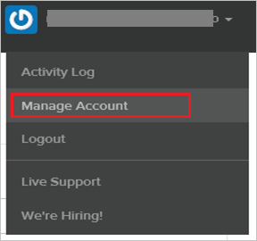
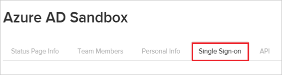
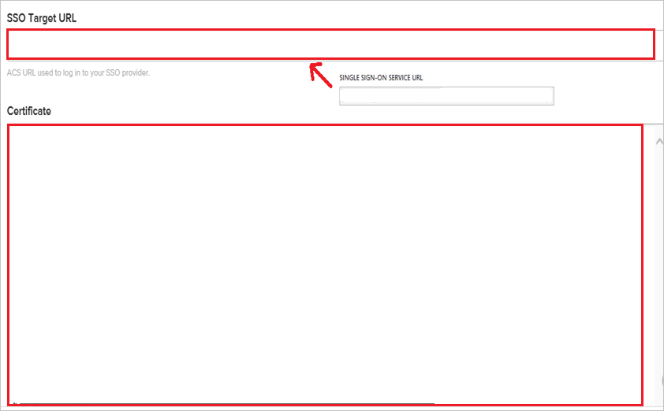
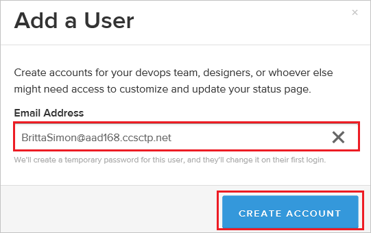

# Tutorial: Azure Active Directory single sign-on (SSO) integration with StatusPage

In this tutorial, you'll learn how to integrate StatusPage with Azure Active Directory (Azure AD). When you integrate StatusPage with Azure AD, you can:

* Control in Azure AD who has access to StatusPage.
* Enable your users to be automatically signed-in to StatusPage with their Azure AD accounts.
* Manage your accounts in one central location - the Azure portal.

## Prerequisites

To configure Azure AD integration with StatusPage, you need the following items:

* An Azure AD subscription. If you don't have an Azure AD environment, you can get a [free account](https://azure.microsoft.com/free/).
* StatusPage single sign-on enabled subscription.

## Scenario description

In this tutorial, you configure and test Azure AD single sign-on in a test environment.

* StatusPage supports **IDP** initiated SSO.

## Add StatusPage from the gallery

To configure the integration of StatusPage into Azure AD, you need to add StatusPage from the gallery to your list of managed SaaS apps.

1. Sign in to the Azure portal using either a work or school account, or a personal Microsoft account.
1. On the left navigation pane, select the **Azure Active Directory** service.
1. Navigate to **Enterprise Applications** and then select **All Applications**.
1. To add new application, select **New application**.
1. In the **Add from the gallery** section, type **StatusPage** in the search box.
1. Select **StatusPage** from results panel and then add the app. Wait a few seconds while the app is added to your tenant.

## Configure and test Azure AD SSO for StatusPage

In this section, you configure and test Azure AD single sign-on with StatusPage based on a test user called **Britta Simon**.
For single sign-on to work, a link relationship between an Azure AD user and the related user in StatusPage needs to be established.

To configure and test Azure AD SSO with StatusPage, perform the following steps:

1. **[Configure Azure AD SSO](#configure-azure-ad-sso)** - to enable your users to use this feature.
    1. **[Create an Azure AD test user](#create-an-azure-ad-test-user)** - to test Azure AD single sign-on with Britta Simon.
    1. **[Assign the Azure AD test user](#assign-the-azure-ad-test-user)** - to enable Britta Simon to use Azure AD single sign-on.
1. **[Configure StatusPage SSO](#configure-statuspage-sso)** - to configure the Single Sign-On settings on application side.
    1. **[Create StatusPage test user](#create-statuspage-test-user)** - to have a counterpart of Britta Simon in StatusPage that is linked to the Azure AD representation of user.
6. **[Test SSO](#test-sso)** - to verify whether the configuration works.

## Configure Azure AD SSO

Follow these steps to enable Azure AD SSO in the Azure portal.

1. In the Azure portal, on the **AskYourTeam** application integration page, find the **Manage** section and select **single sign-on**.
1. On the **Select a single sign-on method** page, select **SAML**.
1. On the **Set up single sign-on with SAML** page, click the pencil icon for **Basic SAML Configuration** to edit the settings.

   

4. On the **Set up Single Sign-On with SAML** page, perform the following steps:

    a. In the **Identifier** text box, type a URL using one of the following patterns:

    | Identifier |
    |--------------|
    | `https://<subdomain>.statuspagestaging.com/` |
    | `https://<subdomain>.statuspage.io/` |
    |

    b. In the **Reply URL** text box, type a URL using one of the following patterns:

     | Reply URL |
    |--------------|
    | `https://<subdomain>.statuspagestaging.com/sso/saml/consume` |
    | `https://<subdomain>.statuspage.io/sso/saml/consume` |
    |

    > [!NOTE]
    > Contact the StatusPage support team at [SupportTeam@statuspage.io](mailto:SupportTeam@statuspage.io)to request metadata necessary to configure single sign-on. 
    >
    > a. From the metadata, copy the Issuer value, and then paste it into the **Identifier** textbox.
    >
    > b. From the metadata, copy the Reply URL, and then paste it into the **Reply URL** textbox.

5. On the **Set up Single Sign-On with SAML** page, in the **SAML Signing Certificate** section, click **Download** to download the **Certificate (Base64)** from the given options as per your requirement and save it on your computer.

	

6. On the **Set up StatusPage** section, copy the appropriate URL(s) as per your requirement.

	

### Create an Azure AD test user

In this section, you'll create a test user in the Azure portal called B.Simon.

1. From the left pane in the Azure portal, select **Azure Active Directory**, select **Users**, and then select **All users**.
1. Select **New user** at the top of the screen.
1. In the **User** properties, follow these steps:
   1. In the **Name** field, enter `B.Simon`.  
   1. In the **User name** field, enter the username@companydomain.extension. For example, `B.Simon@contoso.com`.
   1. Select the **Show password** check box, and then write down the value that's displayed in the **Password** box.
   1. Click **Create**.

### Assign the Azure AD test user

In this section, you enable Britta Simon to use Azure single sign-on by granting access to StatusPage.

1. In the Azure portal, select **Enterprise Applications**, select **All applications**, then select **StatusPage**.

2. In the applications list, select **StatusPage**.

3. In the menu on the left, select **Users and groups**.

4. Click the **Add user** button, then select **Users and groups** in the **Add Assignment** dialog.

5. In the **Users and groups** dialog select **Britta Simon** in the Users list, then click the **Select** button at the bottom of the screen.

6. If you are expecting a role to be assigned to the users, you can select it from the **Select a role** dropdown. If no role has been set up for this app, you see "Default Access" role selected.

7. In the **Add Assignment** dialog click the **Assign** button.

## Configure StatusPage SSO

1. To automate the configuration within StatusPage, you need to install **My Apps Secure Sign-in browser extension** by clicking **Install the extension**.

	

2. After adding extension to the browser, click on **Set up StatusPage** will direct you to the StatusPage application. From there, provide the admin credentials to sign into StatusPage. The browser extension will automatically configure the application for you and automate steps 3-6.

	

3. If you want to setup StatusPage manually, in a different web browser window, sign in to your StatusPage company site as an administrator.

1. In the main toolbar, click **Manage Account**.

    

1. Click the **Single Sign-on** tab.

    

1. On the SSO Setup page, perform the following steps:

    

    

    a. In the **SSO Target URL** textbox, paste the value of **Login URL**, which you have copied from Azure portal.

    b. Open your downloaded certificate in Notepad, copy the content, and then paste it into the **Certificate** textbox.

    c. Click **SAVE CONFIGURATION**.

### Create StatusPage test user

The objective of this section is to create a user called Britta Simon in StatusPage.

StatusPage supports just-in-time provisioning. You have already enabled it in [Configure Azure AD Single Sign-On](#configure-azure-ad-sso).

**To create a user called Britta Simon in StatusPage, perform the following steps:**

1. Sign-on to your StatusPage company site as an administrator.

1. In the menu on the top, click **Manage Account**.

	

1. Click the **Team Members** tab.
  
     

1. Click **ADD TEAM MEMBER**.
  
     

1. Type the **Email Address**, **First Name**, and **Surname** of a valid user you want to provision into the related textboxes. 

     

1. As **Role**, choose **Client Administrator**.

1. Click **CREATE ACCOUNT**.

## Test SSO

In this section, you test your Azure AD single sign-on configuration with following options.

* Click on Test this application in Azure portal and you should be automatically signed in to the StatusPage for which you set up the SSO

* You can use Microsoft My Apps. When you click the StatusPage tile in the My Apps, you should be automatically signed in to the StatusPage for which you set up the SSO. For more information about the My Apps, see [Introduction to the My Apps](../user-help/my-apps-portal-end-user-access.md).

## Next steps

Once you configure StatusPage you can enforce session control, which protects exfiltration and infiltration of your organization’s sensitive data in real time. Session control extends from Conditional Access. [Learn how to enforce session control with Microsoft Cloud App Security](/cloud-app-security/proxy-deployment-any-app).