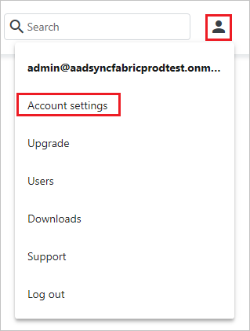
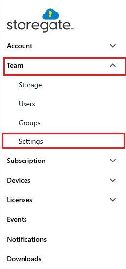
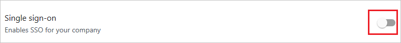
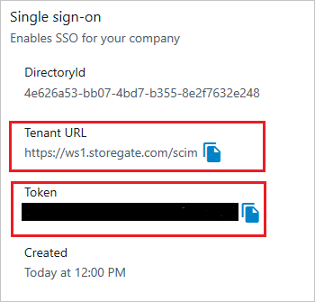
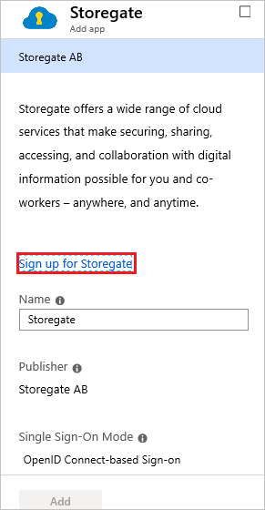
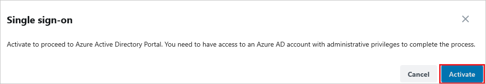
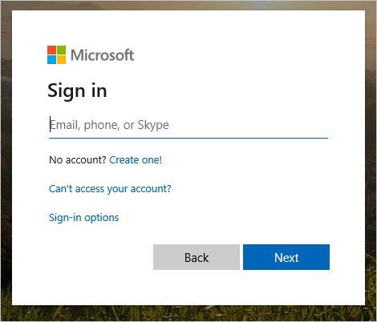
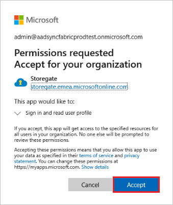
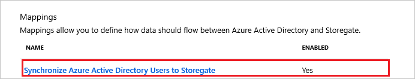
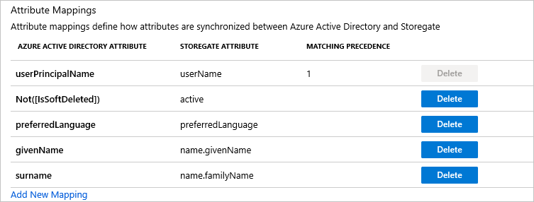

# Tutorial: Configure Storegate for automatic user provisioning

The objective of this tutorial is to demonstrate the steps to be performed in Storegate and Microsoft Entra ID to configure Microsoft Entra ID to automatically provision and de-provision users and/or groups to Storegate.

> [!NOTE]
> This tutorial describes a connector built on top of the Microsoft Entra user Provisioning Service. For important details on what this service does, how it works, and frequently asked questions, see [Automate user provisioning and deprovisioning to SaaS applications with Microsoft Entra ID](../app-provisioning/user-provisioning.md).
>

## Prerequisites

The scenario outlined in this tutorial assumes that you already have the following prerequisites:

* A Microsoft Entra tenant
* [A Storegate tenant](https://www.storegate.com)
* A user account on a Storegate with Administrator permissions.

## Assign users to Storegate

Microsoft Entra ID uses a concept called assignments to determine which users should receive access to selected apps. In the context of automatic user provisioning, only the users and/or groups that have been assigned to an application in Microsoft Entra ID are synchronized.

Before configuring and enabling automatic user provisioning, you should decide which users and/or groups in Microsoft Entra ID need access to Storegate. Once decided, you can assign these users and/or groups to Storegate by following the instructions here:

* [Assign a user or group to an enterprise app](../manage-apps/assign-user-or-group-access-portal.md)

### Important tips for assigning users to Storegate

* It is recommended that a single Microsoft Entra user is assigned to Storegate to test the automatic user provisioning configuration. Additional users and/or groups may be assigned later.

* When assigning a user to Storegate, you must select any valid application-specific role (if available) in the assignment dialog. Users with the **Default Access** role are excluded from provisioning.

## Set up Storegate for provisioning

Before configuring Storegate for automatic user provisioning with Microsoft Entra ID, you will need to retrieve some provisioning information from Storegate.

1. Sign in to your [Storegate Admin Console](https://ws1.storegate.com/identity/core/login?signin=c71fb8fe18243c571da5b333d5437367) and navigate to the settings by clicking on the user icon in the upper right corner and select **Account Settings**.

	

2. Within settings navigate to **Team > Settings** and verify that the toggle switch is switched on in the **Single sign-on** section.

	

	

3. Copy the **Tenant URL** and **Token**. These values will be entered in the **Tenant URL** and **Secret Token** fields respectively in the Provisioning tab of your Storegate application. 

	

## Add Storegate from the gallery

To configure Storegate for automatic user provisioning with Microsoft Entra ID, you need to add Storegate from the Microsoft Entra application gallery to your list of managed SaaS applications.

1. Sign in to the [Microsoft Entra admin center](https://entra.microsoft.com) as at least a [Cloud Application Administrator](../roles/permissions-reference.md#cloud-application-administrator).
1. Browse to **Identity** > **Applications** > **Enterprise applications** > **New application**.
1. In the **Add from the gallery** section, type **Storegate**, select **Storegate** in the results panel. 

	

5. Select the **Sign-up for Storegate** button which will redirect you to Storegate's login page. 

	

6.  Sign in to your [Storegate Admin Console](https://ws1.storegate.com/identity/core/login?signin=c71fb8fe18243c571da5b333d5437367) and navigate to the settings by clicking on the user icon in the upper right corner and select **Account Settings**.

	

7. Within settings navigate to **Team > Settings** and click on toggle switch in the Single sign-on section, this will start the consent-flow. Click on **Activate**.

	

	

	

8. As Storegate is an OpenIDConnect app, choose to login to Storegate using your Microsoft work account.

	

9. After a successful authentication, accept the consent prompt for the consent page. The application will then be automatically added to your tenant and you will be redirected to your Storegate account.

	

## Configure automatic user provisioning to Storegate 

This section guides you through the steps to configure the Microsoft Entra provisioning service to create, update, and disable users and/or groups in Storegate based on user and/or group assignments in Microsoft Entra ID.

> [!NOTE]
> To learn more about Storegate's SCIM endpoint, refer [this](https://en-support.storegate.com/article/step-by-step-instruction-how-to-enable-azure-provisioning-to-your-storegate-team-account/).

### To configure automatic user provisioning for Storegate in Microsoft Entra ID

1. Sign in to the [Microsoft Entra admin center](https://entra.microsoft.com) as at least a [Cloud Application Administrator](../roles/permissions-reference.md#cloud-application-administrator).
1. Browse to **Identity** > **Applications** > **Enterprise applications**

	

1. In the applications list, select **Storegate**.

	

3. Select the **Provisioning** tab.

	

4. Set the **Provisioning Mode** to **Automatic**.

	

5. Under the **Admin Credentials** section, input `https://dialpad.com/scim` in **Tenant URL**. Input the value that you retrieved and saved earlier from Storegate in **Secret Token**. Click **Test Connection** to ensure Microsoft Entra ID can connect to Storegate. If the connection fails, ensure your Storegate account has Admin permissions and try again.

	

6. In the **Notification Email** field, enter the email address of a person or group who should receive the provisioning error notifications and check the checkbox - **Send an email notification when a failure occurs**.

	

7. Click **Save**.

8. Under the **Mappings** section, select **Synchronize Microsoft Entra users to Storegate**.

	

9. Review the user attributes that are synchronized from Microsoft Entra ID to Storegate in the **Attribute Mapping** section. The attributes selected as **Matching** properties are used to match the user accounts in Storegate for update operations. Select the **Save** button to commit any changes.

	

10. To configure scoping filters, refer to the following instructions provided in the [Scoping filter tutorial](../app-provisioning/define-conditional-rules-for-provisioning-user-accounts.md).

11. To enable the Microsoft Entra provisioning service for Storegate, change the **Provisioning Status** to **On** in the **Settings** section.

	

12. Define the users and/or groups that you would like to provision to Storegate by choosing the desired values in **Scope** in the **Settings** section.

	

13. When you are ready to provision, click **Save**.

	

This operation starts the initial synchronization of all users and/or groups defined in **Scope** in the **Settings** section. The initial sync takes longer to perform than subsequent syncs, which occur approximately every 40 minutes as long as the Microsoft Entra provisioning service is running. You can use the **Synchronization Details** section to monitor progress and follow links to provisioning activity report, which describes all actions performed by the Microsoft Entra provisioning service on Storegate.

For more information on how to read the Microsoft Entra provisioning logs, see [Reporting on automatic user account provisioning](../app-provisioning/check-status-user-account-provisioning.md).

## Additional resources

* [Managing user account provisioning for Enterprise Apps](../app-provisioning/configure-automatic-user-provisioning-portal.md)
* [What is application access and single sign-on with Microsoft Entra ID?](../manage-apps/what-is-single-sign-on.md)

## Next steps

* [Learn how to review logs and get reports on provisioning activity](../app-provisioning/check-status-user-account-provisioning.md)
