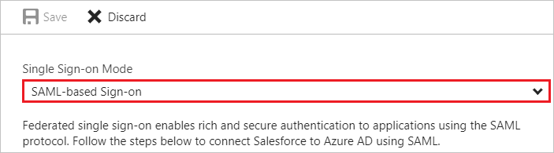
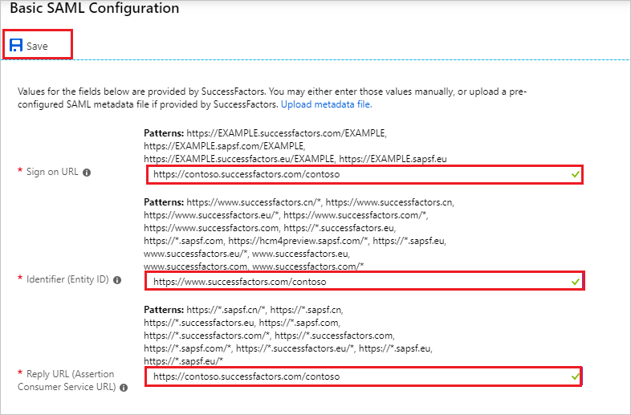
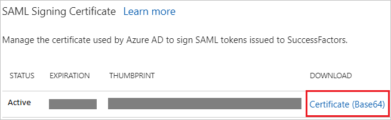
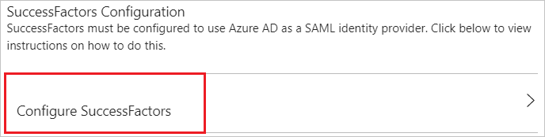
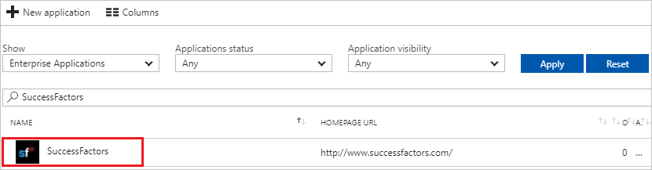

---
title: 'Tutorial: Azure Active Directory integration with SuccessFactors | Microsoft Docs'
description: Learn how to configure single sign-on between Azure Active Directory and SuccessFactors.
services: active-directory
documentationCenter: na
author: jeevansd
manager: femila
ms.reviewer: joflore

ms.assetid: 32bd8898-c2d2-4aa7-8c46-f1f5c2aa05f1
ms.service: active-directory
ms.component: saas-app-tutorial
ms.workload: identity
ms.tgt_pltfrm: na
ms.devlang: na
ms.topic: article
ms.date: 12/08/2017
ms.author: jeedes

---
# Tutorial: Azure Active Directory integration with SuccessFactors

In this tutorial, you learn how to integrate SuccessFactors with Azure Active Directory (Azure AD).

Integrating SuccessFactors with Azure AD provides you with the following benefits:

- You can control in Azure AD who has access to SuccessFactors.
- You can enable your users to automatically get signed-on to SuccessFactors (Single Sign-On) with their Azure AD accounts.
- You can manage your accounts in one central location - the Azure portal.

If you want to know more details about SaaS app integration with Azure AD, see [what is application access and single sign-on with Azure Active Directory](../manage-apps/what-is-single-sign-on.md).

## Prerequisites

To configure Azure AD integration with SuccessFactors, you need the following items:

- An Azure AD subscription
- A SuccessFactors single-sign on enabled subscription

> [!NOTE]
> To test the steps in this tutorial, we do not recommend using a production environment.

To test the steps in this tutorial, you should follow these recommendations:

- Do not use your production environment, unless it is necessary.
- If you don't have an Azure AD trial environment, you can [get a one-month trial](https://azure.microsoft.com/pricing/free-trial/).

## Scenario description
In this tutorial, you test Azure AD single sign-on in a test environment. 
The scenario outlined in this tutorial consists of two main building blocks:

1. Adding SuccessFactors from the gallery
1. Configuring and testing Azure AD single sign-on

## Adding SuccessFactors from the gallery
To configure the integration of SuccessFactors into Azure AD, you need to add SuccessFactors from the gallery to your list of managed SaaS apps.

**To add SuccessFactors from the gallery, perform the following steps:**

1. In the **[Azure portal](https://portal.azure.com)**, on the left navigation panel, click **Azure Active Directory** icon. 

	![The Azure Active Directory button][1]

1. Navigate to **Enterprise applications**. Then go to **All applications**.

	![The Enterprise applications blade][2]
	
1. To add new application, click **New application** button on the top of dialog.

	![The New application button][3]

1. In the search box, type **SuccessFactors**, select **SuccessFactors** from result panel then click **Add** button to add the application.

	

## Configure and test Azure AD single sign-on

In this section, you configure and test Azure AD single sign-on with SuccessFactors based on a test user called "Britta Simon".

For single sign-on to work, Azure AD needs to know what the counterpart user in SuccessFactors is to a user in Azure AD. In other words, a link relationship between an Azure AD user and the related user in SuccessFactors needs to be established.

In SuccessFactors, assign the value of the **user name** in Azure AD as the value of the **Username** to establish the link relationship.

To configure and test Azure AD single sign-on with SuccessFactors, you need to complete the following building blocks:

1. **[Configure Azure AD Single Sign-On](#configure-azure-ad-single-sign-on)** - to enable your users to use this feature.
1. **[Create an Azure AD test user](#create-an-azure-ad-test-user)** - to test Azure AD single sign-on with Britta Simon.
1. **[Create a SuccessFactors test user](#create-a-successfactors-test-user)** - to have a counterpart of Britta Simon in SuccessFactors that is linked to the Azure AD representation of user.
1. **[Assign the Azure AD test user](#assign-the-azure-ad-test-user)** - to enable Britta Simon to use Azure AD single sign-on.
1. **[Test single sign-on](#test-single-sign-on)** - to verify whether the configuration works.

### Configure Azure AD single sign-on

In this section, you enable Azure AD single sign-on in the Azure portal and configure single sign-on in your SuccessFactors application.

**To configure Azure AD single sign-on with SuccessFactors, perform the following steps:**

1. In the Azure portal, on the **SuccessFactors** application integration page, click **Single sign-on**.

	![Configure single sign-on link][4]

1. On the **Single sign-on** dialog, select **Mode** as	**SAML-based Sign-on** to enable single sign-on.
 
	

1. On the **SuccessFactors Domain and URLs** section, perform the following steps:

	

	a. In the **Sign-on URL** textbox, type a URL using the following pattern:
    | |
    |--|
    | `https://<companyname>.successfactors.com/<companyname>`|
    | `https://<companyname>.sapsf.com/<companyname>`|
    | `https://<companyname>.successfactors.eu/<companyname>`|
    | `https://<companyname>.sapsf.eu`|

    b. In the **Identifier** textbox, type a URL using the following pattern:
    | |
    |--|
    | `https://www.successfactors.com/<companyname>`|
    | `https://www.successfactors.com`|
    | `https://<companyname>.successfactors.eu`|
    | `https://www.successfactors.eu/<companyname>`|
    | `https://<companyname>.sapsf.com`|
    | `https://hcm4preview.sapsf.com/<companyname>`|
    | `https://<companyname>.sapsf.eu`|
    | `https://www.successfactors.cn`|
    | `https://www.successfactors.cn/<companyname>`|

	c. In the **Reply URL** textbox, type a URL using the following pattern:
    | |
    |--|
    | `https://<companyname>.successfactors.com/<companyname>`|
    | `https://<companyname>.successfactors.com`|
    | `https://<companyname>.sapsf.com/<companyname>`|
    | `https://<companyname>.sapsf.com`|
    | `https://<companyname>.successfactors.eu/<companyname>`|
    | `https://<companyname>.successfactors.eu`|
    | `https://<companyname>.sapsf.eu`|
    | `https://<companyname>.sapsf.eu/<companyname>`|
    | `https://<companyname>.sapsf.cn`|
    | `https://<companyname>.sapsf.cn/<companyname>`|
    	 
	> [!NOTE] 
	> These values are not real. Update these values with the actual Identifier, Reply URL, and Sign-On URL. Contact [SuccessFactors Client support team](https://www.successfactors.com/en_us/support.html) to get these values. 

1. On the **SAML Signing Certificate** section, click **Certificate(Base64)** and then save the certificate file on your computer.

	 

1. Click **Save** button.

	
	
1. On the **SuccessFactors Configuration** section, click **Configure SuccessFactors** to open **Configure sign-on** window. Copy the **Sign-Out URL, SAML Entity ID, and SAML Single Sign-On Service URL** from the **Quick Reference section.**

	 

1. In a different web browser window, log in to your **SuccessFactors admin portal** as an administrator.
	
1. Visit **Application Security** and native to **Single Sign On Feature**. 

1. Place any value in the **Reset Token** and click **Save Token** to enable SAML SSO.
   
    ![Configuring single sign-on on app side][11]

    > [!NOTE] 
    > This value is used as the on/off switch. If any value is saved, the SAML SSO is ON. If a blank value is saved the SAML SSO is OFF.

1. Native to below screenshot and perform the following actions:
   
    ![Configuring single sign-on on app side][12]
   
    a. Select the **SAML v2 SSO** Radio Button
   
    b. Set the **SAML Asserting Party Name**(for example, SAML issuer + company name).
   
    c. In the **Issuer URL** textbox, paste the **SAML Entity ID** value which you have copied from the Azure portal.
   
    d. Select **Response(Customer Generated/IdP/AP)** as **Require Mandatory Signature**.
   
    e. Select **Enabled** as **Enable SAML Flag**.
   
    f. Select **No** as **Login Request Signature(SF Generated/SP/RP)**.
   
    g. Select **Browser/Post Profile** as **SAML Profile**.
   
    h. Select **No** as **Enforce Certificate Valid Period**.
   
    i. Copy the content of the downloaded certificate file from Azure portal, and then paste it into the **SAML Verifying Certificate** textbox.

    > [!NOTE] 
    > The certificate content must have begin certificate and end certificate tags.

1. Navigate to SAML V2, and then perform the following steps:
   
    ![Configuring single sign-on on app side][13]
   
    a. Select **Yes** as **Support SP-initiated Global Logout**.
   
    b. In the **Global Logout Service URL (LogoutRequest destination)** textbox, paste the **Sign-Out URL** value which you have copied form the Azure portal.
   
    c. Select **No** as **Require sp must encrypt all NameID element**.
   
    d. Select **unspecified** as **NameID Format**.
   
    e. Select **Yes** as **Enable sp initiated login (AuthnRequest)**.
   
    f. In the **Send request as Company-Wide issuer** textbox, paste **SAML Single Sign-On Service URL** value which you have copied from the Azure portal.

1. Perform these steps if you want to make the login usernames Case Insensitive.
   
	![Configure Single Sign-On][29]
	
	a. Visit **Company Settings**(near the bottom).
   
	b. select checkbox near **Enable Non-Case-Sensitive Username**.
   
	c.Click **Save**.
   
	> [!NOTE] 
    > If you try to enable this, the system checks if it creates a duplicate SAML login name. For example if the customer has usernames User1 and user1. Taking away case sensitivity makes these duplicates. The system gives you an error message and does not enable the feature. The customer needs to change one of the usernames so it’s spelled different.

> [!TIP]
> You can now read a concise version of these instructions inside the [Azure portal](https://portal.azure.com), while you are setting up the app!  After adding this app from the **Active Directory > Enterprise Applications** section, simply click the **Single Sign-On** tab and access the embedded documentation through the **Configuration** section at the bottom. You can read more about the embedded documentation feature here: [Azure AD embedded documentation]( https://go.microsoft.com/fwlink/?linkid=845985)

### Create an Azure AD test user

The objective of this section is to create a test user in the Azure portal called Britta Simon.

   ![Create an Azure AD test user][100]

**To create a test user in Azure AD, perform the following steps:**

1. In the Azure portal, in the left pane, click the **Azure Active Directory** button.

    

1. To display the list of users, go to **Users and groups**, and then click **All users**.

    

1. To open the **User** dialog box, click **Add** at the top of the **All Users** dialog box.

    

1. In the **User** dialog box, perform the following steps:

    

    a. In the **Name** box, type **BrittaSimon**.

    b. In the **User name** box, type the email address of user Britta Simon.

    c. Select the **Show Password** check box, and then write down the value that's displayed in the **Password** box.

    d. Click **Create**.
 
### Create a SuccessFactors test user

To enable Azure AD users to log in to SuccessFactors, they must be provisioned into SuccessFactors.  
In the case of SuccessFactors, provisioning is a manual task.

To get users created in SuccessFactors, you need to contact the [SuccessFactors support team](https://www.successfactors.com/en_us/support.html).

### Assign the Azure AD test user

In this section, you enable Britta Simon to use Azure single sign-on by granting access to SuccessFactors.

![Assign the user role][200] 

**To assign Britta Simon to SuccessFactors, perform the following steps:**

1. In the Azure portal, open the applications view, and then navigate to the directory view and go to **Enterprise applications** then click **All applications**.

	![Assign User][201] 

1. In the applications list, select **SuccessFactors**.

	  

1. In the menu on the left, click **Users and groups**.

	![The "Users and groups" link][202]

1. Click **Add** button. Then select **Users and groups** on **Add Assignment** dialog.

	![The Add Assignment pane][203]

1. On **Users and groups** dialog, select **Britta Simon** in the Users list.

1. Click **Select** button on **Users and groups** dialog.

1. Click **Assign** button on **Add Assignment** dialog.
	
### Test single sign-on

In this section, you test your Azure AD single sign-on configuration using the Access Panel.

When you click the SuccessFactors tile in the Access Panel, you should get automatically signed-on to your SuccessFactors application.
For more information about the Access Panel, see [Introduction to the Access Panel](../user-help/active-directory-saas-access-panel-introduction.md). 

## Additional resources

* [List of Tutorials on How to Integrate SaaS Apps with Azure Active Directory](tutorial-list.md)
* [What is application access and single sign-on with Azure Active Directory?](../manage-apps/what-is-single-sign-on.md)

<!--Image references-->

[1]: ./media/successfactors-tutorial/tutorial_general_01.png
[2]: ./media/successfactors-tutorial/tutorial_general_02.png
[3]: ./media/successfactors-tutorial/tutorial_general_03.png
[4]: ./media/successfactors-tutorial/tutorial_general_04.png

[11]: ./media/successfactors-tutorial/tutorial_successfactors_07.png
[12]: ./media/successfactors-tutorial/tutorial_successfactors_08.png
[13]: ./media/successfactors-tutorial/tutorial_successfactors_09.png
[14]: ./media/successfactors-tutorial/tutorial_general_05.png
[15]: ./media/successfactors-tutorial/tutorial_general_06.png
[29]: ./media/successfactors-tutorial/tutorial_successfactors_10.png

[100]: ./media/successfactors-tutorial/tutorial_general_100.png

[200]: ./media/successfactors-tutorial/tutorial_general_200.png
[201]: ./media/successfactors-tutorial/tutorial_general_201.png
[202]: ./media/successfactors-tutorial/tutorial_general_202.png
[203]: ./media/successfactors-tutorial/tutorial_general_203.png

