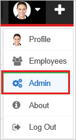
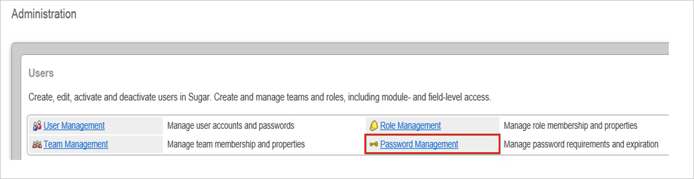
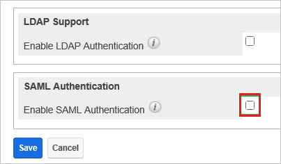
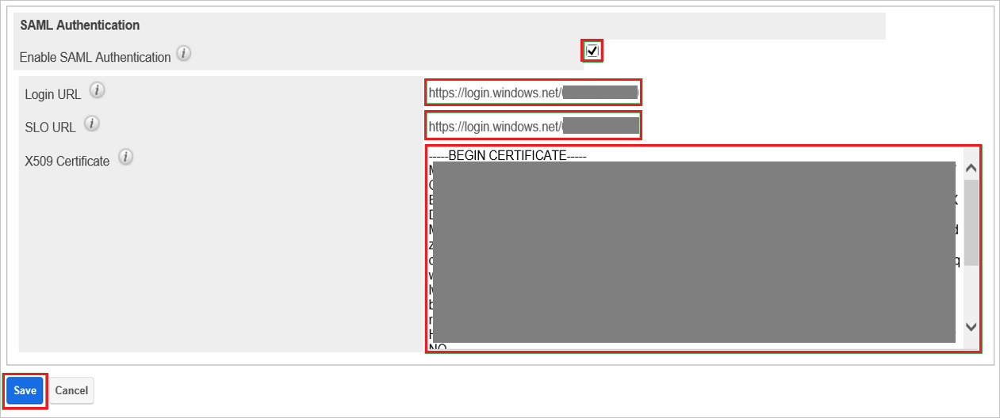
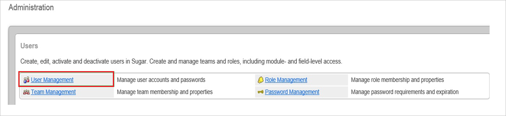
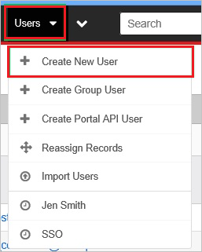
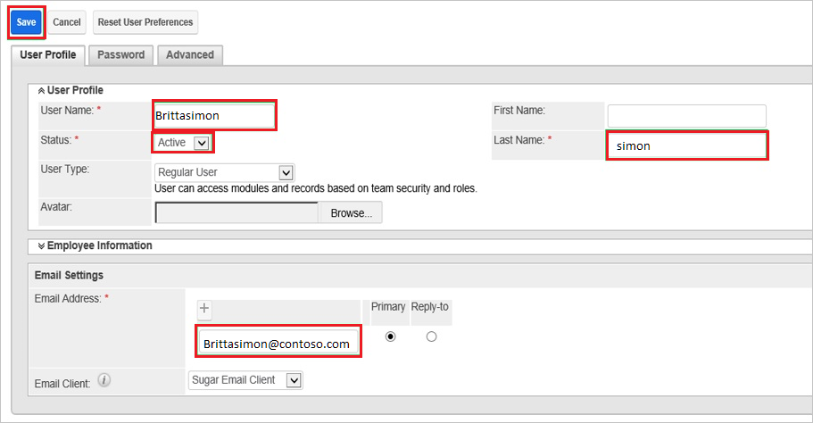

# Tutorial: Azure Active Directory single sign-on (SSO) integration with Sugar CRM

In this tutorial, you'll learn how to integrate Sugar CRM with Azure Active Directory (Azure AD). When you integrate Sugar CRM with Azure AD, you can:

* Control in Azure AD who has access to Sugar CRM.
* Enable your users to be automatically signed-in to Sugar CRM with their Azure AD accounts.
* Manage your accounts in one central location - the Azure portal.

To learn more about SaaS app integration with Azure AD, see [What is application access and single sign-on with Azure Active Directory](https://docs.microsoft.com/azure/active-directory/active-directory-appssoaccess-whatis).

## Prerequisites

To get started, you need the following items:

* An Azure AD subscription. If you don't have a subscription, you can get a [free account](https://azure.microsoft.com/free/).
* Sugar CRM single sign-on (SSO) enabled subscription.

## Scenario description

In this tutorial, you configure and test Azure AD SSO in a test environment.

* Sugar CRM supports **SP** initiated SSO

> [!NOTE]
> Identifier of this application is a fixed string value so only one instance can be configured in one tenant.

## Adding Sugar CRM from the gallery

To configure the integration of Sugar CRM into Azure AD, you need to add Sugar CRM from the gallery to your list of managed SaaS apps.

1. Sign in to the [Azure portal](https://portal.azure.com) using either a work or school account, or a personal Microsoft account.
1. On the left navigation pane, select the **Azure Active Directory** service.
1. Navigate to **Enterprise Applications** and then select **All Applications**.
1. To add new application, select **New application**.
1. In the **Add from the gallery** section, type **Sugar CRM** in the search box.
1. Select **Sugar CRM** from results panel and then add the app. Wait a few seconds while the app is added to your tenant.

## Configure and test Azure AD single sign-on for Sugar CRM

Configure and test Azure AD SSO with Sugar CRM using a test user called **B.Simon**. For SSO to work, you need to establish a link relationship between an Azure AD user and the related user in Sugar CRM.

To configure and test Azure AD SSO with Sugar CRM, complete the following building blocks:

1. **[Configure Azure AD SSO](#configure-azure-ad-sso)** - to enable your users to use this feature.
    1. **[Create an Azure AD test user](#create-an-azure-ad-test-user)** - to test Azure AD single sign-on with B.Simon.
    1. **[Assign the Azure AD test user](#assign-the-azure-ad-test-user)** - to enable B.Simon to use Azure AD single sign-on.
1. **[Configure Sugar CRM SSO](#configure-sugar-crm-sso)** - to configure the single sign-on settings on application side.
    1. **[Create Sugar CRM test user](#create-sugar-crm-test-user)** - to have a counterpart of B.Simon in Sugar CRM that is linked to the Azure AD representation of user.
1. **[Test SSO](#test-sso)** - to verify whether the configuration works.

## Configure Azure AD SSO

Follow these steps to enable Azure AD SSO in the Azure portal.

1. In the [Azure portal](https://portal.azure.com/), on the **Sugar CRM** application integration page, find the **Manage** section and select **single sign-on**.
1. On the **Select a single sign-on method** page, select **SAML**.
1. On the **Set up single sign-on with SAML** page, click the edit/pen icon for **Basic SAML Configuration** to edit the settings.

   

1. On the **Basic SAML Configuration** section, enter the values for the following fields:

    a. In the **Sign-on URL** text box, type a URL using the following pattern:

    | |
	|--|
	| `https://<companyname>.sugarondemand.com`|
	| `https://<companyname>.trial.sugarcrm`|

	b. In the **Reply URL** text box, type a URL using the following pattern:

    | |
	|--|
	| `https://<companyname>.sugarondemand.com/<companyname>`|
	| `https://<companyname>.trial.sugarcrm.com/<companyname>`|
    | `https://<companyname>.trial.sugarcrm.eu/<companyname>`|

	> [!NOTE]
	> These values are not real. Update these values with the actual Sign-On URL and Reply URL. Contact [Sugar CRM Client support team](https://support.sugarcrm.com/) to get these values. You can also refer to the patterns shown in the **Basic SAML Configuration** section in the Azure portal.

1. On the **Set up single sign-on with SAML** page, in the **SAML Signing Certificate** section,  find **Certificate (Base64)** and select **Download** to download the certificate and save it on your computer.

	

1. On the **Set up Sugar CRM** section, copy the appropriate URL(s) based on your requirement.

	

### Create an Azure AD test user

In this section, you'll create a test user in the Azure portal called B.Simon.

1. From the left pane in the Azure portal, select **Azure Active Directory**, select **Users**, and then select **All users**.
1. Select **New user** at the top of the screen.
1. In the **User** properties, follow these steps:
   1. In the **Name** field, enter `B.Simon`.  
   1. In the **User name** field, enter the username@companydomain.extension. For example, `B.Simon@contoso.com`.
   1. Select the **Show password** check box, and then write down the value that's displayed in the **Password** box.
   1. Click **Create**.

### Assign the Azure AD test user

In this section, you'll enable B.Simon to use Azure single sign-on by granting access to Sugar CRM.

1. In the Azure portal, select **Enterprise Applications**, and then select **All applications**.
1. In the applications list, select **Sugar CRM**.
1. In the app's overview page, find the **Manage** section and select **Users and groups**.

   

1. Select **Add user**, then select **Users and groups** in the **Add Assignment** dialog.

	

1. In the **Users and groups** dialog, select **B.Simon** from the Users list, then click the **Select** button at the bottom of the screen.
1. If you're expecting any role value in the SAML assertion, in the **Select Role** dialog, select the appropriate role for the user from the list and then click the **Select** button at the bottom of the screen.
1. In the **Add Assignment** dialog, click the **Assign** button.

## Configure Sugar CRM SSO

1. In a different web browser window, sign in to your Sugar CRM company site as an administrator.

1. Go to **Admin**.

    

1. In the **Administration** section, click **Password Management**.

    

1. Select **Enable SAML Authentication**.

    

1. In the **SAML Authentication** section, perform the following steps:

      

    a. In the **Login URL** textbox, paste the value of **Login URL**, which you have copied from Azure portal.
  
    b. In the **SLO URL** textbox, paste the value of **Logout URL**, which you have copied from Azure portal.
  
    c. Open your base-64 encoded certificate in notepad, copy the content of it into your clipboard, and then paste the entire Certificate into **X.509 Certificate** textbox.
  
    d. Click **Save**.

### Create Sugar CRM test user

In order to enable Azure AD users to sign in to Sugar CRM, they must be provisioned to Sugar CRM. In the case of Sugar CRM, provisioning is a manual task.

**To provision a user account, perform the following steps:**

1. Sign in to your **Sugar CRM** company site as administrator.

1. Go to **Admin**.

    

1. In the **Administration** section, click **User Management**.

    

1. Go to **Users \> Create New User**.

    

1. On the **User Profile** tab, perform the following steps:

    

    * Type the **user name**, **last name**, and **email address** of a valid Azure Active Directory user into the related textboxes.
  
1. As **Status**, select **Active**.

1. On the Password tab, perform the following steps:

    

    a. Type the password into the related textbox.

    b. Click **Save**.

> [!NOTE]
> You can use any other Sugar CRM user account creation tools or APIs provided by Sugar CRM to provision Azure AD user accounts.

## Test SSO 

In this section, you test your Azure AD single sign-on configuration using the Access Panel.

When you click the Sugar CRM tile in the Access Panel, you should be automatically signed in to the Sugar CRM for which you set up SSO. For more information about the Access Panel, see [Introduction to the Access Panel](https://docs.microsoft.com/azure/active-directory/active-directory-saas-access-panel-introduction).

## Additional resources

- [ List of Tutorials on How to Integrate SaaS Apps with Azure Active Directory ](https://docs.microsoft.com/azure/active-directory/active-directory-saas-tutorial-list)

- [What is application access and single sign-on with Azure Active Directory? ](https://docs.microsoft.com/azure/active-directory/active-directory-appssoaccess-whatis)

- [What is conditional access in Azure Active Directory?](https://docs.microsoft.com/azure/active-directory/conditional-access/overview)

- [Try Sugar CRM with Azure AD](https://aad.portal.azure.com/)

