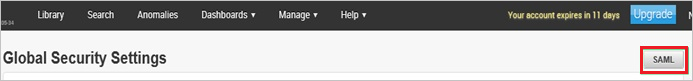
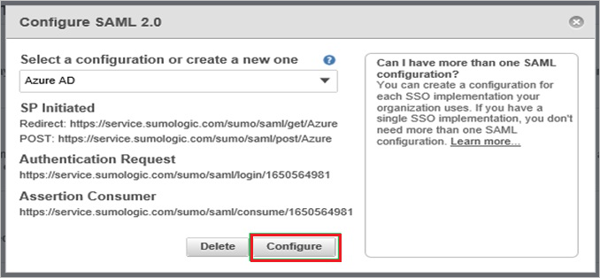
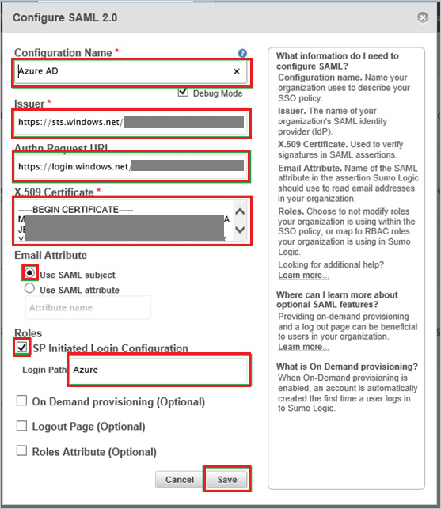
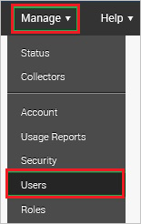
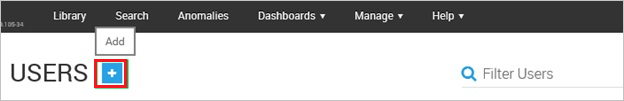

# Tutorial: Azure Active Directory single sign-on (SSO) integration with SumoLogic

In this tutorial, you'll learn how to integrate SumoLogic with Azure Active Directory (Azure AD). When you integrate SumoLogic with Azure AD, you can:

* Control in Azure AD who has access to SumoLogic.
* Enable your users to be automatically signed-in to SumoLogic with their Azure AD accounts.
* Manage your accounts in one central location - the Azure portal.

To learn more about SaaS app integration with Azure AD, see [What is application access and single sign-on with Azure Active Directory](https://docs.microsoft.com/azure/active-directory/active-directory-appssoaccess-whatis).

## Prerequisites

To get started, you need the following items:

* An Azure AD subscription. If you don't have a subscription, you can get a [free account](https://azure.microsoft.com/free/).
* SumoLogic single sign-on (SSO) enabled subscription.

## Scenario description

In this tutorial, you configure and test Azure AD SSO in a test environment.

* SumoLogic supports **IDP** initiated SSO

## Adding SumoLogic from the gallery

To configure the integration of SumoLogic into Azure AD, you need to add SumoLogic from the gallery to your list of managed SaaS apps.

1. Sign in to the [Azure portal](https://portal.azure.com) using either a work or school account, or a personal Microsoft account.
1. On the left navigation pane, select the **Azure Active Directory** service.
1. Navigate to **Enterprise Applications** and then select **All Applications**.
1. To add new application, select **New application**.
1. In the **Add from the gallery** section, type **SumoLogic** in the search box.
1. Select **SumoLogic** from results panel and then add the app. Wait a few seconds while the app is added to your tenant.

## Configure and test Azure AD single sign-on for SumoLogic

Configure and test Azure AD SSO with SumoLogic using a test user called **B.Simon**. For SSO to work, you need to establish a link relationship between an Azure AD user and the related user in SumoLogic.

To configure and test Azure AD SSO with SumoLogic, complete the following building blocks:

1. **[Configure Azure AD SSO](#configure-azure-ad-sso)** - to enable your users to use this feature.
    * **[Create an Azure AD test user](#create-an-azure-ad-test-user)** - to test Azure AD single sign-on with B.Simon.
    * **[Assign the Azure AD test user](#assign-the-azure-ad-test-user)** - to enable B.Simon to use Azure AD single sign-on.
1. **[Configure SumoLogic SSO](#configure-sumologic-sso)** - to configure the single sign-on settings on application side.
    * **[Create SumoLogic test user](#create-sumologic-test-user)** - to have a counterpart of B.Simon in SumoLogic that is linked to the Azure AD representation of user.
1. **[Test SSO](#test-sso)** - to verify whether the configuration works.

## Configure Azure AD SSO

Follow these steps to enable Azure AD SSO in the Azure portal.

1. In the [Azure portal](https://portal.azure.com/), on the **SumoLogic** application integration page, find the **Manage** section and select **single sign-on**.
1. On the **Select a single sign-on method** page, select **SAML**.
1. On the **Set up single sign-on with SAML** page, click the edit/pen icon for **Basic SAML Configuration** to edit the settings.

   

1. On the **Set up single sign-on with SAML** page, enter the values for the following fields:

    a. In the **Identifier** text box, type a URL using the following pattern:

    | |
    |--|
    | `https://service.sumologic.com`|
    | `https://<tenantname>.us2.sumologic.com`|
    | `https://<tenantname>.us4.sumologic.com`|
    | `https://<tenantname>.eu.sumologic.com`|
    | `https://<tenantname>.jp.sumologic.com`|
    | `https://<tenantname>.de.sumologic.com`|
    | `https://<tenantname>.ca.sumologic.com`|

    b. In the **Reply URL** text box, type a URL using the following pattern:

    | |
    |--|
    | `https://service.sumologic.com/sumo/saml/consume/<tenantname>`|
    | `https://service.us2.sumologic.com/sumo/saml/consume/<tenantname>`|
    | `https://service.us4.sumologic.com/sumo/saml/consume/<tenantname>`|
    | `https://service.eu.sumologic.com/sumo/saml/consume/<tenantname>`|
    | `https://service.jp.sumologic.com/sumo/saml/consume/<tenantname>`|
    | `https://service.de.sumologic.com/sumo/saml/consume/<tenantname>`|
    | `https://service.ca.sumologic.com/sumo/saml/consume/<tenantname>`|
    | `https://service.au.sumologic.com/sumo/saml/consume/<tenantname>`|

	> [!NOTE]
	> These values are not real. Update these values with the actual Identifier and Reply URL. Contact [SumoLogic Client support team](https://www.sumologic.com/contact-us/) to get these values. You can also refer to the patterns shown in the **Basic SAML Configuration** section in the Azure portal.

1. SumoLogic application expects the SAML assertions in a specific format, which requires you to add custom attribute mappings to your SAML token attributes configuration. The following screenshot shows the list of default attributes.

	

1. In addition to above, SumoLogic application expects few more attributes to be passed back in SAML response which are shown below. These attributes are also pre populated but you can review them as per your requirements.

	|  Name | Source Attribute |
	| ---------------| --------------- |
	| FirstName | user.givenname |
	| LastName | user.surname |
	| Roles | user.assignedroles |

    > [!NOTE]
	> Please click [here](https://docs.microsoft.com/azure/active-directory/develop/active-directory-enterprise-app-role-management) to know how to configure **Role** in Azure AD.

1. On the **Set up single sign-on with SAML** page, in the **SAML Signing Certificate** section,  find **Certificate (Base64)** and select **Download** to download the certificate and save it on your computer.

	

1. On the **Set up SumoLogic** section, copy the appropriate URL(s) based on your requirement.

	

### Create an Azure AD test user

In this section, you'll create a test user in the Azure portal called B.Simon.

1. From the left pane in the Azure portal, select **Azure Active Directory**, select **Users**, and then select **All users**.
1. Select **New user** at the top of the screen.
1. In the **User** properties, follow these steps:
   1. In the **Name** field, enter `B.Simon`.  
   1. In the **User name** field, enter the username@companydomain.extension. For example, `B.Simon@contoso.com`.
   1. Select the **Show password** check box, and then write down the value that's displayed in the **Password** box.
   1. Click **Create**.

### Assign the Azure AD test user

In this section, you'll enable B.Simon to use Azure single sign-on by granting access to SumoLogic.

1. In the Azure portal, select **Enterprise Applications**, and then select **All applications**.
1. In the applications list, select **SumoLogic**.
1. In the app's overview page, find the **Manage** section and select **Users and groups**.

   

1. Select **Add user**, then select **Users and groups** in the **Add Assignment** dialog.

	

1. In the **Users and groups** dialog, select **B.Simon** from the Users list, then click the **Select** button at the bottom of the screen.
1. If you're expecting any role value in the SAML assertion, in the **Select Role** dialog, select the appropriate role for the user from the list and then click the **Select** button at the bottom of the screen.
1. In the **Add Assignment** dialog, click the **Assign** button.

## Configure SumoLogic SSO

1. In a different web browser window, sign in to your SumoLogic company site as an administrator.

1. Go to **Manage \> Security**.

    

1. Click **SAML**.

    

1. From the **Select a configuration or create a new one** list, select **Azure AD**, and then click **Configure**.

    

1. On the **Configure SAML 2.0** dialog, perform the following steps:

    

    a. In the **Configuration Name** textbox, type **Azure AD**.

    b. Select **Debug Mode**.

    c. In the **Issuer** textbox, paste the value of **Azure AD Identifier**, which you have copied from Azure portal.

    d. In the **Authn Request URL** textbox, paste the value of **Login URL**, which you have copied from Azure portal.

    e. Open your base-64 encoded certificate in notepad, copy the content of it into your clipboard, and then paste the entire Certificate into **X.509 Certificate** textbox.

    f. As **Email Attribute**, select **Use SAML subject**.  

    g. Select **SP initiated Login Configuration**.

    h. In the **Login Path** textbox, type **Azure** and click **Save**.

### Create SumoLogic test user

In order to enable Azure AD users to sign in to SumoLogic, they must be provisioned to SumoLogic. In the case of SumoLogic, provisioning is a manual task.

**To provision a user account, perform the following steps:**

1. Sign in to your **SumoLogic** tenant.

1. Go to **Manage \> Users**.

    

1. Click **Add**.

    

1. On the **New User** dialog, perform the following steps:

    

    a. Type the related information of the Azure AD account you want to provision into the **First Name**, **Last Name**, and **Email** textboxes.
  
    b. Select a role.
  
    c. As **Status**, select **Active**.
  
    d. Click **Save**.

> [!NOTE]
> You can use any other SumoLogic user account creation tools or APIs provided by SumoLogic to provision Azure AD user accounts.

## Test SSO

In this section, you test your Azure AD single sign-on configuration using the Access Panel.

When you click the SumoLogic tile in the Access Panel, you should be automatically signed in to the SumoLogic for which you set up SSO. For more information about the Access Panel, see [Introduction to the Access Panel](https://docs.microsoft.com/azure/active-directory/active-directory-saas-access-panel-introduction).

## Additional resources

- [ List of Tutorials on How to Integrate SaaS Apps with Azure Active Directory ](https://docs.microsoft.com/azure/active-directory/active-directory-saas-tutorial-list)

- [What is application access and single sign-on with Azure Active Directory? ](https://docs.microsoft.com/azure/active-directory/active-directory-appssoaccess-whatis)

- [What is conditional access in Azure Active Directory?](https://docs.microsoft.com/azure/active-directory/conditional-access/overview)

- [Try SumoLogic with Azure AD](https://aad.portal.azure.com/)