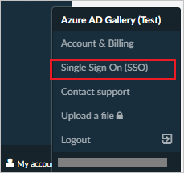
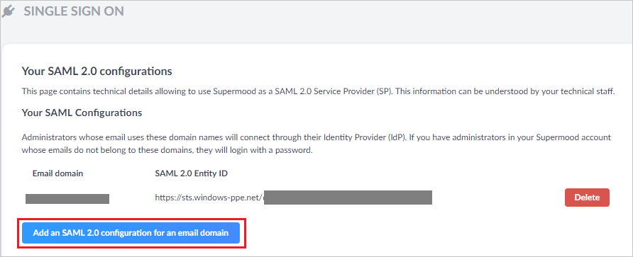
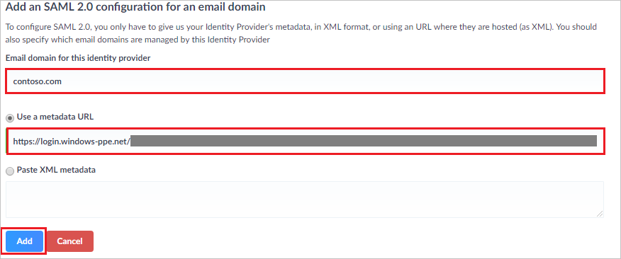

# Tutorial: Azure Active Directory single sign-on (SSO) integration with Supermood

In this tutorial, you'll learn how to integrate Supermood with Azure Active Directory (Azure AD). When you integrate Supermood with Azure AD, you can:

* Control in Azure AD who has access to Supermood.
* Enable your users to be automatically signed-in to Supermood with their Azure AD accounts.
* Manage your accounts in one central location - the Azure portal.

To learn more about SaaS app integration with Azure AD, see [What is application access and single sign-on with Azure Active Directory](../manage-apps/what-is-single-sign-on.md).

## Prerequisites

To get started, you need the following items:

* An Azure AD subscription. If you don't have a subscription, you can get a [free account](https://azure.microsoft.com/free/).
* Supermood single sign-on (SSO) enabled subscription.

## Scenario description

In this tutorial, you configure and test Azure AD SSO in a test environment.

* Supermood supports **SP and IDP** initiated SSO
* Supermood supports **Just In Time** user provisioning

## Adding Supermood from the gallery

To configure the integration of Supermood into Azure AD, you need to add Supermood from the gallery to your list of managed SaaS apps.

1. Sign in to the [Azure portal](https://portal.azure.com) using either a work or school account, or a personal Microsoft account.
1. On the left navigation pane, select the **Azure Active Directory** service.
1. Navigate to **Enterprise Applications** and then select **All Applications**.
1. To add new application, select **New application**.
1. In the **Add from the gallery** section, type **Supermood** in the search box.
1. Select **Supermood** from results panel and then add the app. Wait a few seconds while the app is added to your tenant.

 Alternatively, you can also use the [Enterprise App Configuration Wizard](https://portal.office.com/AdminPortal/home?Q=Docs#/azureadappintegration). In this wizard, you can add an application to your tenant, add users/groups to the app, assign roles, as well as walk through the SSO configuration as well. [Learn more about Microsoft 365 wizards.](/microsoft-365/admin/misc/azure-ad-setup-guides)

## Configure and test Azure AD single sign-on for Supermood

Configure and test Azure AD SSO with Supermood using a test user called **B.Simon**. For SSO to work, you need to establish a link relationship between an Azure AD user and the related user in Supermood.

To configure and test Azure AD SSO with Supermood, complete the following building blocks:

1. **[Configure Azure AD SSO](#configure-azure-ad-sso)** - to enable your users to use this feature.
    * **[Create an Azure AD test user](#create-an-azure-ad-test-user)** - to test Azure AD single sign-on with B.Simon.
    * **[Assign the Azure AD test user](#assign-the-azure-ad-test-user)** - to enable B.Simon to use Azure AD single sign-on.
1. **[Configure Supermood SSO](#configure-supermood-sso)** - to configure the single sign-on settings on application side.
    * **[Create Supermood test user](#create-supermood-test-user)** - to have a counterpart of B.Simon in Supermood that is linked to the Azure AD representation of user.
1. **[Test SSO](#test-sso)** - to verify whether the configuration works.

## Configure Azure AD SSO

Follow these steps to enable Azure AD SSO in the Azure portal.

1. In the [Azure portal](https://portal.azure.com/), on the **Supermood** application integration page, find the **Manage** section and select **single sign-on**.
1. On the **Select a single sign-on method** page, select **SAML**.
1. On the **Set up single sign-on with SAML** page, click the edit/pen icon for **Basic SAML Configuration** to edit the settings.

   

1. On the **Basic SAML Configuration** section, if you wish to configure the application in **IDP** initiated mode, perform the following steps:

	a. Check **Set additional URLs**.
	
	b. In the **Relay State** textbox, type a URL: `https://supermood.co/auth/sso/saml20`

1. Click **Set additional URLs** and perform the following steps if you wish to configure the application in **SP** initiated mode:

	In the **Sign-on URL** text box, type the URL:
    `https://supermood.co/app/#!/loginv2`

1. Click **Save**.

1. Supermood application expects the SAML assertions in a specific format, which requires you to add custom attribute mappings to your SAML token attributes configuration. The following screenshot shows the list of default attributes.

	

1. In addition to above, Supermood application expects few more attributes to be passed back in SAML response which are shown below. These attributes are also pre populated but you can review them as per your requirements.

	| Name | Source Attribute|
	| ---------------| ------|
	| firstName | user.givenname |
	| lastName | user.surname |

1. On the **Set up single sign-on with SAML** page, In the **SAML Signing Certificate** section, click copy button to copy **App Federation Metadata Url** and save it on your computer.

	

### Create an Azure AD test user

In this section, you'll create a test user in the Azure portal called B.Simon.

1. From the left pane in the Azure portal, select **Azure Active Directory**, select **Users**, and then select **All users**.
1. Select **New user** at the top of the screen.
1. In the **User** properties, follow these steps:
   1. In the **Name** field, enter `B.Simon`.  
   1. In the **User name** field, enter the username@companydomain.extension. For example, `B.Simon@contoso.com`.
   1. Select the **Show password** check box, and then write down the value that's displayed in the **Password** box.
   1. Click **Create**.

### Assign the Azure AD test user

In this section, you'll enable B.Simon to use Azure single sign-on by granting access to Supermood.

1. In the Azure portal, select **Enterprise Applications**, and then select **All applications**.
1. In the applications list, select **Supermood**.
1. In the app's overview page, find the **Manage** section and select **Users and groups**.

   

1. Select **Add user**, then select **Users and groups** in the **Add Assignment** dialog.

	

1. In the **Users and groups** dialog, select **B.Simon** from the Users list, then click the **Select** button at the bottom of the screen.
1. If you're expecting any role value in the SAML assertion, in the **Select Role** dialog, select the appropriate role for the user from the list and then click the **Select** button at the bottom of the screen.
1. In the **Add Assignment** dialog, click the **Assign** button.

## Configure Supermood SSO

1. Go to your Supermood.co admin panel as Security Administrator.

1. Click on **My account** (bottom left) and **Single Sign On (SSO)**.

	

1. On **Your SAML 2.0 configurations**, Click **Add an SAML 2.0 configuration for an email domain**.

	

1. On **Add an SAML 2.0 configuration for an email domain**. section, perform the following steps:

	

	a. In the **email domain for this Identity provider** textbox, type your domain.

	b. In the **Use a metadata URL** textbox, paste the **App Federation Metadata Url** which you have copied from Azure portal.

	c. Click **Add**.

### Create Supermood test user

In this section, a user called Britta Simon is created in Supermood. Supermood supports just-in-time user provisioning, which is enabled by default. There is no action item for you in this section. If a user doesn't already exist in Supermood, a new one is created after authentication. If you need to create a user manually, contact [Supermood support team](mailto:hello@supermood.fr).

## Test SSO 

In this section, you test your Azure AD single sign-on configuration using the Access Panel.

When you click the Supermood tile in the Access Panel, you should be automatically signed in to the Supermood for which you set up SSO. For more information about the Access Panel, see [Introduction to the Access Panel](https://support.microsoft.com/account-billing/sign-in-and-start-apps-from-the-my-apps-portal-2f3b1bae-0e5a-4a86-a33e-876fbd2a4510).

## Additional resources

- [ List of Tutorials on How to Integrate SaaS Apps with Azure Active Directory ](./tutorial-list.md)

- [What is application access and single sign-on with Azure Active Directory? ](../manage-apps/what-is-single-sign-on.md)

- [What is Conditional Access in Azure Active Directory?](../conditional-access/overview.md)
