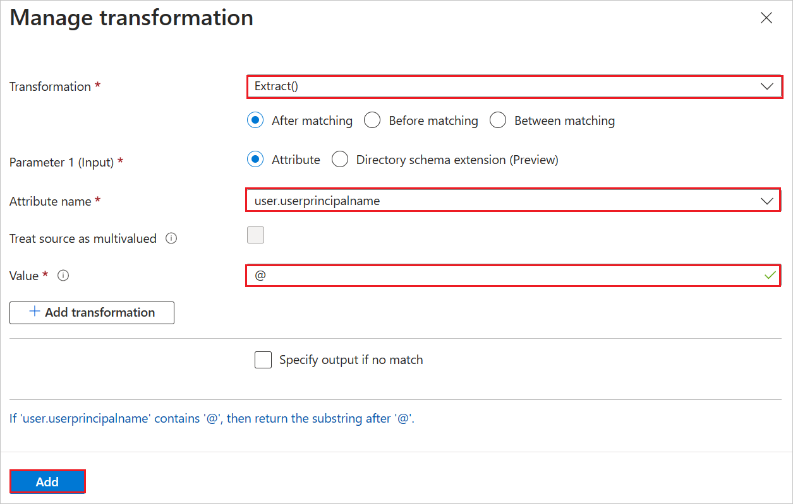

# Microsoft Entra SSO integration with SURFconext

In this article, you'll learn how to integrate SURFconext with Microsoft Entra ID. SURF connected institutions can use SURFconext to log in to many cloud applications with their institution credentials. When you integrate SURFconext with Microsoft Entra ID, you can:

* Control in Microsoft Entra ID who has access to SURFconext.
* Enable your users to be automatically signed-in to SURFconext with their Microsoft Entra accounts.
* Manage your accounts in one central location.

You'll configure and test Microsoft Entra single sign-on for SURFconext in a test environment. SURFconext supports **SP** initiated single sign-on and **Just In Time** user provisioning.

> [!NOTE]
> Identifier of this application is a fixed string value so only one instance can be configured in one tenant.

## Prerequisites

To integrate Microsoft Entra ID with SURFconext, you need:

* A Microsoft Entra user account. If you don't already have one, you can [Create an account for free](https://azure.microsoft.com/free/?WT.mc_id=A261C142F).
* One of the following roles: Global Administrator, Cloud Application Administrator, Application Administrator, or owner of the service principal.
* A Microsoft Entra subscription. If you don't have a subscription, you can get a [free account](https://azure.microsoft.com/free/).
* SURFconext single sign-on (SSO) enabled subscription.

## Add application and assign a test user

Before you begin the process of configuring single sign-on, you need to add the SURFconext application from the Microsoft Entra gallery. You need a test user account to assign to the application and test the single sign-on configuration.

### Add SURFconext from the Microsoft Entra gallery

Add SURFconext from the Microsoft Entra application gallery to configure single sign-on with SURFconext. For more information on how to add application from the gallery, see the [Quickstart: Add application from the gallery](../manage-apps/add-application-portal.md).

### Create and assign Microsoft Entra test user

Follow the guidelines in the [create and assign a user account](../manage-apps/add-application-portal-assign-users.md) article to create a test user account called B.Simon.

Alternatively, you can also use the [Enterprise App Configuration Wizard](https://portal.office.com/AdminPortal/home?Q=Docs#/azureadappintegration). In this wizard, you can add an application to your tenant, add users/groups to the app, and assign roles. The wizard also provides a link to the single sign-on configuration pane. [Learn more about Microsoft 365 wizards.](/microsoft-365/admin/misc/azure-ad-setup-guides). 

## Configure Microsoft Entra SSO

Complete the following steps to enable Microsoft Entra single sign-on.

1. Sign in to the [Microsoft Entra admin center](https://entra.microsoft.com) as at least a [Cloud Application Administrator](../roles/permissions-reference.md#cloud-application-administrator).
1. Browse to **Identity** > **Applications** > **Enterprise applications** > **SURFconext** > **Single sign-on**.
1. On the **Select a single sign-on method** page, select **SAML**.
1. On the **Set up single sign-on with SAML** page, select the pencil icon for **Basic SAML Configuration** to edit the settings.

   

1. On the **Basic SAML Configuration** section, perform the following steps:

	a. In the **Identifier** textbox, type one of the following URLs:

	| Environment | URL |
	|-------|---------|
	| Production |`https://engine.surfconext.nl/authentication/sp/metadata` | 
	| Staging |`https://engine.test.surfconext.nl/authentication/sp/metadata` |

    b. In the **Reply URL** textbox, type one of the following URLs:

	| Environment | URL |
	|-------|---------|
	| Production | `https://engine.surfconext.nl/authentication/sp/consume-assertion` |
	| Staging | `https://engine.test.surfconext.nl/authentication/sp/consume-assertion` |

	c. In the **Sign on URL** textbox, type one of the following URLs:

	| Environment | URL |
	|-------|---------|
	| Production | `https://engine.surfconext.nl/authentication/sp/debug` |
	| Staging | `https://engine.test.surfconext.nl/authentication/sp/debug` |

1. SURFconext application expects the SAML assertions in a specific format, which requires you to add custom attribute mappings to your SAML token attributes configuration. The following screenshot shows the list of default attributes.

	

	> [!Note]
	> You can remove or delete these default attributes manually under Additional claims section, if it is not required.

1. In addition to above, SURFconext application expects few more attributes to be passed back in SAML response, which are shown below. These attributes are also pre populated but you can review them as per your requirements.

	| Name |  Source Attribute|
	| ---------------|  --------- |
    | urn:mace:dir:attribute-def:cn | user.displayname |
	| urn:mace:dir:attribute-def:displayName | user.displayname |
	| urn:mace:dir:attribute-def:eduPersonPrincipalName | user.userprincipalname |
	| urn:mace:dir:attribute-def:givenName | user.givenname |
	| urn:mace:dir:attribute-def:mail | user.mail |
	| urn:mace:dir:attribute-def:preferredLanguage | user.preferredlanguage |
	| urn:mace:dir:attribute-def:sn | user.surname |
	| urn:mace:dir:attribute-def:uid | user.userprincipalname |
	| urn:mace:terena.org:attribute-def:schacHomeOrganization | user.userprincipalname |

1. To perform Transform operation for **urn:mace:terena.org:attribute-def:schacHomeOrganization** claim, select **Transformation** button as a Source under **Manage claim** section.

1. In the **Manage transformation** page, perform the following steps:

	

	1. Select **Extract()** from the dropdown in **Transformation** field and click **After matching** button.

	1. Select **Attribute** as a **Parameter 1 (Input)**.

	1. In the **Attribute name** field, select **user.userprinciplename** from the dropdown.

	1. Select **@** value from the dropdown.

	1. Click **Add**.

1. On the **Set up single sign-on with SAML** page, in the **SAML Signing Certificate** section, click copy button to copy **App Federation Metadata Url** and save it on your computer.

    

## Configure SURFconext SSO

To configure single sign-on on **SURFconext** side, you need to send the **App Federation Metadata Url** to [SURFconext support team](mailto:support@surfconext.nl). They set this setting to have the SAML SSO connection set properly on both sides.

### Create SURFconext test user

In this section, a user called B.Simon is created in SURFconext. SURFconext supports just-in-time user provisioning, which is enabled by default. There's no action item for you in this section. If a user doesn't already exist in SURFconext, a new one is commonly created after authentication.

## Test SSO 

In this section, you test your Microsoft Entra single sign-on configuration with following options. 

* Click on **Test this application**, this will redirect to SURFconext Sign-on URL where you can initiate the login flow. 

* Go to SURFconext Sign-on URL directly and initiate the login flow from there.

* You can use Microsoft My Apps. When you click the SURFconext tile in the My Apps, this will redirect to SURFconext Sign-on URL. For more information, see [Microsoft Entra My Apps](/azure/active-directory/manage-apps/end-user-experiences#azure-ad-my-apps).

## Additional resources

* [What is single sign-on with Microsoft Entra ID?](../manage-apps/what-is-single-sign-on.md)
* [Plan a single sign-on deployment](../manage-apps/plan-sso-deployment.md).

## Next steps

Once you configure SURFconext you can enforce session control, which protects exfiltration and infiltration of your organization’s sensitive data in real time. Session control extends from Conditional Access. [Learn how to enforce session control with Microsoft Cloud App Security](/cloud-app-security/proxy-deployment-aad).
