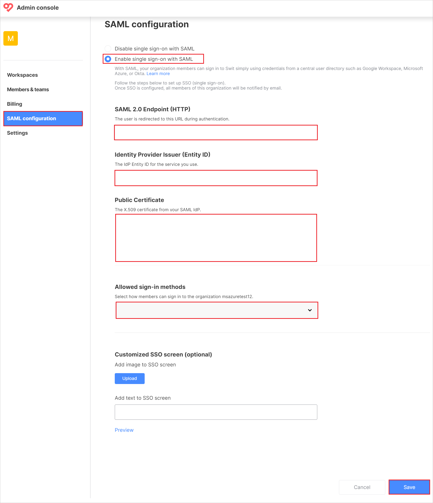

# Tutorial: Azure AD SSO integration with Swit

In this tutorial, you'll learn how to integrate Swit with Azure Active Directory (Azure AD). When you integrate Swit with Azure AD, you can:

* Control in Azure AD who has access to Swit.
* Enable your users to be automatically signed-in to Swit with their Azure AD accounts.
* Manage your accounts in one central location - the Azure portal.

## Prerequisites

To get started, you need the following items:

* An Azure AD subscription. If you don't have a subscription, you can get a [free account](https://azure.microsoft.com/free/).
* Swit single sign-on (SSO) enabled subscription.
* Along with Cloud Application Administrator, Application Administrator can also add or manage applications in Azure AD.
For more information, see [Azure built-in roles](../roles/permissions-reference.md).

> [!NOTE]
> This integration is also available to use from Azure AD US Government Cloud environment. You can find this application in the Azure AD US Government Cloud Application Gallery and configure it in the same way as you do from public cloud.

## Scenario description

In this tutorial, you configure and test Azure AD SSO in a test environment.

* Swit supports **SP** initiated SSO.

## Add Swit from the gallery

To configure the integration of Swit into Azure AD, you need to add Swit from the gallery to your list of managed SaaS apps.

1. Sign in to the Azure portal using either a work or school account, or a personal Microsoft account.
1. On the left navigation pane, select the **Azure Active Directory** service.
1. Navigate to **Enterprise Applications** and then select **All Applications**.
1. To add new application, select **New application**.
1. In the **Add from the gallery** section, type **Swit** in the search box.
1. Select **Swit** from results panel and then add the app. Wait a few seconds while the app is added to your tenant.

 Alternatively, you can also use the [Enterprise App Configuration Wizard](https://portal.office.com/AdminPortal/home?Q=Docs#/azureadappintegration). In this wizard, you can add an application to your tenant, add users/groups to the app, assign roles, as well as walk through the SSO configuration as well. [Learn more about Microsoft 365 wizards.](/microsoft-365/admin/misc/azure-ad-setup-guides)

## Configure and test Azure AD SSO for Swit

Configure and test Azure AD SSO with Swit using a test user called **B.Simon**. For SSO to work, you need to establish a link relationship between an Azure AD user and the related user in Swit.

To configure and test Azure AD SSO with Swit, perform the following steps:

1. **[Configure Azure AD SSO](#configure-azure-ad-sso)** - to enable your users to use this feature.
    1. **[Create an Azure AD test user](#create-an-azure-ad-test-user)** - to test Azure AD single sign-on with B.Simon.
    1. **[Assign the Azure AD test user](#assign-the-azure-ad-test-user)** - to enable B.Simon to use Azure AD single sign-on.
1. **[Configure Swit SSO](#configure-swit-sso)** - to configure the single sign-on settings on application side.
    1. **[Create Swit test user](#create-swit-test-user)** - to have a counterpart of B.Simon in Swit that is linked to the Azure AD representation of user.
1. **[Test SSO](#test-sso)** - to verify whether the configuration works.

## Configure Azure AD SSO

Follow these steps to enable Azure AD SSO in the Azure portal.

1. In the Azure portal, on the **Swit** application integration page, find the **Manage** section and select **single sign-on**.
1. On the **Select a single sign-on method** page, select **SAML**.
1. On the **Set up single sign-on with SAML** page, click the pencil icon for **Basic SAML Configuration** to edit the settings.

   

1. On the **Basic SAML Configuration** section, perform the following steps:

   a. In the **Identifier** textbox, type a URL using the following pattern:
   `https://<OrgName>.swit.io`

   b. In the **Reply URL** textbox, type the URL:
   `https://saml.swit.io/saml/acs`

   c. In the **Sign on URL** textbox, type a URL using the following pattern:
   `https://swit.io/auth/login?subdomain=<OrgName>`

	> [!NOTE]
	> These values are not real. Update the values with the actual Identifier and Sign on URL. Contact [Swit support team](mailto:help@swit.io) to get these values. You can also refer to the patterns shown in the **Basic SAML Configuration** section in the Azure portal.

1. Swit application expects the SAML assertions in a specific format, which requires you to add custom attribute mappings to your SAML token attributes configuration. The following screenshot shows the list of default attributes.

	

1. In addition to above, Swit application expects few more attributes to be passed back in SAML response which are shown below. These attributes are also pre populated but you can review them as per your requirements.
	
	| Name |  Source Attribute|
	| -------------- | --------- |
	| firstName | user.givenname |
	| lastName | user.surname |
    | email | user.mail |
    | username | user.displayname |

1. On the **Set up single sign-on with SAML** page, in the **SAML Signing Certificate** section,  find **Certificate (Base64)** and select **Download** to download the certificate and save it on your computer.

	

1. On the **Set up Swit** section, copy the appropriate URL(s) based on your requirement.

	

### Create an Azure AD test user

In this section, you'll create a test user in the Azure portal called B.Simon.

1. From the left pane in the Azure portal, select **Azure Active Directory**, select **Users**, and then select **All users**.
1. Select **New user** at the top of the screen.
1. In the **User** properties, follow these steps:
   1. In the **Name** field, enter `B.Simon`.  
   1. In the **User name** field, enter the username@companydomain.extension. For example, `B.Simon@contoso.com`.
   1. Select the **Show password** check box, and then write down the value that's displayed in the **Password** box.
   1. Click **Create**.

### Assign the Azure AD test user

In this section, you'll enable B.Simon to use Azure single sign-on by granting access to Swit.

1. In the Azure portal, select **Enterprise Applications**, and then select **All applications**.
1. In the applications list, select **Swit**.
1. In the app's overview page, find the **Manage** section and select **Users and groups**.
1. Select **Add user**, then select **Users and groups** in the **Add Assignment** dialog.
1. In the **Users and groups** dialog, select **B.Simon** from the Users list, then click the **Select** button at the bottom of the screen.
1. If you are expecting a role to be assigned to the users, you can select it from the **Select a role** dropdown. If no role has been set up for this app, you see "Default Access" role selected.
1. In the **Add Assignment** dialog, click the **Assign** button.

## Configure Swit SSO

1. Log in to your Swit company site as an administrator.

1. Go to **Admin console** in the bottom-left corner of the Administration page, then select **SAML configuration**.

1. In the **SAML configuration** page, perform the following steps:

    

    a. Select **Enable single sign-on with SAML** button.

    b. In the **SAML 2.0 Endpoint (HTTP)** textbox, paste the **Login URL** value which you have copied from the Azure portal.

    c. In the **Identity Provider Issuer (Entity ID)** textbox, paste the **Azure AD Identifier** value which you have copied from the Azure portal.

    d. Open the downloaded **Certificate (Base64)** from the Azure portal into Notepad and paste the content into the **Public Certificate** textbox.

    e. Select **Allowed sign-in methods** from the dropdown.

    f. Click **Save**.

### Create Swit test user

1. In a different web browser window, log into your Swit company site as an administrator.

1. Go to **Admin console** > **Members&teams** and click **Invitations**.

1. In the **Invitations** page, perform the following steps:

    

    a. In the **Invite people by email** textbox, type a valid email address.

    b. Select **Roles** from the dropdown menu.

    c. Select **Primary team** from the dropdown menu.

    d. Click **Send Invitation**.

## Test SSO 

In this section, you test your Azure AD single sign-on configuration with following options. 

* Click on **Test this application** in Azure portal. This will redirect to Swit Sign-on URL where you can initiate the login flow. 

* Go to Swit Sign-on URL directly and initiate the login flow from there.

* You can use Microsoft My Apps. When you click the Swit tile in the My Apps, this will redirect to Swit Sign-on URL. For more information about the My Apps, see [Introduction to the My Apps](../user-help/my-apps-portal-end-user-access.md).

## Next steps

Once you configure Swit you can enforce session control, which protects exfiltration and infiltration of your organization’s sensitive data in real time. Session control extends from Conditional Access. [Learn how to enforce session control with Microsoft Cloud App Security](/cloud-app-security/proxy-deployment-aad).