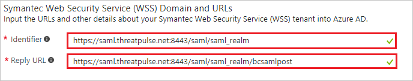
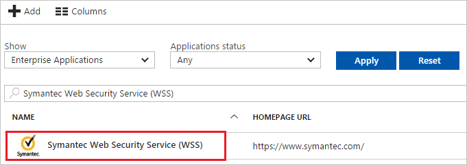

# Tutorial: Azure Active Directory integration with Symantec Web Security Service (WSS)

In this tutorial, you will learn how to integrate your Symantec Web Security Service (WSS) account with your Azure Active Directory (Azure AD) account so that WSS can authenticate an end user provisioned in the Azure AD using SAML authentication and enforce user or group level policy rules.

Integrating Symantec Web Security Service (WSS) with Azure AD provides you with the following benefits:

- Manage all of the end users and groups used by your WSS account from your Azure AD portal. 

- Allow the end users to authenticate themselves in WSS using their Azure AD credentials.

- Enable the enforcement of user and group level policy rules defined in your WSS account.

If you want to know more details about SaaS app integration with Azure AD, see [what is application access and single sign-on with Azure Active Directory](../manage-apps/what-is-single-sign-on.md).

## Prerequisites

To configure Azure AD integration with Symantec Web Security Service (WSS), you need the following items:

- An Azure AD subscription
- A Symantec Web Security Service (WSS) account

> [!NOTE]
> To test the steps in this tutorial, we do not recommend using a WSS account that is currently being used for production purpose.

To test the steps in this tutorial, you should follow these recommendations:

- Do not use your WSS account that is currently being used for production purpose for this test unless it is necessary.
- If you don't have an Azure AD trial environment, you can [get a one-month trial](https://azure.microsoft.com/pricing/free-trial/).

## Scenario description
In this tutorial, you will configure your Azure AD to enable single sign-on to WSS using the end user credentials defined in your Azure AD account.
The scenario outlined in this tutorial consists of two main building blocks:

1. Adding the Symantec Web Security Service (WSS) app from the gallery
1. Configuring and testing Azure AD single sign-on

## Adding Symantec Web Security Service (WSS) from the gallery
To configure the integration of Symantec Web Security Service (WSS) into Azure AD, you need to add Symantec Web Security Service (WSS) from the gallery to your list of managed SaaS apps.

**To add Symantec Web Security Service (WSS) from the gallery, perform the following steps:**

1. In the **[Azure portal](https://portal.azure.com)**, on the left navigation panel, click **Azure Active Directory** icon. 

	![The Azure Active Directory button][1]

1. Navigate to **Enterprise applications**. Then go to **All applications**.

	![The Enterprise applications blade][2]
	
1. To add new application, click **New application** button on the top of dialog.

	![The New application button][3]

1. In the search box, type **Symantec Web Security Service (WSS)**, select **Symantec Web Security Service (WSS)** from result panel then click **Add** button to add the application.

	

## Configure and test Azure AD single sign-on

In this section, you configure and test Azure AD single sign-on with Symantec Web Security Service (WSS) based on a test user called "Britta Simon".

For single sign-on to work, Azure AD needs to know what the counterpart user in Symantec Web Security Service (WSS) is to a user in Azure AD. In other words, a link relationship between an Azure AD user and the related user in Symantec Web Security Service (WSS) needs to be established.

In Symantec Web Security Service (WSS), assign the value of the **user name** in Azure AD as the value of the **Username** to establish the link relationship.

To configure and test Azure AD single sign-on with Symantec Web Security Service (WSS), you need to complete the following building blocks:

1. **[Configure Azure AD Single Sign-On](#configure-azure-ad-single-sign-on)** - to enable your users to use this feature.
1. **[Create an Azure AD test user](#create-an-azure-ad-test-user)** - to test Azure AD single sign-on with Britta Simon.
1. **[Create a Symantec Web Security Service (WSS) test user](#create-a-symantec-web-security-service-wss-test-user)** - to have a counterpart of Britta Simon in Symantec Web Security Service (WSS) that is linked to the Azure AD representation of user.
1. **[Assign the Azure AD test user](#assign-the-azure-ad-test-user)** - to enable Britta Simon to use Azure AD single sign-on.
1. **[Test single sign-on](#test-single-sign-on)** - to verify whether the configuration works.

### Configure Azure AD single sign-on

In this section, you enable Azure AD single sign-on in the Azure portal and configure single sign-on in your Symantec Web Security Service (WSS) application.

**To configure Azure AD single sign-on with Symantec Web Security Service (WSS), perform the following steps:**

1. In the Azure portal, on the **Symantec Web Security Service (WSS)** application integration page, click **Single sign-on**.

	![Configure single sign-on link][4]

1. On the **Single sign-on** dialog, select **Mode** as	**SAML-based Sign-on** to enable single sign-on.
 
	

1. On the **Symantec Web Security Service (WSS) Domain and URLs** section, perform the following steps:

	

    a. In the **Identifier** textbox, type the URL: `https://saml.threatpulse.net:8443/saml/saml_realm`

	b. In the **Reply URL** textbox, type the URL: `https://saml.threatpulse.net:8443/saml/saml_realm/bcsamlpost`

	> [!NOTE]
	> Please contact the [Symantec Web Security Service (WSS) Client support team](https://www.symantec.com/contact-us) if the values for the **Identifier** and **Reply URL** are not working for some reason.

1. On the **SAML Signing Certificate** section, click **Metadata XML** and then save the metadata file on your computer.

	 

1. Click **Save** button.

	
	
1. To configure single sign-on on the Symantec Web Security Service (WSS) side, refer to the WSS online documentation. The downloaded **Metadata XML** file will need to be imported into the WSS portal. Contact the [Symantec Web Security Service (WSS) support team](https://www.symantec.com/contact-us) if you need assistance with the configuration on the WSS portal.

> [!TIP]
> You can now read a concise version of these instructions inside the [Azure portal](https://portal.azure.com), while you are setting up the app!  After adding this app from the **Active Directory > Enterprise Applications** section, simply click the **Single Sign-On** tab and access the embedded documentation through the **Configuration** section at the bottom. You can read more about the embedded documentation feature here: [Azure AD embedded documentation]( https://go.microsoft.com/fwlink/?linkid=845985)

### Create an Azure AD test user

The objective of this section is to create a test user in the Azure portal called Britta Simon.

   ![Create an Azure AD test user][100]

**To create a test user in Azure AD, perform the following steps:**

1. In the Azure portal, in the left pane, click the **Azure Active Directory** button.

    

1. To display the list of users, go to **Users and groups**, and then click **All users**.

    

1. To open the **User** dialog box, click **Add** at the top of the **All Users** dialog box.

    

1. In the **User** dialog box, perform the following steps:

    

    a. In the **Name** box, type **BrittaSimon**.

    b. In the **User name** box, type the email address of user Britta Simon.

    c. Select the **Show Password** check box, and then write down the value that's displayed in the **Password** box.

    d. Click **Create**.
 
### Create a Symantec Web Security Service (WSS) test user

In this section, you create a user called Britta Simon in Symantec Web Security Service (WSS). The corresponding end username can be manually created in the WSS portal or you can wait for the users/groups provisioned in the Azure AD to be synchronized to the WSS portal after a few minutes (~15 minutes). Users must be created and activated before you use single sign-on. The public IP address of the end user machine, which will be used to browse websites also need to be provisioned in the Symantec Web Security Service (WSS) portal.

> [!NOTE]
> Please [click here](http://www.bing.com/search?q=my+ip+address&qs=AS&pq=my+ip+a&sc=8-7&cvid=29A720C95C78488CA3F9A6BA0B3F98C5&FORM=QBLH&sp=1) to get your machine's public IPaddress.

### Assign the Azure AD test user

In this section, you enable Britta Simon to use Azure single sign-on by granting access to Symantec Web Security Service (WSS).

![Assign the user role][200] 

**To assign Britta Simon to Symantec Web Security Service (WSS), perform the following steps:**

1. In the Azure portal, open the applications view, and then navigate to the directory view and go to **Enterprise applications** then click **All applications**.

	![Assign User][201] 

1. In the applications list, select **Symantec Web Security Service (WSS)**.

	  

1. In the menu on the left, click **Users and groups**.

	![The "Users and groups" link][202]

1. Click **Add** button. Then select **Users and groups** on **Add Assignment** dialog.

	![The Add Assignment pane][203]

1. On **Users and groups** dialog, select **Britta Simon** in the Users list.

1. Click **Select** button on **Users and groups** dialog.

1. Click **Assign** button on **Add Assignment** dialog.
	
### Test single sign-on

In this section, you'll test the single sign-on functionality now that you've configured your WSS account to use your Azure AD for SAML authentication.

After you have configured your web browser to proxy traffic to WSS, when you open your web browser and try to browse to a site then you'll be redirected to the Azure sign-on page. Enter the credentials of the test end user that has been provisioned in the Azure AD (that is, BrittaSimon) and associated password. Once authenticated, you'll be able to browse to the website that you chose. Should you create a policy rule on the WSS side to block BrittaSimon from browsing to a particular site then you should see the WSS block page when you attempt to browse to that site as user BrittaSimon.

## Additional resources

* [List of Tutorials on How to Integrate SaaS Apps with Azure Active Directory](tutorial-list.md)
* [What is application access and single sign-on with Azure Active Directory?](../manage-apps/what-is-single-sign-on.md)

<!--Image references-->

[1]: ./media/symantec-tutorial/tutorial_general_01.png
[2]: ./media/symantec-tutorial/tutorial_general_02.png
[3]: ./media/symantec-tutorial/tutorial_general_03.png
[4]: ./media/symantec-tutorial/tutorial_general_04.png

[100]: ./media/symantec-tutorial/tutorial_general_100.png

[200]: ./media/symantec-tutorial/tutorial_general_200.png
[201]: ./media/symantec-tutorial/tutorial_general_201.png
[202]: ./media/symantec-tutorial/tutorial_general_202.png
[203]: ./media/symantec-tutorial/tutorial_general_203.png

