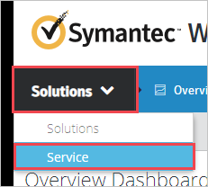
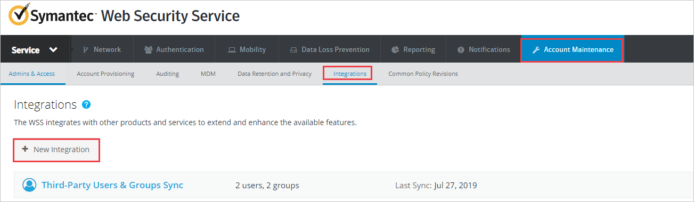
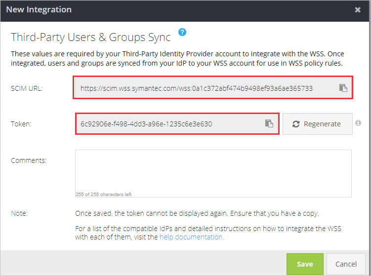
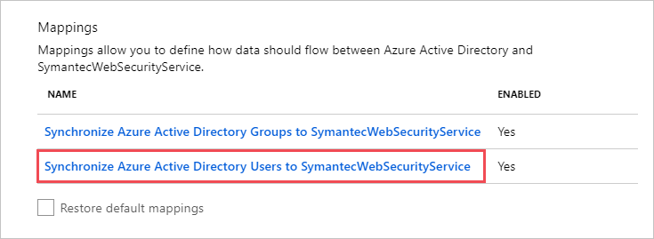
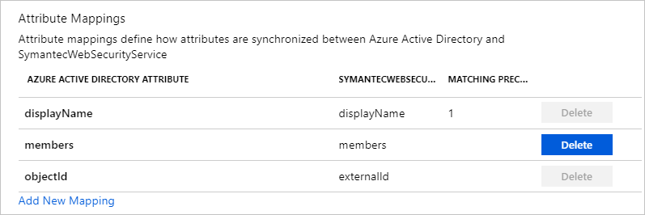

# Tutorial: Configure Symantec Web Security Service (WSS) for automatic user provisioning

The objective of this tutorial is to demonstrate the steps to be performed in Symantec Web Security Service (WSS) and Microsoft Entra ID to configure Microsoft Entra ID to automatically provision and de-provision users and/or groups to Symantec Web Security Service (WSS).

> [!NOTE]
> This tutorial describes a connector built on top of the Microsoft Entra user Provisioning Service. For important details on what this service does, how it works, and frequently asked questions, see [Automate user provisioning and deprovisioning to SaaS applications with Microsoft Entra ID](../app-provisioning/user-provisioning.md).
>
> This connector is currently in Public Preview. For more information about previews, see [Universal License Terms For Online Services](https://www.microsoft.com/licensing/terms/product/ForOnlineServices/all).

## Prerequisites

The scenario outlined in this tutorial assumes that you already have the following prerequisites:

* A Microsoft Entra tenant.
* [A Symantec Web Security Service (WSS) tenant](https://www.websecurity.digicert.com/buy-renew?inid=brmenu_nav_brhome).
* A user account in Symantec Web Security Service (WSS) with Admin permissions.

## Assigning users to Symantec Web Security Service (WSS)

Microsoft Entra ID uses a concept called *assignments* to determine which users should receive access to selected apps. In the context of automatic user provisioning, only the users and/or groups that have been assigned to an application in Microsoft Entra ID are synchronized.

Before configuring and enabling automatic user provisioning, you should decide which users and/or groups in Microsoft Entra ID need access to Symantec Web Security Service (WSS). Once decided, you can assign these users and/or groups to Symantec Web Security Service (WSS) by following the instructions here:
* [Assign a user or group to an enterprise app](../manage-apps/assign-user-or-group-access-portal.md)

##  Important tips for assigning users to Symantec Web Security Service (WSS)

* It is recommended that a single Microsoft Entra user is assigned to Symantec Web Security Service (WSS) to test the automatic user provisioning configuration. Additional users and/or groups may be assigned later.

* When assigning a user to Symantec Web Security Service (WSS), you must select any valid application-specific role (if available) in the assignment dialog. Users with the **Default Access** role are excluded from provisioning.

## Setup Symantec Web Security Service (WSS) for provisioning

Before configuring Symantec Web Security Service (WSS) for automatic user provisioning with Microsoft Entra ID, you will need to enable SCIM provisioning on Symantec Web Security Service (WSS).

1. Sign in to your [Symantec Web Security Service admin console](https://portal.threatpulse.com/login.jsp). Navigate to **Solutions** > **Service**.

	

2. Navigate to **Account Maintenance** > **Integrations** > **New Integration**.

	

3.  Select **Third-Party Users & Groups Sync**. 

	

4.  Copy the **SCIM URL** and **Token**. These values will be entered in the **Tenant URL** and **Secret Token** field in the Provisioning tab of your Symantec Web Security Service (WSS)  		application.

	

## Add Symantec Web Security Service (WSS) from the gallery

To configure Symantec Web Security Service (WSS) for automatic user provisioning with Microsoft Entra ID, you need to add Symantec Web Security Service (WSS) from the Microsoft Entra application gallery to your list of managed SaaS applications.

**To add Symantec Web Security Service (WSS) from the Microsoft Entra application gallery, perform the following steps:**

1. Sign in to the [Microsoft Entra admin center](https://entra.microsoft.com) as at least a [Cloud Application Administrator](../roles/permissions-reference.md#cloud-application-administrator).
1. Browse to **Identity** > **Applications** > **Enterprise applications** > **New application**.
1. In the **Add from the gallery** section, type **Symantec Web Security Service**, select **Symantec Web Security Service** in the search box.
1. Select **Symantec Web Security Service** from results panel and then add the app. Wait a few seconds while the app is added to your tenant.
	

## Configuring automatic user provisioning to Symantec Web Security Service (WSS)

This section guides you through the steps to configure the Microsoft Entra provisioning service to create, update, and disable users and/or groups in Symantec Web Security Service (WSS) based on user and/or group assignments in Microsoft Entra ID.

> [!TIP]
> You may also choose to enable SAML-based single sign-on for Symantec Web Security Service (WSS), following the instructions provided in the [Symantec Web Security Service (WSS) Single sign-on tutorial](symantec-tutorial.md). Single sign-on can be configured independently of automatic user provisioning, though these two features complement each other.

### To configure automatic user provisioning for Symantec Web Security Service (WSS) in Microsoft Entra ID:

1. Sign in to the [Microsoft Entra admin center](https://entra.microsoft.com) as at least a [Cloud Application Administrator](../roles/permissions-reference.md#cloud-application-administrator).
1. Browse to **Identity** > **Applications** > **Enterprise applications**

	

1. In the applications list, select **Symantec Web Security Service**.

	

3. Select the **Provisioning** tab.

	

4. Set the **Provisioning Mode** to **Automatic**.

	

5. Under the Admin Credentials section, input the **SCIM URL** and **Token** values retrieved earlier in **Tenant URL** and **Secret Token** respectively. Click **Test Connection** to ensure Microsoft Entra ID can connect to Symantec Web Security Service. If the connection fails, ensure your Symantec Web Security Service (WSS) account has Admin permissions and try again.

	

6. In the **Notification Email** field, enter the email address of a person or group who should receive the provisioning error notifications and check the checkbox - **Send an email notification when a failure occurs**.

	

7. Click **Save**.

8. Under the **Mappings** section, select **Synchronize Microsoft Entra users to Symantec Web Security Service (WSS)**.

	

9. Review the user attributes that are synchronized from Microsoft Entra ID to Symantec Web Security Service (WSS) in the **Attribute Mapping** section. The attributes selected as **Matching** properties are used to match the user accounts in Symantec Web Security Service (WSS) for update operations. Select the **Save** button to commit any changes.

	

10. Under the **Mappings** section, select **Synchronize Microsoft Entra groups to Symantec Web Security Service**.

	

11. Review the group attributes that are synchronized from Microsoft Entra ID to Symantec Web Security Service (WSS) in the **Attribute Mapping** section. The attributes selected as **Matching** properties are used to match the groups in Symantec Web Security Service (WSS) for update operations. Select the **Save** button to commit any changes.

	

12. To configure scoping filters, refer to the following instructions provided in the [Scoping filter tutorial](../app-provisioning/define-conditional-rules-for-provisioning-user-accounts.md).

13. To enable the Microsoft Entra provisioning service for Symantec Web Security Service, change the **Provisioning Status** to **On** in the **Settings** section.

	

14. Define the users and/or groups that you would like to provision to Symantec Web Security Service (WSS) by choosing the desired values in **Scope** in the **Settings** section.

	

15. When you are ready to provision, click **Save**.

	

This operation starts the initial synchronization of all users and/or groups defined in **Scope** in the **Settings** section. The initial sync takes longer to perform than subsequent syncs. For more information on how long it will take for users and/or groups to provision, see [How long will it take to provision users](../app-provisioning/application-provisioning-when-will-provisioning-finish-specific-user.md#how-long-will-it-take-to-provision-users).

You can use the **Current Status** section to monitor progress and follow links to your provisioning activity report, which describes all actions performed by the Microsoft Entra provisioning service on Symantec Web Security Service (WSS). For more information, see [Check the status of user provisioning](../app-provisioning/application-provisioning-when-will-provisioning-finish-specific-user.md). To read the Microsoft Entra provisioning logs, see [Reporting on automatic user account provisioning](../app-provisioning/check-status-user-account-provisioning.md).

## Additional resources

* [Managing user account provisioning for Enterprise Apps](../app-provisioning/configure-automatic-user-provisioning-portal.md)
* [What is application access and single sign-on with Microsoft Entra ID?](../manage-apps/what-is-single-sign-on.md)

## Next steps

* [Learn how to review logs and get reports on provisioning activity](../app-provisioning/check-status-user-account-provisioning.md)
