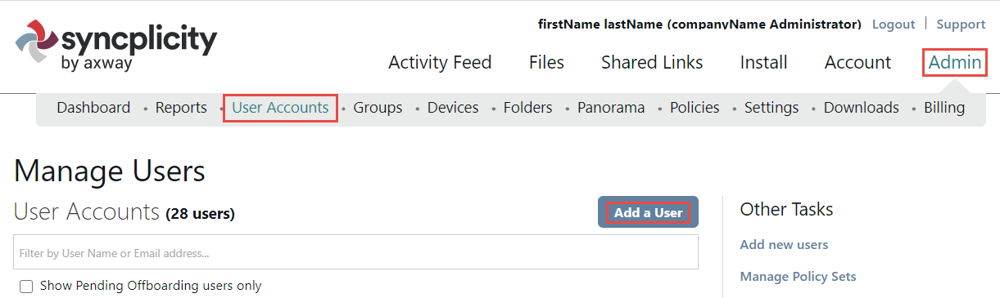
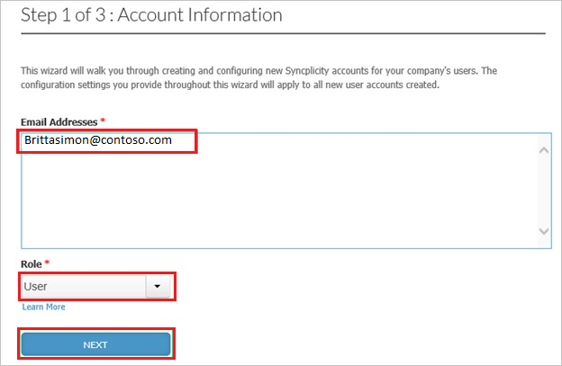
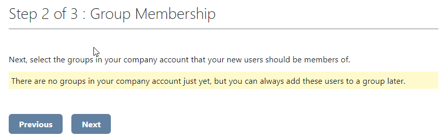
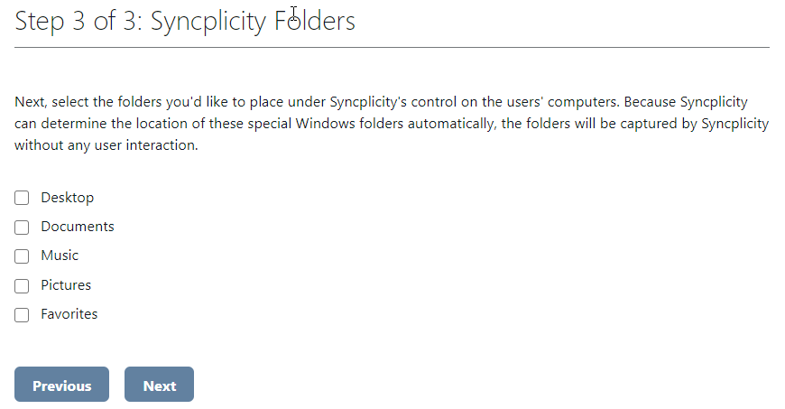

# Tutorial: Integrate Syncplicity with Azure Active Directory

In this tutorial, you'll learn how to integrate Syncplicity with Azure Active Directory (Azure AD). When you integrate Syncplicity with Azure AD, you can:

* Control in Azure AD who has access to Syncplicity.
* Enable your users to be automatically signed-in to Syncplicity with their Azure AD accounts.
* Manage your accounts in one central location - the Azure portal.

To learn more about SaaS app integration with Azure AD, see [What is application access and single sign-on with Azure Active Directory](https://docs.microsoft.com/azure/active-directory/active-directory-appssoaccess-whatis).

## Prerequisites

To get started, you need the following items:

* An Azure AD subscription. If you don't have a subscription, you can get one-month free trial [here](https://azure.microsoft.com/pricing/free-trial/).
* Syncplicity single sign-on (SSO) enabled subscription.

## Scenario description

In this tutorial, you configure and test Azure AD SSO in a test environment. Syncplicity supports **SP** initiated SSO.

## Adding Syncplicity from the gallery

To configure the integration of Syncplicity into Azure AD, you need to add Syncplicity from the gallery to your list of managed SaaS apps.

1. Sign in to the [Azure portal](https://portal.azure.com) using either a work or school account, or a personal Microsoft account.
1. On the left navigation pane, select the **Azure Active Directory** service.
1. Navigate to **Enterprise Applications** and then select **All Applications**.
1. To add new application, select **New application**.
1. In the **Add from the gallery** section, type **Syncplicity** in the search box.
1. Select **Syncplicity** from results panel and then add the app. Wait a few seconds while the app is added to your tenant.

## Configure and test Azure AD SSO

Configure and test Azure AD SSO with Syncplicity using a test user called **B.Simon**. For SSO to work, you need to establish a link relationship between an Azure AD user and the related user in Syncplicity.

To configure and test Azure AD SSO with Syncplicity, complete the following building blocks:

1. **[Configure Azure AD SSO](#configure-azure-ad-sso)** - to enable your users to use this feature.
2. **[Configure Syncplicity SSO](#configure-syncplicity-sso)** - to configure the Single Sign-On settings on application side.
3. **[Create an Azure AD test user](#create-an-azure-ad-test-user)** - to test Azure AD single sign-on with B.Simon.
4. **[Assign the Azure AD test user](#assign-the-azure-ad-test-user)** - to enable B.Simon to use Azure AD single sign-on.
5. **[Create Syncplicity test user](#create-syncplicity-test-user)** - to have a counterpart of B.Simon in Syncplicity that is linked to the Azure AD representation of user.
6. **[Test SSO](#test-sso)** - to verify whether the configuration works.

### Configure Azure AD SSO

Follow these steps to enable Azure AD SSO in the Azure portal.

1. In the [Azure portal](https://portal.azure.com/), on the **Syncplicity** application integration page, find the **Manage** section and select **Single sign-on**.
1. On the **Select a Single sign-on method** page, select **SAML**.
1. On the **Set up Single Sign-On with SAML** page, click the edit/pen icon for **Basic SAML Configuration** to edit the settings.

   

1. On the **Basic SAML Configuration** page, enter the values for the following fields:

	a. In the **Sign on URL** text box, type a URL using the following pattern:
    `https://<companyname>.syncplicity.com`

    b. In the **Identifier (Entity ID)** text box, type a URL using the following pattern:
    `https://<companyname>.syncplicity.com/sp`

	> [!NOTE]
	> These values are not real. Update these values with the actual Sign on URL and Identifier. Contact [Syncplicity Client support team](https://www.syncplicity.com/contact-us) to get these values. You can also refer to the patterns shown in the **Basic SAML Configuration** section in the Azure portal.

1. On the **Set up Single Sign-On with SAML** page, in the **SAML Signing Certificate** section, find **Certificate (Base64)** and select **Download** to download the certificate and save it on your computer.

   

1. On the **Set up Syncplicity** section, copy the appropriate URL(s) based on your requirement.

   

### Configure Syncplicity SSO

1. Sign in to your **Syncplicity** tenant.

1. In the menu on the top, click **admin**, select **settings**, and then click **Custom domain and single sign-on**.

    

1. On the **Single Sign-On (SSO)** dialog page, perform the following steps:

    ")

    a. In the **Custom Domain** textbox, type the name of your domain.
  
    b. Select **Enabled** as **Single Sign-On Status**.

    c. In the **Entity Id** textbox, Paste the **Identifier (Entity ID)** value, which you have used in the **Basic SAML Configuration** in the Azure portal.

    d. In the **Sign-in page URL** textbox, Paste the **Login URL** which you have copied from Azure portal.

    e. In the **Logout page URL** textbox, Paste the **Logout URL** which you have copied from Azure portal.

    f. In **Identity Provider Certificate**, click **Choose file**, and then upload the certificate which you have downloaded from the Azure portal.

    g. Click **SAVE CHANGES**.

### Create an Azure AD test user

In this section, you'll create a test user in the Azure portal called B.Simon.

1. From the left pane in the Azure portal, select **Azure Active Directory**, select **Users**, and then select **All users**.
1. Select **New user** at the top of the screen.
1. In the **User** properties, follow these steps:
   1. In the **Name** field, enter `B.Simon`.  
   1. In the **User name** field, enter the username@companydomain.extension. For example, `B.Simon@contoso.com`.
   1. Select the **Show password** check box, and then write down the value that's displayed in the **Password** box.
   1. Click **Create**.

### Assign the Azure AD test user

In this section, you'll enable B.Simon to use Azure single sign-on by granting access to Syncplicity.

1. In the Azure portal, select **Enterprise Applications**, and then select **All applications**.
1. In the applications list, select **Syncplicity**.
1. In the app's overview page, find the **Manage** section and select **Users and groups**.

   

1. Select **Add user**, then select **Users and groups** in the **Add Assignment** dialog.

	

1. In the **Users and groups** dialog, select **B.Simon** from the Users list, then click the **Select** button at the bottom of the screen.
1. If you're expecting any role value in the SAML assertion, in the **Select Role** dialog, select the appropriate role for the user from the list and then click the **Select** button at the bottom of the screen.
1. In the **Add Assignment** dialog, click the **Assign** button.

### Create Syncplicity test user

For Azure AD users to be able to sign in, they must be provisioned to Syncplicity application. This section describes how to create Azure AD user accounts in Syncplicity.

**To provision a user account to Syncplicity, perform the following steps:**

1. Sign in to your **Syncplicity** tenant (for example: `https://company.Syncplicity.com`).

1. Click **admin** and select **user accounts** and then click **ADD A USER**.

    

1. Type the **Email addresses** of an Azure AD account you want to provision, select **User** as **Role**, and then click **NEXT**.

    

    > [!NOTE]
    > The Azure AD account holder  gets an email including a link to confirm and activate the account.

1. Select a group in your company that your new user should become a member of, and then click **NEXT**.

    

    > [!NOTE]
    > If there are no groups listed, click **NEXT**.

1. Select the folders you would like to place under Syncplicity’s control on the user’s computer, and then click **NEXT**.

    

> [!NOTE]
> You can use any other Syncplicity user account creation tools or APIs provided by Syncplicity to provision Azure AD user accounts.

### Test SSO

When you select the Syncplicity tile in the Access Panel, you should be automatically signed in to the Syncplicity for which you set up SSO. For more information about the Access Panel, see [Introduction to the Access Panel](https://docs.microsoft.com/azure/active-directory/active-directory-saas-access-panel-introduction).

## Additional Resources

- [List of Tutorials on How to Integrate SaaS Apps with Azure Active Directory](https://docs.microsoft.com/azure/active-directory/active-directory-saas-tutorial-list)

- [What is application access and single sign-on with Azure Active Directory?](https://docs.microsoft.com/azure/active-directory/active-directory-appssoaccess-whatis)

- [What is Conditional Access in Azure Active Directory?](https://docs.microsoft.com/azure/active-directory/conditional-access/overview)