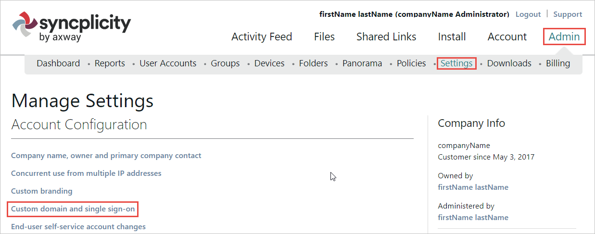
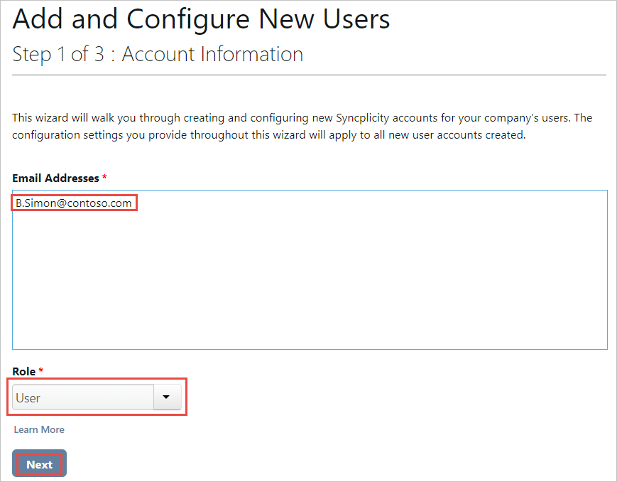
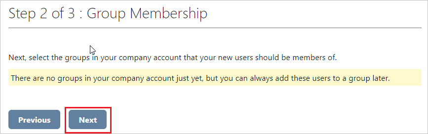
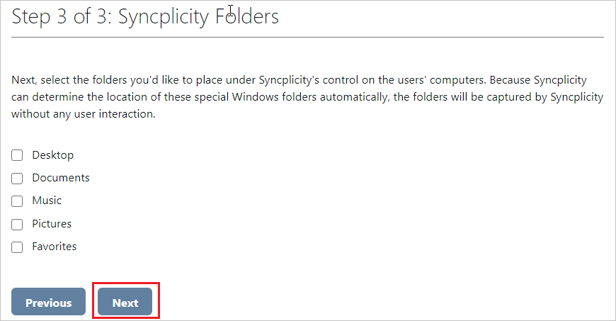

# Tutorial: Integrate Syncplicity with Microsoft Entra ID

In this tutorial, you'll learn how to integrate Syncplicity with Microsoft Entra ID. When you integrate Syncplicity with Microsoft Entra ID, you can:

* Control in Microsoft Entra ID who has access to Syncplicity.
* Enable your users to be automatically signed-in to Syncplicity with their Microsoft Entra accounts.
* Manage your accounts in one central location.

## Prerequisites

To get started, you need the following items:

* A Microsoft Entra subscription. If you don't have a subscription, you can get a [free account](https://azure.microsoft.com/free/).
* Syncplicity single sign-on (SSO) enabled subscription.

## Scenario description

In this tutorial, you configure and test Microsoft Entra SSO in a test environment. 
* Syncplicity supports **SP** initiated SSO.

## Add Syncplicity from the gallery

To configure the integration of Syncplicity into Microsoft Entra ID, you need to add Syncplicity from the gallery to your list of managed SaaS apps.

1. Sign in to the [Microsoft Entra admin center](https://entra.microsoft.com) as at least a [Cloud Application Administrator](../roles/permissions-reference.md#cloud-application-administrator).
1. Browse to **Identity** > **Applications** > **Enterprise applications** > **New application**.
1. In the **Browse Microsoft Entra gallery** section, type **Syncplicity** in the search box.
1. Select **Syncplicity** from results panel and then click **Create** to add the app. Wait a few seconds while the app is added to your tenant.

 Alternatively, you can also use the [Enterprise App Configuration Wizard](https://portal.office.com/AdminPortal/home?Q=Docs#/azureadappintegration). In this wizard, you can add an application to your tenant, add users/groups to the app, assign roles, as well as walk through the SSO configuration as well. [Learn more about Microsoft 365 wizards.](/microsoft-365/admin/misc/azure-ad-setup-guides)

## Configure and test Microsoft Entra SSO for Syncplicity

Configure and test Microsoft Entra SSO with Syncplicity using a test user called **B.Simon**. For SSO to work, you need to establish a link relationship between a Microsoft Entra user and the related user in Syncplicity.

To configure and test Microsoft Entra SSO with Syncplicity, perform the following steps:

1. **[Configure Microsoft Entra SSO](#configure-azure-ad-sso)** - to enable your users to use this feature.
    1. **[Create a Microsoft Entra test user](#create-an-azure-ad-test-user)** - to test Microsoft Entra single sign-on with B.Simon.
    1. **[Assign the Microsoft Entra test user](#assign-the-azure-ad-test-user)** - to enable B.Simon to use Microsoft Entra single sign-on.
1. **[Configure Syncplicity SSO](#configure-syncplicity-sso)** - to configure the single sign-on settings on application side.
    1. **[Create Syncplicity test user](#create-syncplicity-test-user)** - to have a counterpart of B.Simon in Syncplicity that is linked to the Microsoft Entra representation of user.
1. **[Test SSO](#test-sso)** - to verify whether the configuration works.
1. **[Update SSO](#update-sso)** - to make the necessary changes in Syncplicity if you have changed the SSO settings in Microsoft Entra ID.

### Configure Microsoft Entra SSO

Follow these steps to enable Microsoft Entra SSO.

1. Sign in to the [Microsoft Entra admin center](https://entra.microsoft.com) as at least a [Cloud Application Administrator](../roles/permissions-reference.md#cloud-application-administrator).
1. Browse to **Identity** > **Applications** > **Enterprise applications** > **Syncplicity** > **Single sign-on**.
1. On the **Select a single sign-on method** page, select **SAML**.
1. On the **Set up single sign-on with SAML** page, click the pencil icon for **Basic SAML Configuration** to edit the settings.

   

4. In the **Basic SAML Configuration** section, perform the following steps:

    a. In the **Identifier (Entity ID)** text box, type a URL using the following pattern:
    `https://<COMPANY_NAME>.syncplicity.com/sp`

    b. In the **Sign on URL** text box, type a URL using the following pattern:
    `https://<COMPANY_NAME>.syncplicity.com`
    
    c. In the **Reply URL (Assertion Consumer Service URL)** text box, type a URL using the following pattern:
    `https://<COMPANY_NAME>.syncplicity.com/Auth/AssertionConsumerService.aspx`

	> [!NOTE]
	> These values are not real. Update these values with the actual Reply URL,Sign on URL and Identifier. Contact [Syncplicity Client support team](https://www.syncplicity.com/contact-us) to get these values. You can also refer to the patterns shown in the **Basic SAML Configuration** section.

1. On the **Set up Single Sign-On with SAML** page, in the **SAML Signing Certificate** section, click **Edit**. Then in the dialog click the ellipsis button next to your active certificate and select **PEM certificate download**.

   

    > [!NOTE]
    > You need the PEM certificate, as Syncplicity does not accept certificates in CER format.

6. On the **Set up Syncplicity** section, copy the appropriate URL(s) based on your requirement.

   

### Create a Microsoft Entra test user

In this section, you'll create a test user called B.Simon.

1. Sign in to the [Microsoft Entra admin center](https://entra.microsoft.com) as at least a [User Administrator](../roles/permissions-reference.md#user-administrator).
1. Browse to **Identity** > **Users** > **All users**.
1. Select **New user** > **Create new user**, at the top of the screen.
1. In the **User** properties, follow these steps:
   1. In the **Display name** field, enter `B.Simon`.  
   1. In the **User principal name** field, enter the username@companydomain.extension. For example, `B.Simon@contoso.com`.
   1. Select the **Show password** check box, and then write down the value that's displayed in the **Password** box.
   1. Select **Review + create**.
1. Select **Create**.

### Assign the Microsoft Entra test user

In this section, you'll enable B.Simon to use single sign-on by granting access to Syncplicity.

1. Sign in to the [Microsoft Entra admin center](https://entra.microsoft.com) as at least a [Cloud Application Administrator](../roles/permissions-reference.md#cloud-application-administrator).
1. Browse to **Identity** > **Applications** > **Enterprise applications** > **Syncplicity**.
1. In the app's overview page, select **Users and groups**.
1. Select **Add user/group**, then select **Users and groups** in the **Add Assignment** dialog.
   1. In the **Users and groups** dialog, select **B.Simon** from the Users list, then click the **Select** button at the bottom of the screen.
   1. If you are expecting a role to be assigned to the users, you can select it from the **Select a role** dropdown. If no role has been set up for this app, you see "Default Access" role selected.
   1. In the **Add Assignment** dialog, click the **Assign** button.

## Configure Syncplicity SSO

1. Sign in to your **Syncplicity** tenant.

1. In the menu on the top, click **Admin**, select **Settings**, and then click **Custom domain and single sign-on**.

    

1. On the **Single Sign-On (SSO)** dialog page, perform the following steps:

    ")

    a. In the **Custom Domain** textbox, type the name of your domain.
  
    b. Select **Enabled** as **Single Sign-On Status**.

    c. In the **Entity Id** textbox, Paste the **Identifier (Entity ID)** value, which you have used in the **Basic SAML Configuration**.

    d. In the **Sign-in page URL** textbox, Paste the **Sign on URL** which you copied previously.

    e. In the **Logout page URL** textbox, Paste the **Logout URL** which you copied previously.

    f. In **Identity Provider Certificate**, click **Choose file**, and then upload the certificate which you have downloaded.

    g. Click **SAVE CHANGES**.

### Create Syncplicity test user

For Microsoft Entra users to be able to sign in, they must be provisioned to Syncplicity application. This section describes how to create Microsoft Entra user accounts in Syncplicity.

**To provision a user account to Syncplicity, perform the following steps:**

1. Sign in to your **Syncplicity** tenant (for example: `https://company.Syncplicity.com`).

1. Click **Admin** and select **User Accounts**, then click **Add a User**.

    

1. Type the **Email addresses** of a Microsoft Entra account you want to provision, select **User** as **Role**, and then click **Next**.

    

    > [!NOTE]
    > The Microsoft Entra account holder gets an email including a link to confirm and activate the account.

1. Select a group in your company that your new user should become a member of, and then click **Next**.

    

    > [!NOTE]
    > If there are no groups listed, click **Next**.

1. Select the folders you would like to place under Syncplicity’s control on the user’s computer, and then click **Next**.

    

> [!NOTE]
> You can use any other Syncplicity user account creation tools or APIs provided by Syncplicity to provision Microsoft Entra user accounts.

## Test SSO

In this section, you test your Microsoft Entra single sign-on configuration with following options. 

* Click on **Test this application**, this will redirect to Syncplicity Sign-on URL where you can initiate the login flow. 

* Go to Syncplicity Sign-on URL directly and initiate the login flow from there.

* You can use Microsoft My Apps. When you click the Syncplicity tile in the My Apps, this will redirect to Syncplicity Sign-on URL. For more information about the My Apps, see [Introduction to the My Apps](https://support.microsoft.com/account-billing/sign-in-and-start-apps-from-the-my-apps-portal-2f3b1bae-0e5a-4a86-a33e-876fbd2a4510).

### Update SSO

Whenever you need to make changes to the SSO, you need to check the **SAML Signing Certificate** being used. If the certificate has changed, make sure to upload the new one to Syncplicity as described in **[Configure Syncplicity SSO](#configure-syncplicity-sso)**.

If you are using the Syncplicity Mobile app, please contact the Syncplicity Customer Support (support@syncplicity.com) for assistance.

## Next steps

Once you configure Syncplicity you can enforce session control, which protects exfiltration and infiltration of your organization’s sensitive data in real time. Session control extends from Conditional Access. [Learn how to enforce session control with Microsoft Defender for Cloud Apps](/cloud-app-security/proxy-deployment-aad).
