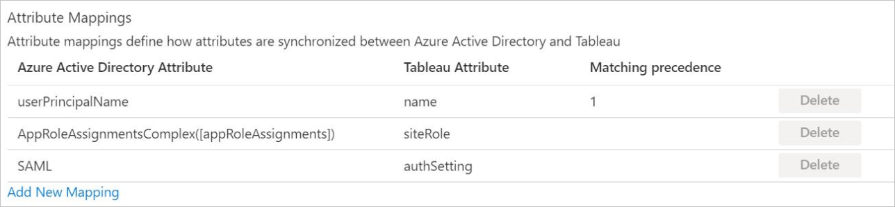

# Tutorial: Configure Tableau Online for automatic user provisioning

This tutorial demonstrates the steps to perform in Tableau Online and Azure Active Directory (Azure AD) to configure Azure AD to automatically provision and deprovision users and groups to Tableau Online.

> [!NOTE]
> This tutorial describes a connector that's built on top of the Azure AD user provisioning service. For information on what this service does, how it works, and frequently asked questions, see [Automate user provisioning and deprovisioning to software-as-a-service (SaaS) applications with Azure Active Directory](../app-provisioning/user-provisioning.md).

## Prerequisites

The scenario outlined in this tutorial assumes that you have:

*   An Azure AD tenant.
*   A [Tableau Online tenant](https://www.tableau.com/).
*   A user account in Tableau Online with admin permissions.

> [!NOTE]
> The Azure AD provisioning integration relies on the [Tableau Online REST API](https://onlinehelp.tableau.com/current/api/rest_api/en-us/help.htm). This API is available to Tableau Online developers.

## Add Tableau Online from the Azure Marketplace
Before you configure Tableau Online for automatic user provisioning with Azure AD, add Tableau Online from the Azure Marketplace to your list of managed SaaS applications.

To add Tableau Online from the Marketplace, follow these steps.

1. In the [Azure portal](https://portal.azure.com), in the navigation pane on the left, select **Azure Active Directory**.

	

2. Go to **Enterprise applications**, and then select **All applications**.

	

3. To add a new application, select **New application** at the top of the dialog box.

	

4. In the search box, enter **Tableau Online** and select **Tableau Online** from the result panel. To add the application, select **Add**.

	

## Assign users to Tableau Online

Azure Active Directory uses a concept called *assignments* to determine which users should receive access to selected apps. In the context of automatic user provisioning, only the users or groups that were assigned to an application in Azure AD are synchronized.

Before you configure and enable automatic user provisioning, decide which users or groups in Azure AD need access to Tableau Online. To assign these users or groups to Tableau Online, follow the instructions in [Assign a user or group to an enterprise app](../manage-apps/assign-user-or-group-access-portal.md).

### Important tips for assigning users to Tableau Online

*	We recommend that you assign a single Azure AD user to Tableau Online to test the automatic user provisioning configuration. You can assign additional users or groups later.

*	When you assign a user to Tableau Online, select any valid application-specific role, if available, in the assignment dialog box. Users with the **Default Access** role are excluded from provisioning.

## Configure automatic user provisioning to Tableau Online

This section guides you through the steps to configure the Azure AD provisioning service. Use it to create, update, and disable users or groups in Tableau Online based on user or group assignments in Azure AD.

> [!TIP]
> You also can enable SAML-based single sign-on for Tableau Online. Follow the instructions in the [Tableau Online single sign-on tutorial](tableauonline-tutorial.md). Single sign-on can be configured independently of automatic user provisioning, although these two features complement each other.

### Configure automatic user provisioning for Tableau Online in Azure AD

1. Sign in to the [Azure portal](https://portal.azure.com). Select **Enterprise applications** > **All applications** > **Tableau Online**.

	

2. In the applications list, select **Tableau Online**.

	

3. Select the **Provisioning** tab.

	

4. Set the **Provisioning Mode** to **Automatic**.

	

5. Under the **Admin Credentials** section, input the domain, admin username, admin password, and content URL of your Tableau Online account:

   * In the **Domain** box, fill in the subdomain based on Step 6.

   * In the **Admin Username** box, fill in the username of the admin account on your Tableau Online Tenant. An example is admin@contoso.com.

   * In the **Admin Password** box, fill in the password of the admin account that corresponds to the admin username.

   * In the **Content URL** box, fill in the subdomain based on Step 6.

6. After you sign in to your administrative account for Tableau Online, you can get the values for **Domain** and **Content URL** from the URL of the admin page.

	* The **Domain** for your Tableau Online account can be copied from this part of the URL:

		

	* The **Content URL** for your Tableau Online account can be copied from this section. It's a value that's defined during account setup. In this example, the value is "contoso":

		

		> [!NOTE]
		> Your **Domain** might be different from the one shown here.

7. After you fill in the boxes shown in Step 5, select **Test Connection** to make sure that Azure AD can connect to Tableau Online. If the connection fails, make sure your Tableau Online account has admin permissions and try again.

	

8. In the **Notification Email** box, enter the email address of the person or group to receive the provisioning error notifications. Select the **Send an email notification when a failure occurs** check box.

	

9. Select **Save**.

10. Under the **Mappings** section, select **Synchronize Azure Active Directory Users to Tableau**.

	

11. Review the user attributes that are synchronized from Azure AD to Tableau Online in the **Attribute Mappings** section. The attributes selected as **Matching** properties are used to match the user accounts in Tableau Online for update operations. To save any changes, select **Save**.

	

12. Under the **Mappings** section, select **Synchronize Azure Active Directory Groups to Tableau**.

	

13.	Review the group attributes that are synchronized from Azure AD to Tableau Online in the **Attribute Mappings** section. The attributes selected as **Matching** properties are used to match the user accounts in Tableau Online for update operations. To save any changes, select **Save**.

	

14. To configure scoping filters, follow the instructions in the [scoping filter tutorial](../app-provisioning/define-conditional-rules-for-provisioning-user-accounts.md).

15. To enable the Azure AD provisioning service for Tableau Online, in the **Settings** section, change **Provisioning Status** to **On**.

	

16. Define the users or groups that you want to provision to Tableau Online. In the **Settings** section, select the values you want in **Scope**.

	

17. When you're ready to provision, select **Save**.

	

This operation starts the initial synchronization of all users or groups defined in **Scope** in the **Settings** section. The initial sync takes longer to perform than later syncs. They occur approximately every 40 minutes as long as the Azure AD provisioning service runs. 

You can use the **Synchronization Details** section to monitor progress and follow links to the provisioning activity report. The report describes all the actions performed by the Azure AD provisioning service on Tableau Online.

For information on how to read the Azure AD provisioning logs, see [Reporting on automatic user account provisioning](../app-provisioning/check-status-user-account-provisioning.md).

## Update a Tableau Cloud application to use the Tableau Cloud SCIM 2.0 endpoint
In June 2022, Tableau released a SCIM 2.0 connector. Completing the steps below will update applications configured to use the Tableau API endpoint to the use the SCIM 2.0 endpoint. These steps will remove any customizations previously made to the Tableau Cloud application, including:
* Authentication details
* Scoping filters
* Custom attribute mappings

> [!NOTE]
> Be sure to note any changes that have been made to the settings listed above before completing the steps below. Failure to do so will result in the loss of customized settings. 

1. Sign into the Azure portal at https://portal.azure.com 
2. Navigate to your current Tableau Cloud app under Azure Active Directory > Enterprise Applications
3. In the Properties section of your new custom app, copy the Object ID.

	

4. In a new web browser window, go to https://developer.microsoft.com/graph/graph-explorer and sign in as the administrator for the Azure AD tenant where your app is added. 

	

5. Check to make sure the account being used has the correct permissions. The permission “Directory.ReadWrite.All” is required to make this change.                              

	                          

	

6. Using the ObjectID selected from the app previously, run the following command:

```
GET https://graph.microsoft.com/beta/servicePrincipals/[object-id]/synchronization/jobs/
```

7. Taking the "id" value from the response body of the GET request from above, run the command below, replacing "[job-id]" with the id value from the GET request. The value should have the format of "Tableau.xxxxxxxxxxxxxxx.xxxxxxxxxxxxxxx":
```
DELETE https://graph.microsoft.com/beta/servicePrincipals/[object-id]/synchronization/jobs/[job-id]
```
8. In the Graph Explorer, run the command below. Replace "[object-id]" with the service principal ID (object ID) copied from the third step.             
```
POST https://graph.microsoft.com/beta/servicePrincipals/[object-id]/synchronization/jobs { "templateId": "TableauOnlineSCIM" }
```


9. Return to the first web browser window and select the Provisioning tab for your application. Your configuration will have been reset. You can confirm the upgrade has taken place by confirming the Job ID starts with “TableauOnlineSCIM”. 

10. Under the Admin Credentials section, select "Bearer Authentication" as the authentication method and enter the Tenant URL and Secret Token of the Tableau instance you wish to provision to.  


11. Restore any previous changes you made to the application (Authentication details, Scoping filters, Custom attribute mappings) and re-enable provisioning. 

> [!NOTE] 
> Failure to restore the previous settings may results in attributes (name.formatted for example) updating in Workplace unexpectedly. Be sure to check the configuration before enabling  provisioning 

## Change log
* 09/30/2020 - Added support for attribute "authSetting" for Users.

## Additional resources

* [Manage user account provisioning for enterprise apps](../app-provisioning/configure-automatic-user-provisioning-portal.md)
* [What is application access and single sign-on with Azure Active Directory?](../manage-apps/what-is-single-sign-on.md)

## Next steps

* [Learn how to review logs and get reports on provisioning activity](../app-provisioning/check-status-user-account-provisioning.md)

<!--Image references-->
[1]: ./media/tableau-online-provisioning-tutorial/tutorial_general_01.png
[2]: ./media/tableau-online-provisioning-tutorial/tutorial_general_02.png
[3]: ./media/tableau-online-provisioning-tutorial/tutorial_general_03.png
