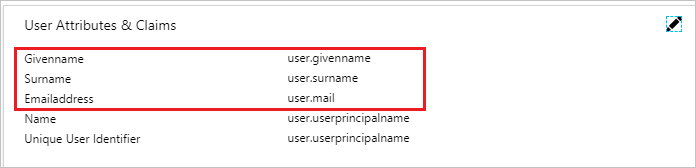
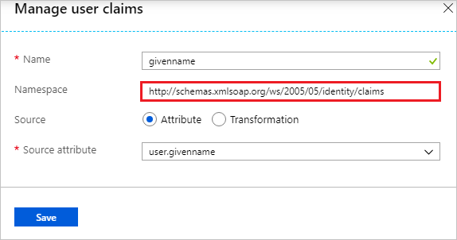
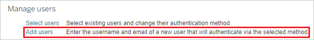
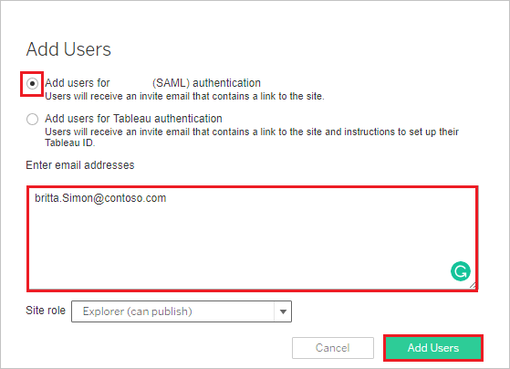

# Tutorial: Azure AD SSO integration with Tableau Cloud

In this tutorial, you'll learn how to integrate Tableau Cloud with Azure Active Directory (Azure AD). When you integrate Tableau Cloud with Azure AD, you can:

* Control in Azure AD who has access to Tableau Cloud.
* Enable your users to be automatically signed-in to Tableau Cloud with their Azure AD accounts.
* Manage your accounts in one central location - the Azure portal.

## Prerequisites

To get started, you need the following items:

* An Azure AD subscription. If you don't have a subscription, you can get a [free account](https://azure.microsoft.com/free/).
* Tableau Cloud single sign-on (SSO) enabled subscription.

> [!NOTE]
> This integration is also available to use from Azure AD US Government Cloud environment. You can find this application in the Azure AD US Government Cloud Application Gallery and configure it in the same way as you do from public cloud.

## Scenario description

In this tutorial, you configure and test Azure AD single sign-on in a test environment.

* Tableau Cloud supports **SP** initiated SSO.
* Tableau Cloud supports [**automated user provisioning and deprovisioning**](tableau-online-provisioning-tutorial.md) (recommended).

## Add Tableau Cloud from the gallery

To configure the integration of Tableau Cloud into Azure AD, you need to add Tableau Cloud from the gallery to your list of managed SaaS apps.

1. Sign in to the Azure portal using either a work or school account, or a personal Microsoft account.
1. On the left navigation pane, select the **Azure Active Directory** service.
1. Navigate to **Enterprise Applications** and then select **All Applications**.
1. To add new application, select **New application**.
1. In the **Add from the gallery** section, type **Tableau Cloud** in the search box.
1. Select **Tableau Cloud** from results panel and then add the app. Wait a few seconds while the app is added to your tenant.

 Alternatively, you can also use the [Enterprise App Configuration Wizard](https://portal.office.com/AdminPortal/home?Q=Docs#/azureadappintegration). In this wizard, you can add an application to your tenant, add users/groups to the app, assign roles, as well as walk through the SSO configuration as well. [Learn more about Microsoft 365 wizards.](/microsoft-365/admin/misc/azure-ad-setup-guides)

## Configure and test Azure AD SSO for Tableau Cloud

In this section, you configure and test Azure AD single sign-on with Tableau Cloud based on a test user called **Britta Simon**.
For single sign-on to work, a link relationship between an Azure AD user and the related user in Tableau Cloud needs to be established.

To configure and test Azure AD SSO with Tableau Cloud, perform the following steps:

1. **[Configure Azure AD SSO](#configure-azure-ad-sso)** - to enable your users to use this feature.
    1. **[Create an Azure AD test user](#create-an-azure-ad-test-user)** - to test Azure AD single sign-on with B.Simon.
    1. **[Assign the Azure AD test user](#assign-the-azure-ad-test-user)** - to enable B.Simon to use Azure AD single sign-on.
1. **[Configure Tableau Cloud SSO](#configure-tableau-cloud-sso)** - to configure the single sign-on settings on application side.
    1. **[Create Tableau Cloud test user](#create-tableau-cloud-test-user)** - to have a counterpart of B.Simon in Tableau Cloud that is linked to the Azure AD representation of user.
1. **[Test SSO](#test-sso)** - to verify whether the configuration works.

## Configure Azure AD SSO

Follow these steps to enable Azure AD SSO in the Azure portal.

1. In the Azure portal, on the **Tableau Cloud** application integration page, find the **Manage** section and select **single sign-on**.
1. On the **Select a single sign-on method** page, select **SAML**.
1. On the **Set up single sign-on with SAML** page, click the pencil icon for **Basic SAML Configuration** to edit the settings.

   

1. On the **Basic SAML Configuration** section, perform the following steps:

	a. In the **Sign on URL** text box, type the URL:
    `https://sso.online.tableau.com/public/sp/login?alias=<entityid>`

    b. In the **Identifier (Entity ID)** text box, type the URL:
    `https://sso.online.tableau.com/public/sp/metadata?alias=<entityid>`

    > [!NOTE]
    > You will get the `<entityid>` value from the **Set up Tableau Cloud** section in this tutorial. The entity ID value will be **Azure AD identifier** value in **Set up Tableau Cloud** section.

5. On the **Set up Single Sign-On with SAML** page, in the **SAML Signing Certificate** section, click **Download** to download the **Federation Metadata XML** from the given options as per your requirement and save it on your computer.

	

6. On the **Set up Tableau Cloud** section, copy the appropriate URL(s) as per your requirement.

	

### Create an Azure AD test user

In this section, you'll create a test user in the Azure portal called B.Simon.

1. From the left pane in the Azure portal, select **Azure Active Directory**, select **Users**, and then select **All users**.
1. Select **New user** at the top of the screen.
1. In the **User** properties, follow these steps:
   1. In the **Name** field, enter `B.Simon`.  
   1. In the **User name** field, enter the username@companydomain.extension. For example, `B.Simon@contoso.com`.
   1. Select the **Show password** check box, and then write down the value that's displayed in the **Password** box.
   1. Click **Create**.

### Assign the Azure AD test user

In this section, you'll enable B.Simon to use Azure single sign-on by granting access to Tableau Cloud.

1. In the Azure portal, select **Enterprise Applications**, and then select **All applications**.
1. In the applications list, select **Tableau Cloud**.
1. In the app's overview page, find the **Manage** section and select **Users and groups**.
1. Select **Add user**, then select **Users and groups** in the **Add Assignment** dialog.
1. In the **Users and groups** dialog, select **B.Simon** from the Users list, then click the **Select** button at the bottom of the screen.
1. If you are expecting a role to be assigned to the users, you can select it from the **Select a role** dropdown. If no role has been set up for this app, you see "Default Access" role selected.
1. In the **Add Assignment** dialog, click the **Assign** button.

## Configure Tableau Cloud SSO

1. To automate the configuration within Tableau Cloud, you need to install **My Apps Secure Sign-in browser extension** by clicking **Install the extension**.

	

2. After adding extension to the browser, click on **Set up Tableau Cloud** will direct you to the Tableau Cloud application. From there, provide the admin credentials to sign into Tableau Cloud. The browser extension will automatically configure the application for you and automate steps 3-7.

	

3. If you want to set up Tableau Cloud manually, in a different web browser window, sign in to your Tableau Cloud company site as an administrator.

1. Go to **Settings** and then **Authentication**.

    

2. To enable SAML, Under **Authentication types** section. Check **Enable an additional authentication method** and then check **SAML** checkbox.

    

3. Scroll down up to **Import metadata file into Tableau Cloud** section.  Click Browse and import the metadata file, which you have downloaded from Azure AD. Then, click **Apply**.

   

4. In the **Match assertions** section, insert the corresponding Identity Provider assertion name for **email address**, **first name**, and **last name**. To get this information from Azure AD: 
  
    a. In the Azure portal, go on the **Tableau Cloud** application integration page.

	b. In the **User Attributes & Claims** section, click on the edit icon, perform the following steps to add SAML token attribute as shown in the below table:

   

	| Name | Source Attribute|
	| ---------------| --------------- |
	| DispalyName | user.displayname |

	c. Copy the namespace value for these attributes: givenname, email and surname by using the following steps:

   

    d. Click **user.givenname** value

    e. Copy the value from the **Namespace** textbox.

    

    f. To copy the namespace values for the email and surname repeat the above steps.

    g. Switch to the Tableau Cloud application, then set the **User Attributes & Claims** section as follows:

    * Email: **mail** or **userprincipalname**

    * Full name: **displayname**

    

### Create Tableau Cloud test user

In this section, you create a user called Britta Simon in Tableau Cloud.

1. On **Tableau Cloud**, click **Settings** and then **Authentication** section. Scroll down to **Manage Users** section. Click **Add Users** and then click **Enter Email Addresses**.
  
    

2. Select **Add users for (SAML) authentication**. In the **Enter email addresses** textbox add britta.simon\@contoso.com
  
    

3. Click **Add Users**.

## Test SSO

In this section, you test your Azure AD single sign-on configuration with following options.

* Click on **Test this application** in Azure portal. This will redirect to Tableau Cloud Sign-on URL where you can initiate the login flow.

* Go to Tableau Cloud Sign-on URL directly and initiate the login flow from there.

* You can use Microsoft My Apps. When you click the Tableau Cloud tile in the My Apps, this will redirect to Tableau Cloud Sign-on URL. For more information about the My Apps, see [Introduction to the My Apps](https://support.microsoft.com/account-billing/sign-in-and-start-apps-from-the-my-apps-portal-2f3b1bae-0e5a-4a86-a33e-876fbd2a4510).

## Next steps

Once you configure Tableau Cloud you can enforce Session control, which protects exfiltration and infiltration of your organization’s sensitive data in real time. Session control extends from Conditional Access. [Learn how to enforce session control with Microsoft Defender for Cloud Apps](/cloud-app-security/proxy-deployment-aad).
