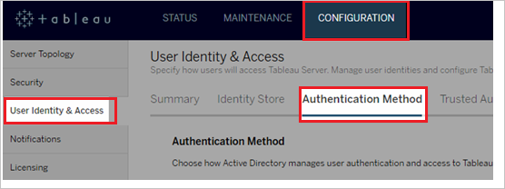
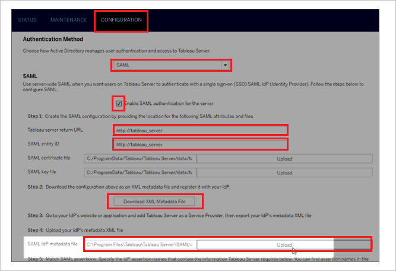

# Tutorial: Azure Active Directory integration with Tableau Server

In this tutorial, you learn how to integrate Tableau Server with Azure Active Directory (Azure AD).
Integrating Tableau Server with Azure AD provides you with the following benefits:

* You can control in Azure AD who has access to Tableau Server.
* You can enable your users to be automatically signed-in to Tableau Server (Single Sign-On) with their Azure AD accounts.
* You can manage your accounts in one central location - the Azure portal.

If you want to know more details about SaaS app integration with Azure AD, see [What is application access and single sign-on with Azure Active Directory](https://docs.microsoft.com/azure/active-directory/active-directory-appssoaccess-whatis).
If you don't have an Azure subscription, [create a free account](https://azure.microsoft.com/free/) before you begin.

## Prerequisites

To configure Azure AD integration with Tableau Server, you need the following items:

* An Azure AD subscription. If you don't have an Azure AD environment, you can get a [free account](https://azure.microsoft.com/free/)
* Tableau Server single sign-on enabled subscription

## Scenario description

In this tutorial, you configure and test Azure AD single sign-on in a test environment.

* Tableau Server supports **SP** initiated SSO

## Adding Tableau Server from the gallery

To configure the integration of Tableau Server into Azure AD, you need to add Tableau Server from the gallery to your list of managed SaaS apps.

**To add Tableau Server from the gallery, perform the following steps:**

1. In the **[Azure portal](https://portal.azure.com)**, on the left navigation panel, click **Azure Active Directory** icon.

	

2. Navigate to **Enterprise Applications** and then select the **All Applications** option.

	

3. To add new application, click **New application** button on the top of dialog.

	

4. In the search box, type **Tableau Server**, select **Tableau Server** from result panel then click **Add** button to add the application.

	

## Configure and test Azure AD single sign-on

In this section, you configure and test Azure AD single sign-on with Tableau Server based on a test user called **Britta Simon**.
For single sign-on to work, a link relationship between an Azure AD user and the related user in Tableau Server needs to be established.

To configure and test Azure AD single sign-on with Tableau Server, you need to complete the following building blocks:

1. **[Configure Azure AD Single Sign-On](#configure-azure-ad-single-sign-on)** - to enable your users to use this feature.
2. **[Configure Tableau Server Single Sign-On](#configure-tableau-server-single-sign-on)** - to configure the Single Sign-On settings on application side.
3. **[Create an Azure AD test user](#create-an-azure-ad-test-user)** - to test Azure AD single sign-on with Britta Simon.
4. **[Assign the Azure AD test user](#assign-the-azure-ad-test-user)** - to enable Britta Simon to use Azure AD single sign-on.
5. **[Create Tableau Server test user](#create-tableau-server-test-user)** - to have a counterpart of Britta Simon in Tableau Server that is linked to the Azure AD representation of user.
6. **[Test single sign-on](#test-single-sign-on)** - to verify whether the configuration works.

### Configure Azure AD single sign-on

In this section, you enable Azure AD single sign-on in the Azure portal.

To configure Azure AD single sign-on with Tableau Server, perform the following steps:

1. In the [Azure portal](https://portal.azure.com/), on the **Tableau Server** application integration page, select **Single sign-on**.

    

2. On the **Select a Single sign-on method** dialog, select **SAML/WS-Fed** mode to enable single sign-on.

    

3. On the **Set up Single Sign-On with SAML** page, click **Edit** icon to open **Basic SAML Configuration** dialog.

	

4. On the **Basic SAML Configuration** section, perform the following steps:

    

    a. In the **Sign-on URL** text box, type a URL using the following pattern:
    `https://azure.<domain name>.link`

    b. In the **Identifier** box, type a URL using the following pattern:
    `https://azure.<domain name>.link`

    c. In the **Reply URL** text box, type a URL using the following pattern:
    `https://azure.<domain name>.link/wg/saml/SSO/index.html`

	> [!NOTE]
	> The preceding values are not real values. Update the values with the actual URL and identifier from the Tableau Server configuration page which is explained later in the tutorial.

5. Tableau Server application expects a custom claim **username** which needs to be defined as below. This is being used as user identifier instead of Unique user identifier claim. You can manage the values of these attributes from the **User Attributes & Claims** section on application integration page. Click **Edit** button to open **User Attributes & Claims** dialog.

	

6. In the **User Claims** section on the **User Attributes & Claims** dialog, configure SAML token attribute as shown in the image above and perform the following steps:

	| Name | Source Attribute | Namespace |
	| ---------------| --------------- | ----------- |
	| username | user.userprincipalname | `http://schemas.xmlsoap.org/ws/2005/05/identity/claims` |
	| | |

	a. Click **Add new claim** to open the **Manage user claims** dialog.

	

	

	b. In the **Name** textbox, type the attribute name shown for that row.

	c. Enter the **Namespace** value.

	d. Select Source as **Attribute**.

	e. From the **Source attribute** list, type the attribute value shown for that row.

	f. Click **Ok**

	g. Click **Save**.

7. On the **Set up Single Sign-On with SAML** page, in the **SAML Signing Certificate** section, click **Download** to download the **Federation Metadata XML** from the given options as per your requirement and save it on your computer.

	

8. On the **Set up Tableau Server** section, copy the appropriate URL(s) as per your requirement.

	

	a. Login URL

	b. Azure AD Identifier

	c. Logout URL

### Configure Tableau Server Single Sign-On

1. To get SSO configured for your application, you need to sign in to your Tableau Server tenant as an administrator.

2. On the **CONFIGURATION** tab, select **User Identity & Access**, and then select the **Authentication** Method tab.

	

3. On the **CONFIGURATION** page, perform the following steps:

	

	a. For **Authentication Method**, select SAML.

	b. Select the checkbox of **Enable SAML Authentication for the server**.

	c. Tableau Server return URL—The URL that Tableau Server users will be accessing, such as <http://tableau_server>. Using `http://localhost` is not recommended. Using a URL with a trailing slash (for example, `http://tableau_server/`) is not supported. Copy **Tableau Server return URL** and paste it in to **Sign On URL** textbox in **Basic SAML Configuration** section in the Azure portal

	d. SAML entity ID—The entity ID uniquely identifies your Tableau Server installation to the IdP. You can enter your Tableau Server URL again here, if you like, but it does not have to be your Tableau Server URL. Copy **SAML entity ID** and paste it in to **Identifier** textbox in **Basic SAML Configuration** section in the Azure portal

	e. Click the **Download XML Metadata File** and open it in the text editor application. Locate Assertion Consumer Service URL with Http Post and Index 0 and copy the URL. Now paste it in to **Reply URL** textbox in **Basic SAML Configuration** section in the Azure portal

	f. Locate your Federation Metadata file downloaded from Azure portal, and then upload it in the **SAML Idp metadata file**.

	g. Enter the names for the attributes that the IdP uses to hold the user names, display names, and email addresses.

	h. Click **Save**

	> [!NOTE]
	> Customer have to upload any certificate in the Tableau Server SAML SSO configuration and it will get ignored in the SSO flow. If you need help configuring SAML on Tableau Server then please refer to this article [Configure SAML](https://onlinehelp.tableau.com/v2018.2/server/en-us/saml_config_steps_tsm_ui.htm).

### Create an Azure AD test user

The objective of this section is to create a test user in the Azure portal called Britta Simon.

1. In the Azure portal, in the left pane, select **Azure Active Directory**, select **Users**, and then select **All users**.

    

2. Select **New user** at the top of the screen.

    

3. In the User properties, perform the following steps.

    

    a. In the **Name** field enter **BrittaSimon**.
  
    b. In the **User name** field type `brittasimon@yourcompanydomain.extension`  
    For example, BrittaSimon@contoso.com

    c. Select **Show password** check box, and then write down the value that's displayed in the Password box.

    d. Click **Create**.

### Assign the Azure AD test user

In this section, you enable Britta Simon to use Azure single sign-on by granting access to Tableau Server.

1. In the Azure portal, select **Enterprise Applications**, select **All applications**, then select **Tableau Server**.

	

2. In the applications list, select **Tableau Server**.

	

3. In the menu on the left, select **Users and groups**.

    

4. Click the **Add user** button, then select **Users and groups** in the **Add Assignment** dialog.

    

5. In the **Users and groups** dialog select **Britta Simon** in the Users list, then click the **Select** button at the bottom of the screen.

6. If you are expecting any role value in the SAML assertion then in the **Select Role** dialog select the appropriate role for the user from the list, then click the **Select** button at the bottom of the screen.

7. In the **Add Assignment** dialog click the **Assign** button.

### Create Tableau Server test user

The objective of this section is to create a user called Britta Simon in Tableau Server. You need to provision all the users in the Tableau server.

That username of the user should match the value which you have configured in the Azure AD custom attribute of **username**. With the correct mapping the integration should work Configuring Azure AD Single Sign-On.

> [!NOTE]
> If you need to create a user manually, you need to contact the Tableau Server administrator in your organization.

### Test single sign-on

In this section, you test your Azure AD single sign-on configuration using the Access Panel.

When you click the Tableau Server tile in the Access Panel, you should be automatically signed in to the Tableau Server for which you set up SSO. For more information about the Access Panel, see [Introduction to the Access Panel](https://docs.microsoft.com/azure/active-directory/active-directory-saas-access-panel-introduction).

## Additional Resources

- [List of Tutorials on How to Integrate SaaS Apps with Azure Active Directory](https://docs.microsoft.com/azure/active-directory/active-directory-saas-tutorial-list)

- [What is application access and single sign-on with Azure Active Directory?](https://docs.microsoft.com/azure/active-directory/active-directory-appssoaccess-whatis)

- [What is Conditional Access in Azure Active Directory?](https://docs.microsoft.com/azure/active-directory/conditional-access/overview)

