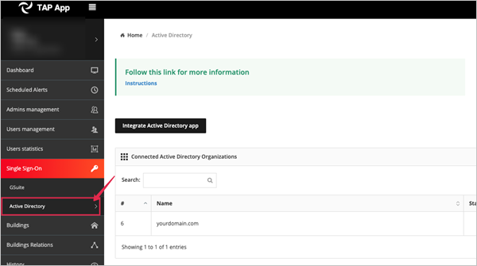
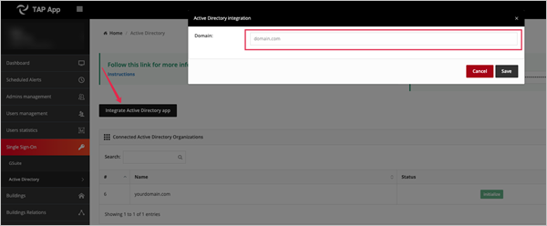
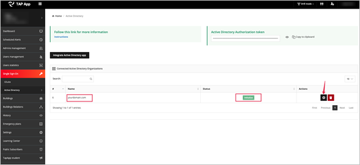
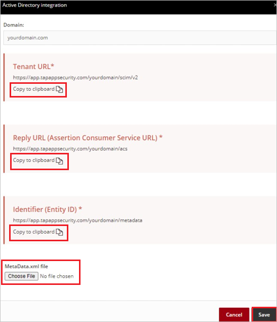

# Tutorial: Microsoft Entra single sign-on (SSO) integration with TAP App Security

In this tutorial, you'll learn how to integrate TAP App Security with Microsoft Entra ID. When you integrate TAP App Security with Microsoft Entra ID, you can:

* Control in Microsoft Entra ID who has access to TAP App Security.
* Enable your users to be automatically signed-in to TAP App Security with their Microsoft Entra accounts.
* Manage your accounts in one central location.

## Prerequisites

To get started, you need the following items:

* A Microsoft Entra subscription. If you don't have a subscription, you can get a [free account](https://azure.microsoft.com/free/).
* TAP App Security single sign-on (SSO) enabled subscription.

## Scenario description

In this tutorial, you configure and test Microsoft Entra SSO in a test environment.

* TAP App Security supports **SP** initiated SSO.

* TAP App Security supports **Just In Time** user provisioning.

## Adding TAP App Security from the gallery

To configure the integration of TAP App Security into Microsoft Entra ID, you need to add TAP App Security from the gallery to your list of managed SaaS apps.

1. Sign in to the [Microsoft Entra admin center](https://entra.microsoft.com) as at least a [Cloud Application Administrator](../roles/permissions-reference.md#cloud-application-administrator).
1. Browse to **Identity** > **Applications** > **Enterprise applications** > **New application**.
1. In the **Add from the gallery** section, type **TAP App Security** in the search box.
1. Select **TAP App Security** from results panel and then add the app. Wait a few seconds while the app is added to your tenant.

 Alternatively, you can also use the [Enterprise App Configuration Wizard](https://portal.office.com/AdminPortal/home?Q=Docs#/azureadappintegration). In this wizard, you can add an application to your tenant, add users/groups to the app, assign roles, as well as walk through the SSO configuration as well. [Learn more about Microsoft 365 wizards.](/microsoft-365/admin/misc/azure-ad-setup-guides)

## Configure and test Microsoft Entra SSO for TAP App Security

Configure and test Microsoft Entra SSO with TAP App Security using a test user called **B.Simon**. For SSO to work, you need to establish a link relationship between a Microsoft Entra user and the related user in TAP App Security.

To configure and test Microsoft Entra SSO with TAP App Security, perform the following steps:

1. **[Configure Microsoft Entra SSO](#configure-azure-ad-sso)** - to enable your users to use this feature.
    1. **[Create a Microsoft Entra test user](#create-an-azure-ad-test-user)** - to test Microsoft Entra single sign-on with B.Simon.
    1. **[Assign the Microsoft Entra test user](#assign-the-azure-ad-test-user)** - to enable B.Simon to use Microsoft Entra single sign-on.
1. **[Configure TAP App Security SSO](#configure-tap-app-security-sso)** - to configure the single sign-on settings on application side.
    1. **[Create TAP App Security test user](#create-tap-app-security-test-user)** - to have a counterpart of B.Simon in TAP App Security that is linked to the Microsoft Entra representation of user.
1. **[Test SSO](#test-sso)** - to verify whether the configuration works.

## Configure Microsoft Entra SSO

Follow these steps to enable Microsoft Entra SSO.

1. Sign in to the [Microsoft Entra admin center](https://entra.microsoft.com) as at least a [Cloud Application Administrator](../roles/permissions-reference.md#cloud-application-administrator).
1. Browse to **Identity** > **Applications** > **Enterprise applications** > **TAP App Security** > **Single sign-on**.
1. On the **Select a single sign-on method** page, select **SAML**.
1. On the **Set up single sign-on with SAML** page, click the pencil icon for **Basic SAML Configuration** to edit the settings.

   

1. On the **Basic SAML Configuration** section, enter the values for the following fields:

    a. In the **Identifier** box, type a URL using the following pattern:
    `https://app.tapappsecurity.com/<CUSTOMER_DOMAIN_WITHOUT_EXTENSION>/metadata`

    b. In the **Reply URL** text box, type a URL using the following pattern:
    `https://app.tapappsecurity.com/<CUSTOMER_DOMAIN_WITHOUT_EXTENSION>/acs`

    c. In the **Sign-on URL** text box, type the URL:
    `https://webapp.tapappsecurity.com/`

	> [!NOTE]
	> These values are not real. Update these values with the actual Identifier and Reply URL. Contact [TAP App Security Client support team](mailto:support@tapappsecurity.com) to get these values. You can also refer to the patterns shown in the **Basic SAML Configuration** section.

1. TAP App Security application expects the SAML assertions in a specific format, which requires you to add custom attribute mappings to your SAML token attributes configuration. The following screenshot shows the list of default attributes.

	

1. In addition to above, TAP App Security application expects few more attributes to be passed back in SAML response, which are shown below. These attributes are also pre populated but you can review them as per your requirements.
	
	| Name |  Source Attribute|
	| --------------- | --------- |
	| email | user.mail |
	| first | user.givenname |
	| login | user.userprincipalname |
	| last | user.surname |

1. On the **Set up single sign-on with SAML** page, in the **SAML Signing Certificate** section,  find **Federation Metadata XML** and select **Download** to download the certificate and save it on your computer.

	

1. On the **Set up TAP App Security** section, copy the appropriate URL(s) based on your requirement.

	

### Create a Microsoft Entra test user

In this section, you'll create a test user called B.Simon.

1. Sign in to the [Microsoft Entra admin center](https://entra.microsoft.com) as at least a [User Administrator](../roles/permissions-reference.md#user-administrator).
1. Browse to **Identity** > **Users** > **All users**.
1. Select **New user** > **Create new user**, at the top of the screen.
1. In the **User** properties, follow these steps:
   1. In the **Display name** field, enter `B.Simon`.  
   1. In the **User principal name** field, enter the username@companydomain.extension. For example, `B.Simon@contoso.com`.
   1. Select the **Show password** check box, and then write down the value that's displayed in the **Password** box.
   1. Select **Review + create**.
1. Select **Create**.

### Assign the Microsoft Entra test user

In this section, you'll enable B.Simon to use single sign-on by granting access to TAP App Security.

1. Sign in to the [Microsoft Entra admin center](https://entra.microsoft.com) as at least a [Cloud Application Administrator](../roles/permissions-reference.md#cloud-application-administrator).
1. Browse to **Identity** > **Applications** > **Enterprise applications** > **TAP App Security**.
1. In the app's overview page, select **Users and groups**.
1. Select **Add user/group**, then select **Users and groups** in the **Add Assignment** dialog.
   1. In the **Users and groups** dialog, select **B.Simon** from the Users list, then click the **Select** button at the bottom of the screen.
   1. If you are expecting a role to be assigned to the users, you can select it from the **Select a role** dropdown. If no role has been set up for this app, you see "Default Access" role selected.
   1. In the **Add Assignment** dialog, click the **Assign** button.

## Configure TAP App Security SSO

1. Log in to the TAP App Security website as an administrator.

1. Click **Single Sign-On** on the left navigation bar and then select **Active Directory**.

    

1. Click on the **Integrate Active Directory app** button. Then enter the domain of your organization and click **Save** button.

    

1. Click the gear icon as shown below.

    

1. Perform the following steps in the **Active Directory integration** page.

    

    a. Copy **Reply URL (Assertion Consumer Service URL)** value, paste this value into the **Reply URL** text box in the **Basic SAML Configuration** section.

    b. Copy **Identifier (Entity ID)** value, paste this value into the **Identifier** text box in the **Basic SAML Configuration** section.

    c. Click **Choose File** to upload the downloaded **Federation Metadata XML** file.

    d. Click **Save**.

### Create TAP App Security test user

In this section, a user called B.Simon is created in TAP App Security. TAP App Security supports just-in-time provisioning, which is enabled by default. There is no action item for you in this section. If a user doesn't already exist in TAP App Security, a new one is created when you attempt to access TAP App Security.

## Test SSO 

In this section, you test your Microsoft Entra single sign-on configuration with following options. 

* Click on **Test this application**, this will redirect to TAP App Security Sign-on URL where you can initiate the login flow. 

* Go to TAP App Security Sign-on URL directly and initiate the login flow from there.

* You can use Microsoft My Apps. When you click the TAP App Security tile in the My Apps, this will redirect to TAP App Security Sign-on URL. For more information about the My Apps, see [Introduction to the My Apps](https://support.microsoft.com/account-billing/sign-in-and-start-apps-from-the-my-apps-portal-2f3b1bae-0e5a-4a86-a33e-876fbd2a4510).

## Next steps

Once you configure TAP App Security you can enforce session control, which protects exfiltration and infiltration of your organization’s sensitive data in real time. Session control extends from Conditional Access. [Learn how to enforce session control with Microsoft Defender for Cloud Apps](/cloud-app-security/proxy-deployment-any-app).
