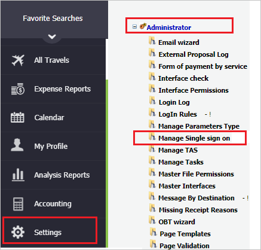
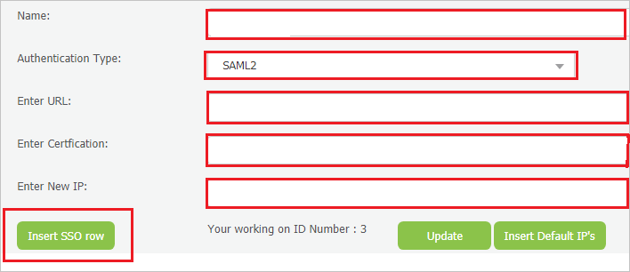

# Tutorial: Azure Active Directory integration with TAS

In this tutorial, you'll learn how to integrate TAS with Azure Active Directory (Azure AD). When you integrate TAS with Azure AD, you can:

* Control in Azure AD who has access to TAS.
* Enable your users to be automatically signed-in to TAS with their Azure AD accounts.
* Manage your accounts in one central location - the Azure portal.

## Prerequisites

To get started, you need the following items:

* An Azure AD subscription. If you don't have a subscription, you can get a [free account](https://azure.microsoft.com/free/).
* TAS single sign-on (SSO) enabled subscription.

## Scenario description

In this tutorial, you configure and test Azure AD single sign-on in a test environment.

* TAS supports **SP and IDP** initiated SSO.

## Add TAS from the gallery

To configure the integration of TAS into Azure AD, you need to add TAS from the gallery to your list of managed SaaS apps.

1. Sign in to the Azure portal using either a work or school account, or a personal Microsoft account.
1. On the left navigation pane, select the **Azure Active Directory** service.
1. Navigate to **Enterprise Applications** and then select **All Applications**.
1. To add new application, select **New application**.
1. In the **Add from the gallery** section, type **TAS** in the search box.
1. Select **TAS** from results panel and then add the app. Wait a few seconds while the app is added to your tenant.

 Alternatively, you can also use the [Enterprise App Configuration Wizard](https://portal.office.com/AdminPortal/home?Q=Docs#/azureadappintegration). In this wizard, you can add an application to your tenant, add users/groups to the app, assign roles, as well as walk through the SSO configuration as well. [Learn more about Microsoft 365 wizards.](/microsoft-365/admin/misc/azure-ad-setup-guides)

## Configure and test Azure AD SSO for TAS

Configure and test Azure AD SSO with TAS using a test user called **B.Simon**. For SSO to work, you need to establish a link relationship between an Azure AD user and the related user in TAS.

To configure and test Azure AD SSO with TAS, perform the following steps:

1. **[Configure Azure AD SSO](#configure-azure-ad-sso)** - to enable your users to use this feature.
    1. **[Create an Azure AD test user](#create-an-azure-ad-test-user)** - to test Azure AD single sign-on with B.Simon.
    1. **[Assign the Azure AD test user](#assign-the-azure-ad-test-user)** - to enable B.Simon to use Azure AD single sign-on.
1. **[Configure TAS SSO](#configure-tas-sso)** - to configure the single sign-on settings on application side.
    1. **[Create TAS test user](#create-tas-test-user)** - to have a counterpart of B.Simon in TAS that is linked to the Azure AD representation of user.
1. **[Test SSO](#test-sso)** - to verify whether the configuration works.

## Configure Azure AD SSO

Follow these steps to enable Azure AD SSO in the Azure portal.

1. In the Azure portal, on the **TAS** application integration page, find the **Manage** section and select **single sign-on**.
1. On the **Select a single sign-on method** page, select **SAML**.
1. On the **Set up single sign-on with SAML** page, click the pencil icon for **Basic SAML Configuration** to edit the settings.

   

4. On the **Basic SAML Configuration** section, If you wish to configure the application in **IDP** initiated mode, perform the following steps:

    a. In the **Identifier** text box, type a URL using the following pattern:
    `https://taseu.combtas.com/<DOMAIN>`

    b. In the **Reply URL** text box, type a URL using the following pattern:
    `https://taseu.combtas.com/<ENVIRONMENT_NAME>/AssertionService.aspx`

5. Click **Set additional URLs** and perform the following step if you wish to configure the application in **SP** initiated mode:

    In the **Sign-on URL** text box, type a URL using the following pattern:
    `https://taseu.combtas.com/<DOMAIN>`

	> [!NOTE]
	> These values are not real. You will update these with the actual Identifier, Reply URL and Sign-on URL which is explained later in the tutorial. You can also refer to the patterns shown in the **Basic SAML Configuration** section in the Azure portal.

6. On the **Set up Single Sign-On with SAML** page, in the **SAML Signing Certificate** section, click **Download** to download the **Certificate (Base64)** from the given options as per your requirement and save it on your computer.

	

7. On the **Set up TAS** section, copy the appropriate URL(s) as per your requirement.

	

### Create an Azure AD test user 

In this section, you'll create a test user in the Azure portal called B.Simon.

1. From the left pane in the Azure portal, select **Azure Active Directory**, select **Users**, and then select **All users**.
1. Select **New user** at the top of the screen.
1. In the **User** properties, follow these steps:
   1. In the **Name** field, enter `B.Simon`.  
   1. In the **User name** field, enter the username@companydomain.extension. For example, `B.Simon@contoso.com`.
   1. Select the **Show password** check box, and then write down the value that's displayed in the **Password** box.
   1. Click **Create**.

### Assign the Azure AD test user

In this section, you'll enable B.Simon to use Azure single sign-on by granting access to TAS.

1. In the Azure portal, select **Enterprise Applications**, and then select **All applications**.
1. In the applications list, select **TAS**.
1. In the app's overview page, find the **Manage** section and select **Users and groups**.
1. Select **Add user**, then select **Users and groups** in the **Add Assignment** dialog.
1. In the **Users and groups** dialog, select **B.Simon** from the Users list, then click the **Select** button at the bottom of the screen.
1. If you are expecting a role to be assigned to the users, you can select it from the **Select a role** dropdown. If no role has been set up for this app, you see "Default Access" role selected.
1. In the **Add Assignment** dialog, click the **Assign** button.

## Configure TAS SSO

1. In a different web browser window, login to TAS as an Administrator.

2. On the left side of menu, click on **Settings** and navigate to **Administrator** and then click on **Manage Single sign on**.

	

3. On the **Manage Single sign on** page, perform the following steps:

	

	a. In the **Name** textbox, type your environment name.
	
	b. Select **SAML2** as **Authentication Type**.

	c. In the **Enter URL** textbox, paste the value of **Login URL** which you have copied from the Azure portal.

	d. In Notepad, open the base-64 encoded certificate that you downloaded from the Azure portal, copy its content, and then paste it into the **Enter Certification** box.

	e. In the **Enter New IP** textbox, type the IP Address.

	>[!NOTE]
	> Contact [TAS support team](mailto:support@combtas.com) to get the IP Address.

	f. Copy the **Single Sign On** URL and paste it into the **identifier (Entity ID)** and **Sign on URL** textbox of **Basic SAML Configuration** in Azure portal. Please note that the URL is case sensitive and must end with a slash (/).

	g. Copy the **Assertion Service** URL in the setup page and paste it into the **Reply URL** textbox of  **Basic SAML Configuration** in Azure portal.

	h. Click **Insert SSO row**.

### Create TAS test user

In this section, you create a user called Britta Simon in TAS. Work with [TAS support team](mailto:support@combtas.com) to add the users in the TAS platform. Users must be created and activated before you use single sign-on.

## Test SSO 

In this section, you test your Azure AD single sign-on configuration with following options. 

#### SP initiated:

* Click on **Test this application** in Azure portal. This will redirect to TAS Sign on URL where you can initiate the login flow.  

* Go to TAS Sign-on URL directly and initiate the login flow from there.

#### IDP initiated:

* Click on **Test this application** in Azure portal and you should be automatically signed in to the TAS for which you set up the SSO. 

You can also use Microsoft My Apps to test the application in any mode. When you click the TAS tile in the My Apps, if configured in SP mode you would be redirected to the application sign on page for initiating the login flow and if configured in IDP mode, you should be automatically signed in to the TAS for which you set up the SSO. For more information about the My Apps, see [Introduction to the My Apps](https://support.microsoft.com/account-billing/sign-in-and-start-apps-from-the-my-apps-portal-2f3b1bae-0e5a-4a86-a33e-876fbd2a4510).

## Next steps

Once you configure TAS you can enforce session control, which protects exfiltration and infiltration of your organization’s sensitive data in real time. Session control extends from Conditional Access. [Learn how to enforce session control with Microsoft Defender for Cloud Apps](/cloud-app-security/proxy-deployment-aad).
