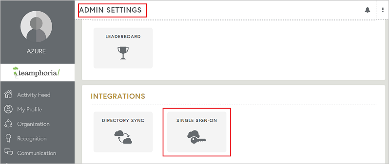
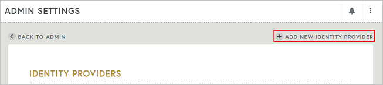
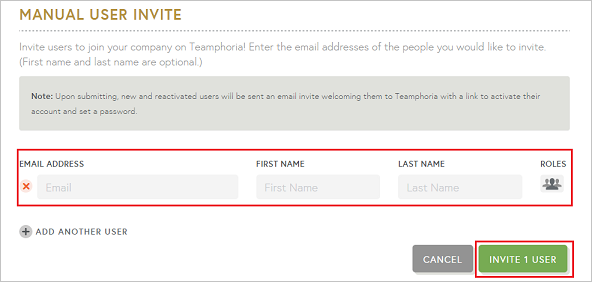

# Tutorial: Azure Active Directory single sign-on (SSO) integration with Teamphoria

In this tutorial, you'll learn how to integrate Teamphoria with Azure Active Directory (Azure AD). When you integrate Teamphoria with Azure AD, you can:

* Control in Azure AD who has access to Teamphoria.
* Enable your users to be automatically signed-in to Teamphoria with their Azure AD accounts.
* Manage your accounts in one central location - the Azure portal.

To learn more about SaaS app integration with Azure AD, see [What is application access and single sign-on with Azure Active Directory](../manage-apps/what-is-single-sign-on.md).

## Prerequisites

To get started, you need the following items:

* An Azure AD subscription. If you don't have a subscription, you can get a [free account](https://azure.microsoft.com/free/).
* Teamphoria single sign-on (SSO) enabled subscription.

## Scenario description

In this tutorial, you configure and test Azure AD SSO in a test environment.

* Teamphoria supports **SP** initiated SSO

## Adding Teamphoria from the gallery

To configure the integration of Teamphoria into Azure AD, you need to add Teamphoria from the gallery to your list of managed SaaS apps.

1. Sign in to the [Azure portal](https://portal.azure.com) using either a work or school account, or a personal Microsoft account.
1. On the left navigation pane, select the **Azure Active Directory** service.
1. Navigate to **Enterprise Applications** and then select **All Applications**.
1. To add new application, select **New application**.
1. In the **Add from the gallery** section, type **Teamphoria** in the search box.
1. Select **Teamphoria** from results panel and then add the app. Wait a few seconds while the app is added to your tenant.

 Alternatively, you can also use the [Enterprise App Configuration Wizard](https://portal.office.com/AdminPortal/home?Q=Docs#/azureadappintegration). In this wizard, you can add an application to your tenant, add users/groups to the app, assign roles, as well as walk through the SSO configuration as well. [Learn more about Microsoft 365 wizards.](/microsoft-365/admin/misc/azure-ad-setup-guides)

## Configure and test Azure AD single sign-on for Teamphoria

Configure and test Azure AD SSO with Teamphoria using a test user called **B.Simon**. For SSO to work, you need to establish a link relationship between an Azure AD user and the related user in Teamphoria.

To configure and test Azure AD SSO with Teamphoria, complete the following building blocks:

1. **[Configure Azure AD SSO](#configure-azure-ad-sso)** - to enable your users to use this feature.
    1. **[Create an Azure AD test user](#create-an-azure-ad-test-user)** - to test Azure AD single sign-on with B.Simon.
    1. **[Assign the Azure AD test user](#assign-the-azure-ad-test-user)** - to enable B.Simon to use Azure AD single sign-on.
1. **[Configure Teamphoria SSO](#configure-teamphoria-sso)** - to configure the single sign-on settings on application side.
    1. **[Create Teamphoria test user](#create-teamphoria-test-user)** - to have a counterpart of B.Simon in Teamphoria that is linked to the Azure AD representation of user.
1. **[Test SSO](#test-sso)** - to verify whether the configuration works.

## Configure Azure AD SSO

Follow these steps to enable Azure AD SSO in the Azure portal.

1. In the [Azure portal](https://portal.azure.com/), on the **Teamphoria** application integration page, find the **Manage** section and select **single sign-on**.
1. On the **Select a single sign-on method** page, select **SAML**.
1. On the **Set up single sign-on with SAML** page, click the edit/pen icon for **Basic SAML Configuration** to edit the settings.

   

1. On the **Basic SAML Configuration** section, enter the values for the following fields:

    In the **Sign-on URL** text box, type a URL using the following pattern:
    `https://<sub-domain>.teamphoria.com/login`

	> [!NOTE]
	> The value is not real. Update the value with the actual Sign-On URL. Contact [Teamphoria Client support team](https://www.teamphoria.com/) to get the value. You can also refer to the patterns shown in the **Basic SAML Configuration** section in the Azure portal.

1. On the **Set up single sign-on with SAML** page, in the **SAML Signing Certificate** section,  find **Certificate (Base64)** and select **Download** to download the certificate and save it on your computer.

	

1. On the **Set up Teamphoria** section, copy the appropriate URL(s) based on your requirement.

	

### Create an Azure AD test user

In this section, you'll create a test user in the Azure portal called B.Simon.

1. From the left pane in the Azure portal, select **Azure Active Directory**, select **Users**, and then select **All users**.
1. Select **New user** at the top of the screen.
1. In the **User** properties, follow these steps:
   1. In the **Name** field, enter `B.Simon`.  
   1. In the **User name** field, enter the username@companydomain.extension. For example, `B.Simon@contoso.com`.
   1. Select the **Show password** check box, and then write down the value that's displayed in the **Password** box.
   1. Click **Create**.

### Assign the Azure AD test user

In this section, you'll enable B.Simon to use Azure single sign-on by granting access to Teamphoria.

1. In the Azure portal, select **Enterprise Applications**, and then select **All applications**.
1. In the applications list, select **Teamphoria**.
1. In the app's overview page, find the **Manage** section and select **Users and groups**.

   

1. Select **Add user**, then select **Users and groups** in the **Add Assignment** dialog.

	

1. In the **Users and groups** dialog, select **B.Simon** from the Users list, then click the **Select** button at the bottom of the screen.
1. If you're expecting any role value in the SAML assertion, in the **Select Role** dialog, select the appropriate role for the user from the list and then click the **Select** button at the bottom of the screen.
1. In the **Add Assignment** dialog, click the **Assign** button.

## Configure Teamphoria SSO

1. In a different web browser window, sign in to your Teamphoria company site as an administrator

4. Go to **ADMIN SETTINGS** option in the left toolbar and under the Configure Tab click on **SINGLE SIGN-ON** to open the SSO configuration window.

	

5. Click on **ADD NEW IDENTITY PROVIDER** option in the top right corner to open the form for adding the settings for SSO.

	

6. Enter the details in the fields as described below-

	

	a. **DISPLAY NAME**: Enter the display name of the plugin on the admin page.

	b. **BUTTON NAME**: The name of the tab that will display on the login page for logging in via SSO.

	c. **CERTIFICATE**: Open the Certificate downloaded earlier from the Azure portal in notepad, copy the contents of the same and paste it here in the box.

	d. **ENTRY POINT**: Paste the **Login URL** copied earlier from the Azure portal.

	e. Switch the option to **ON** and click on **SAVE**.

### Create Teamphoria test user

In order to enable Azure AD users to sign in to Teamphoria, they must be provisioned into Teamphoria. In the case of Teamphoria, provisioning is a manual task.

**To provision a user account, perform the following steps:**

1. Sign in to your Teamphoria company site as an administrator.

1. Click on **ADMIN** settings on the left toolbar and under the **MANAGE** tab Click on **USERS** to open the admin page for users.

    

1. Click on the **MANUAL INVITE** option.

	

1. On this page, perform following action.

	

    a. In the **EMAIL ADDRESS** textbox, enter the **email address** of the user like B.Simon.

    b. In the **FIRST NAME** textbox, enter the first name of the user like **B**.

	c. In the **LAST NAME** textbox, enter the last name of the user like **Simon**.

    d. Click **INVITE 1 USER**. User needs to accept the invite to get created in the system.

## Test SSO 

In this section, you test your Azure AD single sign-on configuration using the Access Panel.

When you click the Teamphoria tile in the Access Panel, you should be automatically signed in to the Teamphoria for which you set up SSO. For more information about the Access Panel, see [Introduction to the Access Panel](https://support.microsoft.com/account-billing/sign-in-and-start-apps-from-the-my-apps-portal-2f3b1bae-0e5a-4a86-a33e-876fbd2a4510).

## Additional resources

- [ List of Tutorials on How to Integrate SaaS Apps with Azure Active Directory ](./tutorial-list.md)

- [What is application access and single sign-on with Azure Active Directory? ](../manage-apps/what-is-single-sign-on.md)

- [What is Conditional Access in Azure Active Directory?](../conditional-access/overview.md)
